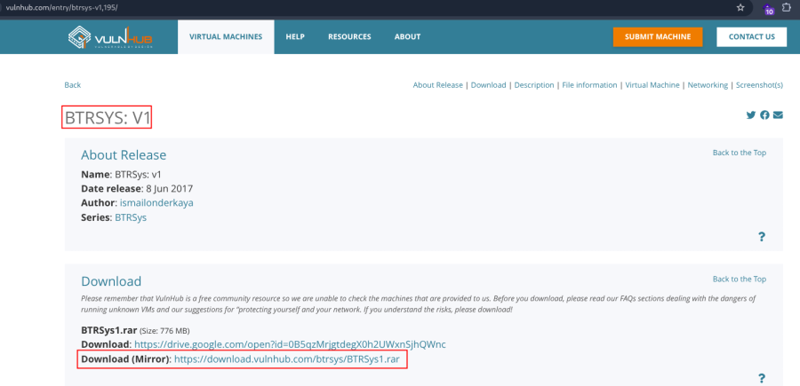
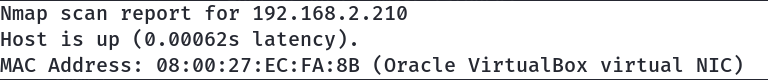
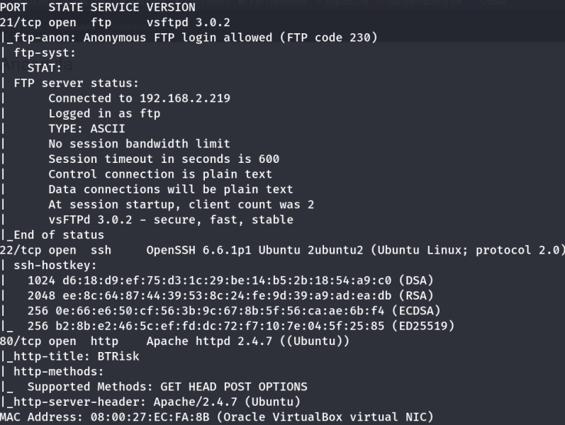
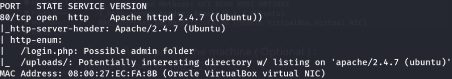
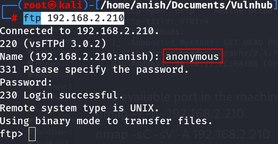

:::::::::: page
# BTRSys: v1 {#btrsys-v1 .title}

\

## 

## BTRSys: v1

- **[BTRSys: v1]{style="color:#8ff0a4;"}** :-

<!-- -->

- Download the machine : <https://www.vulnhub.com/entry/btrsys-v1,195/>

- Extract the rar file .
- Open ovf file .
- Then click finish .
- Start the machine .

1.  [Network Scanning]{style="color:#33d17a;"} :

- Find the machine IP :

::: codebox
    nmap -sn 192.168.2.0/24
:::

- Run nmap master command :

::: codebox
    nmap -v -Pn -sT -sV -sC -A -O -p- 192.168.2.210
:::

- Find available port in the machine ( Optional ) :

::: codebox
    nmap -v -p- 192.168.2.210
:::

- 

::: codebox
    nmap -sC -sV -A 192.168.2.210 
:::

- This command runs an aggressive scan and uses the http-enum script to
  identify potential CGI directories .

::: codebox
    nmap -v -p 80 -sT -sV -A --script=http-enum.nse 192.168.2.210
:::

1.  [FTP Enumeration]{style="color:#33d17a;"} :

- FTP Login :

::: codebox
    ftp 192.168.2.210
:::

1.  [Web Enumeration]{style="color:#33d17a;"} :

- IP visit in browser : <http://192.168.2.210/index.php>
  <http://192.168.2.210/login.php> <http://192.168.2.210/uploads/>

<!-- -->

- Directory brute force with gobuster :

::: codebox
    gobuster dir -u http://192.168.2.210 -w /usr/share/wordlists/dirbuster/directory-list-2.3-medium.txt -x php,txt,html,bak,old -t 50
:::
::::::::::
