::::::::::: page
# Election: 1 {#election-1 .title}

\

## 

## Election: 1

- **[Election: 1]{style="color:#237522;"}** :-

<!-- -->

- Download the machine : <https://www.vulnhub.com/entry/election-1,503/>

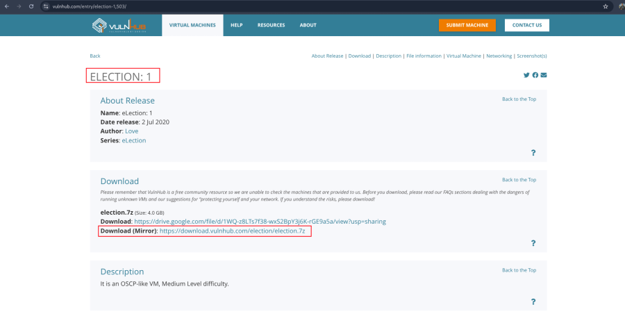

- Now extract the file .
- Open ova file .
- Then click finish .
- Start the machine .

1.  [Network Scanning]{style="color:#9141ac;"} :

- Find the machine IP :

::: codebox
    nmap -sn 192.168.31.0/24
:::

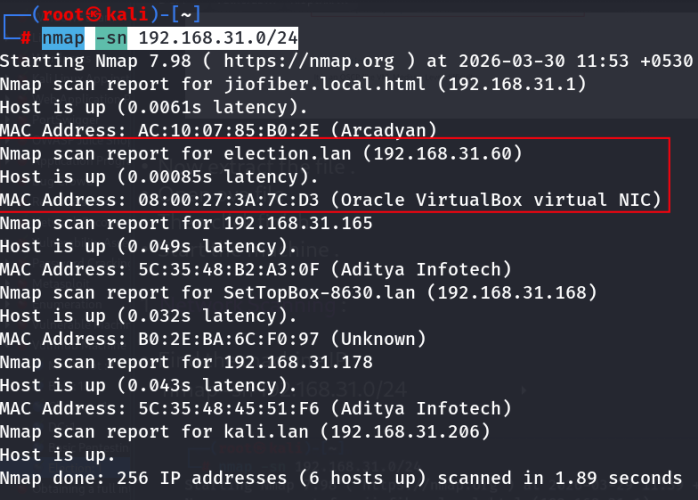

- Find available port in the machine :

::: codebox
    nmap -v -p- 192.168.31.60
:::

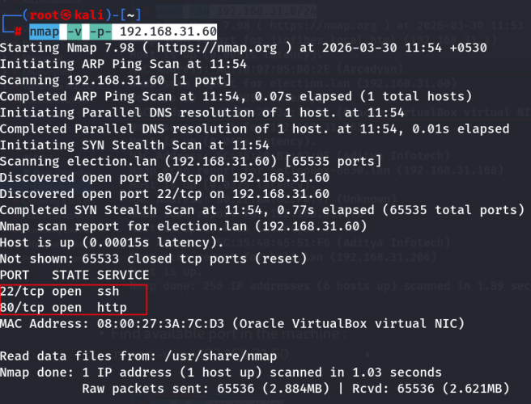

::: codebox
    nmap -sC -sV -A 192.168.31.60
:::

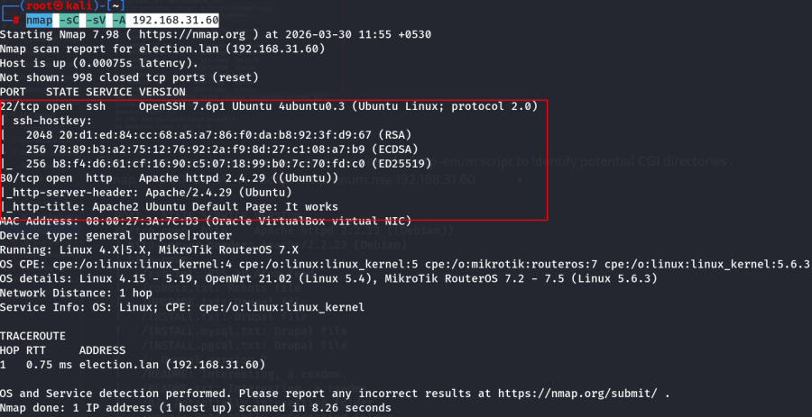

- This command runs an aggressive scan and uses the http-enum script to
  identify potential CGI directories .

::: codebox
    nmap -v -p 80 -sT -sV -A --script=http-enum.nse 192.168.31.60
:::

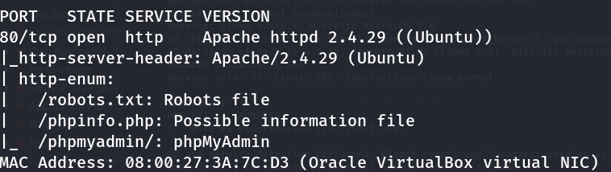

1.  [Web Enumeration]{style="color:#9141ac;"} :

- IP visit in browser : <http://192.168.31.60/>
  <http://192.168.31.60/phpinfo.php> <http://192.168.31.60/phpmyadmin/>
  <http://192.168.31.60/robots.txt>

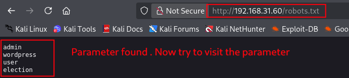

- In election parameter is available : <http://192.168.31.60/election/>

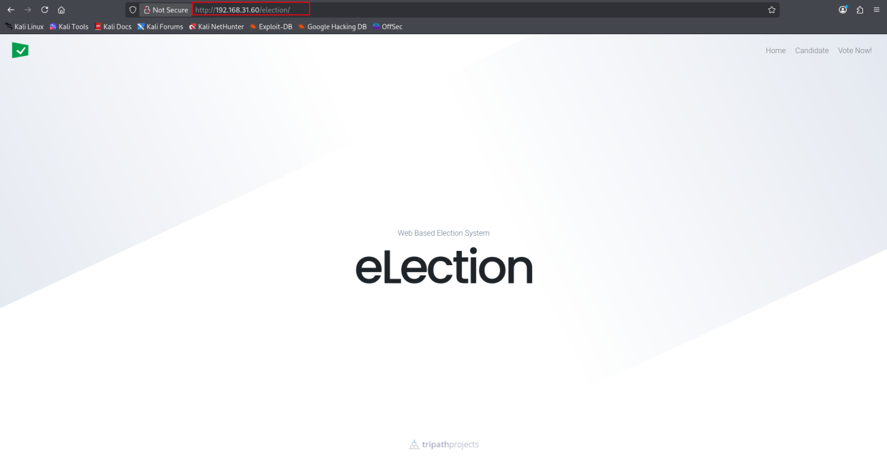

- Now run the gobuster for directory brute force :

::: codebox
    gobuster dir -u http://192.168.31.60/election/ -w /usr/share/wordlists/dirb/common.txt
:::

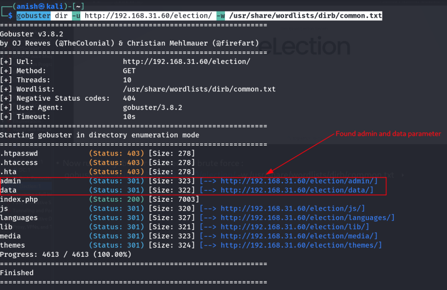

- Visit the parameter : <http://192.168.31.60/election/data/>
  <http://192.168.31.60/election/admin/>

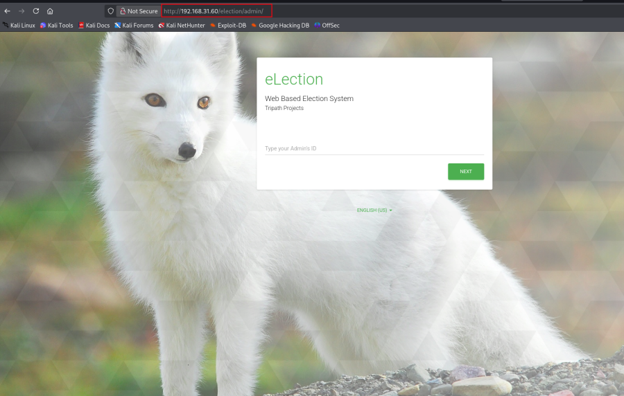

- Again brute force in /admin parameter :

::: codebox
    gobuster dir -u http://192.168.31.60/election/admin/ -w /usr/share/wordlists/dirb/common.txt
:::

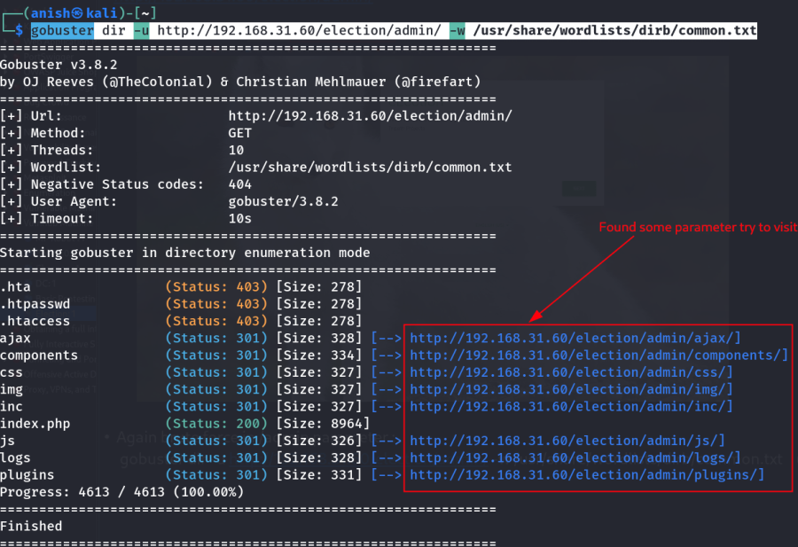

- Visit found parameter : <http://192.168.31.60/election/admin/logs/>

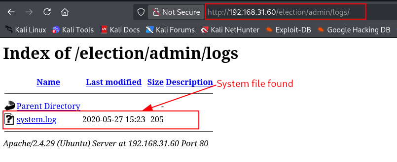

- Open system file :
  <http://192.168.31.60/election/admin/logs/system.log>

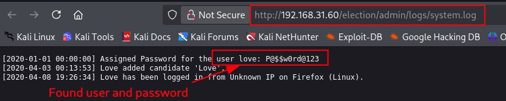

1.  [Get the SSH connection on this machine]{style="color:#9141ac;"} :

::: codebox
    ssh love@192.168.31.60
:::

::: codebox
    user: love 
    Password: P@$$w0rd@123
:::

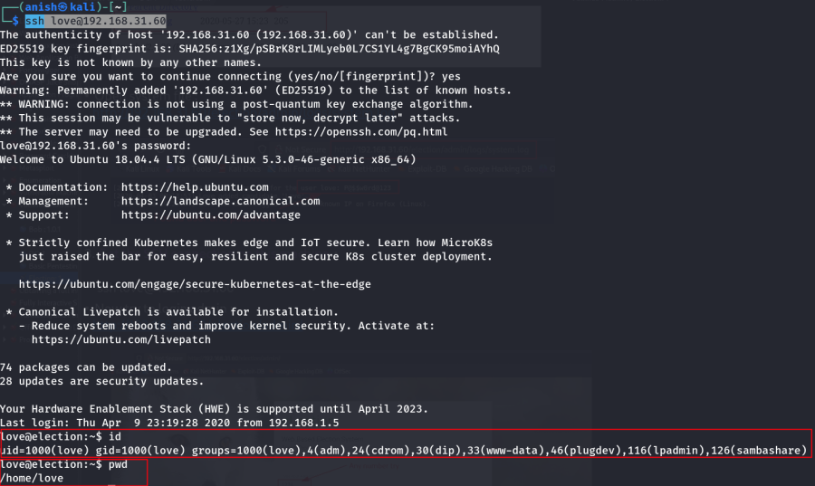

- [Key Features]{style="color:#9141ac;"} :

<!-- -->

- Discovered open ports 80 (HTTP) and 22 (SSH) using Nmap
- Enumerated web app and found credentials in logs (love /
  P@\$\$w0rd@123)
- Login panel was misleading, so used credentials for SSH access
- Gained initial shell as user love

<!-- -->

- [Summary]{style="color:#9141ac;"} :

<!-- -->

- Used exposed credentials to gain SSH access through system
  misconfiguration .
:::::::::::
